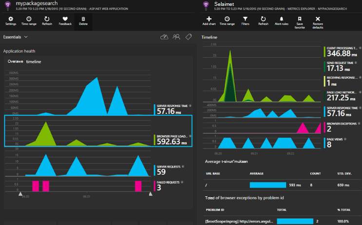

<properties 
    pageTitle="ASP.NET-Core sovelluksen tietoa" 
    description="Seurata web-sovellusten käytettävyyden, suorituskykyä ja käyttö." 
    services="application-insights" 
    documentationCenter=".net"
    authors="alancameronwills" 
    manager="douge"/>

<tags 
    ms.service="application-insights" 
    ms.workload="tbd" 
    ms.tgt_pltfrm="ibiza" 
    ms.devlang="na" 
    ms.topic="article" 
    ms.date="08/30/2016" 
    ms.author="awills"/>

# ASP.NET-Core sovelluksen tietoa

[Visual Studio hakemuksen tiedot](app-insights-overview.md) voit valvoa web-sovelluksen käytettävyyden, suorituskykyä ja käyttö. Palautetta, saat tietoja suorituskykyä ja sovelluksen tehokkuutta luonnosta voit määrittää ajan tasalla rakenteen suuntaa valintoja kunkin development Lifecycle-prosessi.

Tarvitset [Microsoft Azure](http://azure.com)-tilaus. Kirjaudu sisään Microsoft-tiliä, joka voi olla Windows, XBox Live tai muiden Microsoftin pilvipalveluihin. Ryhmän voi olla organisaation tilauksen Azure: kysy omistaja Lisää sinut siihen käyttämällä Microsoft-tiliä.

## Käytön aloittaminen

Noudata [Aloitusopas](https://github.com/Microsoft/ApplicationInsights-aspnetcore/wiki/Getting-Started).

## Hakemuksen tiedot käyttämällä

Kirjaudu sisään [Microsoft Azure-portaalin](https://portal.azure.com) ja siirry resurssin luotu sovelluksen seurannassa.

Käyttää sovelluksen hetken erillisessä selainikkunassa. Näet sovelluksen tiedot-kaaviot näkyvät tiedot. (Voit joutua valitsemalla Päivitä.) Kun kehität ilmenee vain vähän tietoja, mutta kaavioista todella tulee toiminnassa kun sovellus ja on useita käyttäjiä. 

Yhteenveto-sivu näyttää suorituskyvyn kaavioita, olet todennäköisesti kiinnostunut: palvelimen vastausajan, sivun latausajasta ja epäonnistuneiden pyyntöjen määrä. Napsauta mitä tahansa kaavion saat näkyviin lisää kaavioita ja tietoja.

Näkymät-portaalissa jakautuvat kahteen luokkaan tärkeimmät:

* [Arvot Explorer](app-insights-metrics-explorer.md) näyttää kaavioita ja taulukoita arvot ja laskee, kuten vastauksen ajat, virheen korvaukset tai arvot, luot itse [API](app-insights-api-custom-events-metrics.md). Suodattaminen ja määritetään tietojen avulla saat paremman käsityksen sovelluksen ja sen käyttäjät ominaisuusarvoihin.
* [Erikoishaku](app-insights-diagnostic-search.md) luettelo yksittäisiä tapahtumia, kuten tietyn pyynnöt, poikkeukset, loki jäljittää tai itse luotu [API](app-insights-api-custom-events-metrics.md)-tapahtumat. Suodattaminen ja tapahtumat etsiminen ja siirtyä niihin liittyvät tapahtumat tutkia ongelmat välillä.
* [Analyysin](app-insights-analytics.md) avulla voit suorittaa SQL kaltaisessa kyselyjä oman telemetriatietojen päälle ja on tehokas analytical ja diagnostiikka-työkalu.

## Ilmoitukset

* Saat automaattisesti [ennakoiva diagnostiikan ilmoituksia](app-insights-proactive-diagnostics.md) , jotka kertovat voit erheellisiin muutoksista virheen korvaukset ja muita tietoja.
* Määritä [käytettävyys testit](app-insights-monitor-web-app-availability.md) Testaa sivuston jatkuvasti sijainneista maailmanlaajuisesti, ja poistaa sähköpostit heti, kun kaikki testi epäonnistuu.
* Määritä [metrisillä ilmoitukset](app-insights-monitor-web-app-availability.md) tietää, jos arvot, kuten vastauksen kertaa tai poikkeuksen korvaukset Siirry ulkopuolelta rajoissa.

## Hae Lisää telemetriatietojen

* [Lisää telemetriatietojen verkkosivuille](app-insights-javascript.md) seurata sivun käyttöä ja suorituskykyä.
* [Näytön riippuvuudet](app-insights-dependencies.md) nähdäksesi, jos REST-, SQL- tai muut Ulkoiset resurssit ovat hidastaa voit.
* [Käytä Ohjelmointirajapinnan](app-insights-api-custom-events-metrics.md) lähettää oman tapahtuma- ja lisää yksityiskohtaisen näkymän sinua sovelluksen suorituskyvyn ja käyttömäärän mittaukset.
* [Käytettävyys testien](app-insights-monitor-web-app-availability.md) Tarkista jatkuvasti-sovelluksen eri puolilla maailmaa. 

## Avaa lähde

[Luku- ja osallistuja-koodia](https://github.com/Microsoft/ApplicationInsights-aspnetcore#recent-updates)

