<properties 
    pageTitle="Seuranta-sovelluksen tiedot riippuvuus" 
    description="Analysoi käyttö, käytettävyys ja paikallisen tai Microsoft Azure web-sovelluksen kanssa sovelluksen havainnollistamisen suorituskykyä." 
    services="application-insights" 
    documentationCenter=".net"
    authors="alancameronwills" 
    manager="douge"/>

<tags 
    ms.service="application-insights" 
    ms.workload="tbd" 
    ms.tgt_pltfrm="ibiza" 
    ms.devlang="na" 
    ms.topic="article" 
    ms.date="10/24/2016" 
    ms.author="awills"/>


# <a name="set-up-application-insights-dependency-tracking"></a>Hakemuksen tiedot määrittäminen: riippuvuuden seuranta


[AZURE.INCLUDE [app-insights-selector-get-started-dotnet](../../includes/app-insights-selector-get-started-dotnet.md)]


*Riippuvuus* on ulkoista osaa, jota kutsutaan sovelluksen mukaan. Se on yleensä kutsua HTTP- tai tietokannan tai tiedostojärjestelmän palvelu. Visual Studio hakemuksen tiedot näet helposti kuinka kauan sovelluksesi odottaa riippuvuudet ja kuinka usein riippuvuus-kutsu epäonnistuu.

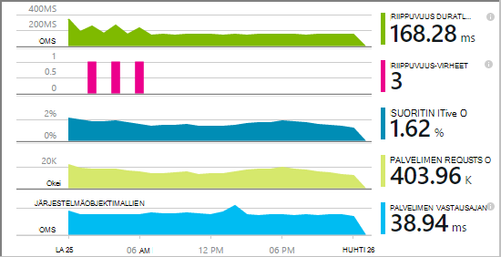

Ulos,-valmiilla riippuvuus-valvonta raportoi tällä hetkellä seuraavanlaisiin riippuvuuksien puhelut:

* ASP.NET
 * SQL-tietokannat
 * ASP.NET web ja käyttää HTTP-pohjaista sidontojen WCF-palveluita
 * Paikalliseen tai etätietokantaan HTTP-puhelut
 * Azure DocumentDb, taulukkoon, blob-säiliö ja jonossa
* Java
 * Tietokannan kautta [JDBC](http://docs.oracle.com/javase/7/docs/technotes/guides/jdbc/) ohjaimen, kuten MySQL, SQL Server, PostgreSQL tai SQLite kutsuja.
* JavaScript-web-sivua - [web-sivun SDK](app-insights-javascript.md) kirjaa automaattisesti Ajax puhelut riippuvuudet nimellä.

Voit kirjoittaa omaa SDK puhelut seurannassa muiden riippuvuudet [TrackDependency Ohjelmointirajapinnan](app-insights-api-custom-events-metrics.md#track-dependency)käyttäminen.


## <a name="to-set-up-dependency-monitoring"></a>Voit määrittää riippuvuuden seuranta

Tarvitset [Microsoft Azure](http://azure.com) -tilaus.

### <a name="if-your-app-runs-on-your-iis-server"></a>Sovelluksen käytetään IIS-palvelimeen

Jos koodiin suoritetaan .NET 4.6 tai uudempi versio, voit joko [asentaa sovelluksen tiedot-SDK](app-insights-asp-net.md) -sovelluksen, tai jos asennat sovelluksen havainnollistamisen tilan valvonta. Sinun ei tarvitse molemmat.

Asenna sovellus havainnollistamisen tilan valvonta, palvelimen:

1. IIS verkkosivustoon, kirjaudu sisään järjestelmänvalvojan tunnistetiedoilla.
2. Lataa ja suorita [tilan valvonta asennusohjelma](http://go.microsoft.com/fwlink/?LinkId=506648).
4. Microsoft Azure kirjautuminen ohjatun asennuksen.

    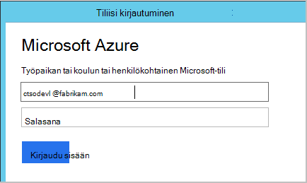

    *Yhteyden virheitä? Katso [vianmääritys](#troubleshooting).*

5. Valitse asennettujen web-sovelluksen tai sivustoon, jota haluat seurata ja valitse resurssien, johon haluat tarkastella tuloksia sovelluksen tiedot-portaalissa.

    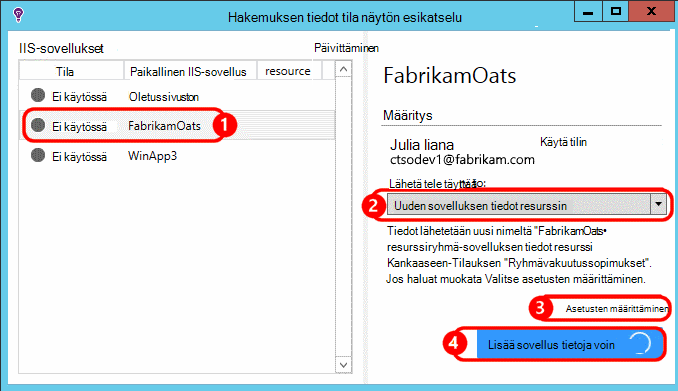

    Tavallisesti, valitse Määritä uusi resurssi ja [resurssiryhmä][roles].

    Muussa tapauksessa käytä aiemman resurssin, jos olet jo määrittänyt [web Testaa] [ availability] sivuston tai [web-Asiakasohjelman seuranta][client].

6. Käynnistä IIS uudelleen.

    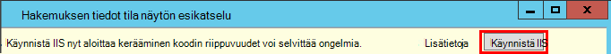

    Web-palvelu keskeytetään, hetki.

6. Huomaa, että ApplicationInsights.config on lisätty, jota haluat seurata verkkosovelluksissa.

    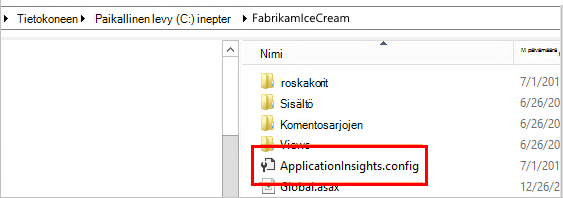

   Saatavilla on myös web.config tehdään muutoksia.

#### <a name="want-to-reconfigure-later"></a>Haluatko (poistetaan) Määritä myöhemmin?

Kun olet suorittanut ohjatun toiminnon, voit määrittää uudelleen agentti, milloin tahansa. Voit käyttää myös tämän Jos agentti asennettu, mutta ollut ensimmäisen määrityskerran joitakin ongelmia.

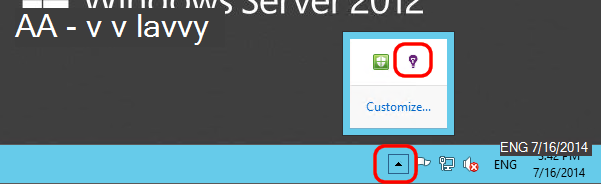


### <a name="if-your-app-runs-as-an-azure-web-app"></a>Jos sovellus suoritetaan Azure Web App-sovelluksessa

Azure koodiin Ohjauspaneelin Lisää sovelluksen tiedot-tunniste.

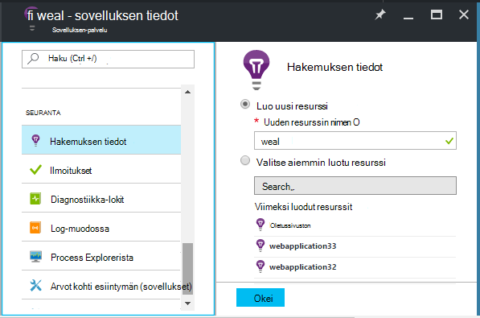


### <a name="if-its-an-azure-cloud-services-project"></a>Jos se on Azure cloud services-projekti

[Web- ja työntekijä rooleille komentosarjojen lisääminen](app-insights-cloudservices.md#dependencies). Tai jos [asennat .NET framework 4.6 tai uudempi](../cloud-services/cloud-services-dotnet-install-dotnet.md).

## <a name="diagnosis"></a>Riippuvuus suorituskykyongelmia ohjelmistossa

Arvioi pyyntöjä palvelimen suorituskykyyn, Avaa suorituskyky-sivu ja vieritä katsaus pyynnöt ruudukon:

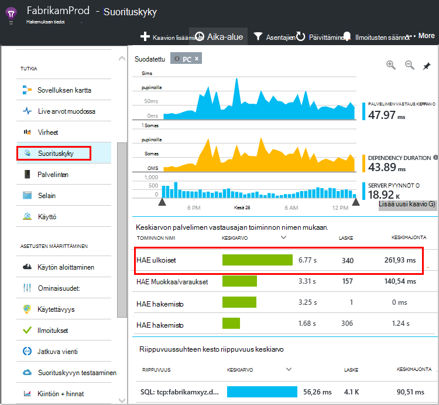

Ylimmät yksi kestää kauan. Katsotaan, jos löydämme, jossa on käytetty aika.

Napsauta kyseisen rivin, jos haluat tarkastella yksittäisiä pyynnön tapahtumia:


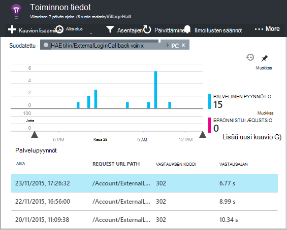

Napsauta mitä tahansa pitkään suoritettavien esiintymä tutkia tarkemmin.

Vieritä liittyvät pyyntö remote riippuvuuden puhelut:

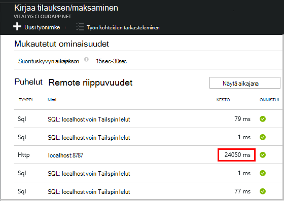

Näyttää useimmat aika ylläpidon pyyntö kului paikallisen palvelun kutsu. 


Valitse rivin Saat lisätietoja:

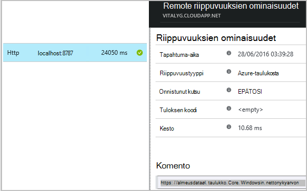

Tiedot on riittävästi tietoja vianmäärityksessä.


Eri tapauksessa riippuvuuden ei kutsu on pitkä, mutta vaihtamalla aikajananäkymän näemme kun viive tapahtunut sisäinen käsittelyn:


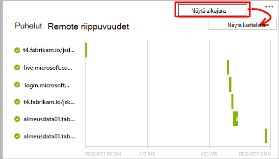


## <a name="failures"></a>Virheet

Jos määritettynä on epäonnistunut pyynnöt, napsauta kaaviota.

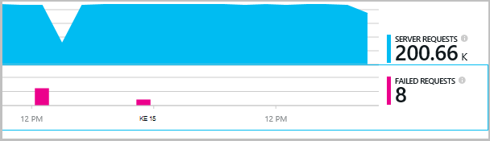

Valitse pyynnön tyyppi ja pyynnön esiintymän Etsi remote riippuvuus epäonnistui puhelun kautta.


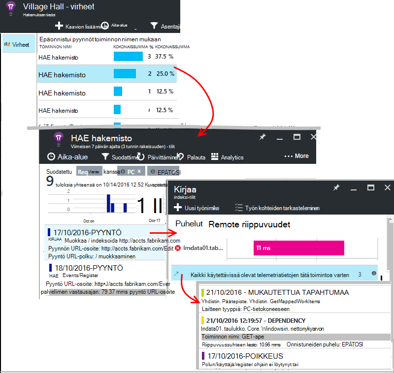


## <a name="custom-dependency-tracking"></a>Mukautettu riippuvuus seuranta

Riippuvuus seuranta-perusmoduuli löytää automaattisesti Ulkoiset riippuvuudet, kuten ja REST API. Mutta voit halutessasi muita osia käsitellään samalla tavalla. 

Voit kirjoittaa koodi, joka lähettää riippuvuustiedot, sama [TrackDependency API](app-insights-api-custom-events-metrics.md#track-dependency) , jota käytetään vakio moduulit käyttäminen.

Esimerkiksi jos luot koodisi kokoonpanon, et ole itse kirjoittanut itse kanssa, voi aikaa kaikki puhelut, voit selvittää, mitä vaikutus vastauksen kertaa. On tämän sovelluksen havainnollistamisen riippuvuus-kaaviot näkyvät tiedot, Lähetä se `TrackDependency`.

```C#

            var startTime = DateTime.UtcNow;
            var timer = System.Diagnostics.Stopwatch.StartNew();
            try
            {
                success = dependency.Call();
            }
            finally
            {
                timer.Stop();
                telemetry.TrackDependency("myDependency", "myCall", startTime, timer.Elapsed, success);
            }
```

Jos haluat poistaa käytöstä vakio riippuvuuden seuranta-moduulin, poista DependencyTrackingTelemetryModule viittaus [ApplicationInsights.config](app-insights-configuration-with-applicationinsights-config.md).

## <a name="troubleshooting"></a>Vianmääritys

*Riippuvuus success Merkitse aina näyttää joko TOSI tai EPÄTOSI.*

* Päivitä SDK uusimman version. Jos .NET-versio on pienempi kuin 4.6, asenna [tilan valvonta](app-insights-monitor-performance-live-website-now.md).

## <a name="next-steps"></a>Seuraavat vaiheet

- [Poikkeukset](app-insights-asp-net-exceptions.md)
- [Käyttäjän & sivun tiedot][client]
- [Käytettävyys](app-insights-monitor-web-app-availability.md)


<!--Link references-->

[api]: app-insights-api-custom-events-metrics.md
[apikey]: app-insights-api-custom-events-metrics.md#ikey
[availability]: app-insights-monitor-web-app-availability.md
[azure]: ../insights-perf-analytics.md
[client]: app-insights-javascript.md
[diagnostic]: app-insights-diagnostic-search.md
[metrics]: app-insights-metrics-explorer.md
[netlogs]: app-insights-asp-net-trace-logs.md
[portal]: http://portal.azure.com/
[qna]: app-insights-troubleshoot-faq.md
[redfield]: app-insights-asp-net-dependencies.md
[roles]: app-insights-resources-roles-access-control.md

 
