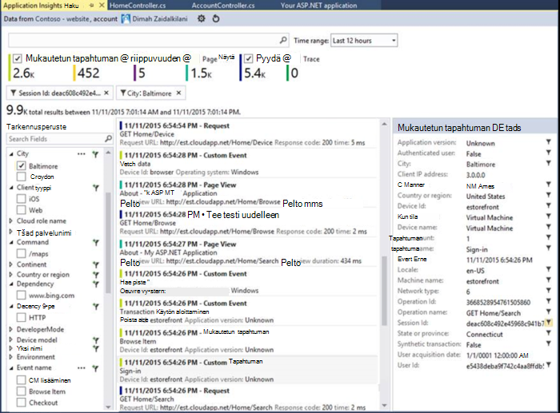
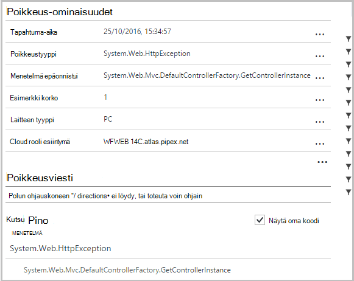
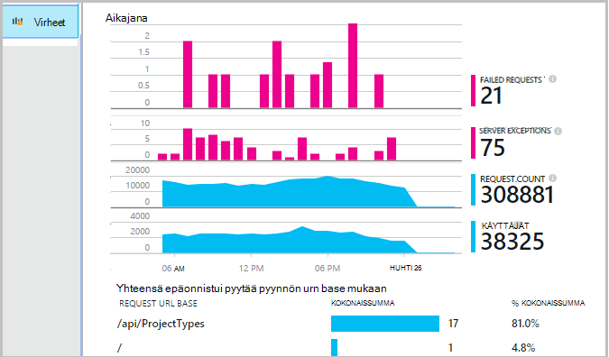
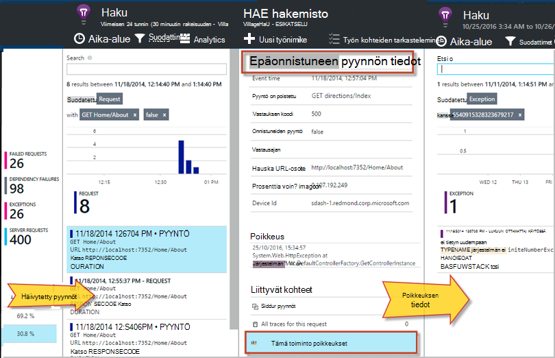
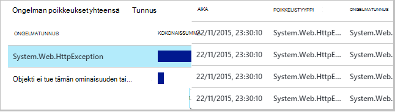
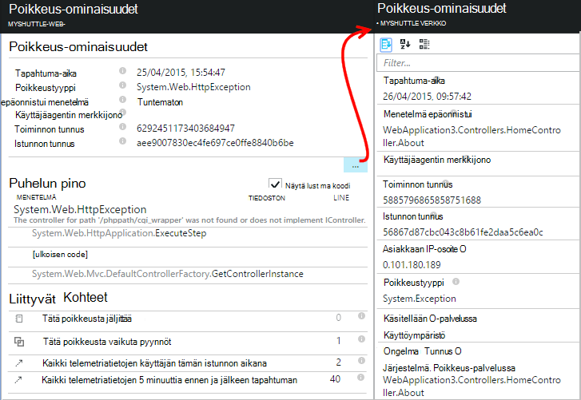
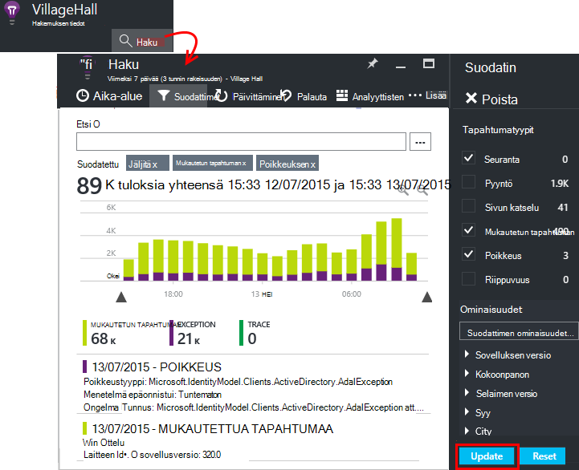
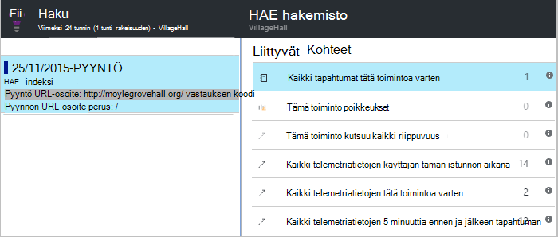

<properties 
    pageTitle="Virheet ja poikkeukset ASP.NET-sovelluksissa hakemuksen tiedot vianmääritys" 
    description="Sieppaa poikkeukset sekä pyynnön telemetriatietojen ASP.NET-sovelluksista." 
    services="application-insights" 
    documentationCenter=".net"
    authors="alancameronwills" 
    manager="douge"/>

<tags 
    ms.service="application-insights" 
    ms.workload="tbd" 
    ms.tgt_pltfrm="ibiza" 
    ms.devlang="na" 
    ms.topic="article" 
    ms.date="10/27/2016" 
    ms.author="awills"/>


# <a name="set-up-application-insights-diagnose-exceptions"></a>Hakemuksen tiedot määrittäminen: poikkeukset vianmääritys

[AZURE.INCLUDE [app-insights-selector-get-started-dotnet](../../includes/app-insights-selector-get-started-dotnet.md)]


Sovelluksen mukana [Visual Studio hakemuksen tiedot]seuraamalla[start], voit yhdistää epäonnistuneiden pyyntöjen poikkeukset ja muita tapahtumia sekä asiakkaan ja palvelimen, niin, että voit nopeasti selvittää syyt.

ASP.NET-sovelluksen seurannassa, sinun on lisättävä [Sovellus havainnollistamisen SDK] [ greenbrown] sovelluksen tai [asentaa tilan valvonta IIS-palvelimeen][redfield], tai, jos sovellus on Azure Web App-sovelluksessa, Lisää [Sovelluksen tiedot-tunniste](app-insights-azure-web-apps.md).

## <a name="diagnosing-exceptions-using-visual-studio"></a>Ohjelmistossa Visual Studiossa poikkeukset

Avaa sovellus-ratkaisun Visual Studiossa auttamaan virheenkorjaus.

Suorita sovellus-palvelimeen tai kehitys tietokoneeseen käyttämällä F5-näppäintä.

Avaa sovellus tiedot Etsi-toiminnon Visual Studiossa ja määritä se näyttää tapahtumat-sovellukset. Samalla, kun olet virheenkorjaus, voit tehdä tämän napsauttamalla sovelluksen tiedot-painiketta.



Huomaa, että voit suodattaa raportin, jos haluat näyttää vain poikkeukset. 

*Poikkeukset ei ole näkyvissä? Kohdassa [Poikkeukset sieppaaminen](#exceptions).*

Valitse poikkeus-raporttiin ja esittää sen pinon jäljitys.



Valitse rivin viittauksen pinon seurantatiedoista, Avaa haluamasi tiedosto.  

## <a name="diagnosing-failures-using-the-azure-portal"></a>Ohjelmistossa virheet Azure-portaalissa

Sovelluksen hakemuksen tiedot yleiskatsaus virheet-ruutu näkyy poikkeukset kaavioita ja epäonnistui pyyntöjen yhdessä pyynnön luettelon kanssa URL-osoitteet, joka aiheuttaa eniten virheitä.



Valitse jokin epäonnistuneen pyynnön tyypit luettelossa, voit siirtyä virheen yksittäiset esiintymät. Sieltä Valitse poikkeukset tai minkä tahansa jäljitystiedot liittyy kautta:




**Vaihtoehtoisesti** voit aloittaa poikkeusten luettelosta, jonka voi etsiä alemmas virheet-sivu. Säilytä napsauttamalla, kunnes näyttöön ilmestyy yksittäisiä poikkeuksia.




*Poikkeukset ei ole näkyvissä? Kohdassa [Poikkeukset siepata](#exceptions).*

Sieltä voit pinon jäljitys ja kunkin poikkeuksen yksityiskohtainen ominaisuuksien ja etsiä Aiheeseen liittyvät log Jäljitä tai muita tapahtumia.




[Lisätietoja diagnostiikan haun][diagnostic].


## <a name="dependency-failures"></a>Riippuvuus-virheet

*Riippuvuus* on palvelu, sovelluksen soittaa, yleensä REST API tai tietokannan kautta. [Hakemuksen tiedot tilan valvonta] [ redfield] valvoo automaattisesti tyyppisiä riippuvuuden kutsun, puhelun kesto ja onnistumisesta tai epäonnistumisesta mittaaminen erilaisia. 

Saat riippuvuuden tiedot, sinun on [asennettava tilan valvonta] [ redfield] IIS-palvelimeen, tai jos sovellus on Azure-Online- [Sovelluksen tiedot-tunniste](app-insights-azure-web-apps.md). 

Riippuvuudet epäonnistui puhelut näkyvät virheet-sivu ja voit myös hakea muistiinpanoja liittyvät kohteet-kohdassa pyynnön tiedot ja poikkeuksen tiedot.

*Ei ole riippuvuuden epäonnistuu? Se on hienoa. Mutta varmistaaksesi, että saat riippuvuuden tiedot avaamalla suorituskyky-sivu ja katsomalla riippuvuussuhteen kesto-kaavio.*

 

## <a name="custom-tracing-and-log-data"></a>Mukautettu jäljityksen ja lokitiedot

Saat diagnostiikan tiedot tietyn sovelluksen, voit lisätä koodin lähettämään telemetriatietojen omiin tietoihisi. Tämä näkyvät diagnostiikan haun pyynnön, sivu-näkymän ja muiden automaattisesti kerättyjen tietojen rinnalla. 

Sinulla on useita vaihtoehtoja:

* [TrackEvent()](app-insights-api-custom-events-metrics.md#track-event) käytetään yleensä käyttötavat seurantaa varten, mutta se lähettää myös tietojen näkyy kohdassa mukautetut tapahtumat diagnostiikan hakutoiminnossa. Tapahtumien nimetään ja voi suorittaa merkkijonon ominaisuudet ja numeeriset arvot, voit [suodattaa diagnostiikan hakujen][diagnostic].
* [TrackTrace()](app-insights-api-custom-events-metrics.md#track-trace) voit lähettää pidempi tietoja, kuten kirjaa tietoja.
* [TrackException()](#exceptions) lähettää pinon jälkitiedot. [Lisätietoja poikkeukset](#exceptions).
* Jos käytössäsi on jo kirjaaminen framework, kuten Log4Net tai NLog, voit [siepata kyseiset lokit] [ netlogs] ja tarkastella niitä diagnostiikan hakutoiminnossa pyynnön ja poikkeuksen tiedot: n rinnalla.

Jos haluat nähdä näitä tapahtumia, Avaa [Etsi][diagnostic], Avaa suodatin ja valitse sitten mukautettu tapahtuman, jäljitys tai poikkeuksen.





> [AZURE.NOTE] Jos sovelluksen Luo telemetriatietojen paljon, mukautuvat esimerkkejä moduulin automaattisesti pienentää äänenvoimakkuutta, joka lähetetään portaaliin lähettämällä vain edustava luku tapahtumat. Tapahtumat, jotka ovat samassa toiminnossa osa on valittuna tai valitsematta ryhmänä ja siten, että voit siirtyä niihin liittyvät tapahtumat. [Lue lisää esimerkkejä.](app-insights-sampling.md)

### <a name="how-to-see-request-post-data"></a>Pyynnön kirjaa tietojen tarkastelu

Pyynnön tiedot eivät sisällä ohjeartikkelista viestin puhelun lähetettävät tiedot. Jos haluat, että nämä tiedot synkronointivirheet toimimalla seuraavasti:

* [Asenna SDK] [ greenbrown] sovelluksen projektin.
* Lisää koodi sovelluksen Soita [Microsoft.ApplicationInsights.TrackTrace()][api]. Lähetä viesti-parametrin kirjaa tiedot. Ei rajoitettu sallitun koon, joten yritä lähettää vain keskeiset tiedot.
* Kun epäonnistuneen pyynnön tutkia, tarkistaa liittyvät tapahtumat.  




## <a name="exceptions"></a>Tallentaa poikkeukset ja diagnostiikan tietoja

Ensimmäinen et näe portaalissa, joka aiheuttaa virheitä sovelluksen poikkeukset. Näkyviin tulee selaimen poikkeukset (Jos käytät [JavaScript SDK] [ client] web-sivujen). Useimmat palvelimen poikkeukset on pyydetty IIS, mutta ja sinun tarvitse kirjoittaa koodin näkyvät vähän.

Voit:

* **Kirjaudu poikkeukset erikseen** lisäämällä koodin poikkeuksen käsittelytoimintoja raportin poikkeukset.
* ASP.NET-framework määrittämällä **siepata poikkeukset automaattisesti** . Tarvittavat lisäykset määräytyvät erityyppisiä framework.

## <a name="reporting-exceptions-explicitly"></a>Raportoinnin poikkeukset erikseen

Helpoin tapa on lisätä TrackException() puhelun poikkeuksen käsittelytoiminnon.

JavaScript

    try 
    { ...
    }
    catch (ex)
    {
      appInsights.trackException(ex, "handler loc",
        {Game: currentGame.Name, 
         State: currentGame.State.ToString()});
    }

C#

    var telemetry = new TelemetryClient();
    ...
    try 
    { ...
    }
    catch (Exception ex)
    {
       // Set up some properties:
       var properties = new Dictionary <string, string> 
         {{"Game", currentGame.Name}};

       var measurements = new Dictionary <string, double>
         {{"Users", currentGame.Users.Count}};

       // Send the exception telemetry:
       telemetry.TrackException(ex, properties, measurements);
    }

VB

    Dim telemetry = New TelemetryClient
    ...
    Try
      ...
    Catch ex as Exception
      ' Set up some properties:
      Dim properties = New Dictionary (Of String, String)
      properties.Add("Game", currentGame.Name)

      Dim measurements = New Dictionary (Of String, Double)
      measurements.Add("Users", currentGame.Users.Count)
  
      ' Send the exception telemetry:
      telemetry.TrackException(ex, properties, measurements)
    End Try

Ominaisuudet ja mitat-parametrit on valinnainen, mutta on hyötyä [Suodattaminen ja lisäämällä] [ diagnostic] lisäohjeita. Esimerkiksi jos on, voit suorittaa useita visualisointi n sovelluksen olet löytänyt kaikki liittyvät erityisesti Ottelu poikkeuksen raportit. Voit lisätä niin monta kohteet kuin haluat kunkin sanastoon.

## <a name="browser-exceptions"></a>Selaimen poikkeukset

Useimmat selaimen poikkeukset raportoidaan.

Jos web-sivu sisältää komentosarjatiedostot sisältöverkot ja muiden toimialueiden, varmista komentosarja-tunniste on määrite ```crossorigin="anonymous"```, ja palvelin lähettää [CORS otsikot](http://enable-cors.org/). Näin voit hankkia käsittelemättömän JavaScript-poikkeukset resursseilta pinon jäljitys- ja tiedot.

## <a name="web-forms"></a>Web-lomakkeet

Web-lomakkeissa HTTP-moduulin voivat kerätä poikkeukset, kun ei ole määritetty CustomErrors Uudelleenohjauksia.

Jos sinulla on aktiivinen uudelleenohjauksesta, mutta lisääminen Global.asax.cs Application_Error-funktion seuraavat rivit. (Lisää Global.asax-tiedostoon, jos sinulla ei ole vielä yksi.)

*C#*

    void Application_Error(object sender, EventArgs e)
    {
      if (HttpContext.Current.IsCustomErrorEnabled && Server.GetLastError  () != null)
      {
         var ai = new TelemetryClient(); // or re-use an existing instance

         ai.TrackException(Server.GetLastError());
      }
    }


## <a name="mvc"></a>MVC

Jos [CustomErrors](https://msdn.microsoft.com/library/h0hfz6fc.aspx) määritys on `Off`, valitse poikkeukset voi kerätä [HTTP-moduuli](https://msdn.microsoft.com/library/ms178468.aspx) . Jos se on `RemoteOnly` (oletus) tai `On`, sitten poikkeuksen on valittuna ja sovelluksen automaattisesti kerätä tietoja ei ole käytettävissä. Voit korjata, ohittaminen [System.Web.Mvc.HandleErrorAttribute luokan](http://msdn.microsoft.com/library/system.web.mvc.handleerrorattribute.aspx)ja käyttämällä ohitetun luokan MVC versioiden ([github lähde](https://github.com/AppInsightsSamples/Mvc2UnhandledExceptions/blob/master/MVC2App/Controllers/AiHandleErrorAttribute.cs)) alla osoitetulla:

    using System;
    using System.Web.Mvc;
    using Microsoft.ApplicationInsights;

    namespace MVC2App.Controllers
    {
      [AttributeUsage(AttributeTargets.Class | AttributeTargets.Method, Inherited = true, AllowMultiple = true)] 
      public class AiHandleErrorAttribute : HandleErrorAttribute
      {
        public override void OnException(ExceptionContext filterContext)
        {
            if (filterContext != null && filterContext.HttpContext != null && filterContext.Exception != null)
            {
                //If customError is Off, then AI HTTPModule will report the exception
                if (filterContext.HttpContext.IsCustomErrorEnabled)
                {   //or reuse instance (recommended!). see note above  
                    var ai = new TelemetryClient();
                    ai.TrackException(filterContext.Exception);
                } 
            }
            base.OnException(filterContext);
        }
      }
    }

#### <a name="mvc-2"></a>MVC 2

HandleError-määritteen tilalle uusi-kohdassa ohjaimet-määrite.

    namespace MVC2App.Controllers
    {
       [AiHandleError]
       public class HomeController : Controller
       {
    ...

[Esimerkki](https://github.com/AppInsightsSamples/Mvc2UnhandledExceptions)

#### <a name="mvc-3"></a>MVC 3

Rekisteröi `AiHandleErrorAttribute` yleinen suodattimena Global.asax.cs:

    public class MyMvcApplication : System.Web.HttpApplication
    {
      public static void RegisterGlobalFilters(GlobalFilterCollection filters)
      {
         filters.Add(new AiHandleErrorAttribute());
      }
     ...

[Esimerkki](https://github.com/AppInsightsSamples/Mvc3UnhandledExceptionTelemetry)


#### <a name="mvc-4-mvc5"></a>MVC 4, MVC5

Rekisteröi AiHandleErrorAttribute FilterConfig.cs yleisen suodattimen:

    public class FilterConfig
    {
      public static void RegisterGlobalFilters(GlobalFilterCollection filters)
      {
        // Default replaced with the override to track unhandled exceptions
        filters.Add(new AiHandleErrorAttribute());
      }
    }

[Esimerkki](https://github.com/AppInsightsSamples/Mvc5UnhandledExceptionTelemetry)

## <a name="web-api-1x"></a>Verkko-Ohjelmointirajapinnan 1.x


Ohita System.Web.Http.Filters.ExceptionFilterAttribute:

    using System.Web.Http.Filters;
    using Microsoft.ApplicationInsights;

    namespace WebAPI.App_Start
    {
      public class AiExceptionFilterAttribute : ExceptionFilterAttribute
      {
        public override void OnException(HttpActionExecutedContext actionExecutedContext)
        {
            if (actionExecutedContext != null && actionExecutedContext.Exception != null)
            {  //or reuse instance (recommended!). see note above 
                var ai = new TelemetryClient();
                ai.TrackException(actionExecutedContext.Exception);    
            }
            base.OnException(actionExecutedContext);
        }
      }
    }

Voi lisätä ohitetun määrite tietyn ohjaimet tai lisätä sen yleisen suodattimen työnkulkuun WebApiConfig luokan: 

    using System.Web.Http;
    using WebApi1.x.App_Start;

    namespace WebApi1.x
    {
      public static class WebApiConfig
      {
        public static void Register(HttpConfiguration config)
        {
            config.Routes.MapHttpRoute(name: "DefaultApi", routeTemplate: "api/{controller}/{id}",
                defaults: new { id = RouteParameter.Optional });
            ...
            config.EnableSystemDiagnosticsTracing();

            // Capture exceptions for Application Insights:
            config.Filters.Add(new AiExceptionFilterAttribute());
        }
      }
    }

[Esimerkki](https://github.com/AppInsightsSamples/WebApi_1.x_UnhandledExceptions)

On useita tapauksia, joita poikkeus suodattimia ei tue. Esimerkki:

* Poikkeukset-ohjain konstruktoreja. 
* Poikkeukset-viestin käsittelytoimintoja. 
* Aikana reititys poikkeukset. 
* Vastauksen sisällön Sarjatoiminto aikana poikkeukset. 

## <a name="web-api-2x"></a>Verkko-Ohjelmointirajapinnan 2.x

Lisää toteutus IExceptionLogger:

    using System.Web.Http.ExceptionHandling;
    using Microsoft.ApplicationInsights;

    namespace ProductsAppPureWebAPI.App_Start
    {
      public class AiExceptionLogger : ExceptionLogger
      {
        public override void Log(ExceptionLoggerContext context)
        {
            if (context !=null && context.Exception != null)
            {//or reuse instance (recommended!). see note above 
                var ai = new TelemetryClient();
                ai.TrackException(context.Exception);
            }
            base.Log(context);
        }
      }
    }

Lisää tämä WebApiConfig palvelut:

    using System.Web.Http;
    using System.Web.Http.ExceptionHandling;
    using ProductsAppPureWebAPI.App_Start;

    namespace WebApi2WithMVC
    {
      public static class WebApiConfig
      {
        public static void Register(HttpConfiguration config)
        {
            // Web API configuration and services

            // Web API routes
            config.MapHttpAttributeRoutes();

            config.Routes.MapHttpRoute(
                name: "DefaultApi",
                routeTemplate: "api/{controller}/{id}",
                defaults: new { id = RouteParameter.Optional }
            );
            config.Services.Add(typeof(IExceptionLogger), new AiExceptionLogger()); 
        }
      }
  }

[Esimerkki](https://github.com/AppInsightsSamples/WebApi_2.x_UnhandledExceptions)

Vaihtoehtoisesti voit tehdä seuraavaa:

2. Korvaa vain ExceptionHandler IExceptionHandler mukautetun soveltaminen. Tätä kutsutaan vain, kun puitteissa ei voi valita, mitkä vastausviesti lähetetään (ei kun yhteys keskeytetään, esimerkiksi) 
3. Poikkeus suodattimet (kuvattuja verkko-Ohjelmointirajapinnan 1.x ohjaimet yllä-osio) - kutsua ei kaikissa tapauksissa.


## <a name="wcf"></a>WCF

Lisää luokka, joka ulottuu määrite ja toteuttaa IErrorHandler ja IServiceBehavior.

    using System;
    using System.Collections.Generic;
    using System.Linq;
    using System.ServiceModel.Description;
    using System.ServiceModel.Dispatcher;
    using System.Web;
    using Microsoft.ApplicationInsights;

    namespace WcfService4.ErrorHandling
    {
      public class AiLogExceptionAttribute : Attribute, IErrorHandler, IServiceBehavior
      {
        public void AddBindingParameters(ServiceDescription serviceDescription,
            System.ServiceModel.ServiceHostBase serviceHostBase,
            System.Collections.ObjectModel.Collection<ServiceEndpoint> endpoints,
            System.ServiceModel.Channels.BindingParameterCollection bindingParameters)
        {
        }

        public void ApplyDispatchBehavior(ServiceDescription serviceDescription, 
            System.ServiceModel.ServiceHostBase serviceHostBase)
        {
            foreach (ChannelDispatcher disp in serviceHostBase.ChannelDispatchers)
            {
                disp.ErrorHandlers.Add(this);
            }
        }

        public void Validate(ServiceDescription serviceDescription, 
            System.ServiceModel.ServiceHostBase serviceHostBase)
        {
        }

        bool IErrorHandler.HandleError(Exception error)
        {//or reuse instance (recommended!). see note above 
            var ai = new TelemetryClient();

            ai.TrackException(error);
            return false;
        }

        void IErrorHandler.ProvideFault(Exception error, 
            System.ServiceModel.Channels.MessageVersion version, 
            ref System.ServiceModel.Channels.Message fault)
        {
        }
      }
    }

Lisää palvelu käyttöotot määrite:

    namespace WcfService4
    {
        [AiLogException]
        public class Service1 : IService1 
        { 
         ...

[Esimerkki](https://github.com/AppInsightsSamples/WCFUnhandledExceptions)

## <a name="exception-performance-counters"></a>Poikkeus suorituskyvyn laskureita

Jos sinulla on [asennettu tilan valvonta] [ redfield] palvelimeen, saat kaavioon poikkeukset korko; .NET mitattuna. Tämä sisältää sekä käsittelemättömän käsitellyt .NET poikkeukset.

Avaa metrijärjestelmä Explorer-sivu, Lisää uusi kaavio ja valitse **poikkeuksen korko**-kohdasta suorituskyvyn laskureita. 

.NET framework laskee nopeus kappalemäärän poikkeukset ajan ja jakamalla aikavälin pituuden. 

Huomaa, että se on erilainen laskemalla sovelluksen tiedot-portaali TrackException raporttien "Poikkeukset" määrä. Esimerkkejä välit ovat eri ja SDK ei lähetä kaikkien raporttien TrackException käsitellään ja käsittelemätön poikkeukset.

<!--Link references-->

[api]: app-insights-api-custom-events-metrics.md
[client]: app-insights-javascript.md
[diagnostic]: app-insights-diagnostic-search.md
[greenbrown]: app-insights-asp-net.md
[netlogs]: app-insights-asp-net-trace-logs.md
[redfield]: app-insights-monitor-performance-live-website-now.md
[start]: app-insights-overview.md

 
