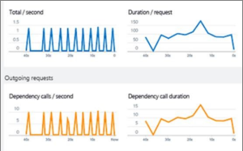

<properties 
    pageTitle="Hakemuksen tiedot hyödyntää tehokkaammin | Microsoft Azure" 
    description="Jälkeen aloittaminen hakemuksen tiedot, tässä on yhteenveto ominaisuuksista, voit selata." 
    services="application-insights" 
    documentationCenter=".net"
    authors="alancameronwills" 
    manager="douge"/>

<tags 
    ms.service="application-insights" 
    ms.workload="tbd" 
    ms.tgt_pltfrm="ibiza" 
    ms.devlang="na" 
    ms.topic="article" 
    ms.date="10/27/2016" 
    ms.author="awills"/>

# <a name="more-telemetry-from-application-insights"></a>Lisää telemetriatietojen-sovelluksen tiedot

Kun olet [lisännyt sovelluksen havainnollistamisen ASP.NET-koodin](app-insights-asp-net.md)tai on muutama seikka, voit saada paremmin telemetriatietojen. 

## <a name="if-your-app-runs-on-your-iis-server-"></a>Sovelluksen käytetään IIS-palvelimeen...

Jos sovelluksesi sijaitsee IIS-palvelimiin ohjausobjektissa, asentaa sovelluksen havainnollistamisen tilan valvonta palvelimiin. Jos se on jo asennettu, ei tarvitse tehdä mitään.

1. IIS web-palvelimessa Kirjaudu sisään järjestelmänvalvojan tunnistetiedoilla.
2. Lataa ja suorita [tilan valvonta asennusohjelma](http://go.microsoft.com/fwlink/?LinkId=506648).
3. Microsoft Azure kirjautuminen ohjatun asennuksen.

Sinun ei tarvitse tehdä mitään muuta, mutta voit vahvistaa, että seuranta on käytössä, kun sovellus.


(Voit käyttää myös tilan valvonta [käyttöön suorituksen seuranta](app-insights-monitor-performance-live-website-now.md), vaikka et soittimen sovelluksia Visual Studiossa.)

### <a name="what-do-you-get"></a>Mitä saat?

Jos palvelin-tietokoneissa on asennettu tilan valvonta, näyttöön tulee joitakin muita telemetriatietojen:

* Riippuvuus telemetriatietojen (SQL-kutsujen ja muiden puhelujen sovelluksen) .NET 4.5 sovellusten. (.NET uudemmat versiot tilan valvonta ei ole pakollinen riippuvuuden telemetriatietojen.) 
* Poikkeuksen pinon jäljittää Näytä tarkemmin.
* Suorituskyvyn laskureita. Hakemuksen tiedot näitä laskureita näkyvät palvelimet-sivu. 


Jos haluat nähdä enemmän tai vähemmän laskureita, [muokata kaavioita](app-insights-metrics-explorer.md). Jos haluat suorituskyvyn laskuri ei ole käytettävissä määrittäminen, voit [lisätä sen suorituskyky laskuri-moduulin keräämiä määrittäminen](app-insights-performance-counters.md).

## <a name="if-its-an-azure-web-app-"></a>Jos se on Azure web app-sovelluksessa...

Jos kuin Azure web app-sovelluksen, siirry Azure Ohjauspaneeliin sovelluksen tai AM ja avaa sovelluksen tiedot-sivu. 

### <a name="what-do-you-get"></a>Mitä saat?

* Poikkeuksen pinon jäljittää Näytä tarkemmin.
* Riippuvuus telemetriatietojen (SQL-kutsujen ja muiden puhelujen sovelluksen) .NET 4.5 sovellusten. (.NET uudempi versio, tiedostotunniste ei ole vaatia riippuvuuden telemetriatietojen.) 


(Voit käyttää myös tällä menetelmällä voit [ottaa käyttöön suorituskyvyn suorituksen aikana](app-insights-monitor-performance-live-website-now.md), vaikka et soittimen sovelluksen Visual Studiossa.)

## <a name="client-side-monitoring"></a>Asiakkaan seuranta

Olet asentanut SDK-paketissa, joka lähettää telemetriatietoja palvelimesta (takaisin end)-sovelluksen. Voit nyt lisätä asiakkaan seuranta. Tämä voi tiedot käyttäjille, istuntojen, page views ja poikkeukset tai kaatuu, jotka ilmenevät selaimessa. Voit myös voi kirjoittaa oman koodin voi seurata, miten käyttäjien suoritetaan sovelluksesi oikealle alas yksityiskohtaiset tason hiiren napsautuksella ja näppäimen painalluksella.

Lisää sovellus tiedot käyttöösi JavaScript-katkelma jokaiselle sivulle telemetriatietojen käyttämistä asiakkaan selaimissa.

1. Avaa Azure-sovelluksen tiedot resurssin, kun sovellus.
2. Avaa käytön aloittaminen-näyttö asiakaspuolen, ja kopioi koodikatkelman.
3. Liitä se, niin, että kunkin verkkosivun - muistissaan yleensä voit tehdä tämän liittämällä perustyyli-rakenne-sivulle.


Huomaat, että koodi, joka määrittää sovelluksen resurssin instrumentation-näppäintä.

### <a name="what-do-you-get"></a>Mitä saat?

* Voit kirjoittaa JavaScript lähettää [mukautetun telemetriatietojen web-sivuilta](app-insights-api-custom-events-metrics.md), esimerkiksi haluat seurata painiketta hiiren napsautuksella.
* [Analytics](app-insights-analytics.md)-tietojen `pageViews` ja AJAX tietojen `dependencies`. 
* [Asiakkaan suorituskyky ja -käyttötietoja](app-insights-javascript.md) selaimet-sivu.


[Lisätietoja verkkosivun seuranta.](app-insights-web-track-usage.md)


## <a name="track-application-version"></a>Seuraa sovellusversio

Varmista, että `buildinfo.config` luodaan MSBuild-prosessin. Lisää .csproj-tiedostoon:  

```XML

    <PropertyGroup>
      <GenerateBuildInfoConfigFile>true</GenerateBuildInfoConfigFile>    <IncludeServerNameInBuildInfo>true</IncludeServerNameInBuildInfo>
    </PropertyGroup> 
```

Siinä on Muodosta info-sovelluksen tiedot-web-moduulin lisää automaattisesti **sovellusversio** ominaisuutena jokaisen telemetriatietojen kohteeseen. Joiden avulla voit suodattaa versiolla, kun [Diagnostiikan](app-insights-diagnostic-search.md) hakuja tai [tutustuminen arvot](app-insights-metrics-explorer.md). 

Huomaa kuitenkin, että koontiversion luodaan vain MS Build kehittäjä Luo Visual Studiossa mukaan.


## <a name="availability-web-tests"></a>Käytettävyys web testit

Lähetä koodiin pyyntöjen säännöllisin väliajoin eri puolilla maailmaa. Olemme Varoita, jos vastaus on hidas tai epäluotettavista.

Valitse sovelluksen tiedot, kun sovellus resurssin käytettävyys-ruutu, voit lisätä, muokata ja tarkastella web testejä.

Voit lisätä useita testit suoritetaan useisiin sijainteihin.


[Opi lisää](app-insights-monitor-web-app-availability.md)

## <a name="custom-telemetry-and-logging"></a>Mukautetun telemetriatietojen ja kirjaaminen

Sovelluksen tiedot-paketteja, jotka olet lisännyt koodin antaa API, voit soittaa sovelluksestasi.

* [Luo omia tapahtuma- ja arvot](app-insights-api-custom-events-metrics.md), kuten Laske business tapahtumia tai suorituskyvyn seuranta voit.
* [Sieppaaminen log jäljittää](app-insights-asp-net-trace-logs.md) Log4Net, NLog tai System.Diagnostics.Trace.
* [Suodata-Muokkaa, tai verkkotunnistetietojen](app-insights-api-filtering-sampling.md) sovelluksestasi lähettämä kirjoittaminen Telemetriatietojen suorittimien vakio telemetriatietojen. 


## <a name="powerful-analysis-and-presentation"></a>Tehokas analysoiminen ja esittäminen

On runsaasti tapoja tietojen. Jos olet viimeksi aloittaminen hakemuksen tiedot, tutustu seuraaviin artikkeleihin:

||
|---|---
|[**Diagnostiikan haun esiintymän tiedot**](app-insights-visual-studio.md)<br/>Hakemisesta ja suodattamisesta tapahtumia, kuten pyynnöt, poikkeukset, riippuvuuden puheluista ja kirjaudu jäljittää ja sivun näkymät. Visual Studiossa Siirry koodiin pinon jälkitiedot.|
|[**Arvot Explorerin kootut tiedot**](app-insights-metrics-explorer.md)<br/>Tarkastella, suodattaa ja määritetään koottuja tietoja, kuten pyynnöt, virheet ja poikkeukset; vastauksen ajat, sivun lataamista.|
|[**Raporttinäkymien**](app-insights-dashboards.md#dashboards)<br/>Tietoja useista resursseista ja Jaa muiden kanssa. Hienoa usean osan sovellusten ja ryhmän huoneessa jatkuva näyttämistä varten.  |
|[**Live arvot muodossa**](app-insights-metrics-explorer.md#live-metrics-stream)<br/>Kun otat käyttöön uuden muodosta, katso nämä lähellä-reaaliajassa suorituskykyilmaisimia, varmista, että kaikki toimii odotetulla tavalla.|
|[**Analytics**](app-insights-analytics.md)<br/>Löydät vastaukset vaikeisiin kysymyksiin sinua sovelluksen suorituskyvyn ja käyttömäärän tehokkaita kyselykielen avulla.|
|[**Automaattiset ja manuaaliset ilmoitukset**](app-insights-alerts.md)<br/>Automaattisia ilmoituksia mukauttaa sinua sovelluksen Normaali kuviot telemetriatietojen ja käynnistin, kun jotakin tavanomaista kaavaa ulkopuolella. Voit määrittää ilmoitusten myös mukautettuja tai standard arvot tiettyyn tasot.|

## <a name="data-management"></a>Tietojen hallinta

|||
|---|---|
|[**Jatkuva vienti**](app-insights-export-telemetry.md)<br/>Kopioi kaikki telemetriatietojen tallennustilaa niin, että voit analysoida niitä oman tavalla.|
|**Tietojen käyttö Ohjelmointirajapinta**<br/>Tulossa pian.|
|[**Esimerkkejä**](app-insights-sampling.md)<br/>Vähentää tietojen määrä ja avulla voit pitää hinnoittelu taso rajoissa.|