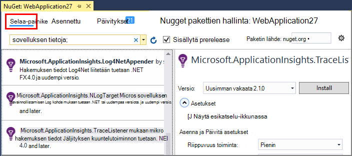
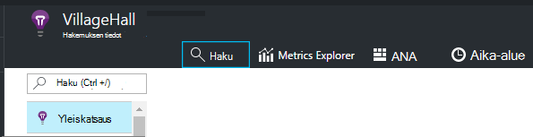
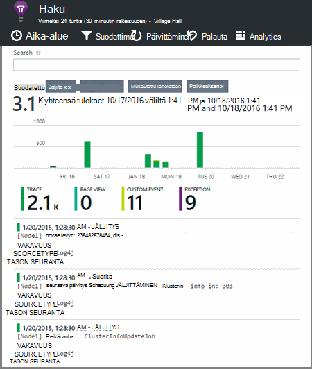

<properties 
    pageTitle="Tutustu .NET Jäljityslokien hakemuksen tiedot" 
    description="Etsi luotu jäljitys, NLog tai Log4Net lokitiedot." 
    services="application-insights" 
    documentationCenter=".net"
    authors="alancameronwills" 
    manager="douge"/>

<tags 
    ms.service="application-insights" 
    ms.workload="tbd" 
    ms.tgt_pltfrm="ibiza" 
    ms.devlang="na" 
    ms.topic="article" 
    ms.date="07/21/2016" 
    ms.author="awills"/>
 
# <a name="explore-net-trace-logs-in-application-insights"></a>Tutustu .NET Jäljityslokien hakemuksen tiedot  

Jos käytät NLog log4Net tai diagnostiikan jäljitys ASP.NET-sovelluksessa System.Diagnostics.Trace voi olla [Visual Studio sovelluksen]havainnollistamisen lähettää lokit[start], jossa voit tarkastella ja etsiä niitä. Lokien yhdistetään telemetriatietojen, tulevat sovelluksen niin, että voit tunnistaa liittyvät ylläpidon käyttäjän sivupyynnön jäljittää ja yhdistää ne muiden tapahtumien ja poikkeuksen raportit.


> [AZURE.NOTE] Lokitiedoston sieppaus-moduuli on? Se on hyödyllinen sovittimen 3rd osapuolen tallentajia varten, mutta jos käytössäsi ei ole jo NLog, log4Net tai System.Diagnostics.Trace, harkitse kutsumista vain [Hakemuksen tiedot TrackTrace()](app-insights-api-custom-events-metrics.md#track-trace) suoraan.


## <a name="install-logging-on-your-app"></a>Kirjautuminen sisään sovelluksen asentaminen

Asenna valitsemasi kirjaaminen framework projektin. Tämä on johtaa app.config tai web.config täydennys.

Jos käytät System.Diagnostics.Trace, sinun on lisättävä merkinnän web.config:

```XML

    <configuration>
     <system.diagnostics>
       <trace autoflush="false" indentsize="4">
         <listeners>
           <add name="myListener" 
             type="System.Diagnostics.TextWriterTraceListener" 
             initializeData="TextWriterOutput.log" />
           <remove name="Default" />
         </listeners>
       </trace>
     </system.diagnostics>
   </configuration>
```

## <a name="configure-application-insights-to-collect-logs"></a>Hakemuksen tiedot lokien kerääminen määrittäminen

Jos et ole antanut, vielä **[Lisätä sovelluksen havainnollistamisen projektin](app-insights-asp-net.md)** . Näkyviin tulee vaihtoehto sisältämään log kerääminen.

Tai napsauttamalla hiiren kakkospainikkeella ratkaisunhallinnassa projektin **Määrittäminen hakemuksen tiedot** . Valitse **Määritä jäljitys sivustokokoelman**.

*Sovelluksen tiedot-valikosta tai log kerääminen valintaa?* Yritä [vianmääritystä](#troubleshooting).


## <a name="manual-installation"></a>Manuaalinen asennus

Käytä tätä tapaa, jos projektityyppi ei tue sovelluksen havainnollistamisen installer (kuten Windows desktop projektin). 

1. Jos aiot käyttää log4Net tai NLog, voit asentaa sen projektin. 
2. Napsauta ratkaisunhallinnassa projektin hiiren kakkospainikkeella ja valitse **NuGet pakettien hallinta**.
3. Etsi "Hakemuksen tiedot"

    

4. Valitse haluamasi paketti - jokin seuraavista:
  + Microsoft.ApplicationInsights.TraceListener (kannattaa tallentaa System.Diagnostics.Trace puhelut)
  + Microsoft.ApplicationInsights.NLogTarget
  + Microsoft.ApplicationInsights.Log4NetAppender

NuGet-paketti asennetaan tarvittavat kokoonpanon ja Muokkaa myös web.config tai app.config.

## <a name="insert-diagnostic-log-calls"></a>Lisää vianmäärityslokeihin puhelut

Jos käytät System.Diagnostics.Trace, tyypillinen puhelun on seuraava:

    System.Diagnostics.Trace.TraceWarning("Slow response - database01");

Jos käytät mieluummin log4net tai NLog:

    logger.Warn("Slow response - database01");


## <a name="using-the-trace-api-directly"></a>Jäljitä Ohjelmointirajapinnan käyttäminen suoraan

Voit kutsua sovelluksen havainnollistamisen seurannasta API suoraan. Kirjaaminen sovittimet käyttävät tätä Liittymää. 

Esimerkki:

    var telemetry = new Microsoft.ApplicationInsights.TelemetryClient();
    telemetry.TrackTrace("Slow response - database01");

TrackTrace etuna on se, että voit laittaa tietojen suhteellisen pitkää viestiä. Esimerkiksi voi koodata kirjaa tietoja siellä. 

Lisäksi voit lisätä vakavuus tason viestiin. Ja muut telemetriatietojen, kuten voit lisätä ominaisuuden arvoja, jotka voit tehdä suodattimen tai Hae erilaisia arvojoukkoja jäljittää Ohje. Esimerkki:


    var telemetry = new Microsoft.ApplicationInsights.TelemetryClient();
    telemetry.TrackTrace("Slow database response",
                   SeverityLevel.Warning,
                   new Dictionary<string,string> { {"database", db.ID} });

Tämä mahdollisella tavalla, [Etsi][diagnostic], helposti suodattamaan tietyn vakavuus tason tietyn tietokannan liittyvät viestit.

## <a name="explore-your-logs"></a>Tutustu lokit

Suorita sovellus, joko virheenkorjaus-tilassa tai ota käyttöön live.

Valitse [sovelluksen tiedot]-portaalissa sinua sovelluksen yhteenveto-sivu[portal], valitse [haku][diagnostic].





Voit esimerkiksi:

* Suodattaa lokin jäljittää tai kohteet, joiden tietyt ominaisuudet
* Tarkasta tietyn kohteen yksityiskohtaiset tiedot.
* Etsi muita telemetriatietojen liittyvät käyttäjän pyynnössä (eli saman toimintotunnukseksi kanssa) 
* Tallenna tämän sivun kokoonpano suosikiksi

> [AZURE.NOTE] **Esimerkkejä.** Jos sovelluksesi lähettää tietojen tarkastelun ja käytät sovelluksen tiedot-SDK ASP.NET-version 2.0.0-beta3 tai uudempi versio, mukautuvat esimerkkejä-ominaisuus saattaa toimia ja Lähetä vain oman telemetriatietojen prosentteina. [Lue lisää esimerkkejä.](app-insights-sampling.md)

## <a name="next-steps"></a>Seuraavat vaiheet

[Virheet ja poikkeukset ASP.NET-vianmääritys][exceptions]

[Lisätietoja haun][diagnostic].


## <a name="troubleshooting"></a>Vianmääritys

### <a name="how-do-i-do-this-for-java"></a>Miten teen tämä Java?

Käytä [Java log sovittimet](app-insights-java-trace-logs.md).

### <a name="theres-no-application-insights-option-on-the-project-context-menu"></a>Project-pikavalikko ei ole sovelluksen tiedot-asetus on

* Valitse sovelluksen tiedot-työkalut asennetaan kehittäminen tässä tietokoneessa. Visual Studio valikko-Työkalut, tunnisteet ja päivitykset Etsi sovellus havainnollistamisen työkalut. Jos se ei ole asennettu-välilehti, avaa Online-välilehti ja asenna se.
* Tämä voi johtua ei tue sovelluksen havainnollistamisen työkalut projektin tyyppi. Käytä [Manuaalinen asennus](#manual-installation).

### <a name="no-log-adapter-option-in-the-configuration-tool"></a>Ei log sovittimen vaihtoehto määritys-työkalussa

* Sinun täytyy asentaa kirjaaminen framework ensin.
* Jos käytät System.Diagnostics.Trace, varmista, että [määritetty sen `web.config` ](https://msdn.microsoft.com/library/system.diagnostics.eventlogtracelistener.aspx).
* Olet, onko sovellus havainnollistamisen Työkalut uusimman version? Visual Studio- **Työkalut** -valikossa Valitse **tunnisteet ja päivitykset**ja Avaa **päivitykset** -välilehti. Jos sovelluksen havainnollistamisen työkalut on roskapostikansiossa, valitse päivittää sen.


### <a name="emptykey"></a>Saan virhesanoman "Instrumentation avain ei voi olla tyhjä"

Näyttää kirjaaminen sovittimen Nuget paketin asentanut asentamatta hakemuksen tiedot.

Napsauta ratkaisunhallinnassa, napsauta hiiren kakkospainikkeella `ApplicationInsights.config` ja valitse **Päivitä sovelluksen tiedot**. Näyttöön tulee valintaikkuna, joka kutsuu voit kirjautua Azure ja Luo sovelluksen tiedot-resurssi, tai Käytä aiemmin luotua uudelleen. Tämä on Ratkaise.

### <a name="i-can-see-traces-in-diagnostic-search-but-not-the-other-events"></a>Diagnostiikan haun, mutta ei muiden tapahtumien jäljittää on näkyvissä

Joskus saattaa kestää hetken tapahtumien ja pyynnöt tulee putkijohto.

### <a name="limits"></a>Kuinka paljon tietoja säilytetään?

Enintään 500 tapahtumat sekunnissa kunkin sovelluksesta. Tapahtumien säilyvät seitsemän päivän ajan.

### <a name="im-not-seeing-some-of-the-log-entries-that-i-expect"></a>Ei näy joitakin lokimerkintöjä, korjata

Jos sovelluksesi lähettää tietojen tarkastelun ja käytät sovelluksen tiedot-SDK ASP.NET-version 2.0.0-beta3 tai uudempi versio, mukautuvat esimerkkejä-ominaisuus saattaa toimia ja Lähetä vain oman telemetriatietojen prosentteina. [Lue lisää esimerkkejä.](app-insights-sampling.md)

## <a name="add"></a>Seuraavat vaiheet

* [Käytettävyys ja vastausajan testien määrittäminen][availability]
* [Vianmääritys][qna]


<!--Link references-->

[availability]: app-insights-monitor-web-app-availability.md
[diagnostic]: app-insights-diagnostic-search.md
[exceptions]: app-insights-asp-net-exceptions.md
[portal]: https://portal.azure.com/
[qna]: app-insights-troubleshoot-faq.md
[start]: app-insights-overview.md

 
