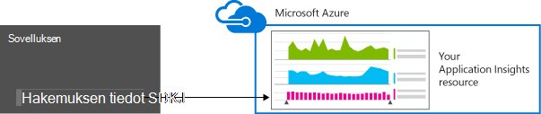

<properties 
    pageTitle="Hakemuksen tiedot kanssa ASP.NET web app analytics määrittäminen | Microsoft Azure" 
    description="Suorituskyvyn, käytettävyys ja käyttöanalyysin ASP.NET-sivuston määrittäminen nykyisessä paikallisen tai Azure-tietokannassa." 
    services="application-insights" 
    documentationCenter=".net"
    authors="NumberByColors" 
    manager="douge"/>

<tags 
    ms.service="application-insights" 
    ms.workload="tbd" 
    ms.tgt_pltfrm="ibiza" 
    ms.devlang="na" 
    ms.topic="get-started-article" 
    ms.date="10/13/2016" 
    ms.author="awills"/>


# <a name="set-up-application-insights-for-aspnet"></a>ASP.NET hakemuksen tiedot määrittäminen

[Visual Studio hakemuksen tiedot](app-insights-overview.md) valvoo live sovelluksen auttaa [tunnistamaan ja vianmäärityksen suorituskykyongelmia ja poikkeukset](app-insights-detect-triage-diagnose.md)ja [Tutustu, miten sovelluksen käytetään](app-insights-overview-usage.md).  Se toimii sovellukset, joita isännöidään oman paikallisen IIS-palvelimiin tai cloud VMs sekä Azure verkkosovelluksissa.


## <a name="before-you-start"></a>Ennen aloittamista

Tarvitset:

* Visual Studio 2013: n päivitys 3 tai uudempi. On myöhemmin parempi.
* [Microsoft Azure](http://azure.com)-tilausta. Jos ryhmäsi tai organisaation on Azure-tilaus, omistaja voi lisätä voit, käyttämällä [Microsoft-tili](http://live.com). 

Vaihtoehtoinen artikkeleita, jos olet kiinnostunut voit katsella on:

* [Instrumenting verkkosovellukseen suorituksen aikana](app-insights-monitor-performance-live-website-now.md)
* [Azure pilvipalveluihin](app-insights-cloudservices.md)

## <a name="ide"></a>1. lisätä hakemuksen tiedot SDK-paketissa


### <a name="if-its-a-new-project"></a>Jos kyseessä on uusi projekti...

Varmista, että hakemuksen tiedot on valittuna, kun luot uuden projektin luominen Visual Studiossa. 


### <a name="-or-if-its-an-existing-project"></a>... tai jos se on aiemmin luodusta projektista

Napsauta ratkaisunhallinnassa projektin hiiren kakkospainikkeella ja valitse **Lisää sovellus havainnollistamisen Telemetriatietojen** tai **Määrittäminen sovelluksen tiedot**.


* ASP.NET-Core projektiin? - [Noudattamalla seuraavia ohjeita voit korjata joitakin koodin rivit](https://github.com/Microsoft/ApplicationInsights-aspnetcore/wiki/Getting-Started#add-application-insights-instrumentation-code-to-startupcs). 


## <a name="run"></a>2. Suorita sovellus

Suorita sovellus F5-näppäintä ja kokeile,: Avaa Luo joitakin telemetriatietojen eri sivuille.

Visual Studiossa näet tapahtumat, jotka on kirjattu määrä. 


## <a name="3-see-your-telemetry"></a>3. Katso oman telemetriatietojen...

### <a name="-in-visual-studio"></a>... Visual Studiossa

Avaa Visual Studiossa sovelluksen tiedot-ikkuna: Valitse sovelluksen tiedot-painiketta tai napsauta ratkaisunhallinnassa projektin:


Tässä näkymässä näkyy luotu sovelluksesi palvelinpuolen telemetriatietojen. Kokeile suodattimet ja napsauttamalla mitä tahansa yksityiskohdat.

[Lisätietoja Visual Studio sovelluksen tiedot-työkaluista](app-insights-visual-studio.md).

<a name="monitor"></a> 
### <a name="-in-the-portal"></a>Portalissa...

Ellet *Asentaa SDK,* näet myös telemetriatietojen sovelluksen tiedot-web-portaaliin. 

Portaalissa on muita kaavioita, analyyttisten työkalut ja raporttinäkymien kuin Visual Studio. 


Avaa sovellus tiedot resurssin [Azure portal](https://portal.azure.com/).


Portaalin avautuu sovelluksestasi telemetriatietojen näkymän:

* Ensimmäisen telemetriatietojen näkyy [Live arvot muodossa](app-insights-metrics-explorer.md#live-metrics-stream).
* Yksittäiset tapahtumat näkyvät **haun** (1). Tietoja voi kestää muutaman minuutin kuluttua näkyvän. Napsauttamalla mitä tahansa jotta voit tarkastella sen ominaisuuksia. 
* Koostetun arvot näkyvät kaavioiden (2). Voi kestää hetken tai kaksi tiedot näkyvät tässä. Valitse mikä tahansa kaaviota ja Avaa sivu ja lisää tiedot.

[Lisätietoja käyttämällä sovelluksen havainnollistamisen Azure-portaalissa](app-insights-dashboards.md).

## <a name="4-publish-your-app"></a>4. sovelluksen julkaiseminen

Julkaista sovelluksen IIS-palvelimeen tai Azure. Katso [Live arvot muodossa](app-insights-metrics-explorer.md#live-metrics-stream) , varmista, että kaikki toimii ongelmitta.

Näet sovelluksen tiedot-portaalissa, jossa voit valvoa mittarit, Etsi oman telemetriatietojen ja määrittäminen [raporttinäkymät](app-insights-dashboards.md)muodostetaan yhteyttä telemetriatietojen. Voit käyttää [Analytics kyselyn kielen](app-insights-analytics.md) tehokas käyttö- ja suorituskyvyn analysoiminen ja löytämään tiettyyn tapahtumat. 

Voit myös edelleen oman telemetriatietojen [Visual](app-insights-visual-studio.md) Studiossa työkaluja, kuten diagnostiikan haku- ja [trendien](app-insights-visual-studio-trends.md)analysoiminen.

> [AZURE.NOTE] Jos sovelluksen lähettää tarpeeksi telemetriatietojen esitellä [rajoittimen rajoitukset](app-insights-pricing.md#limits-summary), automaattinen [Esimerkkejä](app-insights-sampling.md) vaihtaa. Esimerkkejä vähentää telemetriatietojen lähetetyt-sovellukset säilyttämällä vianmääritystä varten Korreloidun tietojen määrä.


##<a name="land"></a>Mitä 'Lisää sovellus tiedot' tehdä?

Hakemuksen tiedot lähettää telemetriatietojen sovelluksen sovelluksen tiedot-portaaliin (joka sijaitsee Microsoft Azure):



Jotta komento näkyy kolme asiaa:

1. Hakemuksen tiedot Web SDK NuGet paketin lisääminen projektiin. Jos haluat nähdä Visual Studiossa, projektin hiiren kakkospainikkeella ja valitse NuGet pakettien hallinta.
2. Luo sovelluksen tiedot-resurssin [Azure](https://portal.azure.com/)-portaalissa. Tämä on, jossa näet tiedot. Se hakee *instrumentation-näppäintä,* joka yksilöi resurssin.
3. Lisää instrumentation avain `ApplicationInsights.config`, jotta SDK lähettää telemetriatietojen-portaaliin.

Jos haluat, voit tehdä seuraavat toimet itse [ASP.NET-4](app-insights-windows-services.md) tai [ASP.NET Core](https://github.com/Microsoft/ApplicationInsights-aspnetcore/wiki/Getting-Started).

### <a name="to-upgrade-to-future-sdk-versions"></a>Tulevien SDK-versioiden päivittäminen

[Uuden version SDK:](https://github.com/Microsoft/ApplicationInsights-dotnet-server/releases)ksi, Avaa NuGet pakettien hallinta uudelleen ja suodattaa asennetut paketit. Valitse Microsoft.ApplicationInsights.Web ja valitse Päivitä.

Jos olet tehnyt kaikki mukautukset ApplicationInsights.config, tallentaa sen ennen päivittäminen ja yhdistää muutokset jälkeenpäin uuteen versioon.

## <a name="add-more-telemetry"></a>Lisää Lisää telemetriatietojen

### <a name="web-pages-and-single-page-apps"></a>Verkkosivujen ja yhden sovellukset

1. Verkkosivujen [lisääminen käyttöösi JavaScript-katkelma](app-insights-javascript.md) näyttää tiedot sivun näkymät, latausajat, selaimen poikkeukset AJAX puhelun suorituskyvyn selaimessa ja käyttö näiden käyttäjien ja istunnon arvo.
2. [Mukautetut tapahtumat koodin](app-insights-api-custom-events-metrics.md) määrä, aika tai mittayksikön käyttäjän toimet.

### <a name="dependencies-exceptions-and-performance-counters"></a>Riippuvuudet, poikkeukset ja suorituskyvyn laskureita

[Asenna tilan valvonta](app-insights-monitor-performance-live-website-now.md) kunkin palvelimissa, saat lisää tietoja sovelluksen telemetriatietojen. Näkyviin tulee seuraavat asiat:

* [Suorituskyvyn laskureita](app-insights-performance-counters.md) - 
suorittimen ja muistin, levyn sovelluksen liittyvät suorituskyvyn muita laskureita. 
* [Poikkeukset](app-insights-asp-net-exceptions.md) - tarkempia telemetriatietojen joitakin poikkeuksia.
* [Riippuvuudet](app-insights-asp-net-dependencies.md) - puhelut REST API tai SQL-palveluihin. Katso, onko hidas vastaukset ulkoisen osat aiheuttavat suorituskykyongelmia sovellukseen. (Jos sovellus toimii .NET 4.6, sinun ei tarvitse tilan valvonta saat tämän telemetriatietojen.)

### <a name="diagnostic-code"></a>Diagnostiikan koodi

Onko sinulla ongelmia? Jos haluat lisätä koodin voi selvittää sen sovelluksen, sinulla on useita vaihtoehtoja:

* [Sieppaus log jäljittää](app-insights-asp-net-trace-logs.md): Jos jo käytössä Log4N, NLog tai System.Diagnostics.Trace kirjautua tapahtumien seuranta ja valitse tulosteen voidaan lähettää sovelluksen havainnollistamisen niin, että se voidaan yhdistää pyyntöjen, Etsi kulkee ja analysoi. 
* [Mukautetut tapahtumat ja arvot](app-insights-api-custom-events-metrics.md): Käytä TrackEvent() ja TrackMetric() palvelimeen tai verkkosivun koodin.
* [Tunnisteen telemetriatietojen ja muita ominaisuuksia](app-insights-api-filtering-sampling.md#add-properties)

[Hakutoiminnolla voit etsiä ja yhdistää tiettyjen tapahtumien ja [analyysin](app-insights-analytics.md) suorittamiseen tehokkaampia kyselyt.](app-insights-diagnostic-search.md)

## <a name="alerts"></a>Ilmoitukset

Ensimmäisten tietää, onko sovelluksen ongelmia. (Älä odota kertoa käyttäjille!) 

* [Luo web testien](app-insights-monitor-web-app-availability.md) varmistaaksesi, että sivusto on näkyvissä verkossa.
* [Ennakoiva diagnostiikka](app-insights-proactive-diagnostics.md) Suorita automaattisesti (Jos sovellus on vain tietyt vähän liikenne). Sinun ei tarvitse tehdä mitään voit määrittää ne seuraavalla. Ne kertoa, jos sovellus on epäonnistuneiden pyyntöjen epätavallisia korkokannan.
* [Metrijärjestelmän ilmoitusten määrittäminen](app-insights-alerts.md) varoittaa, jos mittarin leikkauspiste raja-arvon. Voit määrittää ne mukautettua arvot voit koodi sovelluksen kyselyjä.

Ilmoitukset lähetetään Azure tilauksen omistaja. 


## <a name="version-and-release-tracking"></a>Versionumeron ja seuranta

### <a name="track-application-version"></a>Seuraa sovellusversio

Varmista, että `buildinfo.config` luodaan MSBuild-prosessin. Lisää .csproj-tiedostoon:  

```XML

    <PropertyGroup>
      <GenerateBuildInfoConfigFile>true</GenerateBuildInfoConfigFile>    <IncludeServerNameInBuildInfo>true</IncludeServerNameInBuildInfo>
    </PropertyGroup> 
```

Siinä on Muodosta info-sovelluksen tiedot-web-moduulin lisää automaattisesti **sovellusversio** ominaisuutena jokaisen telemetriatietojen kohteeseen. Joiden avulla voit suodattaa versiolla, kun [Diagnostiikan](app-insights-diagnostic-search.md) hakuja tai [tutustuminen arvot](app-insights-metrics-explorer.md). 

Huomaa kuitenkin, että koontiversion luodaan vain MS Build kehittäjä Luo Visual Studiossa mukaan.

### <a name="release-annotations"></a>Vapauta huomautukset

Jos käytät Visual Studio Team Services, voit [saada huomautuksen merkki](app-insights-annotations.md) lisätään kaaviot aina, kun vapautat uuden version.


## <a name="next-steps"></a>Seuraavat vaiheet

| | 
|---|---
|**[Hakemuksen tiedot Visual Studiossa käsitteleminen](app-insights-visual-studio.md)**<br/>Virheenkorjaus telemetriatietojen diagnostiikan kanssa Etsi-koodiin porautuminen.|
|**[Sovelluksen tiedot-portaalin käyttäminen](app-insights-dashboards.md)**<br/>Raporttinäkymien, diagnostiikka- ja analyyttisten tehokkaita työkaluja, ilmoitukset-sovellus ja telemetriatietojen live riippuvuuden kartan Vie. |
|**[Lisää tietoja](app-insights-asp-net-more.md)**<br/>Seurata käyttöä, käytettävyys, riippuvuudet, poikkeukset. Integroi jäljittää kirjaaminen kehysten kohteesta. Kirjoita mukautetun telemetriatietojen. | 


