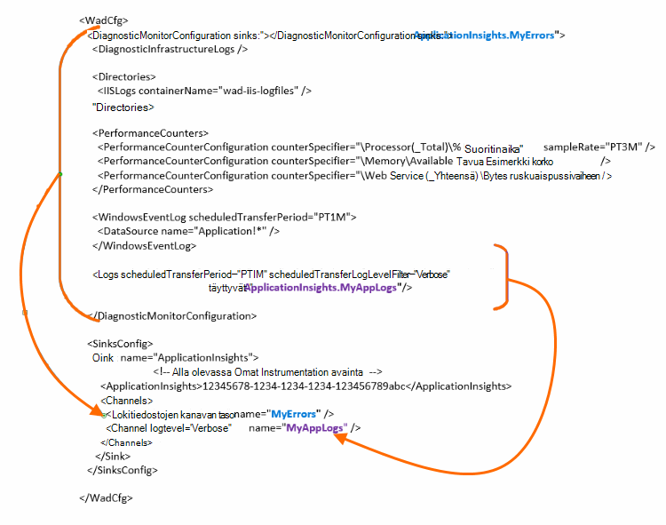

<properties
    pageTitle="Lähetä Azure vianmäärityslokit sovelluksen havainnollistamisen"
    description="Määritä tiedot, jotka lähetetään sovelluksen tiedot-portaaliin Azure Cloud Services-vianmäärityslokit."
    services="application-insights"
    documentationCenter=".net"
    authors="sbtron"
    manager="douge"/>

<tags
    ms.service="application-insights"
    ms.workload="tbd"
    ms.tgt_pltfrm="ibiza"
    ms.devlang="na"
    ms.topic="article"
    ms.date="11/17/2015"
    ms.author="awills"/>

# <a name="configure-azure-diagnostic-logging-to-application-insights"></a>Sovelluksen havainnollistamisen Azure diagnostiikan kirjauksen määrittäminen

Kun määrität pilvipalveluihin projektin tai Virtual-Machine-Microsoft Azure- [Azure luoda diagnostiikan loki](../vs-azure-tools-diagnostics-for-cloud-services-and-virtual-machines.md). Voit määrittää tämän lähetetty sovelluksen havainnollistamisen niin, että voit analysoida ja diagnostiikka- ja käytön mukaan hakemuksen tiedot SDK sovelluksen lähettämät telemetriatietojen. Azure loki sisältää tapahtumien sovellus, esimerkiksi aloitus, Lopeta, kaatuu sekä suorituskyvyn laskureita hallinta. Kirjaudu myös puhelut System.Diagnostics.Trace-sovelluksessa.

Tässä artikkelissa kerrotaan yksityiskohtaisesti diagnostiikan sieppaus määrittäminen.

Sinun on asennettu Visual Studiossa Azure SDK 2,8.

## <a name="get-an-application-insights-resource"></a>Hae sovelluksen tiedot-resurssi

Paras kokemus, [Lisää sovellus havainnollistamisen SDK rooleille Cloud Services-sovelluksen](app-insights-cloudservices.md)tai [jostakin sovellukseen voit suorittaa oman AM](app-insights-overview.md). Voit lähettää analysoidaan tietoja ja samalle resurssille hakemuksen tiedot näkyviin.

Vaihtoehtoisesti, jos et halua käyttää SDK - esimerkiksi jos sovellus on jo live - voit vain [Luo uusi sovelluksen havainnollistamisen resurssi](app-insights-create-new-resource.md) Azure-portaalissa. Valitse **Azure vianmääritys** sovelluksen tyyppi.


## <a name="send-azure-diagnostics-to-application-insights"></a>Lähetä Azure vianmääritys sovelluksen havainnollistamisen

Jos et pysty päivittämään app projektin, sitten Visual Studiossa kunkin rooli, valitse sen ominaisuuksia ja määritys-välilehti, valitse **Lähetä vianmääritys sovelluksen havainnollistamisen**.

Jos sovellus on jo julkaistu, käytä Visual Studio palvelimen Explorer tai pilvipalveluihin Resurssienhallinnassa Avaa sovelluksen ominaisuudet. Valitse **Lähetä vianmääritys sovelluksen havainnollistamisen**.

Kaikissa tapauksissa, sinua pyydetään lisätietoja loit sovelluksen tiedot resurssin.

[Lisätietoja sovelluksen havainnollistamisen Cloud Services-sovelluksen määrittäminen](app-insights-cloudservices.md).

## <a name="configuring-the-azure-diagnostics-adapter"></a>Azure diagnostiikka-sovittimen määrittäminen

Vain luku-Jos haluat valita lokin, joka hakemuksen tiedot lähetät osat. Oletusarvon mukaan kaikki on lähetetty, mukaan lukien: Microsoft Azure tapahtumien; suorituskyvyn laskureita; jäljittää kutsuja sovelluksen System.Diagnostics.Trace.

Azure diagnostiikka tallentaa tiedot Azuren tallennustilaan taulukoihin. Voit kuitenkin myös putkien kaikki tai osan tiedoista sovelluksen havainnollistamisen määrittäminen "täyttyvät" ja "kanavien" kokoonpanoa käytettäessä Azure diagnostiikka-tunniste 1.5 tai uudempi.

### <a name="configure-application-insights-as-a-sink"></a>Määritä hakemuksen tiedot käsittelytoiminto

Rooli-ominaisuuksien avulla voit määrittää "Lähetä tiedot sovelluksen havainnollistamisen", Lisää Azure SDK (2,8 tai uudempi) `<SinksConfig>` julkisen [Azure diagnostiikka kokoonpanotiedosto](https://msdn.microsoft.com/library/azure/dn782207.aspx) roolin elementti.

`<SinksConfig>`määrittää muita käsittelytoiminto kohtaa, johon voidaan lähettää Azure diagnostiikka-tiedot.  Esimerkki `SinksConfig` tältä:

```xml

    <SinksConfig>
     <Sink name="ApplicationInsights">
      <ApplicationInsights>{Insert InstrumentationKey}</ApplicationInsights>
      <Channels>
        <Channel logLevel="Error" name="MyTopDiagData"  />
        <Channel logLevel="Verbose" name="MyLogData"  />
      </Channels>
     </Sink>
    </SinksConfig>

```

`ApplicationInsights` Elementti määrittää instrumentation-näppäintä, joka yksilöi hakemuksen tiedot resurssin, johon Azure diagnostiikka tiedot lähetetään. Kun olet valinnut resurssi, se lisätään automaattisesti perusteella `APPINSIGHTS_INSTRUMENTATIONKEY` palvelun määritykset. (Jos haluat määrittää sen manuaalisesti, saat avain resurssin Essentials avattavasta luettelosta.)

`Channels`Määritä tiedot, jotka lähetetään käsittelytoiminto. Kanavan toimii samalla tavalla kuin suodatin. `loglevel` Määritteen avulla voit määrittää lokitiedoston, joka lähettää kanava. Käytettävissä ovat seuraavat arvot: `{Verbose, Information, Warning, Error, Critical}`.

### <a name="send-data-to-the-sink"></a>Tietojen lähettäminen käsittelytoiminto

Lähetä tiedot sovelluksen havainnollistamisen allas lisäämällä DiagnosticMonitorConfiguration solmun poistumia-määrite. Pesualtaiden-osan lisääminen kukin solmu määrittää, että haluat solmun ja se lähetetään määritetty käsittelytoiminto solmu kerättyjä tietoja.

Azure-SDK luoma oletusarvo on esimerkiksi Lähetä Azure diagnostiikan tiedot:

```xml

    <DiagnosticMonitorConfiguration overallQuotaInMB="4096" sinks="ApplicationInsights">
```

Mutta jos haluat lähettää vain virhelokeja olla käsittelytoiminto nimi kanavan nimi:

```xml

    <DiagnosticMonitorConfiguration overallQuotaInMB="4096" sinks="ApplicationInsights.MyTopDiagdata">
```

Huomaa, että esimerkissä on käytössä, jotka on määritetty nimi, joka on määritetty edellä kanavan sekä käsittelytoiminto nimi.

Jos haluat määrittää vain Lähetä yksityiskohtainen sovelluksen lokit sovelluksen havainnollistamisen sitten poistumia-määritteen, Lisää `Logs` solmu.

```xml

    <Logs scheduledTransferPeriod="PT1M" scheduledTransferLogLevelFilter="Verbose" sinks="ApplicationInsights.MyLogData"/>
```

Voit myös lisätä useita pesualtaita hierarkiassa eri tasoilla määritykset. Tässä tapauksessa määritetyn hierarkian ylimmällä tasolla käsittelytoiminto toimii yleinen asetus ja yksittäisen osan elementti säädösten ohitus Yleiset asetukset, kuten osoitteessa on määritetty.

Seuraavassa on valmis Esimerkki julkisen määritystiedoston, joka lähettää kaikki virheet sovelluksen havainnollistamisen (on määritetty `DiagnosticMonitorConfiguration` solmu) ja lisäksi yksityiskohtainen tason kirjautuu lokit sovelluksen (on määritetty `Logs` solmu).

```xml

    <WadCfg>
     <DiagnosticMonitorConfiguration overallQuotaInMB="4096"
       sinks="ApplicationInsights.MyTopDiagData"> <!-- All info below sent to this channel -->
      <DiagnosticInfrastructureLogs />
      <PerformanceCounters>
        <PerformanceCounterConfiguration counterSpecifier="\Processor(_Total)\% Processor Time" sampleRate="PT3M" sinks="ApplicationInsights.MyLogData/>
        <PerformanceCounterConfiguration counterSpecifier="\Memory\Available MBytes" sampleRate="PT3M" />
        <PerformanceCounterConfiguration counterSpecifier="\Web Service(_Total)\Bytes Total/Sec" sampleRate="PT3M" />
      </PerformanceCounters>
      <WindowsEventLog scheduledTransferPeriod="PT1M">
        <DataSource name="Application!*" />
      </WindowsEventLog>
      <Logs scheduledTransferPeriod="PT1M" scheduledTransferLogLevelFilter="Verbose"
            sinks="ApplicationInsights.MyLogData"/>
       <!-- This specific info sent to this channel -->
     </DiagnosticMonitorConfiguration>

     <SinksConfig>
      <Sink name="ApplicationInsights">
        <ApplicationInsights>{Insert InstrumentationKey}</ApplicationInsights>
        <Channels>
          <Channel logLevel="Error" name="MyTopDiagData"  />
          <Channel logLevel="Verbose" name="MyLogData"  />
        </Channels>
      </Sink>
     </SinksConfig>
    </WadCfg>
```



On joitakin rajoituksia otettava huomioon tämän toiminnon avulla:

* Kanavien on tarkoitettu vain lokitiedoston tyyppi ja suorituskyvyn laskureita. Jos määrität kanavan suorituskyvyn laskuri-elementin, se ohitetaan.
* Log-tason kanavan eivät saa ylittää log tason Azure diagnostiikka kerättyjä tietoja. Esimerkki: Et voi kerätä sovelluksen virheiden lokit-osaan ja yritä lähettää yksityiskohtainen virhelokit sovelluksen tietoja Synkronoi. ScheduledTransferLogLevelFilter-määrite on aina kerätä yhtä tai Lisää lokit lokit kuin yrität lähettää käsittelytoiminto.
* Blob-objektien mitään tietoja ei voi lähettää keräämiä Azure diagnostiikka tunniste sovelluksen havainnollistamisen. Esimerkiksi mitään määritetty hakemistoja-solmun. Saat kaatumisen kirjoittaa todellisia kaatumisvedos edelleen lähetetään blob storage ja hakemuksen tiedot lähetetään vain ilmoituksen kaatumisvedos luotiin.

## <a name="related-topics"></a>Aiheeseen liittyviä ohjeita

* [Azure pilvipalveluihin hakemuksen tiedot ja seuranta](app-insights-cloudservices.md)
* [Lähetä Azure vianmääritys sovelluksen havainnollistamisen PowerShellin avulla](app-insights-powershell-azure-diagnostics.md)
* [Azure diagnostiikka kokoonpanotiedosto](https://msdn.microsoft.com/library/azure/dn782207.aspx)
