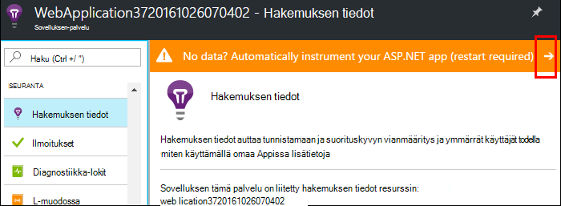
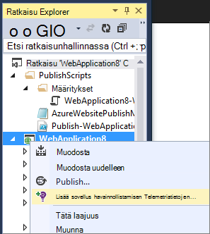
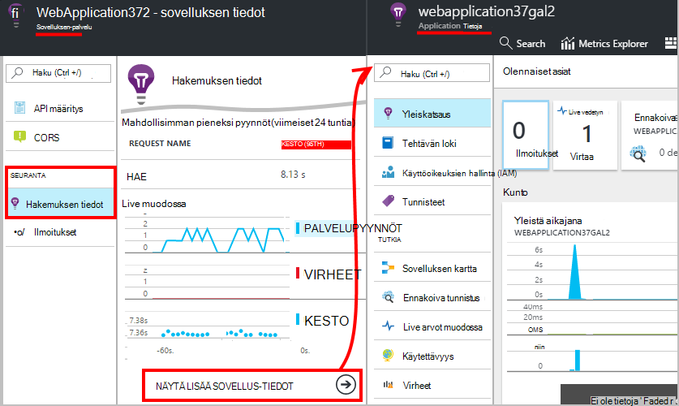
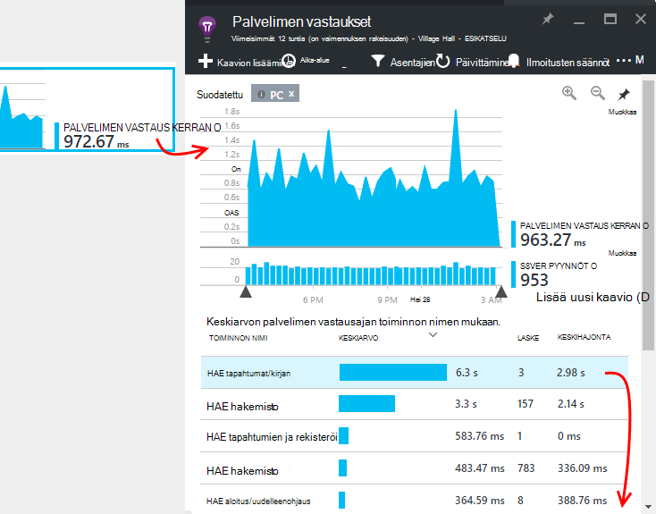
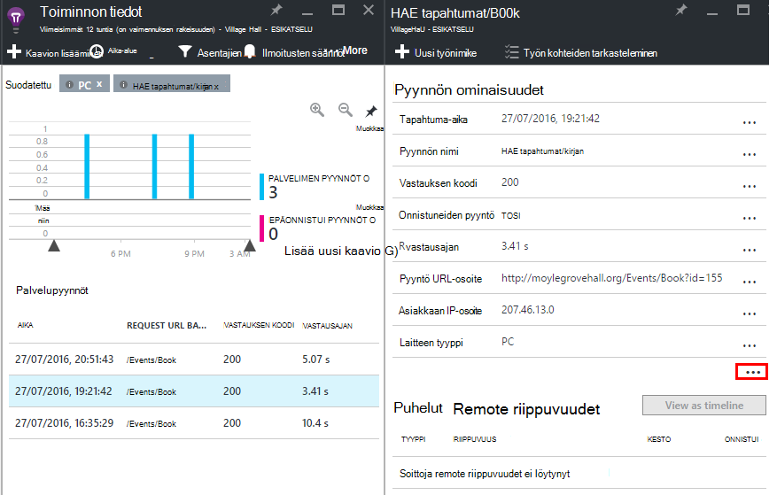

<properties
    pageTitle="Seurata Azure web app | Microsoft Azure"
    description="Sovelluksen suorituskyvyn Azure-verkkosovelluksissa. Kaavion kuormituksen ja vastaus aikaa, riippuvuustiedot ja määrittämään ilmoituksia suorituskykyyn."
    services="application-insights"
    documentationCenter=".net"
    authors="alancameronwills"
    manager="douge"/>

<tags
    ms.service="azure-portal"
    ms.workload="na"
    ms.tgt_pltfrm="na"
    ms.devlang="na"
    ms.topic="article"
    ms.date="10/24/2016"
    ms.author="awills"/>

# Azure web app suorituskyvyn seuranta

[Azure-portaalissa](https://portal.azure.com) voit määrittää sovelluksen suorituskyvyn seurantaa varten [Azure verkkosovelluksissa](../app-service-web/app-service-web-overview.md). [Visual Studio hakemuksen tiedot](app-insights-overview.md) välineiden lähettäminen sovelluksen tiedot-palvelu, johon se on tallennettu ja analysoida tietoja sen toiminnasta telemetriatietojen sovelluksen. Siellä metrisillä kaavioita ja hakutyökalut voidaan avulla vianmääritys ja suorituskyvyn parantaminen arvioida käyttö.

## Suoritusaika tai muodosta aika

Voit määrittää valvoo instrumenting sovelluksen jommallakummalla seuraavista tavoista:

* **Suorituksenaikainen** - voit valita myös suorituskykyä seuranta tunnisteen, kun web Appissa on jo julkaistu. Se ei ole välttämätön uudelleen tai asentaa sovelluksen uudelleen. Saat määrätyn paketteja, jotka valvoa vastauksen ajat, success korvaukset, poikkeukset, riippuvuudet ja niin edelleen. 
 
* **Muodostaa kellonaika** - paketin voit asentaa sovelluksen kehitteillä. Tämä asetus on monipuolisempia. Saman vakio pakettien lisäksi voit kirjoittaa voit mukauttaa telemetriatietojen tai lähettää oman telemetriatietojen koodi. Voit kirjautua tiettyjen toimintojen tai tietueen tapahtumien semantiikkaan liittyvien toimialueesi sovelluksen mukaan. 

## Näyttää ajan instrumentation hakemuksen tiedot

Jos käytät jo verkkosovellukseen Azure-tietokannassa, jo saat joitakin seuranta: pyynnön ja virhe. Lisää sovellus havainnollistamisen saat paljon, kuten vastauksen kertaa, seuranta puhelut riippuvuudet, automaattinen tunnistaminen ja tehokas Analytics kyselyn kieli. 

1. **Valitse sovelluksen tiedot** Azure Ohjauspaneelin web App-ohjelman.

    

 * Valitse Luo uusi resurssi, ellet jo määrittänyt sovelluksen tiedot-resurssin sovelluksen toiseen reittiä.

2. **Välineen web app** sovelluksen havainnollistamisen asentamisen jälkeen. 

    

3. **Näytön sovelluksen**.  [Expore tiedot](#explore-the-data).

Voit myöhemmin, muodosta ja ota hakemuksen tiedot sovelluksen uudelleen, jos haluat.

*Miten poistaa sovelluksen tietoja, tai siirry lähettäminen toiselle resurssille?*

* Azure-tietokannassa Avaa web app-hallinta-sivu ja valitse Kehitystyökalut- **laajennuksia**. Voit poistaa sovelluksen tiedot-tunniste. Valitse seuranta-kohdassa Valitse sovelluksen tiedot ja luo tai valitse haluamasi resurssi.

## Hakemuksen tiedot sovelluksen luominen

Hakemuksen tiedot voit antaa tarkempia telemetriatietojen asentamalla SDK: N sovelluksen kyselyjä. Erityisesti voit kerätä jäljityslokit, [Kirjoita mukautettu telemetriatietojen](../application-insights/app-insights-api-custom-events-metrics.md), ja saat tarkempia poikkeus-raportteja.

1. **Visual Studiossa** (2013-päivitys 2 tai uudempi)-sovelluksen tiedot-SDK lisääminen projektiin.

    

    Jos sinua pyydetään kirjautumaan, käytä Azure-tilin tunnistetiedot.

    Toiminto on kaksi:

 1. Luo sovelluksen tiedot-resurssin Azure-tietokannassa, johon telemetriatietojen tallennetaan, analysoida ja näytetään.
 2. Lisää sovelluksen havainnollistamisen NuGet-paketti-koodin ja määrittää sen telemetriatietojen lähettäminen Azure resurssi.

2. **Testi telemetriatietojen** suorittamalla sovelluksen kehittämisen tietokoneen (F5).

3. **Julkaise sovelluksen** Azure tavalliseen tapaan. 

*Miten vaihdan resurssia hakemuksen tiedot lähetät?*

* Visual Studiossa, napsauta hiiren kakkospainikkeella projektin, valitse **hakemuksen tiedot > Määritä** ja valitse haluamasi resurssi. Saat luontivaihtoehto uusi resurssi. Muodosta uudelleen ja ota uudelleen.

## Tutki tietoja

1. Web-sovelluksen Ohjauspaneelin sovelluksen tiedot-sivu, näet Live mittarit, jossa näkyy toisen tai kaksi pyyntöjä ja virheiden määrä. Se on erittäin hyödyllinen näyttö, kun olet uudelleen sovelluksen julkaiseminen - näet ongelmia heti.

2. Vahvista automaattisen koko sovelluksen tiedot-resurssiin.

    
    

    Voit myös siirtyä on joko Azure resurssin siirtymisruudusta.

2. Napsauta mitä tahansa kaavion saat tarkempia tietoja kautta:

    

    Voit [mukauttaa arvot lavat](../application-insights/app-insights-metrics-explorer.md).

3. Valitse Katso yksittäiset tapahtumat ja niiden ominaisuudet:

    

    Huomaa, "..." linkki avaa kaikki ominaisuudet.

    Voit [mukauttaa hakujen](../application-insights/app-insights-diagnostic-search.md).

Tehokkaampi hakujen oman telemetriatietojen päälle Käytä [Analytics kyselyn kieli](../application-insights/app-insights-analytics-tour.md).

## Seuraavat vaiheet

* [Ota käyttöön Azure diagnostiikka](app-insights-azure-diagnostics.md) hakemuksen tiedot lähetetään.
* Varmista, että palvelu on käytettävissä ja vastaa [näytön palvelun kunto-arvot](../monitoring-and-diagnostics/insights-how-to-customize-monitoring.md) .
* [Vastaanota ilmoitukset](../monitoring-and-diagnostics/insights-receive-alert-notifications.md) aina, kun toiminnallisia tapahtuma tapahtuu tai arvot toimintojen raja-arvon.
* [Sovelluksen tietoa JavaScript-sovellukset ja web-sivujen](app-insights-web-track-usage.md) avulla voit saada asiakkaan telemetriatietojen selaimissa, jotka verkkosivulla.
* Jos haluat saada ilmoituksia, jos sivusto on alaspäin [Määritä käytettävyys web testit](app-insights-monitor-web-app-availability.md) .
