<properties
   pageTitle="Sovelluksen tietoa Azure pilvipalveluihin"
   description="Web- ja työntekijä-roolien hakemuksen tiedot entistä valvonta"
   services="application-insights"
   documentationCenter=""
   authors="soubhagyadash"
   manager="douge"
   editor="alancameronwills"/>

<tags
   ms.service="application-insights"
   ms.devlang="na"
   ms.tgt_pltfrm="ibiza"
   ms.topic="article"
   ms.workload="tbd"
   ms.date="03/02/2016"
   ms.author="sdash"/>

# <a name="application-insights-for-azure-cloud-services"></a>Sovelluksen tietoa Azure pilvipalveluihin


*Hakemuksen tiedot ovat esikatselu*

[Microsoft Azure Cloud palvelun sovellukset](https://azure.microsoft.com/services/cloud-services/) voivat seurattava [Visual Studio hakemuksen tiedot] [ start] käytettävyys, suorituskyky, virheet ja käyttö. Palautetta, saat tietoja suorituskykyä ja sovelluksen tehokkuutta luonnosta voit määrittää suunnan muuttaminen rakenteen ajan tasalla valintoja kunkin development Lifecycle-prosessi.

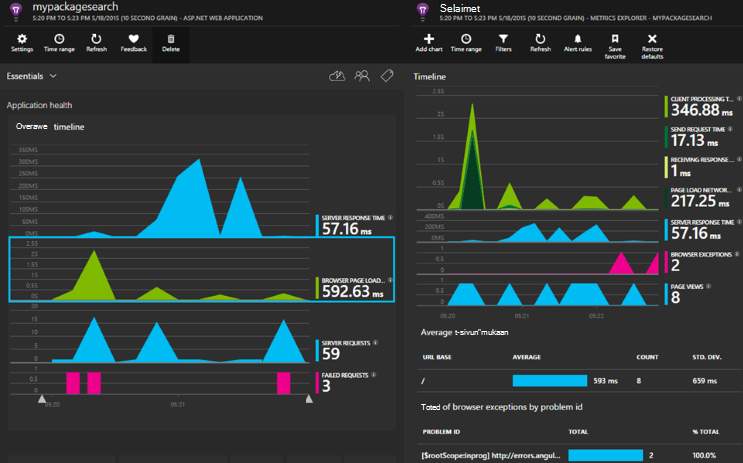

Tarvitset [Microsoft Azure](http://azure.com)-tilaus. Kirjaudu sisään Microsoft-tiliä, joka voi olla Windows, XBox Live tai muiden Microsoftin pilvipalveluihin. 


#### <a name="sample-application-instrumented-with-application-insights"></a>Hakemuksen tiedot kanssa instrumented sovelluksen malli

Tutustu tämän [sovelluksen malli](https://github.com/Microsoft/ApplicationInsights-Home/tree/master/Samples/AzureEmailService) joka hakemuksen tiedot lisätään pilvipalveluun ylläpidettävä Azure kaksi työntekijä rooleihin. 

Seuraavassa kerrotaan, miten oman cloud palvelun project mukauttaa samalla tavalla.

## <a name="create-an-application-insights-resource-for-each-role"></a>Sovelluksen tiedot-resurssin kunkin roolin luominen

Sovelluksen tiedot-resurssi on missä telemetriatietojen tietojen analysoida ja näkyviin.  

1.  [Azure portal][portal], Luo uusi sovelluksen havainnollistamisen resurssi. Sovelluksen tyyppi-Valitse ASP.NET-sovellus. 

    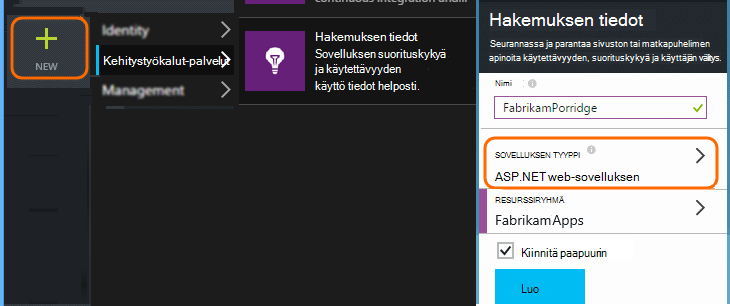

2.  Ota kopion Instrumentation-näppäintä. Tarvitset tätä pian SDK määrittämiseen.

    


Yleensä on [helpointa luoda erilliset resurssin Internetin kautta tai työntekijä rooleille tiedot](app-insights-separate-resources.md). 

Käyttää seuraavaa vaihtoehtona, olet voi lähettää tietoja kaikista rooleista vain yksi resurssi, mutta [oletusominaisuus] [ apidefaults] jotta voit suodattaa ja ryhmitellä tulokset kunkin roolista.

## <a name="sdk"></a>Asenna SDK kunkin Projectissa


1. Muokkaa Visual Studion cloud app projektin NuGet-paketit.

    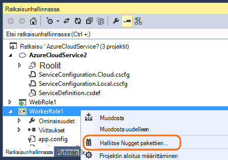


2. Web-roolien lisätä [Sovelluksen tietoa Web](http://www.nuget.org/packages/Microsoft.ApplicationInsights.Web) NuGet paketin. Tämä SDK-versio sisältää moduulit, joka lisää palvelimen konteksti, kuten roolitiedot. Työntekijä roolien käyttää [Sovelluksen-tiedot Windows-palvelimiin](https://www.nuget.org/packages/Microsoft.ApplicationInsights.WindowsServer/).

    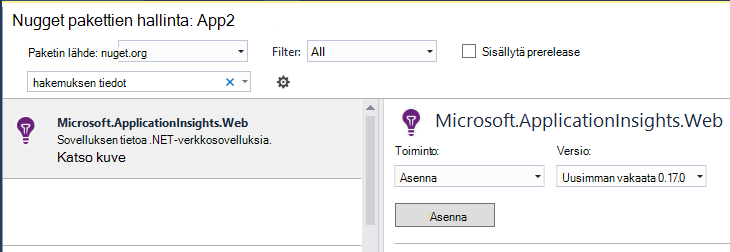


3. Määritä tietojen lähettäminen hakemuksen tiedot resurssin SDK.

    Määrittää instrumentation käyttäjäavainten määritys-asetukseksi tiedoston `ServiceConfiguration.Cloud.cscfg`. ([Sample code](https://github.com/Microsoft/ApplicationInsights-Home/blob/master/Samples/AzureEmailService/AzureEmailService/ServiceConfiguration.Cloud.cscfg)).
 
    ```XML
     <Role name="WorkerRoleA"> 
      <Setting name="APPINSIGHTS_INSTRUMENTATIONKEY" value="YOUR IKEY" /> 
     </Role>
    ```
 
    Sopivan käynnistys-funktiossa määrittää instrumentation avain määritys-asetusta:

    ```C#
     TelemetryConfiguration.Active.InstrumentationKey = RoleEnvironment.GetConfigurationSettingValue("APPINSIGHTS_INSTRUMENTATIONKEY");
    ```

    Huomautus, on sama nimi `APPINSIGHTS_INSTRUMENTATIONKEY` määrityksen asetusta käytetään Azure diagnostiikka raportointia varten. 


    Toimi samoin kunkin sovelluksen rooli. Katso Esimerkkejä:
 
 * [Web-rooli](https://github.com/Microsoft/ApplicationInsights-Home/blob/master/Samples/AzureEmailService/MvcWebRole/Global.asax.cs#L27)
 * [Työntekijän rooli](https://github.com/Microsoft/ApplicationInsights-Home/blob/master/Samples/AzureEmailService/WorkerRoleA/WorkerRoleA.cs#L232)
 * [Web-sivuille](https://github.com/Microsoft/ApplicationInsights-Home/blob/master/Samples/AzureEmailService/MvcWebRole/Views/Shared/_Layout.cshtml#L13)   

4. Määritä ApplicationInsights.config tiedoston kopioidaan aina tulostus-kansio. 

    (.Config-tiedostossa, näet viestien kysytään, sijoita instrumentation-näppäin. Cloud sovellusten on kuitenkin parempi määrittäminen .cscfg-tiedostosta. Näin varmistat, että rooli on määritetty oikein portaalissa.)


#### <a name="run-and-publish-the-app"></a>Suorita ja julkaista sovellus

Suorita sovellus ja kirjaudu sisään Azure. Avaa loit sovelluksen tiedot-resurssit ja tiedot näkyvät [Hae](app-insights-diagnostic-search.md)yksittäisten arvopisteiden ja tietojen [Metrijärjestelmä](app-insights-metrics-explorer.md)Resurssienhallinnassa. 

Lisää Lisää telemetriatietojen - alla - kohdissa ja julkaise sovelluksen live palautetta diagnostiikka- ja käyttö. 


#### <a name="no-data"></a>Tietoja?

* Avaa [Etsi] [ diagnostic] ruutua, näet yksittäiset tapahtumat.
* Sovelluksen avaaminen eri sivuille, niin, että se luo joitakin telemetriatietojen avulla.
* Odota hetki ja valitse sitten Päivitä.
* Katso [vianmääritys][qna].


## <a name="more-telemetry"></a>Lisää telemetriatietojen

Seuraavissa osissa Näytä Lisää telemetriatietojen hakemisesta sovelluksen eri osa-alueita.


## <a name="track-requests-from-worker-roles"></a>Seuraa pyynnöt työntekijä roolit

Web-roolien pyynnöt moduulin kerää automaattisesti pyyntöjen tietoja. Katso esimerkkejä siitä, miten voit ohittaa sivustokokoelman oletustoiminnan [otoksen MVCWebRole](https://github.com/Microsoft/ApplicationInsights-Home/tree/master/Samples/AzureEmailService/MvcWebRole) . 

Voit siepata puhelut työntekijä rooleille suorituskyvyn seuraamalla samalla tavalla kuin HTTP-pyynnöt. Sovelluksen tiedot-pyynnön telemetriatietojen tyyppiä mittaa nimetty palvelimen puoli työtä, joka voi olla aikakatkaistu ja itsenäisesti onnistuu tai epäonnistuu. Samalla, kun SDK tallennetaan automaattisesti pyyntöjen, voit lisätä oman koodin jäljittämiseksi pyynnöt työntekijä roolit.

Katso kaksi otoksen työntekijä roolia mittalaitteilla pyynnöt: [WorkerRoleA](https://github.com/Microsoft/ApplicationInsights-Home/tree/master/Samples/AzureEmailService/WorkerRoleA) ja [WorkerRoleB](https://github.com/Microsoft/ApplicationInsights-Home/tree/master/Samples/AzureEmailService/WorkerRoleB)

## <a name="azure-diagnostics"></a>Azure diagnostiikka

[Azure diagnostiikka](../vs-azure-tools-diagnostics-for-cloud-services-and-virtual-machines.md) tiedot sisältävät roolin hallinta tapahtumat, suorituskyvyn laskureita ja sovelluksen lokit. Voit määrittää nämä lähetettyjen sovelluksen havainnollistamisen niin, että voit tarkastella niitä muiden oman telemetriatietojen rinnalla vianmääritys on helpompaa.

Azure diagnostiikka ovat erityisen hyödyllisiä, jos rooli epäonnistuu odottamatta tai ei käynnisty.

1. Rooli (ei projekti!), jotta voit avata sen ominaisuuksia hiiren kakkospainikkeella ja valitse **Ota käyttöön vianmäärityksen** **vianmääritys sovelluksen tiedot ja Lähetä**.

    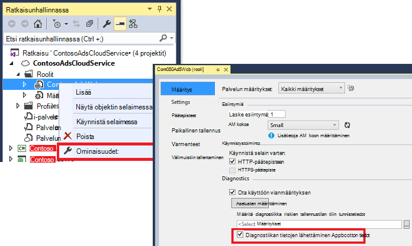

    **Tai jos sovellus on jo julkaistu ja käytössä**, Avaa Server Exploreria tai Cloud Resurssienhallinnassa sovelluksen hiiren kakkospainikkeella ja valitse samaa asetusta.

3.  Valitse sovelluksen tiedot samalle resurssille oman telemetriatietojen.

    Jos haluat, voit määrittää eri resurssin eri käyttömahdollisuudet (pilveen, paikallinen) kehittämisen tietojen pitäminen erillään reaaliaikaiset tiedot.

3. Voit myös [jättää joitakin Azure-kansio](app-insights-azure-diagnostics.md) , jonka haluat sovelluksen havainnollistamisen siirtyvät. Oletusarvo on kaikki.

### <a name="view-azure-diagnostic-events"></a>Azure diagnostiikan tapahtumien tarkasteleminen

Diagnostiikkaa sijainti:

* Suorituskyvyn laskureita näkyvät mukautettua arvot. 
* Windowsin tapahtumalokien näkyvät jäljittää ja mukautetut tapahtumat.
* Sovelluksen lokit, tapahtumien seuranta-lokit ja minkä tahansa diagnostiikka infrastruktuurin lokit näkyvät jälkitiedot.

Saat näkyviin suorituskyvyn laskureita ja tapahtumien määrä, Avaa [Resurssienhallinta arvot](app-insights-metrics-explorer.md) ja uuden kaavion lisääminen:


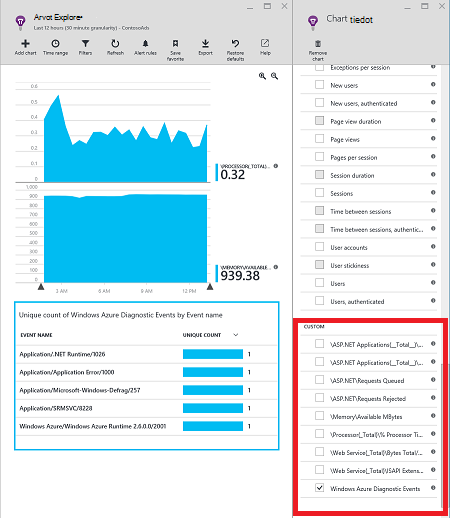

Eri Jäljityslokit Azure diagnostiikka lähettämä hakuja [haun](app-insights-diagnostic-search.md) avulla. Esimerkki: Jos haluat käyttää unhanded poikkeuksen rooli, joka aiheuttaa kaatumisen ja Roskakorin rooli, että tiedot näkyvät-sovelluksen kanavaa, Windowsin tapahtumalokiin. Voit tarkastella Windowsin tapahtumalokiin virheen ja koko pinon jäljitys voit löytää ongelman syy pääkansio poikkeuksen hakutoiminto.


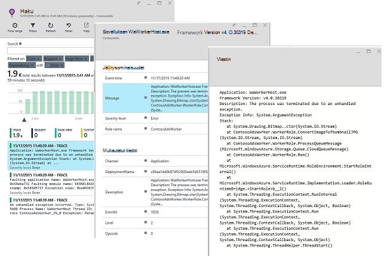

## <a name="app-diagnostics"></a>Sovelluksen vianmääritys

Azure diagnostiikka sisältää automaattisesti lokimerkintöjä, joka luo sovelluksen System.Diagnostics.Trace avulla. 

Jos käytät jo Log4N tai NLog puitteissa, voit myös [siepata niiden log jäljittää], mutta[netlogs].

[Mukautetut tapahtumat ja arvot seuranta] [ api] asiakkaan palvelimeen tai molemmat, saat lisätietoja sovelluksen suorituskyvyn ja käyttömäärän.

## <a name="dependencies"></a>Riippuvuudet

Hakemuksen tiedot SDK raportoida puhelut, jotka sovelluksen tekee Ulkoiset riippuvuudet, kuten REST API ja SQL-palvelimet. Voit tarkastella aiheutuuko tietyn riippuvuus hidas vastauksia tai epäonnistuu.

Jos sovellus käyttää .NET framework 4.6 tai uudempi versio, ei tarvitse tehdä mitään muuta. 

Määritä muutoin web/Työntekijä-roolin [Sovelluksen tiedot-agentti](app-insights-monitor-performance-live-website-now.md) tunnetaan myös nimellä "tilan valvonta" kanssa.

Voit käyttää sovelluksen tiedot-agentti web/työntekijä roolien seuraavasti:

* Lisää [AppInsightsAgent](https://github.com/Microsoft/ApplicationInsights-Home/tree/master/Samples/AzureEmailService/WorkerRoleA/AppInsightsAgent) -kansio ja kaksi tiedostot ei web/Työntekijä-roolin projekteihin. Muista niiden muodosta-ominaisuuksien määrittäminen niin, että ne kopioidaan aina tulostus-kansioon. Nämä tiedostot asentaa agentti.
* Lisätä tehtävän käynnistyksen CSDEF tiedoston sen näkyy [Tässä](https://github.com/Microsoft/ApplicationInsights-Home/tree/master/Samples/AzureEmailService/AzureEmailService/ServiceDefinition.csdef#L18).
* Huomautus: *Työntekijä roolien* edellyttävät kolme ympäristön muuttujaa näkyy [Tässä](https://github.com/Microsoft/ApplicationInsights-Home/tree/master/Samples/AzureEmailService/AzureEmailService/ServiceDefinition.csdef#L44). Tämä ei ole pakollinen web roolit.

### <a name="dependency-reports"></a>Riippuvuus-raportit

Tässä on esimerkki sovelluksen tiedot-portaalissa osoitteessa näkemä:

* Rich diagnostiikka automaattisesti Korreloidun pyynnöt ja riippuvuuksien:

    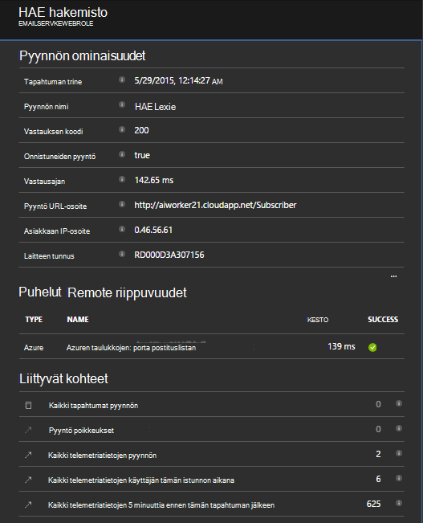

* Web-rooli, riippuvuustiedot suorituskyky:

    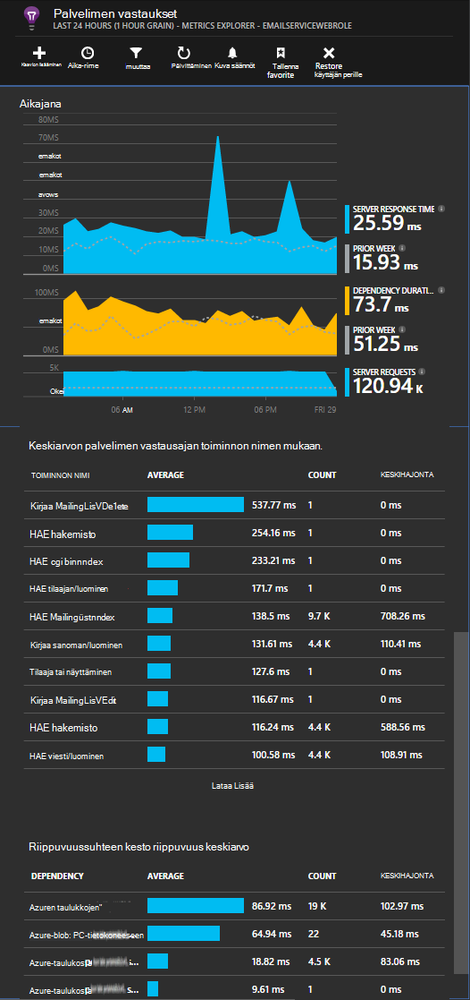

* Näyttökuva pyynnöt ja riippuvuustiedot Työntekijä-roolin näin:

    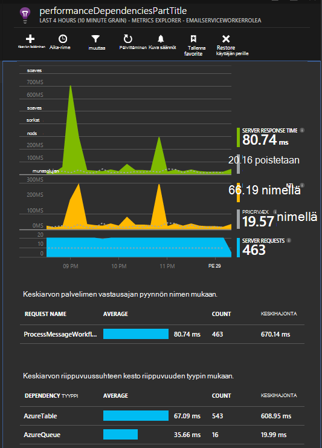

## <a name="exceptions"></a>Poikkeukset

Lisätietoja siitä, miten voit kerätä käsittelemättömän poikkeukset eri web-sovellusten tietotyypeistä on [Seuranta poikkeukset-sovelluksen tiedot](app-insights-asp-net-exceptions.md) .

Esimerkki web roolilla on MVC5 ja verkko-Ohjelmointirajapinnan 2-ohjaimet. 2 käsittelemättömän poikkeuksia välitetyt kanssa seuraavasti:

* [AiHandleErrorAttribute](https://github.com/Microsoft/ApplicationInsights-Home/blob/master/Samples/AzureEmailService/MvcWebRole/Telemetry/AiHandleErrorAttribute.cs) määrittäminen [tähän](https://github.com/Microsoft/ApplicationInsights-Home/blob/master/Samples/AzureEmailService/MvcWebRole/App_Start/FilterConfig.cs#L12) MVC5 ohjaimet
* [AiWebApiExceptionLogger](https://github.com/Microsoft/ApplicationInsights-Home/blob/master/Samples/AzureEmailService/MvcWebRole/Telemetry/AiWebApiExceptionLogger.cs) määrittäminen [tähän](https://github.com/Microsoft/ApplicationInsights-Home/blob/master/Samples/AzureEmailService/MvcWebRole/App_Start/WebApiConfig.cs#L25) verkko-Ohjelmointirajapinnan 2 ohjaimet

Työntekijän roolit ovat voi seurata poikkeukset kahdella tavalla.

* TrackException(ex)
* Jos olet lisännyt sovelluksen havainnollistamisen jäljitys listener NuGet-paketti, voit kirjautua poikkeukset System.Diagnostics.Trace. [Esimerkki.](https://github.com/Microsoft/ApplicationInsights-Home/blob/master/Samples/AzureEmailService/WorkerRoleA/WorkerRoleA.cs#L107)

## <a name="performance-counters"></a>Suorituskyvyn laskureita

Seuraavia laskureita kerätään oletusarvoisesti:

    * \Process(??APP_WIN32_PROC??)\% suoritinaika
    * \Memory\Available tavua
    * \.VERKON CLR Exceptions(??APP_CLR_PROC??)\# Exceps ilmenee / sec.
    * \Process (?????. APP_WIN32_PROC?) \Private tavua
    * \Process (?????. APP_WIN32_PROC?) \IO tietojen tavua/s
    * \Processor(_Total)\% suoritinaika

Lisäksi seuraavat myös kerätään web roolien:

    * \ASP.NET sovellusten (?????. APP_W3SVC_PROC?) \Requests/sec    
    * \ASP.NET sovellusten (?????. APP_W3SVC_PROC?) \Request suoritusaika
    * \ASP.NET sovellusten (?????. APP_W3SVC_PROC?) Sovelluksen jonossa \Requests

Voit määrittää Lisää mukautettu tai muita Windowsin suorituskykylaskureita näkyvän [tähän](https://github.com/Microsoft/ApplicationInsights-Home/blob/master/Samples/AzureEmailService/WorkerRoleA/ApplicationInsights.config#L14)

  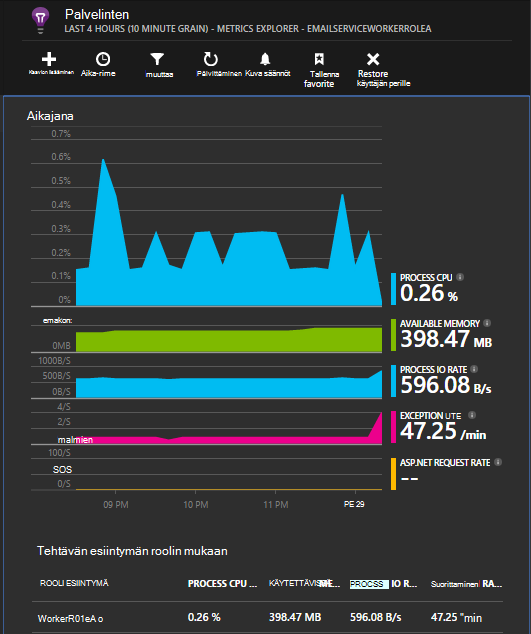

## <a name="correlated-telemetry-for-worker-roles"></a>Työntekijän roolien Korreloidun Telemetriatietojen

Se on monipuolisia diagnostiikan kokemuksen, näet, mitä johtanut tai epäonnistuneen viive-pyynnön. Web-roolien SDK automaattisesti määrittää korrelaatio liittyvät telemetriatietojen. Työntekijän roolien voit mukautetun telemetriatietojen alustaja voit määrittää yleisiä Operation.Id kontekstin määrite kaikkien tätä telemetriatietojen varten. Näin näet, onko ongelman viive/virhe aiheutuu riippuvuus tai koodisi yhdellä silmäyksellä! 

Näin miten:

* Määritä korrelaatio tunnus kyselyjä callContext-arvo näkyy [Tässä](https://github.com/Microsoft/ApplicationInsights-Home/blob/master/Samples/AzureEmailService/WorkerRoleA/WorkerRoleA.cs#L36). Tässä tapauksessa on käytössä kuin korrelaatiotunnus pyytää tunnus
* Lisää mukautettu TelemetryInitializer toteutus, joka määrittää Operation.Id CorrelationId yläpuolelle. Kuvassa: [ItemCorrelationTelemetryInitializer](https://github.com/Microsoft/ApplicationInsights-Home/blob/master/Samples/AzureEmailService/WorkerRoleA/Telemetry/ItemCorrelationTelemetryInitializer.cs#L13)
* Lisää mukautettu telemetriatietojen alustaja. Voi sitä ApplicationInsights.config tiedosto- tai koodissa kuin näkyvän [tähän](https://github.com/Microsoft/ApplicationInsights-Home/blob/master/Samples/AzureEmailService/WorkerRoleA/WorkerRoleA.cs#L233)

Joka on tämä! Portaalin kokemus on jo langallinen näet yhdellä silmäyksellä kaikki siihen liittyvät telemetriatietojen:

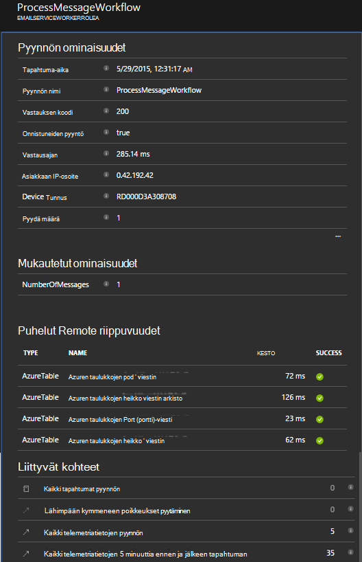


## <a name="client-telemetry"></a>Asiakkaan telemetriatietojen

[Lisää JavaScript-SDK verkkosivuille] [ client] saat selainpohjaisia telemetriatietojen, kuten sivun näkymän laskelmia, sivujen lataamista, komentosarjan poikkeukset ja avulla voit kirjoittaa mukautetun telemetriatietojen sivun komentosarjoja.

## <a name="availability-tests"></a>Käytettävyys testit

[Määritä web testit] [ availability] , varmista, että sovelluksesi pysyy suorien ja vastaa.


## <a name="example"></a>Esimerkki

[Esimerkki](https://github.com/Microsoft/ApplicationInsights-Home/tree/master/Samples/AzureEmailService) valvoo palvelun, joka on web-rooli ja kaksi työntekijä roolit.

## <a name="exception-method-not-found-on-running-in-azure-cloud-services"></a>Poikkeus "menetelmä ei löydy" suorittamisesta Azure Cloud Services-palveluissa

Luot .NET 4.6 varten? 4.6 ei tueta automaattisesti Azure pilvipalveluihin roolit. [Asenna 4.6 kunkin roolin](../cloud-services/cloud-services-dotnet-install-dotnet.md) ennen sovelluksen suorittamista.

## <a name="related-topics"></a>Aiheeseen liittyviä ohjeita

* [Määritä Azure diagnostiikka lähettäminen hakemuksen tiedot](app-insights-azure-diagnostics.md)
* [Lähetä Azure vianmääritys sovelluksen havainnollistamisen PowerShellin avulla](app-insights-powershell-azure-diagnostics.md)


[api]: app-insights-api-custom-events-metrics.md
[apidefaults]: app-insights-api-custom-events-metrics.md#default-properties
[apidynamicikey]: app-insights-separate-resources.md#dynamic-ikey
[availability]: app-insights-monitor-web-app-availability.md
[azure]: app-insights-azure.md
[client]: app-insights-javascript.md
[diagnostic]: app-insights-diagnostic-search.md
[netlogs]: app-insights-asp-net-trace-logs.md
[portal]: http://portal.azure.com/
[qna]: app-insights-troubleshoot-faq.md
[redfield]: app-insights-monitor-performance-live-website-now.md
[start]: app-insights-overview.md 
