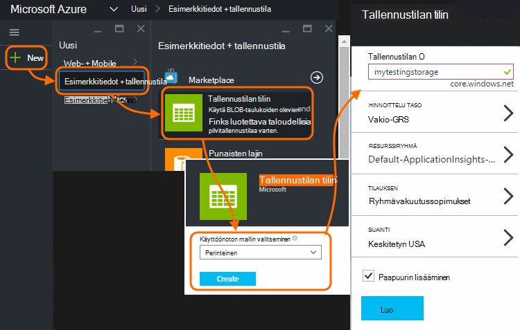
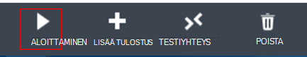

<properties 
    pageTitle="Vaiheittainen kuvaus: Vie telemetriatietojen SQL-tietokanta-sovelluksen tiedot" 
    description="Sovelluksen tiedot-tietojen vieminen SQL käyttämällä Stream Analytics jatkuvasti." 
    services="application-insights" 
    documentationCenter=""
    authors="noamben" 
    manager="douge"/>

<tags 
    ms.service="application-insights" 
    ms.workload="tbd" 
    ms.tgt_pltfrm="ibiza" 
    ms.devlang="na" 
    ms.topic="article" 
    ms.date="03/06/2015" 
    ms.author="awills"/>
 
# <a name="walkthrough-export-to-sql-from-application-insights-using-stream-analytics"></a>Vaiheittainen kuvaus: Vie SQL-sovelluksen tiedot muodossa-analyysin avulla

Tämän artikkelin avulla voit siirtää telemetriatietojen tietojen [Visual Studio hakemuksen tiedot] [ start] Azure SQL-tietokantaan käyttämällä [Jatkuva Vie] [ export] ja [Azure Stream analysoinnin](https://azure.microsoft.com/services/stream-analytics/). 

Jatkuva Vie siirtyy telemetriatietojen tietojen Azuren tallennustilaan JSON-muodossa. Syy jäsentää JSON-objektien Azure Stream Analytics ja luoda tietokantataulukon rivit.

(Lisää jatkuvan Vie on yleensä tapa tehdä omia sovelluksia Lähetä sovelluksen havainnollistamisen telemetriatietojen analyysin. Voit voi mukauttaa Tämä koodi Esimerkki muihin toimintoihin viedyn telemetriatietojen, kuten yhteenlaskeminen tietojen kanssa.)

Asetetaan ensin olettaen, että sinulla on jo sovellus, joita haluat seurata.


Tässä esimerkissä on käyttää sivun näkymän tiedot, mutta samoissa laajennettavissa helposti muita tietotyyppejä, kuten mukautetut tapahtumat ja poikkeukset. 


## <a name="add-application-insights-to-your-application"></a>Lisää sovelluksen tiedot-sovellukseen


Aloittaminen:

1. [Sovelluksen tietoa web-sivujen määrittäminen](app-insights-javascript.md). 

    (Tässä esimerkissä tarkastellaan käsittelyn sivun näkymän tiedot asiakas-selaimissa, mutta voit myös määrittää sovelluksen tietoa palvelinpuolen [Java](app-insights-java-get-started.md) tai [ASP.NET](app-insights-asp-net.md) -sovelluksen ja prosessin pyynnön, riippuvuuden ja muut palvelimen telemetriatietojen.)


5. Sovelluksen julkaista ja katsella telemetriatietojen-sovelluksen tiedot resurssin tiedot.


## <a name="create-storage-in-azure"></a>Tallennustilan luominen Azure

Jatkuva Vie tulostaa aina Azure-tallennustilan tilin tietoja, joten sinun täytyy luoda muistitilaa ensin.

1. Tallennustilan tilin luominen [Azure portal]-tilaukseesi[portal].

    

2. Luoda säilön

    

3. Kopioi tallennustilan pikanäppäin

    Tarvitset sitä pian voit määrittää syötteen stream analytics-palveluun.

    

## <a name="start-continuous-export-to-azure-storage"></a>Käynnistä jatkuva Vie Azure-tallennustilan

1. Siirry Azure-portaalissa loit sovelluksen hakemuksen tiedot resurssin.

    

2. Luo jatkuva Vie.

    


    Valitse aiemmin luomasi tallennustilan-tili:

    
    
    Määritä haluamasi tapahtumatyypit:

    


3. Anna joidenkin tietojen keräämistä. Istut takaisin ja salliminen käyttää sovelluksen jonkin aikaa. Telemetriatietojen toimitetaan ja näet tilastokaavion [metrisillä](app-insights-metrics-explorer.md) Resurssienhallinnassa ja yksittäiset tapahtumat [Diagnostiikan haku](app-insights-diagnostic-search.md). 

    Ja -tallennustilan Vie tiedot. 

4. Tarkasta vietyjä tietoja, joko - portaalissa valitsemalla **Selaa**, valitse tallennustilan tilin, ja sitten **säilöt** - tai Visual Studiossa. Valitse Visual Studion **tarkastella / Cloud Explorer**, ja avaa Azure / tallennustilan. (Jos tämä vaihtoehto ei ole, sinun täytyy asentaa Azure SDK: Avaa uusi projekti-valintaikkuna ja Avaa Visual C# / Cloud / hakeminen Microsoft Azure SDK .NET.)

    

    Merkitse muistiin polun nimi, joka johdetaan nimi- ja sovellusnäppäintä Yleiset-osan. 

Tapahtumat kirjoitetaan blob-tiedostoja JSON-muodossa. Kunkin tiedostossa voi olla yksi tai useampi tapahtumat. Niin haluamme lukea tapahtumatietoja ja suodattaa pois haluamme kentät. On kaikenlaisten emme voi käyttää tietoja, mutta Microsoftin suunnitelman tänään on käytettävä Stream Analytics tietojen siirtäminen SQL-tietokantaan. Joka on helppo suorittaa paljon kiinnostavat kyselyt.

## <a name="create-an-azure-sql-database"></a>Azure SQL-tietokannan luominen

Käynnistäminen uudelleen tilauksesta [Azure]-portaalissa[portal], on luotu (ja uuden palvelimen, ellei jokin on jo käytössä), joka kirjoittaa tiedot.


Varmista, että tietokantapalvelimen sallii Azure palveluiden käyttäminen:


## <a name="create-a-table-in-azure-sql-db"></a>Taulukon luominen Azure SQL-DB

Muodosta yhteys tietokantaan, joka on luotu edellisessä osassa käytetyn hallintatyökalulla. Tätä vaiheittaista-esimerkissä käytössä [SQL Server Management Tools](https://msdn.microsoft.com/ms174173.aspx) (SSMS).


Luo uusi kysely ja suorita seuraavassa T-SQL-LAUSE:

```SQL

CREATE TABLE [dbo].[PageViewsTable](
    [pageName] [nvarchar](max) NOT NULL,
    [viewCount] [int] NOT NULL,
    [url] [nvarchar](max) NULL,
    [urlDataPort] [int] NULL,
    [urlDataprotocol] [nvarchar](50) NULL,
    [urlDataHost] [nvarchar](50) NULL,
    [urlDataBase] [nvarchar](50) NULL,
    [urlDataHashTag] [nvarchar](max) NULL,
    [eventTime] [datetime] NOT NULL,
    [isSynthetic] [nvarchar](50) NULL,
    [deviceId] [nvarchar](50) NULL,
    [deviceType] [nvarchar](50) NULL,
    [os] [nvarchar](50) NULL,
    [osVersion] [nvarchar](50) NULL,
    [locale] [nvarchar](50) NULL,
    [userAgent] [nvarchar](max) NULL,
    [browser] [nvarchar](50) NULL,
    [browserVersion] [nvarchar](50) NULL,
    [screenResolution] [nvarchar](50) NULL,
    [sessionId] [nvarchar](max) NULL,
    [sessionIsFirst] [nvarchar](50) NULL,
    [clientIp] [nvarchar](50) NULL,
    [continent] [nvarchar](50) NULL,
    [country] [nvarchar](50) NULL,
    [province] [nvarchar](50) NULL,
    [city] [nvarchar](50) NULL
)

CREATE CLUSTERED INDEX [pvTblIdx] ON [dbo].[PageViewsTable]
(
    [eventTime] ASC
)WITH (PAD_INDEX = OFF, STATISTICS_NORECOMPUTE = OFF, SORT_IN_TEMPDB = OFF, DROP_EXISTING = OFF, ONLINE = OFF, ALLOW_ROW_LOCKS = ON, ALLOW_PAGE_LOCKS = ON)

```


Tässä esimerkissä on käytössä sivun näkymiä tiedoista. Jos haluat tarkastella muita käytettävissä olevien tietojen, Tarkasta JSON-tulostus ja kohdassa [Vie tietomallin](app-insights-export-data-model.md).

## <a name="create-an-azure-stream-analytics-instance"></a>Azure Stream Analytics luominen

[Perinteinen Azure-portaalin](https://manage.windowsazure.com/)ja Azure Stream Analytics-palvelu ja luo uusi Stream Analytics työ:


Kun uusi projekti on luotu, Laajenna sen tiedot:


#### <a name="set-blob-location"></a>Määritä Blob-objektien sijainti

Määritä toteuttamaan syötteen jatkuva Vie-blob:


Nyt tarvitset tallennustilan-tililtä, jonka kirjoittamasi Access perusavain. Määritä tallennustilan tilin avaimeksi.


#### <a name="set-path-prefix-pattern"></a>Määritä polku etuliitemalli 


Muista päivämäärämuodon asettaminen **YYYY-MM-DD** (ja **Katkoviivat**).

Polku etuliite malli määrittää Stream Analytics etsintätavan syötteen tiedostot muistiin. Sinun täytyy määrittää sen vastaamaan miten jatkuva Vie tallentaa tiedot. Määritä tältä:

    webapplication27_12345678123412341234123456789abcdef0/PageViews/{date}/{time}

Tässä esimerkissä:

* `webapplication27`on nimi hakemuksen tiedot resurssin **kaikki pieniksi kirjaimiksi**. 
* `1234...`on-sovelluksen tiedot resurssin **ja poistaa katkoviivat**instrumentation-avain. 
* `PageViews`on tietotyypin haluat analysoida. Saatavilla olevat tyypit määräytyvät sen mukaan, mitä voit määrittää jatkuva Vie suodatin. Nähdäksesi käytettävissä muuntyyppisten viedyille tiedoille tutkia ja tuo näkyviin [tietomallin Vie](app-insights-export-data-model.md).
* `/{date}/{time}`kirjoitetaan kuvion literaaleina.

Pääset nimi ja iKey hakemuksen tiedot resurssin Avaa Essentials sen yleiskatsaus-sivulla tai avaa asetuksia.

#### <a name="finish-initial-setup"></a>Ensimmäinen asennus valmis

Vahvista Sarjatoiminto muoto:


Sulje ohjattu toiminto ja odota, Viimeistele määritys.

>[AZURE.TIP] Esimerkki-funktion avulla voit tarkistaa, että syötteen polku on määritetty oikein. Jos se ei onnistu: Tarkista, että valitsemasi malli aikavälin tallennustila on tietoja. Syötteen kuvauksen muokkaaminen ja määritä tallennustilan tilin, polku etuliite ja päivämäärämuoto oikein.

## <a name="set-query"></a>Määritä kysely

Avaa kysely-osassa:


Korvaa oletuskyselyn kanssa:

```SQL

    SELECT flat.ArrayValue.name as pageName
    , flat.ArrayValue.count as viewCount
    , flat.ArrayValue.url as url
    , flat.ArrayValue.urlData.port as urlDataPort
    , flat.ArrayValue.urlData.protocol as urlDataprotocol
    , flat.ArrayValue.urlData.host as urlDataHost
    , flat.ArrayValue.urlData.base as urlDataBase
    , flat.ArrayValue.urlData.hashTag as urlDataHashTag
      ,A.context.data.eventTime as eventTime
      ,A.context.data.isSynthetic as isSynthetic
      ,A.context.device.id as deviceId
      ,A.context.device.type as deviceType
      ,A.context.device.os as os
      ,A.context.device.osVersion as osVersion
      ,A.context.device.locale as locale
      ,A.context.device.userAgent as userAgent
      ,A.context.device.browser as browser
      ,A.context.device.browserVersion as browserVersion
      ,A.context.device.screenResolution.value as screenResolution
      ,A.context.session.id as sessionId
      ,A.context.session.isFirst as sessionIsFirst
      ,A.context.location.clientip as clientIp
      ,A.context.location.continent as continent
      ,A.context.location.country as country
      ,A.context.location.province as province
      ,A.context.location.city as city
    INTO
      AIOutput
    FROM AIinput A
    CROSS APPLY GetElements(A.[view]) as flat


```

Huomaa, että ensimmäinen joitakin ominaisuuksia ovat sivun näkymän tiedot. Muuntyyppisten telemetriatietojen vienti on erilaisia ominaisuuksia. Katso [yksityiskohtaiset tiedot viiteopas ominaisuuden tiedostotyypit ja-arvoja.](app-insights-export-data-model.md)

## <a name="set-up-output-to-database"></a>Määritä tulostus-tietokantaan

Valitse SQL tulos.


Määritä SQL-tietokantaan.


Sulje ohjattu toiminto ja odota, kunnes ilmoituksen, että tulos on määritetty.

## <a name="start-processing"></a>Aloita käsittely

Työn käynnistäminen toimintoriville:



Voit valita Aloita nyt tai aloittaa aiempaa tietoa tietojen käsittelemistä. Tämä on hyödyllinen, jos haluat käyttää jatkuva vieminen käynnissä jonkin aikaa.


Muutaman minuutin kuluttua palaa SQL Server-hallintatyökalut ja katso juoksutus tiedot. Käytä esimerkiksi kyselyn seuraavasti:

    SELECT TOP 100 *
    FROM [dbo].[PageViewsTable]


## <a name="related-articles"></a>Aiheeseen liittyviä artikkeleita

* [Vie SQL Työntekijä roolin avulla](app-insights-code-sample-export-telemetry-sql-database.md)
* [Vie PowerBI virta-analyysin avulla](app-insights-export-power-bi.md)
* [Yksityiskohtaisia tietoja mallin viittaus ominaisuuden tiedostotyypit ja -arvoja.](app-insights-export-data-model.md)
* [Hakemuksen tiedot jatkuva vienti](app-insights-export-telemetry.md)
* [Hakemuksen tiedot](https://azure.microsoft.com/services/application-insights/)

<!--Link references-->

[diagnostic]: app-insights-diagnostic-search.md
[export]: app-insights-export-telemetry.md
[metrics]: app-insights-metrics-explorer.md
[portal]: http://portal.azure.com/
[start]: app-insights-overview.md

 