<properties 
    pageTitle="Koodin otoksen: jäsentää tiedot viety hakemuksen tiedot" 
    description="Oman analyysin telemetriatietojen sovelluksen tiedot-koodin jatkuva vieminen-toiminnolla. Tallenna SQL tiedot." 
    services="application-insights" 
    documentationCenter=""
    authors="mazharmicrosoft" 
    manager="douge"/>

<tags 
    ms.service="application-insights" 
    ms.workload="tbd" 
    ms.tgt_pltfrm="ibiza" 
    ms.devlang="na" 
    ms.topic="article" 
    ms.date="01/05/2016" 
    ms.author="awills"/>
 
# Koodin otoksen: jäsentää tiedot viety hakemuksen tiedot

Tässä artikkelissa kerrotaan, miten voit käsitellä JSON tietoja viety sovelluksen tiedot. Esimerkkinä on kirjoittaa koodia telemetriatietojen tietojen siirtäminen [Visual Studio hakemuksen tiedot] [ start] Azure SQL-tietokantaan käyttämällä [Jatkuva Vie][export]. (Voit myös toteuttaa tässä [muodossa-analyysin avulla](app-insights-code-sample-export-sql-stream-analytics.md), mutta Microsoftin tavoitteena on näyttämään lisäkoodin.) 

Jatkuva Vie siirtyy oman telemetriatietojen Azuren tallennustilaan JSON-muodossa, niin olemme kirjoittaa lisäkoodin jäsentää JSON-objektit ja luo rivit tietokannan taulukkoon.

Lisää yleensä jatkuva vieminen on tapa tehdä omia sovelluksia Lähetä sovelluksen havainnollistamisen telemetriatietojen analyysin. Tämä koodi Esimerkki muihin toimintoihin viedyn telemetriatietojen kanssa voi mukauttaa.

Asetetaan ensin olettaen, että sinulla on jo sovellus, joita haluat seurata.

## Lisää tiedot sovelluksen SDK-paketissa

Voit valvoa sovellusta, voit [lisätä sovelluksen havainnollistamisen SDK-paketissa] [ start] sovelluksen. On eri SDK: T ja helper Työkalut eri ympäristöissä, IDEs ja kielillä. Voit valvoa verkkosivujen, Java tai ASP.NET-verkko-palvelimiin ja mobiililaitteiden useita sivustomalleista. Kaikki SDK: T Lähetä telemetriatietojen [sovelluksen tiedot-portaalin][portal], jossa voit käyttää sekä tehokkaat Analysointityökalut ja diagnostiikkatyökalut ja vie tiedot tallennustilan.

Aloittaminen:

1. Hanki [Microsoft Azure-tili](https://azure.microsoft.com/pricing/).
2. [Azure portal][portal], Lisää uusi sovellus havainnollistamisen resurssi, kun sovellus:

    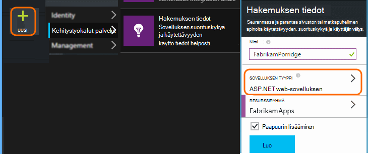

    (Sovelluksen tyyppi ja tilauksen voi olla eri.)
3. Avaa pika-aloituksen Etsi voit määrittää sovelluksen tyyppi SDK-paketissa.

    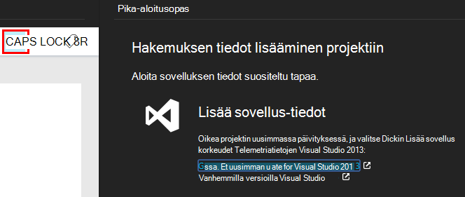

    Jos sovelluksen tyyppi ei ole luettelossa, tutustu [Aloittaminen] [ start] sivulle.

4. Tässä esimerkissä on olet seuranta verkkosovellukseen, jotta Microsoft Azure Työkalut Visual Studiossa ja asenna SDK. Olemme tunnistaa sen sovelluksen havainnollistamisen tämän resurssin nimi:

    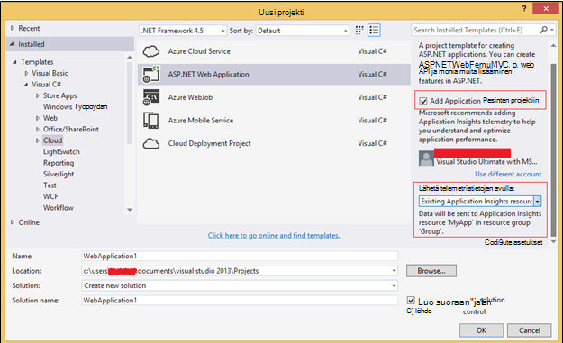

## Tallennustilan luominen Azure

Hakemuksen tiedot tiedot viedään aina Azure-tallennustilan tilin JSON-muodossa. Se on tämä koodisi lukee tiedot.

1. "Perinteinen-tallennustilan tilin luominen [Azure portal]-tilaukseesi[portal].

    

2. Luoda säilön

    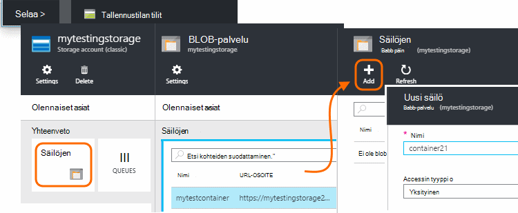

## Käynnistä jatkuva Vie Azure-tallennustilan

1. Siirry Azure-portaalissa loit sovelluksen hakemuksen tiedot resurssin.

    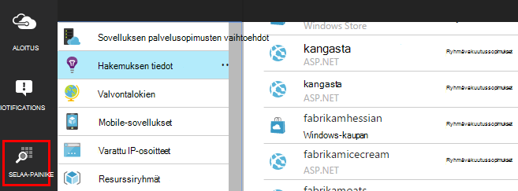

2. Luo jatkuva Vie.

    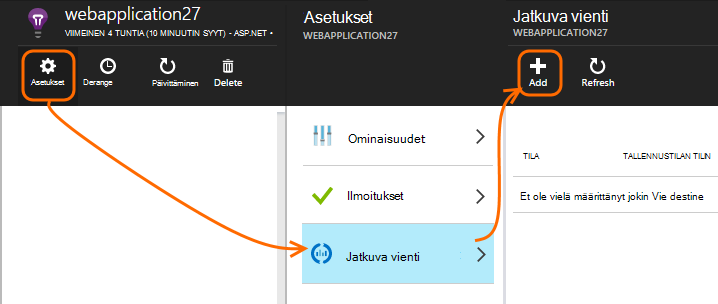

    Valitse aiemmin luomasi tallennustilan-tili:

    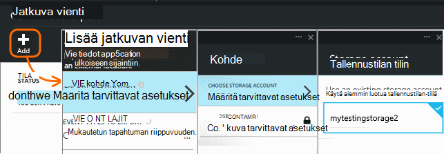
    
    Määritä haluamasi tapahtumatyypit:

    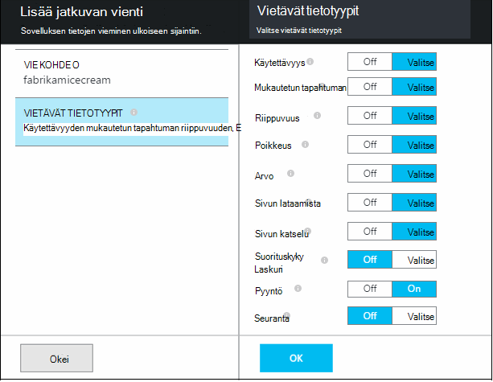

3. Anna joidenkin tietojen keräämistä. Istut takaisin ja salliminen käyttää sovelluksen jonkin aikaa. Telemetriatietojen toimitetaan ja näet tilastokaavion [metrisillä](app-insights-metrics-explorer.md) Resurssienhallinnassa ja yksittäiset tapahtumat [Diagnostiikan haku](app-insights-diagnostic-search.md). 

    Ja -tallennustilan Vie tiedot. 

4. Tarkasta viedyille tiedoille. Valitse Visual Studion **tarkastella / Cloud Explorer**, ja avaa Azure / tallennustilan. (Jos tämä vaihtoehto ei ole, sinun täytyy asentaa Azure SDK: Avaa uusi projekti-valintaikkuna ja Avaa Visual C# / Cloud / hakeminen Microsoft Azure SDK .NET.)

    

    Merkitse muistiin polun nimi, joka johdetaan nimi- ja sovellusnäppäintä Yleiset-osan. 

Tapahtumat kirjoitetaan blob-tiedostoja JSON-muodossa. Kunkin tiedostossa voi olla yksi tai useampi tapahtumat. Niin haluamme lukea tapahtumatietoja ja suodattaa pois haluamme kentät. On kaikenlaisten emme voi käyttää tietoja, mutta Microsoftin suunnitelman tänään on kirjoittaa lisäkoodin tietojen siirtäminen SQL-tietokantaan. Joka on helppo suorittaa paljon kiinnostavat kyselyt.

## Azure SQL-tietokannan luominen

Tässä esimerkissä on kirjoittaa koodia push tiedot tietokantaan.

Käynnistäminen uudelleen tilauksesta [Azure]-portaalissa[portal], on luotu (ja uuden palvelimen, ellei jokin on jo käytössä), joka kirjoittaa tiedot.

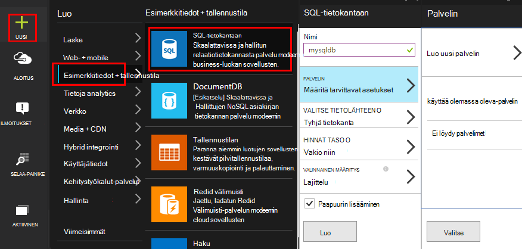

Varmista, että tietokantapalvelimen sallii Azure palveluiden käyttäminen:

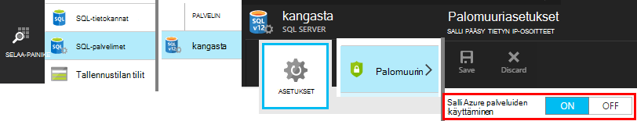

## Työntekijä-roolin luominen 

Nyt on viimeksi syy voidaan kirjoittaa [lisäkoodin](https://sesitai.codeplex.com/) jäsentää viedyn BLOB JSON, ja luoda tietueita tietokantaan. Koska Vie säilö ja tietokannan ovat molemmat Azure-tietokannassa, emme suorittaa koodin Azure Työntekijä-roolin.

Tämä koodi poimii automaattisesti jostakin ominaisuudet ovat JSON. Ominaisuuksien kuvaukset on kohdassa [Vie tietomalliin](app-insights-export-data-model.md).

#### Työntekijän roolin projektin luominen

Visual Studiossa Työntekijä-roolin uuden projektin luominen:

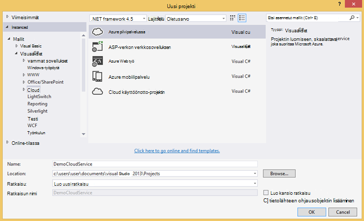

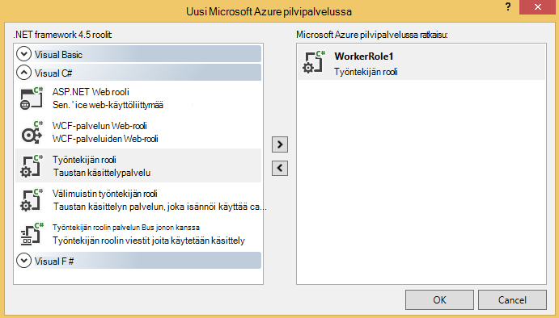

#### Yhteyden muodostaminen tallennustilan-tiliin

Azure-tietokannassa tallennustilan tilin noutaminen yhteysmerkkijono:

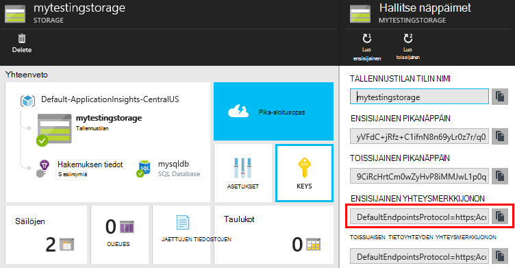

Visual Studiossa tallennustilan tilin yhteysmerkkijonolla työntekijän rooli-asetusten määrittäminen:

#### Pakettien

Napsauta ratkaisunhallinnassa työntekijän rooli projektin hiiren kakkospainikkeella ja valitse NuGet pakettien hallinta.
Etsi ja asenna nämä paketit: 

 * EntityFramework 6.1.2 tai myöhemmin – käyttämällä Tämä luo DB Taulukkorakenteen suoraan selaimessa, JSON blob-sisällön perusteella.
 * JsonFx - käytetään tämä litistämistä JSON C# luokan ominaisuuksiin.

Tämän työkalun avulla voit luoda C#-luokan Microsoftin yksittäisen JSON-tiedoston ulos. Se vaatii makroon pieniä muutoksia, kuten litistämistä JSON matriisin yhden C# ominaisuuden ottaminen käyttöön yhdessä sarakkeessa DB-taulukon (ex. urlData_port) 

 * [JSON C#-luokan luominen](http://jsonclassgenerator.codeplex.com/)

## Koodi 

Voit sijoittaa koodin `WorkerRole.cs`.

#### Tuonti

    using Microsoft.WindowsAzure.Storage;

    using Microsoft.WindowsAzure.Storage.Blob;

#### Tallennustilan yhteysmerkkijonon noutaminen

    private static string GetConnectionString()
    {
      return Microsoft.WindowsAzure.CloudConfigurationManager.GetSetting("StorageConnectionString");
    }

#### Suorita työntekijän säännöllisin väliajoin

Korvaa aiemmin luotu Suorita menetelmä ja valitse laite aikaväli. Sen on oltava vähintään tunnin, koska vientitoiminto on valmis JSON objektina tunnissa.

    public override void Run()
    {
      Trace.TraceInformation("WorkerRole1 is running");

      while (true)
      {
        Trace.WriteLine("Sleeping", "Information");

        Thread.Sleep(86400000); //86400000=24 hours //1 hour=3600000
                
        Trace.WriteLine("Awake", "Information");

        ImportBlobtoDB();
      }
    }

#### Lisää JSON kunkin objektin taulukkorivi

    public void ImportBlobtoDB()
    {
      try
      {
        CloudStorageAccount account = CloudStorageAccount.Parse(GetConnectionString());

        var blobClient = account.CreateCloudBlobClient();
        var container = blobClient.GetContainerReference(FilterContainer);

        foreach (CloudBlobDirectory directory in container.ListBlobs())//Parent directory
        {
          foreach (CloudBlobDirectory subDirectory in directory.ListBlobs())//PageViewPerformance
          {
            foreach (CloudBlobDirectory dir in subDirectory.ListBlobs())//2015-01-31
            {
              foreach (CloudBlobDirectory subdir in dir.ListBlobs())//22
              {
                foreach (IListBlobItem item in subdir.ListBlobs())//3IAwm6u3-0.blob
                {
                  itemname = item.Uri.ToString();
                  ParseEachBlob(container, item);
                  AuditBlob(container, directory, subDirectory, dir, subdir, item);
                } //item loop
              } //subdir loop
            } //dir loop
          } //subDirectory loop
        } //directory loop
      }
      catch (Exception ex)
      {
        //handle exception
      }
    }

#### Jäsentää kunkin blob

    private void ParseEachBlob(CloudBlobContainer container, IListBlobItem item)
    {
      try
      {
        var blob = container.GetBlockBlobReference(item.Parent.Prefix + item.Uri.Segments.Last());
    
        string json;
    
        using (var memoryStream = new MemoryStream())
        {
          blob.DownloadToStream(memoryStream);
          json = System.Text.Encoding.UTF8.GetString(memoryStream.ToArray());
    
          IEnumerable<string> entities = json.Split('\n').Where(s => !string.IsNullOrWhiteSpace(s));
    
          recCount = entities.Count();
          failureCount = 0; //resetting failure count
    
          foreach (var entity in entities)
          {
            var reader = new JsonFx.Json.JsonReader();
            dynamic output = reader.Read(entity);
    
            Dictionary<string, object> dict = new Dictionary<string, object>();
    
            GenerateDictionary((System.Dynamic.ExpandoObject)output, dict, "");
    
            switch (FilterType)
            {
              case "PageViewPerformance":
    
              if (dict.ContainsKey("clientPerformance"))
                {
                  GenerateDictionary(((System.Dynamic.ExpandoObject[])dict["clientPerformance"])[0], dict, "");
                }
    
              if (dict.ContainsKey("context_custom_dimensions"))
              {
                if (dict["context_custom_dimensions"].GetType() == typeof(System.Dynamic.ExpandoObject[]))
                {
                  GenerateDictionary(((System.Dynamic.ExpandoObject[])dict["context_custom_dimensions"])[0], dict, "");
                }
              }
    
            PageViewPerformance objPageViewPerformance = (PageViewPerformance)GetObject(dict);
    
            try
            {
              using (var db = new TelemetryContext())
              {
                db.PageViewPerformanceContext.Add(objPageViewPerformance);
                db.SaveChanges();
              }
            }
            catch (Exception ex)
            {
              failureCount++;
            }
            break;
    
            default:
            break;
          }
        }
      }
    }
    catch (Exception ex)
    {
      //handle exception 
    }
    }

#### Sanaston valmisteleminen JSON-asiakirjoille

    private void GenerateDictionary(System.Dynamic.ExpandoObject output, Dictionary<string, object> dict, string parent)
        {
            try
            {
                foreach (var v in output)
                {
                    string key = parent + v.Key;
                    object o = v.Value;

                    if (o.GetType() == typeof(System.Dynamic.ExpandoObject))
                    {
                        GenerateDictionary((System.Dynamic.ExpandoObject)o, dict, key + "_");
                    }
                    else
                    {
                        if (!dict.ContainsKey(key))
                        {
                            dict.Add(key, o);
                        }
                    }
                }
            }
            catch (Exception ex)
            {
            //handle exception 
            }
        }

#### CAST JSON asiakirjan takaisin C# luokan telemetriatietojen objektin ominaisuudet

     public object GetObject(IDictionary<string, object> d)
        {
            PropertyInfo[] props = null;
            object res = null;

            try
            {
                switch (FilterType)
                {
                    case "PageViewPerformance":

                        props = typeof(PageViewPerformance).GetProperties();
                        res = Activator.CreateInstance<PageViewPerformance>();
                        break;

                    default:
                        break;
                }

                for (int i = 0; i < props.Length; i++)
                {
                    if (props[i].CanWrite && d.ContainsKey(props[i].Name))
                    {
                        props[i].SetValue(res, d[props[i].Name], null);
                    }
                }
            }
            catch (Exception ex)
            {
            //handle exception 
            }

            return res;
        }

#### PageViewPerformance luokkatiedosto luotu JSON tiedoston ulos

    public class PageViewPerformance
    {
        [DatabaseGenerated(DatabaseGeneratedOption.Identity)]
        public Guid Id { get; set; }

        public string url { get; set; }

        public int urlData_port { get; set; }

        public string urlData_protocol { get; set; }

        public string urlData_host { get; set; }

        public string urlData_base { get; set; }

        public string urlData_hashTag { get; set; }

        public double total_value { get; set; }

        public double networkConnection_value { get; set; }

        public double sendRequest_value { get; set; }

        public double receiveRequest_value { get; set; }

        public double clientProcess_value { get; set; }

        public string name { get; set; }

        public string internal_data_id { get; set; }

        public string internal_data_documentVersion { get; set; }

        public DateTime? context_data_eventTime { get; set; }

        public string context_device_id { get; set; }

        public string context_device_type { get; set; }

        public string context_device_os { get; set; }

        public string context_device_osVersion { get; set; }

        public string context_device_locale { get; set; }

        public string context_device_userAgent { get; set; }

        public string context_device_browser { get; set; }

        public string context_device_browserVersion { get; set; }

        public string context_device_screenResolution_value { get; set; }

        public string context_user_anonId { get; set; }

        public string context_user_anonAcquisitionDate { get; set; }

        public string context_user_authAcquisitionDate { get; set; }

        public string context_user_accountAcquisitionDate { get; set; }

        public string context_session_id { get; set; }

        public bool context_session_isFirst { get; set; }

        public string context_operation_id { get; set; }

        public double context_location_point_lat { get; set; }

        public double context_location_point_lon { get; set; }

        public string context_location_clientip { get; set; }

        public string context_location_continent { get; set; }

        public string context_location_country { get; set; }

        public string context_location_province { get; set; }

        public string context_location_city { get; set; }
    }

#### DBcontext SQL vuorovaikutuksen kohteen Framework mukaan

    public class TelemetryContext : DbContext
    {
        public DbSet<PageViewPerformance> PageViewPerformanceContext { get; set; }
        public TelemetryContext()
            : base("name=TelemetryContext")
        {
        }
    }

Lisää DB yhteysmerkkijono nimellä `TelemetryContext` - `app.config`.

## Rakenteen (vain tiedot)

Tämä on taulukko, joka luodaan Sivunäkymä rakenne.

> [AZURE.NOTE] Sinun ei tarvitse suorittaa tämän komentosarjan. JSON määritteet määrittää taulukon sarakkeet.

    CREATE TABLE [dbo].[PageViewPerformances](
    [Id] [uniqueidentifier] NOT NULL,
    [url] [nvarchar](max) NULL,
    [urlData_port] [int] NOT NULL,
    [urlData_protocol] [nvarchar](max) NULL,
    [urlData_host] [nvarchar](max) NULL,
    [urlData_base] [nvarchar](max) NULL,
    [urlData_hashTag] [nvarchar](max) NULL,
    [total_value] [float] NOT NULL,
    [networkConnection_value] [float] NOT NULL,
    [sendRequest_value] [float] NOT NULL,
    [receiveRequest_value] [float] NOT NULL,
    [clientProcess_value] [float] NOT NULL,
    [name] [nvarchar](max) NULL,
    [User] [nvarchar](max) NULL,
    [internal_data_id] [nvarchar](max) NULL,
    [internal_data_documentVersion] [nvarchar](max) NULL,
    [context_data_eventTime] [datetime] NULL,
    [context_device_id] [nvarchar](max) NULL,
    [context_device_type] [nvarchar](max) NULL,
    [context_device_os] [nvarchar](max) NULL,
    [context_device_osVersion] [nvarchar](max) NULL,
    [context_device_locale] [nvarchar](max) NULL,
    [context_device_userAgent] [nvarchar](max) NULL,
    [context_device_browser] [nvarchar](max) NULL,
    [context_device_browserVersion] [nvarchar](max) NULL,
    [context_device_screenResolution_value] [nvarchar](max) NULL,
    [context_user_anonId] [nvarchar](max) NULL,
    [context_user_anonAcquisitionDate] [nvarchar](max) NULL,
    [context_user_authAcquisitionDate] [nvarchar](max) NULL,
    [context_user_accountAcquisitionDate] [nvarchar](max) NULL,
    [context_session_id] [nvarchar](max) NULL,
    [context_session_isFirst] [bit] NOT NULL,
    [context_operation_id] [nvarchar](max) NULL,
    [context_location_point_lat] [float] NOT NULL,
    [context_location_point_lon] [float] NOT NULL,
    [context_location_clientip] [nvarchar](max) NULL,
    [context_location_continent] [nvarchar](max) NULL,
    [context_location_country] [nvarchar](max) NULL,
    [context_location_province] [nvarchar](max) NULL,
    [context_location_city] [nvarchar](max) NULL,
    CONSTRAINT [PK_dbo.PageViewPerformances] PRIMARY KEY CLUSTERED 
    (
     [Id] ASC
    )WITH (PAD_INDEX = OFF, STATISTICS_NORECOMPUTE = OFF, IGNORE_DUP_KEY = OFF, ALLOW_ROW_LOCKS = ON, ALLOW_PAGE_LOCKS = ON) ON [PRIMARY]
    ) ON [PRIMARY] TEXTIMAGE_ON [PRIMARY]

    GO

    ALTER TABLE [dbo].[PageViewPerformances] ADD  DEFAULT (newsequentialid()) FOR [Id]
    GO

Jos haluat nähdä tässä esimerkissä-toiminto, [Lataa](https://sesitai.codeplex.com/) valmis toimimasta-koodia, muuttaa `app.config` asetukset ja julkaista Työntekijä-roolin Azure.

## Aiheeseen liittyviä artikkeleita

* [Vie SQL Työntekijä roolin avulla](app-insights-code-sample-export-telemetry-sql-database.md)
* [Hakemuksen tiedot jatkuva vienti](app-insights-export-telemetry.md)
* [Hakemuksen tiedot](https://azure.microsoft.com/services/application-insights/)
* [Tiedot-mallin vieminen](app-insights-export-data-model.md)
* [Lisää näytteiden ja vaihe vaiheelta](app-insights-code-samples.md)

<!--Link references-->

[diagnostic]: app-insights-diagnostic-search.md
[export]: app-insights-export-telemetry.md
[metrics]: app-insights-metrics-explorer.md
[portal]: http://portal.azure.com/
[start]: app-insights-overview.md

 
