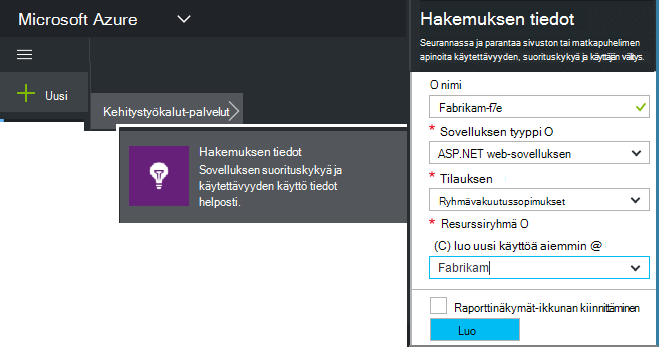
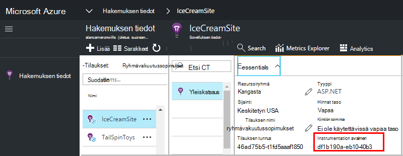

<properties 
    pageTitle="Luo uusi sovelluksen havainnollistamisen resurssi | Microsoft Azure" 
    description="Määritä sovelluksen havainnollistamisen seurantaa live uusi sovellus. WWW-vaihtoehto." 
    services="application-insights" 
    documentationCenter=""
    authors="alancameronwills" 
    manager="douge"/>

<tags 
    ms.service="application-insights" 
    ms.workload="tbd" 
    ms.tgt_pltfrm="ibiza" 
    ms.devlang="na" 
    ms.topic="article" 
    ms.date="08/26/2016" 
    ms.author="awills"/>

# Luo sovelluksen tiedot-resurssi

Visual Studio hakemuksen tiedot näkyvät tietoja sovelluksen Microsoft Azure *resurssin*. Uusi resurssi luominen on näin ollen [hakemuksen tiedot seurannassa uusi sovellus on määritetty]osana[start]. Monissa tapauksissa tämän voi tehdä automaattisesti kuin IDE ja joka on suositeltu tapaa, jos ne ovat saatavilla. Mutta joissakin tapauksissa voit luoda resurssin manuaalisesti.

Luotuasi resurssin saat sen instrumentation-näppäintä ja voit määrittää SDK-sovelluksessa. Tämä lähettää telemetriatietojen resurssi.

## Microsoft Azure Rekisteröidy

Jos sinulla ei ole [Microsoft-tili, hanki nyt](http://live.com). (Jos käytät palveluja, kuten Outlook.com, Onedriveen, Windows Phone-tai XBox Live, sinulla on jo Microsoft-tili.)

Sinun on myös [Microsoft Azure](http://azure.com)-tilausta. Jos ryhmäsi tai organisaation on Azure-tilaus, omistaja voi lisätä voit, käyttämällä Windows Live ID-tunnuksellasi.

Voit myös luoda uusi tilaus. Ilmaisen-tilin avulla voit kokeilla kaikki Azure-tietokannassa. Kokeilujakson päätyttyä voi olla tukiyhteyksiä tilauksen tarvittaessa, kun olet ei veloitetaan maksutta palvelut. 

Kun on käytössä access tilaukseen kirjautuminen sovelluksen havainnollistamisen osoitteessa [http://portal.azure.com](https://portal.azure.com)ja käyttää Live ID-tunnuksena, kirjaudu sisään.

## Luo sovelluksen tiedot-resurssi
  

Lisää [portal.azure.com](https://portal.azure.com)sovelluksen tiedot-resurssi:

* **Sovelluksen tyyppi** vaikuttaa yhteenveto-sivu ja ominaisuuksista, jotka ovat käytettävissä [metrisillä]Explorerissa näkemä[metrics]. Jos et näe sovelluksen tyypin, valitse ASP.NET.
* **Resurssiryhmä** on helppokäyttöisyys hallintaan ominaisuudet, kuten käyttöoikeuksien hallinta. Jos olet jo luonut Azure resursseihin, voit sijoittaa sisältöä saman ryhmän uusi resurssi.
* **Tilaus** on maksu-tilisi Azure-tietokannassa.
* **Sijainti** on, jossa on säilyttää tiedot. Tällä hetkellä se ei voi muuttaa.
* **Lisää startboard** siirtää nopeasti ruudun oman resurssin Azure aloitus-sivulla. Suositeltava.

Kun sovellus on luotu, uusi sivu avautuu. Tämä on, jossa näet suorituskykyä ja -käyttötietoja sovelluksen tietoja. 

Pääset takaisin sen seuraava kellonajan voit Azure-kirjautuminen etsiminen sinua sovelluksen pika-Aloitus-ruutu Aloita board (aloitusnäytön). Tai etsi se valitsemalla Selaa.

## Kopioi instrumentation avain

Resurssin, jonka loit yksilöivä instrumentation-näppäintä. Sinun on käyttöoikeus ja anna SDK.

## Asenna SDK-sovelluksen

Asenna sovellus havainnollistamisen SDK-sovelluksen. Tässä vaiheessa määräytyy raskaasti sovelluksen tyyppi. 

Instrumentation avaimen avulla voit määrittää [, jotka olet asentanut sovelluksen SDK][start].

SDK sisältää vakio moduulit, jotka lähettävät telemetriatietojen eikä sinun tarvitse koodia. Tehtävien seurantaa tai vianmääritys tarkemmin, [Käytä Ohjelmointirajapinnan] [ api] lähettää oman telemetriatietojen.

## Katso telemetriatietoja

Sulje palaa sovellusta-sivu Azure-portaalissa pika-aloitusopas-sivu.

Haku-ruutua ohjeaiheessa [Diagnostiikan][diagnostic], jossa näkyvät ensimmäisen tapahtumat. 

Valitse Päivitä muutaman sekunnin kuluttua, jos olet odotetaan enemmän tietoja.

## Resurssin luominen automaattisesti

Voit kirjoittaa [PowerShell-komentosarjaa](app-insights-powershell-script-create-resource.md) Luo resurssille automaattisesti.

## Seuraavat vaiheet

* [Luo raporttinäkymät-ikkuna](app-insights-dashboards.md)
* [Diagnostiikan haku](app-insights-diagnostic-search.md)
* [Tutustu arvot](app-insights-metrics-explorer.md)
* [Kirjoita Analytics-kyselyt](app-insights-analytics.md)

<!--Link references-->

[api]: app-insights-api-custom-events-metrics.md
[diagnostic]: app-insights-diagnostic-search.md
[metrics]: app-insights-metrics-explorer.md
[start]: app-insights-overview.md

 