<properties
    pageTitle="Raporttinäkymien ja siirtyminen sovelluksen tiedot-portaalissa | Microsoft Azure"
    description="Luo avaimen APM kaavioita ja kyselyjen näkymiä."
    services="application-insights"
    documentationCenter=""
    authors="alancameronwills"
    manager="douge"/>

<tags
    ms.service="application-insights"
    ms.workload="tbd"
    ms.tgt_pltfrm="ibiza"
    ms.devlang="multiple"
    ms.topic="article" 
    ms.date="10/18/2016"
    ms.author="awills"/>

# Siirtyminen ja raporttinäkymien sovelluksen tiedot-portaalissa

Kun olet [määrittäminen projektin tiedot sovelluksen](app-insights-overview.md)tai telemetriatietojen tietoja sinua sovelluksen suorituskyvyn ja käyttömäärän näkyvät projektin hakemuksen tiedot resurssin [Azure portal](https://portal.azure.com).

## Etsi oman telemetriatietojen

Kirjautuminen [Azure-portaaliin](https://portal.azure.com) ja siirry hakemuksen tiedot resurssin, jonka loit sovelluksen.

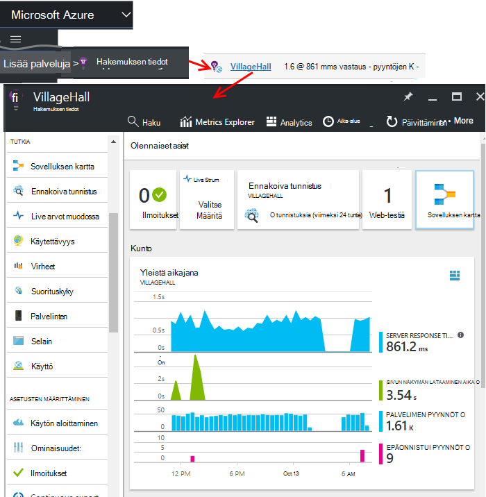

Yhteenveto-sivu (sivun), kun sovellus näkyy sovelluksen tärkeimmistä diagnostiikan arvot yhteenveto ja muiden ominaisuuksien portaalin yhdyskäytävä.

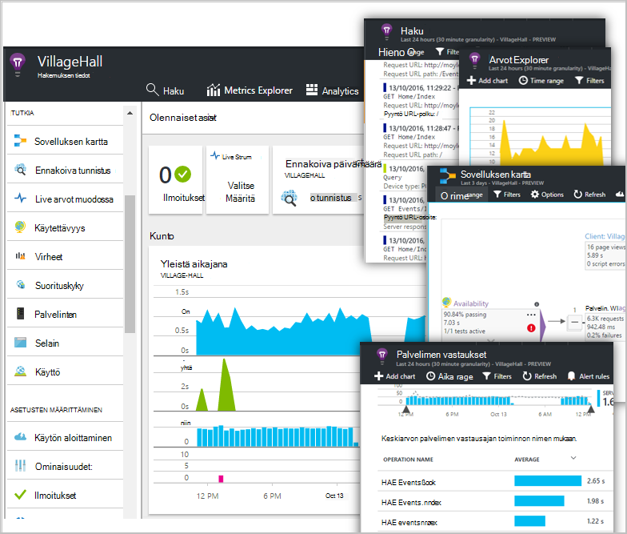

Voit mukauttaa muissa kaavioissa ja kiinnittämällä ne Raporttinäkymät-ikkunan. Näin voit tuoda yhdessä avaimen kaavioiden eri sovelluksista.

## Raporttinäkymien

Huomaa, näet, kun olet kirjautunut sisään [Microsoft Azure-portaalissa](https://portal.azure.com) ei Raporttinäkymät-ikkunan. Tässä voit yhdistää kaavioita, jotka ovat sinulle tärkeimpiä kaikki Azure resursseja, mukaan lukien telemetriatietojen [Visual Studio sovelluksen tiedot](app-insights-overview.md)-yli.
 

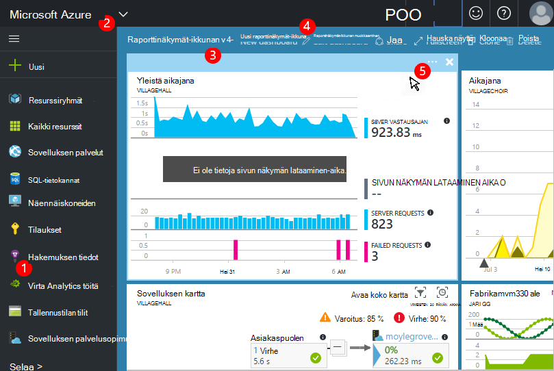

1. **Siirry resurssit** , kuten hakemuksen tiedot sovelluksen: vasen palkin avulla.
2. **Palauttaa nykyisen Raporttinäkymät-ikkunan**tai siirry viimeisimmät muissa näkymissä: Käytä avattavasta valikosta vasempaan yläkulmaan.
3. **Vaihda raporttinäkymien**: avattavasta valikosta käyttäminen Raporttinäkymät-ikkunan otsikko
4. **Luo, Muokkaa, ja jaa raporttinäkymien** Raporttinäkymät-ikkunan työkalurivillä.
5. **Koontinäytön Muokkaa**: ruudun päälle ja valitse sen yläpalkissa avulla siirtäminen, mukauttaa tai poistaa sen.

## Raporttinäkymät-ikkunan lisääminen

Kun haluat sivu tai kaavioiden joukko, joka on erityisen mielenkiintoisia, voit kiinnittää sen kopion koontinäyttö. Näet sen seuraavan kerran, palaa sinne.

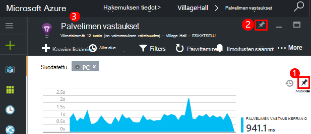

1. Raporttinäkymät-ikkunan kiinnittäminen kaaviota. Kaavion kopio näkyy koontinäytössä.
2. Kiinnitä koontinäyttö koko sivu - se näkyy koontinäytössä ruuduksi, jota napsauttamalla kautta.
3. Valitse palaa nykyisen Raporttinäkymät-ikkunan vasemmassa yläkulmassa. Sitten voit palata nykyiseen näkymään avattavasta valikosta.

Huomaa kaavioiden ryhmitetty ruudut: ruudun voi sisältää useamman kuin yhden kaavion. Voit kiinnittää koontinäyttö koko-ruutu.

### Kiinnitä kyselyn Analytics

Voit myös [jaetun](#share-dashboards-with-your-team) Raporttinäkymät-ikkunan [kiinnittäminen Analytics](app-insights-analytics-using.md#pin-to-dashboard) kaaviot. Voit lisätä haluamaansa kyselyn rinnalla vakio arvot kaavioita. (Ei toiminto maksu.)

## Säädä ruudun koontinäytössä

Kun ruudun on koontinäytössä, voit muuttaa sitä.

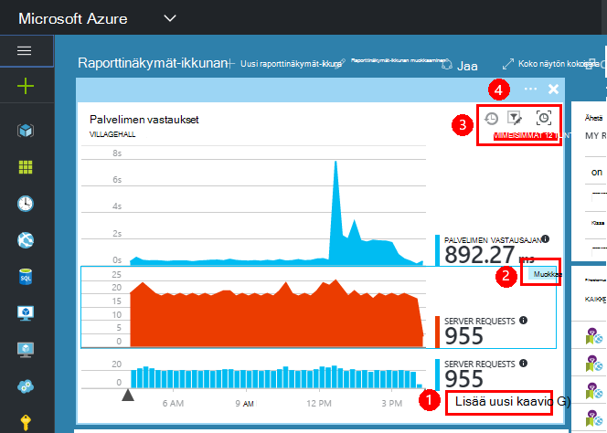

1. Kaavion lisääminen ruutu. 
2. Määritä arvo, Ryhmittelyperuste dimensio ja kaavion tyyli (taulukko, kaavio).
3. Vetämällä kaavioon lähentäminen; Valitse Palauta aikajakson; Kumoa-painike Määritä kaavioiden suodattimen ominaisuudet-ruutu.
4. Määritä ruutu otsikko.

-Metrisillä explorer lavat kiinnitetyt ruudut on enemmän kuin yhteenveto-sivu-kiinnitettyjen ruutujen muokkausasetukset.

Alkuperäinen ruutu, jonka kiinnitetyt ei vaikuta lopputulokseen.

## Raporttinäkymien vaihtaminen

Voit tallentaa useita Raporttinäkymät-ikkunan ja siirtyä niiden välillä. Kun kiinnität lisääminen kaavioon tai -sivu, ne lisätään nykyisen Raporttinäkymät-ikkunan.

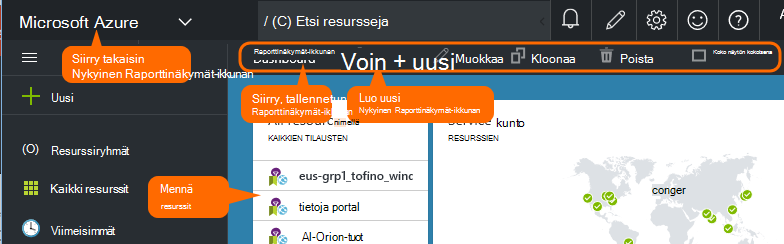

Voit joutua esimerkiksi yksi Raporttinäkymät-ikkunan ja koko näytön näyttämään ryhmän huoneen ja toinen yleistä kehitystä varten.

Koontinäytössä sivu näkyy ruuduksi: Valitse Siirry sivu. Kaavion kopioi kaavio alkuperäiseen sijaintiin.

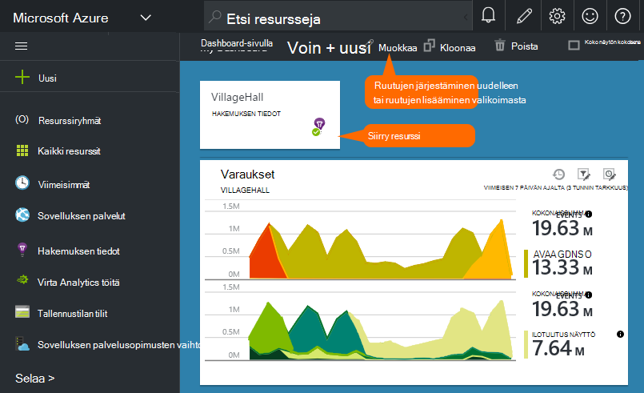

## Jaa raporttinäkymät

Kun olet luonut Raporttinäkymät-ikkunan, voit jakaa sen muiden käyttäjien kanssa.

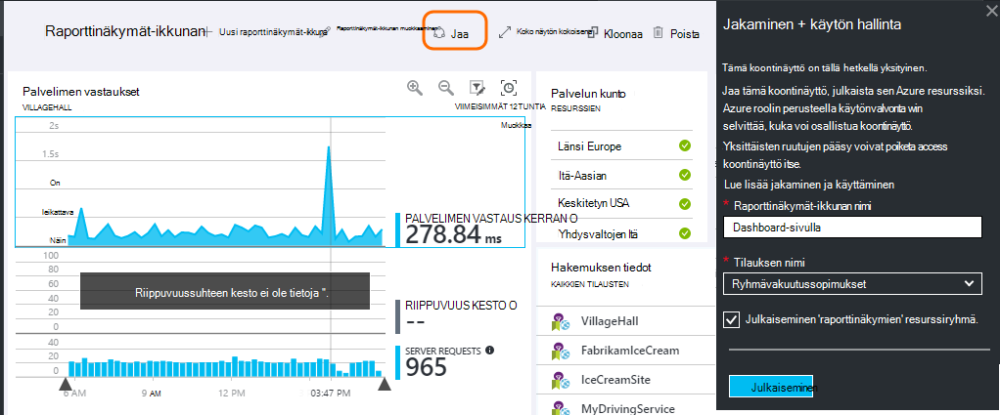

Lisätietoja [roolien ja käyttöoikeuksien hallinta](app-insights-resources-roles-access-control.md).

## Sovelluksen siirtyminen

Yhteenveto-sivu on lisätietoja sovelluksen yhdyskäytävä.

* **Mitä tahansa kaavion tai ruutu** napsauttamalla minkä tahansa ruutu tai kaavion saat näkyviin lisätietoja se näyttää.

### Yhteenveto-sivu-painikkeet

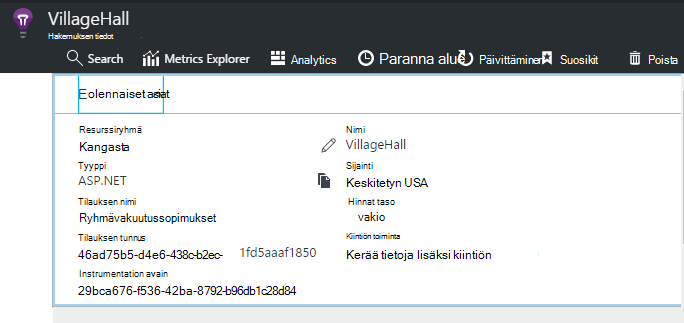

* [**Arvot Explorer**](app-insights-metrics-explorer.md) - oman luominen suorituskyvyn ja käyttö.
* [**Etsi**](app-insights-diagnostic-search.md) - tutkia tapahtumia, kuten pyynnöt poikkeuksia lukuun ottamatta esiintymiä tai kirjaudut jäljittää.
* [**Analytics**](app-insights-analytics.md) - että telemetriatietojen tehokkaita kyselyt.
* **Aikaväli** - Säädä näkyvät kaikki kaaviot sivu-alue.
* **Poista** - sovelluksen hakemuksen tiedot resurssin poistaminen. Voit pitäisi myös sovelluksen tiedot-pakettien poistaminen sovelluksen koodista tai muokkaa [instrumentation avain](app-insights-create-new-resource.md#copy-the-instrumentation-key) sovelluksen ohjaamaan telemetriatietojen eri sovelluksen havainnollistamisen resurssille.

### Perustiedot-välilehti

* [Instrumentation avain](app-insights-create-new-resource.md#copy-the-instrumentation-key) - tunnistaa sovelluksen resurssi. 
* Hinnoittelu - että ominaisuudet käytettävissä ja määritä aseman CAPS LOCK.

### Appin siirtymispalkki

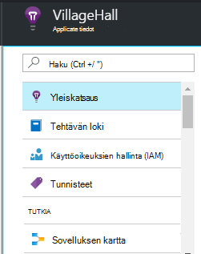

* **Yleistä** - palaa sovelluksen yhteenveto-sivu.
* **Tehtävän log** - ilmoitukset ja Azure järjestelmänvalvojan tapahtumia.
* [**Käyttöoikeuksien hallinta**](app-insights-resources-roles-access-control.md) - antaa työryhmän jäsenet ja muita.
* [**Tunnisteet**](../resource-group-using-tags.md) - tunnisteilla ryhmittämään sovelluksen muiden kanssa.

TUTKIA

* [**Sovelluksen kartta**](app-insights-app-map.md) - aktiivinen map Näyttää sovelluksen osat johdetaan riippuvuustiedot.
* [**Ennakoiva diagnostiikka**](app-insights-proactive-diagnostics.md) - Tarkista uusimmat suorituskyvyn ilmoitukset.
* [**Live virta**](app-insights-metrics-explorer.md#live-stream) - tai kiinteät arvot pikaviestikeskustelun lähellä hyödyllinen silloin, kun otat käyttöön uuden koontiversion joukko virheenkorjaus.
* [**Käytettävyys / WWW-testien**](app-insights-monitor-web-app-availability.md) -lähettää tavallisen pyyntöjä koodiin world.* ympärille 
* [**Virheet, suorituskyky**](app-insights-web-monitor-performance.md) - poikkeukset, virheen korvaukset ja vastaus kellonaikojen sovelluksen pyynnöt ja [riippuvuuksien](app-insights-asp-net-dependencies.md)sovelluksestasi pyynnöt.
* [**Suorituskyky**](app-insights-web-monitor-performance.md) – vastausajan, riippuvuuden vastaus ajan. 
* [Palvelimet](app-insights-web-monitor-performance.md) – suorituskyvyn laskureita. Jos käytettävissä [asentaa tilan valvonta](app-insights-monitor-performance-live-website-now.md).

* **Selain** - sivu-näkymän ja AJAX suorituskykyä. Jos käytettävissä voit [soittimen verkkosivuille](app-insights-javascript.md).
* **Käyttö** - sivulla Näytä, käyttäjän ja istunnon laskee. Jos käytettävissä voit [soittimen verkkosivuille](app-insights-javascript.md).

ASETUSTEN MÄÄRITTÄMINEN

* **Aloittaminen** : tekstiin opetusohjelma.
* **Ominaisuudet** - instrumentation avaimen, tilaus ja resurssitunnus.
* [Ilmoitukset](app-insights-alerts.md) - metrisillä loput määritykset.
* [Jatkuva Vie](app-insights-export-telemetry.md) - määrittäminen vienti telemetriatietojen Azure-tallennustilan.
* Synteettiset kuormituksen sivuston [Suorituskyvyn testaaminen](app-insights-monitor-web-app-availability.md#performance-tests) - määrittäminen.
* [Kiintiön ja hinnat](app-insights-pricing.md) ja [nieltynä esimerkkejä](app-insights-sampling.md).
* **API Access** - [Vapauta huomautusten](app-insights-annotations.md) luominen ja tietojen Access-Ohjelmointirajapinnan.
* [**Toimi kohteet**](app-insights-diagnostic-search.md#create-work-item) - työ seuranta järjestelmä niin, että voit luoda virheet aikana tarkistetaan telemetriatietojen yhdistäminen.

ASETUKSET

* [**Lukitsee**](..\resource-group-lock-resources.md) - Lukitse Azure resurssit
* [**Automaatio-komentosarjaa**](app-insights-powershell.md) : Vie Azure resurssin määritys, niin, että voit käyttää sitä mallina luomiseen uudet resurssit.

TUKI

* **Tukipyyntö** - edellyttää maksulliseen tilaukseen. Katso myös [Ohje](app-insights-get-dev-support.md).

## Mitä seuraavaksi?

||
|---|---
|[Arvot explorer](app-insights-metrics-explorer.md) Suodattaminen ja segmentin arvot|
|[Diagnostiikan haku](app-insights-diagnostic-search.md) Etsi ja tapahtumia, niihin liittyvät tapahtumat Tarkasta ja luo virheet |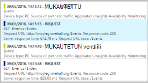
|[Analytics](app-insights-analytics.md) Tehokas kyselykielen| 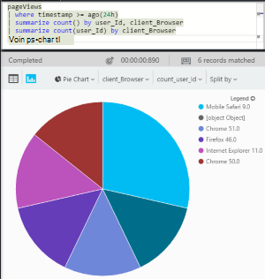

