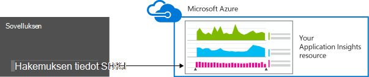
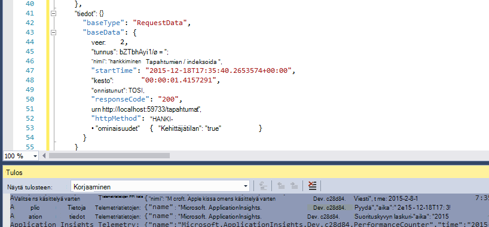
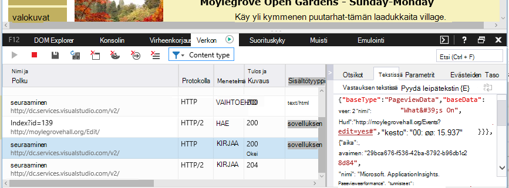

<properties 
    pageTitle="Tietojen säilytys ja tallennustilaa-sovelluksen tiedot" 
    description="Säilytys- ja tietosuoja käytäntö-lause" 
    services="application-insights" 
    documentationCenter=""
    authors="alancameronwills" 
    manager="douge"/>

<tags 
    ms.service="application-insights" 
    ms.workload="tbd" 
    ms.tgt_pltfrm="ibiza" 
    ms.devlang="na" 
    ms.topic="article" 
    ms.date="05/17/2016" 
    ms.author="awills"/>

# Tietojen kerääminen, säilytystä ja tallennustilan hakemuksen tiedot 

*Hakemuksen tiedot on esikatselu.*

Kun olet asentanut [Visual Studio hakemuksen tiedot] [ start] SDK-sovelluksen, se lähettää tietoja sovelluksen telemetriatietojen pilveen. Tietenkin vastaava kehittäjät haluat tietää, täsmälleen lähetettävät tiedot, mitä tapahtuu, tiedot ja siitä, miten voit säilyttää sen ohjausobjektin. Erityisesti voitu luottamuksellisia tietoja voidaan lähettää, missä se on tallennettu, ja miten turvalliseksi on? 

Ensimmäinen, vastaus:

* Vakio telemetriatietojen moduulit, jotka suoritetaan "ei"ruutuun todennäköisesti luottamuksellisia tietoja lähettäminen palvelu. Telemetriatietojen koskee kuormituksen, suorituskyvyn ja käyttömäärän arvot, poikkeuksen raportteja ja muita diagnostiikkatiedot. Diagnostiikan raportit näkyvät tärkeimmät käyttäjätiedot ovat URL-osoitteet; mutta sovelluksen missään tapauksessa ei kannata valitseminen luottamuksellisia tietoja tekstimuodossa URL-osoite.
* Voit kirjoittaa koodi, joka lähettää muita mukautettuja telemetriatietojen apuna diagnostiikka- ja seurantaa käyttö. (Tämä laajennettavuus on hyvä ominaisuus, sovelluksen tiedot.) Se on mahdollista, vahingossa, voit kirjoittaa niin, että se sisältää henkilökohtaisia ja luottamuksellisia tietoja. Jos sovellus käyttää näitä tietoja, vahva Tarkista prosessit on voimassa voit kirjoittaa koodin.
* Kehittä ja testaus sovelluksen, on helppo Tarkasta, mikä on lähetetty SDK. Tiedot näkyvät muistin tulosteen Windowsissa IDE ja selaimessa. 
* Tiedot säilytetään Yhdysvalloissa [Microsoft Azure](http://azure.com) -palvelimiin. (Mutta sovelluksen suorittamisen anywhere.) Azure on [vahva suojaus käsittelee ja vastaa laajan valikoiman yhteensopivuusstandardeja](https://azure.microsoft.com/support/trust-center/). Vain sinä ja nimetyt ryhmäsi käyttää tietoihin. Microsoftin henkilöstön voit rajoittaa sen vain tietyissä olosuhteissa rajoitettu tietosi kanssa. Se on salattu siirron, mutta ei-palvelimet.

Tässä artikkelissa loput elaborates täydellisemmin nämä vastaukset. Se on suunniteltu itsenäinen, jotta voit näyttää sen työtovereita, jotka eivät kuulu ryhmäsi.

## Mikä on hakemuksen tiedot?

[Visual Studio hakemuksen tiedot] [ start] on palvelu Microsoftin, jonka avulla voit parantaa suorituskykyä ja live-sovelluksen käytettävyyttä. Se valvoo sovelluksen aina, joita se toimii sekä testauksen aikana ja sen jälkeen, kun olet julkaissut tai ottaa sen käyttöön. Hakemuksen tiedot Luo kaaviot ja taulukot, jotka osoittavat, kuten, päivämäärän, kellonajan saat Useimmat käyttäjät, miten vastaa sovellus on ja miten hyvin ulkoisia palveluja, josta se on riippuvainen served sitä, on. Jos määritettynä on kaatuu, virheet ja suorituskykyyn liittyviä ongelmia, voit hakea läpi vianmääritys aiheuttaa yksityiskohtien telemetriatietojen tiedot. Ja palvelun lähettää sinulle sähköpostit tilanne käytettävyyttä ja sovelluksen suorituskyvyn muutokset.

Jotta saat tämän toiminnon, asenna sovellus havainnollistamisen SDK-paketissa sovelluksessa, joka tulee osaksi sen koodin. Kun sovellus on käynnissä, SDK valvoo toimintansa ja lähettää telemetriatietojen sovelluksen tiedot-palveluun. Tämä on [Microsoft Azure](http://azure.com)ylläpitämä pilvipalveluun. (Mutta hakemuksen tiedot soveltuu sovellukset, eikä vain ne arvot, joita isännöidään Azure.)

Sovelluksen tiedot-palvelu sisältää ja analysoi telemetriatietojen. Analyysin tai Etsi tallennettu telemetriatietojen näkyviin Azure-tiliin kirjautuminen ja avaa sovelluksen tiedot resurssin sovelluksen. Voit myös jakaa tietoihin pääsy työryhmän muiden jäsenten kanssa tai määritetyn Azure-tilaajille.

Voit määrittää tiedot viedään sovelluksen tiedot-palvelusta, kuten tietokantaan tai ulkoisen työkalut. Voit antaa kunkin työkalun erityinen avain, voit hankkia-palvelusta. Voit kumota avain tarvittaessa. 

Hakemuksen tiedot SDK: T ovat käytettävissä sovelluksen eri tietoalueen: WWW-palveluiden isännöidään oman J2EE tai ASP.NET-palvelimia tai Azure; Web asiakkaat - koodin suorittaminen verkkosivulle, eli Työpöytäsovellukset ja palveluja. laitteen sovelluksia, kuten Windows Phone-, iOS- ja Android. Lähetä telemetriatietojen ne kaikki samalla tavalla.

## Tietoja sen kerääkö?

### Miten tiedot kerätään?

On kolme tietolähteisiin:

* SDK-paketissa, joka sovelluksen integroida [kehitteillä](app-insights-asp-net.md) tai [suorituksen aikana](app-insights-monitor-performance-live-website-now.md). Useilla eri SDK: T toiseen sovellukseen tyypeissä. On myös [web-sivujen SDK](app-insights-javascript.md), joka latautuu end-käyttäjän selaimen sekä sivu.

 * Kunkin SDK on useita, [Moduulit](app-insights-configuration-with-applicationinsights-config.md), joita eri tekniikoista avulla voit kerätä erilaisia telemetriatietojen.
 * Jos asennat SDK kehitystä, voit lähettää oman telemetriatietojen lisäksi vakio moduulit sen API. Tämän mukautetun telemetriatietojen voi sisältää lähetettävät tiedot.
* Jotkin web-palvelimet ovat myös tekijöiden Suorita sovellus rinnalla ja Lähetä telemetriatietojen suorittimen ja muistin verkon käyttöönottoon asti. Esimerkiksi Azure VMs Docker isäntien ja [J2EE palvelinten](app-insights-java-agent.md) voi olla esimerkiksi agenttien vuoksi.
* [Käytettävyys testit](app-insights-monitor-web-app-availability.md) ovat Suorita Microsoft prosesseja, joka lähettää pyyntöjä koodiin säännöllisin väliajoin. Tulokset lähetetään sovelluksen tiedot-palveluun.

### Millaisia tietoja kerätään?

Tärkeimmät luokat ovat seuraavat:

* [Web-palvelimen telemetriatietojen](app-insights-asp-net.md) - pyyntöjen.  URI-aika keskimäärin pyynnön, vastauskoodi, asiakkaan IP-osoite. Istunnon tunnus.
* [Verkkosivujen](app-insights-javascript.md) - sivulla, käyttäjän ja istunnon laskee. Sivun lataamista. Poikkeukset. AJAX-puhelut.
* Suorituskyvyn laskureita - muistin suorittimen, IO-verkon käyttöönottoon asti.
* Asiakkaan ja palvelimen konteksti - Käyttöjärjestelmä, kieli, Laitetyyppi, selaimen, näyttötarkkuus.
* [Poikkeukset](app-insights-asp-net-exceptions.md) ja kaatuu - **pino kirjoittaa**, luoda tunnuksen, suorittimen tyyppi. 
* [Riippuvuudet](app-insights-asp-net-dependencies.md) - ulkoisten palvelujen, kuten REST-SQL-AJAX puhelut. URI tai yhteyden merkkijono, kesto, onnistui, -komento.
* [Käytettävyys testien](app-insights-monitor-web-app-availability.md) - Testaa ja vaiheet, vastauksia kestoa.
* [Jäljitä lokit](app-insights-search-diagnostic-logs.md) ja [mukautetun telemetriatietojen](app-insights-api-custom-events-metrics.md) - **mitään lokit tai telemetriatietojen koodi**.

[Tarkemmin](#data-sent-by-application-insights).

## Miten voin tarkistaa mitä kerätään?

Jos kehität sovelluksen Visual Studiossa, suorita sovellus virheenkorjaus-tilassa (F5). Telemetriatietojen näkyy kohde-ikkunassa. Sieltä voit kopioida sen ja ne muotoillaan JSON helposti nähtäville. 

Valitse Diagnostiikka-ikkunassa on myös luettavuutta näkymä.

Web-sivujen Avaa selaimen muistin-ikkuna.

### Voit kirjoittaa koodin suodattaminen telemetriatietojen ennen sen lähettämistä?

Tämä on mahdollista kirjoittamalla [telemetriatietojen suoritin laajennuksen](app-insights-api-filtering-sampling.md).

## Kuinka kauan tietoja säilytetään? 

Raaka arvopisteiden (eli kohteita, jolla voit tarkistaa diagnostiikan hakutoiminnossa) säilyvät, 7 päivää. Jos haluat säilyttää tiedot pidempään, voit kopioida tallennustilan tilin [Jatkuva Vie](app-insights-export-telemetry.md) .

Kootut tiedot (eli laskelmia, keskiarvot ja muiden tilastollisten tietojen näkyvissä olevat metrijärjestelmä Explorer) säilyvät osoitteessa syyt 1 minuutin 30 päivää, ja 1 tunti tai 1 päivä (sen mukaan, kirjoita) vähintään 90 päivää.

## Kuka voi käyttää tietoja?

Tiedot ovat näkyvissä sinulle ja, jos sinulla on organisaation tili, työryhmän jäsenet. 

Se voi viedä sinun ja työryhmän jäsenet ja saattaa voidaan kopioida muihin sijainteihin ja välittää muille henkilöille.

#### Mitä Microsoft tekee sovelluksen lähettää sovelluksen havainnollistamisen tiedot?

Microsoft käyttää tietoja vain, jos haluat tarjota palvelun.

## Jos tiedot säilytetään? 

* Yhdysvalloissa. 

#### Se voidaan tallentaa jossain muualla, esimerkiksi Euroopan? 

* Ei tällä hetkellä. 

#### Tämä tarkoittaa sovellukseni on Yhdysvalloissa isännöidään?

* Ei. Sovelluksen suorittaa tahansa, oman paikallisen isännät- tai pilveen.

## Miten turvalliseksi ovatko tietoni?  

Hakemuksen tiedot on esikatselussa Azure-palvelu. Kun esikatselu Yritämme kohti kohti [Azure tietoturva, tietosuoja ja vaatimustenmukaisuus laadinta](http://go.microsoft.com/fwlink/?linkid=392408)kuvattu käytännöt tietojen suojaamisesta.

Tiedot tallennetaan Microsoft Azure-palvelimiin. Azure-portaalin tilin tili rajoitukset on kuvattu [Azure tietoturva, tietosuoja ja vaatimustenmukaisuus asiakirjan](http://go.microsoft.com/fwlink/?linkid=392408). Visual Studio Team Services-portaalissa-tileillä [Visual Studio ryhmän palveluiden tietojen suojaaminen](http://download.microsoft.com/download/8/E/E/8EE6A61C-44C2-4F81-B870-A267F1DF978C/MicrosoftVisualStudioOnlineDataProtection.pdf) asiakirja koskee. 

Microsoftin henkilöstön tietojen käyttöä on rajoitettu. Microsoft käyttää tietoja vain luvalla ja onko tukevia tiedot sovelluksen käyttöä. 

Kooste (kuten tietoa ja jäljittää koko keskimäärin) sovellusten kaikkien asiakkaiden tietojen käytetään parantaa sovelluksen tiedot.

#### Toisen käyttäjän telemetriatietojen toimintaa sovelluksen tiedot-tietoni?

Ne voi lähettää muita telemetriatietojen tiliisi instrumentation-näppäintä, joka löytyy koodin web-sivujen avulla. Riitä muita tietoja että arvot vastaa täydellisesti sinua sovelluksen suorituskyvyn ja käyttömäärän.

Jos jaat muiden projektien koodi, muista poistaa instrumentation-näppäintä.

## Salataan tiedot? 

Ei sisällä tällä hetkellä palvelimiin.

Kaikki tiedot salataan siirtyy välillä tietojen keskikohdan mukaan.

#### Tiedot on salattu siirrossa sovelluksen tiedot-palvelimiin sovelluksessa

Kyllä, Käytämme https tietojen lähettäminen portaalin lähes kaikki SDK: T, mukaan lukien WWW-palvelimien, laitteet ja HTTPS-web-sivujen. Ainoa poikkeus on tavallista HTTP-web-sivujen lähetetyt tiedot. 

## Henkilötiedot

#### Onnistunut henkilökohtaisesti (PII henkilökohtaisia tietoja) lähetetään sovelluksen havainnollistamisen? 

Kyllä, se on mahdollista. 

Kuin yleisiä ohjeita:

* Useimmissa tavallisissa telemetriatietojen (telemetriatietojen, niin, että voit kirjoittaa koodia) ei ole eksplisiittinen henkilökohtaisia tietoja. Kuitenkin ehkä voi tunnistaa henkilöiden johtaminen tapahtumien kokoelmasta.
* Poikkeus ja Jäljitä viestit saattavat sisältää henkilökohtaisia tietoja
* Mukautetun telemetriatietojen -, kuten TrackEvent, joita kirjoitat koodia API tai loki jäljittää-puhelut - voi olla mitään tietoja, voit valita.

Tämän artikkelin lopussa olevassa taulukossa on yksityiskohtaisempia kuvaukset kerätyistä tiedoista.

#### Olen vastuussa lainsäädännön ja asetusten osalta henkilökohtaisia tietoja?

Kyllä. Se on varmistaa, että kerääminen ja käyttäminen tietojen mukainen lainsäädännön ja Microsoft Online Services-ehtojen kanssa.

Tulisi ilmoittaa asiakkaille asianmukaisesti sovelluksen kerää tietoja ja miten niitä käytetään.

#### Omat käyttäjät poistaa käytöstä hakemuksen tiedot?

Ei suoraan. Emme tarjoa valitsin, joka käyttäjät voivat toimia hakemuksen tiedot käytöstä.

Voit kuitenkin toteuttaa tällainen ominaisuus-sovelluksessa. Kaikki SDK: T ovat API-asetusta, joka poistaa käytöstä telemetriatietojen sivustokokoelman. 

#### Sovelluksessa on vahingossa luottamuksellisten tietojen kerääminen. Voit sovelluksen tiedot scrub tiedoista, joten se ei säily?

Hakemuksen tiedot ei Suodata tai poistaa tietoja. Kannattaa hallita tietoja asianmukaisesti ja vältä näiden tietojen lähettäminen sovelluksen tiedot.

## Hakemuksen tiedot lähettämät tiedot

Ympäristöjen vaihdella SDK: T ja on useita osia, voit asentaa. (Viitata [sovelluksen tiedot - Aloita][start].) Kukin osa lähettää eri tiedot.

#### Eri skenaarioissa lähetetyt tiedot luokat

Toiminnon  | Tietoluokkien kerääminen (katso seuraava taulukko)
---|---
[Lisää sovellus havainnollistamisen SDK .NET-web-projekti][greenbrown] | Palvelimen kontekstia Johtaa Teholaskureita Palvelupyynnöt **Poikkeukset** Istunnon käyttäjät
[Asenna IIS-tilan valvonta][redfield]|Riippuvuudet Palvelimen kontekstia Johtaa Teholaskureita
[Lisää sovellus havainnollistamisen SDK Java web App-sovellukseen][java]|Palvelimen kontekstia Johtaa Pyyntö Istunnon käyttäjät
[Lisää JavaScript SDK web-sivulle][client]|ClientContext  Johtaa Sivun ClientPerf AJAX
[Määritä oletusominaisuudet][apiproperties]|Kaikki tapahtumat tavallisen ja mukautetut **Ominaisuudet**
[Kutsu TrackMetric][api]|Numeeriset arvot **Ominaisuudet:**
[Puhelun Jäljitä *][api]|Tapahtuman nimi **Ominaisuudet:**
[Kutsu TrackException][api]|**Poikkeukset** Pinon raakavedos **Ominaisuudet:**
SDK et voi kerätä tietoja. Esimerkki:   -voi käyttää teholaskureita  -telemetriatietojen alustaja poikkeus | SDK diagnostiikka
 

[Muiden ympäristöjen SDK: T],[platforms], katso tiedostoissaan.

#### Kerättyjen tietojen luokkia

Kerättyjen tietojen luokka | Sisältää (ei kattava luettelo) 
---|---
**Ominaisuudet:**|**Tiedot - koodisi määräytyy**
DeviceContext |Tunnus, IP, kieli-laitteen mallista, verkko, verkkotyyppi, OEM-nimeä, näyttötarkkuus-roolin esiintymän, roolinimi, laitteen tyyppi
ClientContext |Käyttöjärjestelmän aluekohtaiset asetukset-, kieli-, verkko-, ikkunan tarkkuus
Istunnon | istunnon tunnus
Palvelimen kontekstia |Tietokoneen nimi-, kieli-OS, laitteen VAIHTO, käyttäjän istuntoon, käyttäjäkonteksti ja toiminto 
Johtaa |IP-osoite, aikaleima-Käyttöjärjestelmää, selaimen GEO sijainti
Arvot | Metrijärjestelmän nimen ja arvon
Tapahtumat | Tapahtuman nimi ja arvo
PageViews | URL-Osoitteen ja sivun tai näytön nimi
Asiakkaan perf | URL-Osoitteen ja sivun nimen, selaimen latausajasta
AJAX | HTTP-puhelut verkkosivulta palvelimeen
Palvelupyynnöt |URL-osoite, kesto, vastauskoodi
Riippuvuudet|Laji (SQL, HTTP,...), yhteysmerkkijonon tai URI-synkronoinnin/asynkroninen, kesto, onnistui, SQL-lause (ja tila-näyttö)
**Poikkeukset** | Tyyppi, **viestin**, puhelu pinoa, lähteen tiedoston ja rivin numero, säikeen tunnus
Kaatuu | Tunnus, ylemmän tason tunnus, kaatumisen säikeen tunnus; korjaustiedoston, tunnus ja luo;  poikkeustyyppi, osoite, syystä. salatut merkit ja rekisteri, binaarinen alkamis- ja osoitteet, binaarinen nimi ja polku, suorittimen tyyppi
Seuranta | **Viestin** ja vakavuus tasolla
Teholaskureita | Ajan, käytettävissä oleva muisti, pyyntö korko, poikkeuksen korko, prosessin yksityisten tavujen, IO korko, pyynnön kesto pyytää jono
Käytettävyys | Web testi vastauksen koodi, kesto kunkin testin vaihe, testin nimi, aikaleima, onnistui, vastausajan, Testaa sijainti
SDK diagnostiikka | Viestin jäljityksen tai poikkeuksen 

Voit [poistaa käytöstä joidenkin tietojen muokkaamiseen ApplicationInsights.config mukaan][config]

## Hyvitykset

Tämä tuote sisältää GeoLite2 tietojen luoma MaxMind, [http://www.maxmind.com](http://www.maxmind.com)käytettävissä.

## Videot

#### Johdanto

> [AZURE.VIDEO application-insights-introduction]

#### Käytön aloittaminen

> [AZURE.VIDEO getting-started-with-application-insights]

<!--Link references-->

[api]: app-insights-api-custom-events-metrics.md
[apiproperties]: app-insights-api-custom-events-metrics.md#properties
[client]: app-insights-javascript.md
[config]: app-insights-configuration-with-applicationinsights-config.md
[greenbrown]: app-insights-asp-net.md
[java]: app-insights-java-get-started.md
[platforms]: app-insights-platforms.md
[pricing]: http://azure.microsoft.com/pricing/details/application-insights/
[redfield]: app-insights-monitor-performance-live-website-now.md
[start]: app-insights-overview.md

 