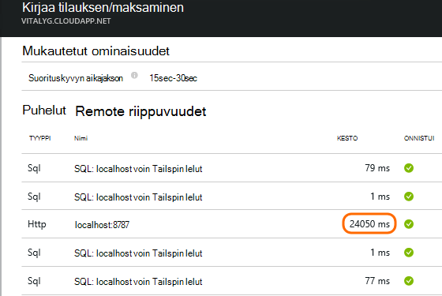

<properties 
    pageTitle="Ongelmat riippuvuudet sovelluksen tiedot-ohjelmistossa" 
    description="Virheet ja riippuvuuksien aiheutuvat hidasta etsiminen" 
    services="application-insights" 
    documentationCenter=""
    authors="alancameronwills" 
    manager="douge"/>

<tags 
    ms.service="application-insights" 
    ms.workload="tbd" 
    ms.tgt_pltfrm="ibiza" 
    ms.devlang="na" 
    ms.topic="article" 
    ms.date="05/12/2016" 
    ms.author="awills"/>
 
# <a name="diagnosing-issues-with-dependencies-in-application-insights"></a>Ongelmat riippuvuudet sovelluksen tiedot-ohjelmistossa


*Riippuvuus* on ulkoista osaa, jota kutsutaan sovelluksen mukaan. Se on yleensä kutsua HTTP- tai tietokannan tai tiedostojärjestelmän palvelu. Tai verkkosivun-komentosarja, se voi olla AJAX kutsun palvelimeen. Visual Studio hakemuksen tiedot näet helposti kuinka kauan sovelluksesi odottaa riippuvuudet ja kuinka usein riippuvuus-kutsu epäonnistuu.

## <a name="where-you-can-use-it"></a>Jos voit käyttää sitä

Ulos ruutuun riippuvuuden seuranta on tällä hetkellä käytettävissä:

* ASP.NET web Apps-sovellusten ja IIS-palvelimeen tai Azure-palveluita
* [Java web Apps-sovelluksista](app-insights-java-agent.md)
* [Verkkosivut](https://azure.microsoft.com/blog/ajax-collection-in-application-insights/)

Muuntyyppisten, kuten sovelluksille voit kirjoittaa omia näytön [TrackDependency Ohjelmointirajapinnan](app-insights-api-custom-events-metrics.md#track-dependency)käyttäminen.

Ulos,-valmiilla riippuvuus-valvonta raportoi tällä hetkellä seuraavanlaisiin riippuvuuksien puhelut:

* ASP.NET
 * SQL-tietokannat
 * ASP.NET web ja käyttää HTTP-pohjaista sidontojen WCF-palveluita
 * Paikalliseen tai etätietokantaan HTTP-puhelut
 * Azure DocumentDb, taulukkoon, blob-säiliö ja jonossa
* Java
 * Tietokannan kautta [JDBC](http://docs.oracle.com/javase/7/docs/technotes/guides/jdbc/) ohjaimen, kuten MySQL, SQL Server, PostgreSQL tai SQLite kutsuja.
* Verkkosivut
 * [AJAX-puhelut](app-insights-javascript.md)

Uudelleen voit kirjoittaa omaa SDK puhelut seurannassa muiden riippuvuudet.

## <a name="to-set-up-dependency-monitoring"></a>Voit määrittää riippuvuuden seuranta

Asenna tarvittavat isäntäpalvelimen-agentti.

Käyttöympäristö | Asenna
---|---
IIS-palvelin | Joko [Asenna tilan valvonta-palvelimeen](app-insights-monitor-performance-live-website-now.md) tai [päivittää sovelluksen .NET Frameworkin 4.6 tai uudempi](http://go.microsoft.com/fwlink/?LinkId=528259) ja asenna [Sovellus havainnollistamisen SDK](app-insights-asp-net.md) -sovelluksen.
Azure Web Appissa | [Sovelluksen tiedot-tunniste](app-insights-azure-web-apps.md)
Java verkkopalvelin | [Java web Apps-sovelluksista](app-insights-java-agent.md)
Verkkosivut | [JavaScript-näyttö](app-insights-javascript.md) (Lisäksi verkkosivun seuranta ei ole muita asetukset)
Azure pilvipalvelussa |  [Käytä käynnistys tehtävän](app-insights-cloudservices.md#dependencies) tai [asentaa .NET framework 4.6 +](../cloud-services/cloud-services-dotnet-install-dotnet.md)  

IIS-palvelimiin tila-näytössä ei tarvitse voit muodostaa sovelluksen havainnollistamisen SDK projektia lähde. 

## <a name="application-map"></a>Sovelluksen kartta

Sovelluksen kartta toimii visuaalisena apuvälineenä etsiminen sovelluksen osat väliset riippuvuudet. 


Ruudut voit siirtyä asiaa riippuvuuden ja muissa kaavioissa.

Valitse Kutista alipuun pieni [x].

Kiinnitä kartan [raporttinäkymät-ikkunan](app-insights-dashboards.md), johon se on täysin.

[Lue lisää](app-insights-app-map.md).

## <a name="diagnosis"></a>Ohjelmistossa riippuvuuden suorituskykyongelmia WWW-palvelimessa

Arvioida pyyntöjä palvelimen suorituskykyyn:


Vieritä katsaus pyynnöt ruudukon:


Ylimmät yksi kestää kauan. Katsotaan, jos löydämme, jossa on käytetty aika.

Napsauta kyseisen rivin, jos haluat tarkastella yksittäisiä pyynnön tapahtumia:


Napsauta mitä tahansa pitkään suoritettavien esiintymä tutkia tarkemmin.

> [AZURE.NOTE] Vierittää alaspäin vähän valitsemaan esiintymä. Viive putkijohto voi tarkoittaa yläreunan esiintymien tiedot ovat puutteelliset.

Vieritä liittyvät pyyntö remote riippuvuuden puhelut:



Näyttää useimmat aika ylläpidon pyyntö kului paikallisen palvelun kutsu. 

Valitse rivin Saat lisätietoja:


Tiedot on riittävästi tietoja vianmäärityksessä.


## <a name="failures"></a>Virheet

Jos määritettynä on epäonnistunut pyynnöt, napsauta kaaviota.


Valitse pyynnön tyyppi ja pyynnön esiintymän Etsi remote riippuvuus epäonnistui puhelun kautta.


## <a name="custom-dependency-tracking"></a>Mukautettu riippuvuus seuranta

Riippuvuus seuranta-perusmoduuli löytää automaattisesti Ulkoiset riippuvuudet, kuten ja REST API. Mutta voit halutessasi muita osia käsitellään samalla tavalla. 

Voit kirjoittaa koodi, joka lähettää riippuvuustiedot, sama [TrackDependency API](app-insights-api-custom-events-metrics.md#track-dependency) , jota käytetään vakio moduulit käyttäminen.

Esimerkiksi jos luot koodisi kokoonpanon, et ole itse kirjoittanut itse kanssa, voi aikaa kaikki puhelut, voit selvittää, mitä vaikutus vastauksen kertaa. On tämän sovelluksen havainnollistamisen riippuvuus-kaaviot näkyvät tiedot, Lähetä se `TrackDependency`.

```C#

            var success = false;
            var startTime = DateTime.UtcNow;
            var timer = System.Diagnostics.Stopwatch.StartNew();
            try
            {
                success = dependency.Call();
            }
            finally
            {
                timer.Stop();
                telemetry.TrackDependency("myDependency", "myCall", startTime, timer.Elapsed, success);
            }
```

Jos haluat poistaa käytöstä vakio riippuvuuden seuranta-moduulin, poista DependencyTrackingTelemetryModule viittaus [ApplicationInsights.config](app-insights-configuration-with-applicationinsights-config.md).


## <a name="ajax"></a>AJAX

Katso [verkkosivujen](app-insights-javascript.md).


 