<properties
    pageTitle="Tunnistaa, Kiireellisyysjärjestys, vianmääritys"
    description="Analysoi kaatuu ja haku- ja sovellusten suorituskyvyn vianmääritys"
    authors="alancameronwills"
    services="application-insights"
    documentationCenter=""
    manager="douge"/>

<tags
    ms.service="application-insights"
    ms.workload="tbd"
    ms.tgt_pltfrm="ibiza"
    ms.devlang="na"
    ms.topic="article" 
    ms.date="11/06/2015"
    ms.author="awills"/>

# Tunnistaa, Kiireellisyysjärjestys ja vianmääritys sovelluksen havainnollistamisen kanssa

*Hakemuksen tiedot on esikatselu.*

Hakemuksen tiedot auttaa huomaat, miten sovellus toimii ja niitä käytetään, kun se on julkaistu. Ja jos ilmenee ongelmia, se ilmoittaa avulla voit arvioida vaikutusta ja auttaa määrittämään, syy.

Näin tilin kuulumisia, kehittää verkkosovellusten:

* *"Pari päivää on otettu käyttöön vähäisiä' korjaus. Olemme suorittaminen laaja testi kerralla, mutta valitettavasti odottamattomia muutoksia käytössä yhdistetään tunnistukseen ilmenneet eivät ole yhteensopivia etu- ja Edellinen päät välillä. Välittömästi palvelimen poikkeukset tehdä Microsoftin ilmoitusta käynnistyy ja olemme on tehty tilanne. Poissa-sovelluksen tiedot-portaalin muutamalla napsautuksella on saatu tarpeeksi tietoa poikkeuksen callstacks rajataksesi ongelma. Olemme peruutetaan välittömästi ja rajoitettu vaurio. Hakemuksen tiedot on tehnyt tässä osassa devops käy hyvin helppoa ja suoritettavia."*

Katsotaan, miten tyypillinen web kehittäminen työryhmän käyttää sovelluksen havainnollistamisen suorituskyvyn seurantaa varten. Olemme tehdään noudattamalla ryhmän Fabrikam pankin, kehittää pankkijärjestelmän (OBS).

Ryhmän toimii jakson tältä:

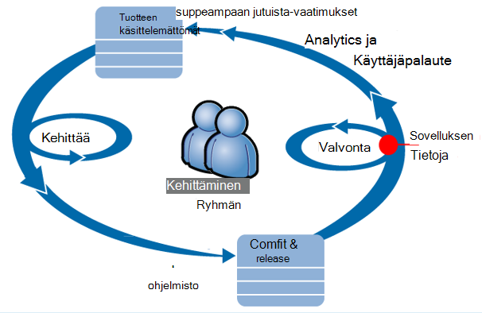

Vaatimukset syötteen niiden kehittämisen keskeneräisen (tehtäväluettelon). Ne toimivat lyhyessä sprints, jotka toimittavat usein toimimasta ohjelmisto - yleensä parannukset ja laajennukset aiemmin luotuun sovellukseen. Live sovellus päivitetään usein uudet ominaisuudet. Live, mutta ryhmän valvoo sitä varten suorituskyvyn ja käyttömäärän hakemuksen tiedot avulla. Tämä analyysi syötteet takaisin niiden kehittämisen keskeneräisen.

Ryhmän seurata tarkasti, live web-sovelluksen käyttää sovelluksen tietoja:
* Suorituskyky. Käyttäjät haluavat ymmärtää, kuinka vastaus kertaa vaihtelevat pyynnön Laske; kuinka paljon suorittimen, verkon, levyn ja muut resurssit ovat käytössä; ja pullonkaulojen sijainti.
* Virheet. Jos on poikkeus tai epäonnistui pyynnöt, tai jos suorituskyvyn laskuri perehtynyt sen alueen ulkopuolella, ryhmän on tunnettava nopeasti, jotta ne voivat käyttää toimintoa.
* Käyttö. Aina, kun uusi ominaisuus on julkaistu, ryhmän haluat tietää, missä määrin sitä käytetään ja onko käyttäjillä on se ongelmia.

Oletetaan, että keskittyä jakson palaute-osassa:

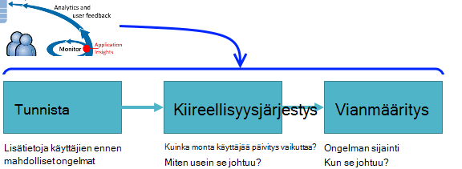

## Tunnista heikko käytettävyys

Marcela Markova on vanhempi developer OBS ryhmän ja kestää liidin valvonnasta Onlinen suorituskyvyn parantamisesta. Hän määrittää useita [web-testien][availability]:

* Sovelluksen tärkeimmät aloitussivu single-URL-Osoitteen testin http://fabrikambank.com/onlinebanking/. Hän määrittää ehdot HTTP-koodin 200 ja teksti "Tervetuloa!". Jos testi ei onnistu, on ongelmia vakavasti verkossa tai palvelimet tai ehkä käyttöönoton ongelma. (Tai joku muuttanut Tervetuloa! viestin sivulla ilman auttaa muita hänen know.)

* Tarkempaa monivaiheinen testi, jossa lokit ja kaavan nykyisen tilin kohdalle, tarkistuksen muutaman tärkeimmät tiedot kullakin sivulla. Tämä testi tarkistaa, että tilit-tietokannan linkki toimii. Hän käyttää kuvitteellinen Asiakastunnus: muutamat ylläpidetään testaus.

Määritä testit Marcela on varma, että ryhmän tietävät nopeasti kaikki käyttökatkosta tietoja.  

Web-testi kaaviossa punaiset pisteet näkyvät virheitä:

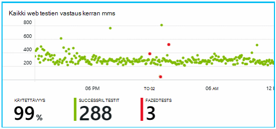

Mutta tärkeintä, ja sähköpostitse ilmoituksen siitä, mikä tahansa suoritusvirhe esille kanssa. Tällä tavoin ne tietää ennen lähes kaikki asiakkaat.

## Näytön suorituskyvyn mittarit

Valitse sovelluksen tiedot-sivulla, on kaavio, jossa näkyy [avaimen arvot]eri[perf].

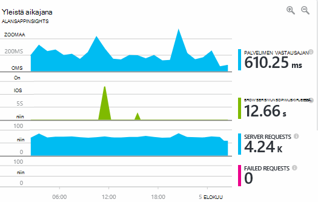

Selaimen sivun latausajasta johdetaan telemetriatietojen verkkosivujen lähettäjä. Palvelimen vastausajan, palvelimen pyynnön ja epäonnistuneen pyynnön määrän kaikki mitataan verkkopalvelin ja lähettää sovelluksen havainnollistamisen sieltä.

Marcela on hieman kyseisen kanssa palvelimen vastauksen kaavio, jossa näkyy välinen keskimääräinen aika, kun palvelin vastaanottaa HTTP-pyyntö käyttäjän selain ja kun se palauttaa vastauksen. Ei epätavallisia Nähdäksesi Tässä kaaviossa muunnelma, kun järjestelmä kuormitus vaihtelee. Mutta tässä tapauksessa on todennäköisesti korrelaatio pieni nousuihin viittaavat tulokset-pyynnöt ja suuri määrä nousee vastausajan. Joka saattaa johtua, että järjestelmä toimii vain sen rajoitukset. 

Hän avaa palvelimet-kaavioita:

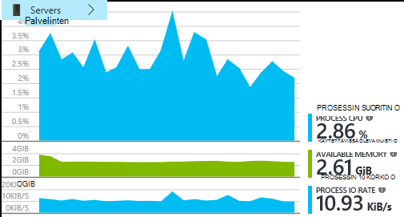

Todennäköisesti ei allekirjoitus resurssien rajoitukset, joten ehkä kohoumat palvelimen vastauksen kaaviot ovat vain silloin.

## Ilmoitukset

Kuitenkin hän haluaa vastauksen ajat seuraa. Jos se on liian suuri, hän haluaa tietää se heti.

Jotta hän määrittää [ilmoitusten][metrics], vastaus silloin on suurempi kuin tavallinen raja-arvon. Näin hänen luotettavuus, jotta hän tietävät se, jos vastauksen kertaa hitaasti.

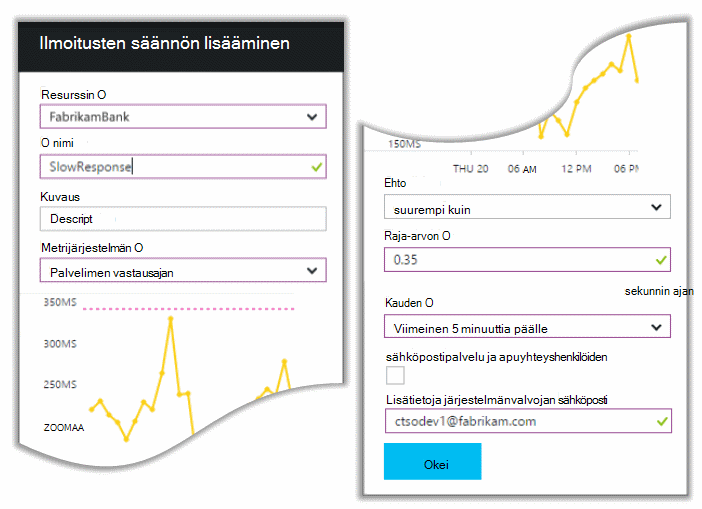

Ilmoitukset voi määrittää monenlaisia muita tietoja. Esimerkiksi voi vastaanottaa sähköposteja, jos poikkeus määrä on suuri tai käytettävissä oleva muisti siirtyy pieni tai jos on huippu asiakkaan pyyntöihin.

## Ennakoiva diagnostiikan ilmoitukset

Seuraavan päivän ilmoitus sähköposti saapuu hakemuksen tiedot. Mutta kun hän avautuu, she etsii ei vastausta aika-ilmoitus, jotka hän määrittää. Sen sijaan se ilmoittaa, ettei hän on ollut äkillinen nousu epäonnistui pyyntöjä - eli pyynnöt, jotka on palautettu virhe koodit vähintään 500.

Epäonnistuneiden pyyntöjen ovat kohtaa, johon käyttäjät on tullut virheen: yleensä seuraavat koodin poikkeuksen. Ehkä nähdä viestin ajattelevat "Valitettavasti emme ei voitu päivittää tiedot juuri nyt" tai osoitteessa absoluuttinen häpeälliset huonoin-pino-luominen käyttöön käyttäjän näytön: verkkopalvelin.

Tämä ilmoitus on muutokset yllätä, koska hän tarkastellut, viimeksi epäonnistuneen pyynnön määrä on encouragingly pieni. Virheiden pieni määrä on odotettavissa varattu Serverissä. 

On myös vähän hän muutokset yllätä, koska hän ei tarvitse määrittää tämän ilmoituksen. Itse asiassa ennakoiva diagnostiikka sisältyy automaattisesti hakemuksen tiedot. Se automaattisesti mukautuu jälkeen sovellus tavallista virheen kuvio ja tietylle sivulle tai valitse suuren kuormituksen aikana "saa käyttää" virheet tai liitetty muita tietoja. Hälytyksen aiheuttaa vain silloin, kun ei nousu yläpuolella mitä on tulossa.

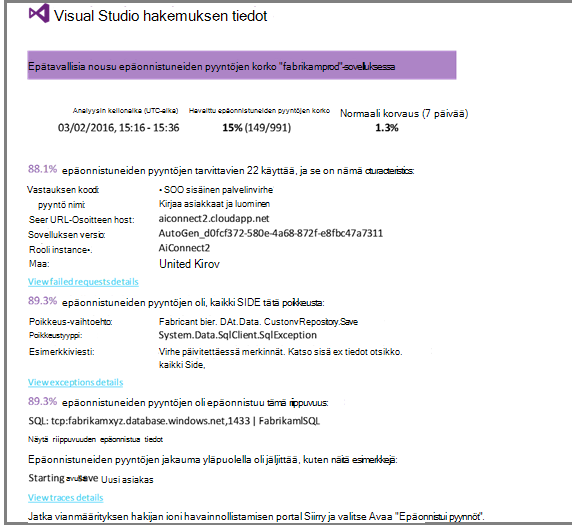

Tämä on erittäin hyödyllinen sähköpostin. Se ei vain Nosta hälytys; se tekee kiireellisyysjärjestys ja diagnostiikan työtä paljon liian.

Se näyttää, kuinka monta asiakkaiden päivitys vaikuttaa, ja mitkä verkkosivujen ja toiminnot. Marcela voit päättää, onko on saatava parissa tämä kuin fire Poraudu koko työryhmäsi tai onko se voidaan ohittaa vasta ensi viikolla.

Sähköpostin näkyvät myös, että tietyn poikkeus tapahtui ja - lisää kiinnostavat - että virheen liittyy epäonnistui puhelut tietyn tietokannan vaikka. Kerrotaan, miksi vian yhtäkkiä näkyivät vaikka Marcela's ryhmän ei otettu käyttöön päivityksiä viimeksi. 

Hän Testaa tietokanta-ryhmän vetäjä. Kyllä, julkaissut kuuma korjaa edellisten puolessa tunnissa; ja jokin meni vikaan-ehkä on saattanut vähäisiä rakenteen muuttaminen

Ongelma on niin tapa on kiinteä, myös tutkiminen lokit ennen ja sen johtuvat 15 minuutin kuluessa. Kuitenkin Marcela napsauttaa linkkiä, voit avata sovelluksen tiedot. Se avautuu suoraan sivulle epäonnistuneen pyynnön, ja hän näkee epäonnistui tietokannan soittaa riippuvuuden puhelut liittyvä luettelo. 

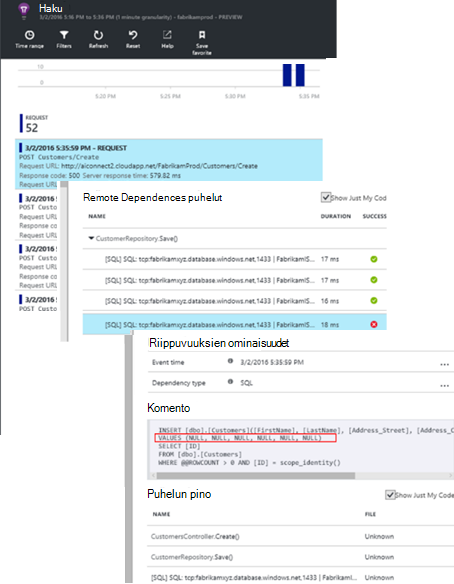

## Poikkeukset tunnistaminen

Hieman asetukset, joiden [Poikkeukset](app-insights-asp-net-exceptions.md) raportoidaan hakemuksen tiedot automaattisesti. Ne voivat myös voi tallentaa erikseen lisäämällä [TrackException()](app-insights-api-custom-events-metrics.md#track-exception) puhelut koodi:  

    var telemetry = new TelemetryClient();
    ...
    try
    { ...
    }
    catch (Exception ex)
    {
       // Set up some properties:
       var properties = new Dictionary <string, string>
         {{"Game", currentGame.Name}};

       var measurements = new Dictionary <string, double>
         {{"Users", currentGame.Users.Count}};

       // Send the exception telemetry:
       telemetry.TrackException(ex, properties, measurements);
    }

Fabrikam pankin ryhmän on kehittynyt käytäntö lähettää aina telemetriatietojen poikkeuksen, ellei ilmeisimmät palauttaminen.  

Itse asiassa niiden strategia on entistä laajempia kuin,: lähettämisen telemetriatietojen kaikissa tapauksissa missä asiakkaan turhautunut: mitä ne haluat tehdä, onko se vastaa poikkeuksen koodissa vai ei. Esimerkiksi jos ulkoinen välisten siirron-järjestelmän palauttaa "ei voi suorittaa tämän tapahtuman" viestin toiminnallisia jostain syystä (ei vika asiakkaan) jälkeen ne seurata kyseisen tapahtuman.

    var successCode = AttemptTransfer(transferAmount, ...);
    if (successCode < 0)
    {
       var properties = new Dictionary <string, string>
            {{ "Code", returnCode, ... }};
       var measurements = new Dictionary <string, double>
         {{"Value", transferAmount}};
       telemetry.TrackEvent("transfer failed", properties, measurements);
    }

TrackException käytetään raportin poikkeukset, koska se lähettää kopion pino; TrackEvent käytetään raportin muita tapahtumia. Voit liittää ominaisuudet, jotka voivat olla hyödyllisiä vianmäärityksen.

[Diagnostiikan haun] näkyvät poikkeukset ja tapahtumia[ diagnostic] sivu. Voit siirtyä niihin lisäominaisuuksien ja pinon jäljitys kyselyjä.

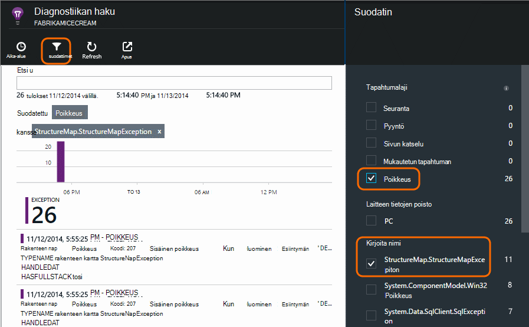

## Käyttäjän toiminnan valvominen

Kun vastausajan on hyvä johdonmukaisesti ja on muutama poikkeus, keskihajonta-ryhmän Voit ajatella siitä, miten voit parantaa käyttäjien käyttökokemusta ja edistää haluamasi luokittelemiseen käyttäjää.

Tavallinen käyttäjä matkustaminen verkkosivuston kautta on esimerkiksi Tyhjennä 'suppilo': useille asiakkaille kohde on erityyppisiä lainan;. Jotkin niistä täytä tarjouksen lomakkeessa. ja ne, jotka saavat tarjous, muutaman Siirry eteenpäin ja poista laina-aika.

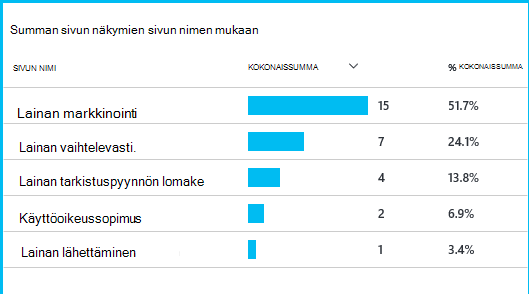

Liiketoiminnan käyttää sivustokokoelmatyyppien missä mahdollisimman numerot heikentyä, kuinka saat lisätietoja käyttäjien suppilo alareunaan. Joskus voi olla käyttäjän kokemus (UX) epäonnistui - esimerkiksi seuraava"-painike on vaikea löytää, tai ohjeet eivät ole selvää. Lisää todennäköisesti on enemmän avattavan käyttäminen business syitä: ehkä lainan hinnat ovat liian suuria.

Jostakin syyt tietojen avulla käyttäjät toiminnan seuraaminen toimi ryhmän. Jos haluat tutustua tarkemmin, voidaan lisätä Lisää seuranta-puhelut. TrackEvent() voidaan laskea käyttäjän toiminnot, yksityiskohtien yksittäisen painikkeen napsautusten merkittäviä saavutuksista, kuten maksaa lainan käytöstä ja poistaminen.

Ryhmän käytetään käytön ottaa käyttäjän tietoja. Internetissä aina, kun ne suunnitella uuden toiminnon, ne toimivat, kuinka he saavat sen käyttöä koskevaa palautetta. Ne suunnitella seuranta kutsuu ominaisuus alusta alkaen. Ne parantavat ominaisuus kehittäminen kunkin jakson palautteen avulla.

## Ennakoiva seuranta  

Marcela ei vain istut ympärille odotetaan ilmoituksia. Pian jokaisen lukea jälkeen hän on katsaus [vastauksen kertaa] [ perf] -yleinen luku- ja mahdollisimman pieneksi palvelupyynnöt sekä poikkeuksen laskee sisällysluettelon.  

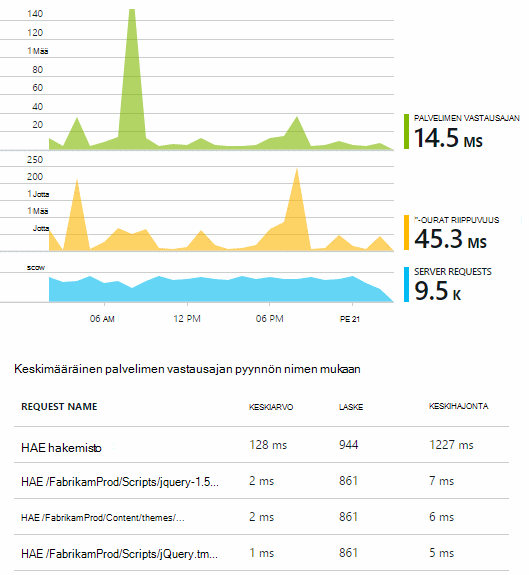

Hän arvioida jokaisen käyttöönoton suorituskyvyn vaikutus vertailu yleensä viikon viimeinen kanssa. Jos näkyvissä on äkillinen enenevästi, hän nostaa, jotka kiinnostavat kehittäjien kanssa.

## Kiireellisyysjärjestys

Kiireellisyysjärjestys - arvioidaan vakavuus ja ongelman laajuus - on ensimmäiseksi tunnistus. Olisi olemme soitetaan ulos ryhmän keskiyön? Tai sen jättää asti keskeneräisen seuraava helposti välin? On kiireellisyysjärjestys avaimen kysymyksiin.

Kuinka paljon se tarkoittaa? Yhteenveto-sivu-kaavioiden tarkastella joitakin näkökulmasta ongelman. Esimerkiksi Fabrikam-sovelluksen luodaan neljä web-testi ilmoitusten yksi yöllä. Katsoo kaavion aamulla, ryhmän voi nähdä että käytettävissä on varmasti joitakin punaista pistettä edelleen testejä useimmat olisivat vihreä. Siirtyminen käytettävyys-kaavioksi, oli Tyhjennä kaikki katkonainen ongelmat on yksi testi sijainnista. Tämä on selvästi vaikuttavia vain yhden reitin verkko-ongelma ja todennäköisesti poistaa itse.  

Sen sijaan käyttämällä ja vakaata nousu poikkeuksen laskee tai vastaus kertaa kaaviossa on selvästi jotain hätäile tietoja.

Hyödyllisiä kiireellisyysjärjestys tekeminen on kokeilla sitä itse. Jos sama ongelma voi ilmetä, tiedät on reaaliluku.

Valitse murtoluku käyttäjien päivitys vaikuttaa? Saadakseen karkea answer jaetaan istunnon Laske virheen korko.

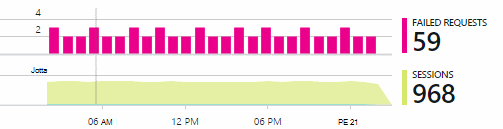

Kyseessä hidas vastauksen vertaa mahdollisimman pieneksi vastaamisen pyynnöt käyttö usein jokaisen sivun taulukon.

Kuinka tärkeää on estetty skenaarion? Jos kyseessä on estää tietyn käyttäjän Tarinan toimintojen ongelma, sen merkitystä paljon? Jos asiakkaita ei niiden laskujen maksaminen, se on vakavia; Jos niitä ei voi muuttaa asetuksiaan näytön värin, ehkä se odottaa. Tapahtuman tai poikkeuksen tiedot tai hidas sivun henkilöllisyyttä ilmoittaa, jossa asiakkaiden on ongelmia.

## Vianmääritys

Vianmääritys ei ole aivan sama kuin virheenkorjaus. Ennen kuin aloitat jäljitys koodin avulla, on oltava karkea käsityksen siitä, miksi, missä ja milloin ongelma ilmenee.

**Kun se johtuu?** Tapahtuma- ja metrijärjestelmän kaavioiden tarjoaman historiallisten näkymän on helppo yhdistää mahdollisia syitä ja tehosteet. Jos määritettynä on katkonainen päät vastaus kerran tai poikkeuksen korvaukset, tarkista pyynnön Laske: Jos se päät samanaikaisesti ja näyttää Resurssiongelma. Tarvitsetko Lisää suorittimen ja muistin määrittämiseen? Vai onko se riippuvuus, joka ei voi hallita kuormituksen?

**Onko se us?**  Jos sinulla äkilliseen – esimerkiksi kun asiakas haluaa tiliotteen - pyyntö tietyn tyyppisiä suorituskyvyn sitten on mahdollista voi olla ulkoisella web-sovelluksen sijaan. Arvot Resurssienhallinnassa riippuvuuden virheen korko ja riippuvuussuhteen kesto korvaukset ja vertailla niiden hammashoitoa edellisten muutaman tunnin tai päivien voit havaittu ongelma. Jos ovat hajautettuna muutokset, ulkoisella voi olla myös blame.  

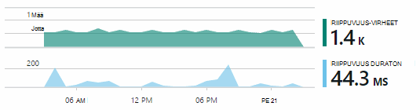

Hidas riippuvuuden asioita, jotka ovat: n maantieteellinen sijainti ongelmia. Fabrikam pankin käyttää Azuren näennäiskoneiden ja havaitsi, että ne oli vahingossa sijoitettu niiden verkkopalvelin ja tilin palvelimen eri maasta. Käyttämällä Käyttömukavuuden on tuodut valinnanvapaus jonkin niistä.

**Mitä on tehdä?** Jos ongelma ei näy riippuvuuden, jos se ei aina, se on todennäköisesti syynä viimeaikaisesta muutoksesta. Historiallinen perspektiivi metriyksiköt ja tapahtuma-kaavioita varten on helppo yhdistää äkillinen muutoksia ominaisuuksissa kanssa. Etsi ongelman, joka rajaa.

**Mitä on tekeillä?** Ongelmia ilmenee vain harvoin, ja se voi olla vaikea jäljittää testaamalla offline-tilassa. Kaikki voimme on yrittää sieppaus ohjelmavirhe reaaliaikainen yhteydessä. Voit tarkastaa pinon Vedostaa poikkeuksen raporteissa. Voit lisäksi kirjoittaa jäljitys puhelut-suosikki-kirjaaminen Framework tai TrackTrace() tai TrackEvent().  

Fabrikam oli katkonainen ongelma välisten tilin siirrot, mutta vain tietyt tilityypit. Ymmärtää paremmin, mitä on tapahtuu, ne lisäsi TrackTrace() puhelut koodin liittäminen tilityyppi ominaisuutena kunkin puheluun tärkeimmistä asioista. Joka tekeminen on helppoa suodattamaan vain maksuttomista jäljittää diagnostiikan hakutoiminnolla. Ne myös liittyvien parametriarvot ominaisuudet ja mitat jäljittää kutsuja.

## Sen käsittely

Kun olet todetaan ongelman, voit tehdä suunnitelma ratkaisemaan ongelman. Haluat peruuttaa viimeaikaisesta muutoksesta tai ehkä voit vain Siirry eteenpäin ja ratkaisemaan ongelman. Kun korjaus on valmis, sovelluksen havainnollistamisen kertoo, onko onnistui.  

Fabrikam pankin ryhmälle kestää Lisää rakenteellisia hallintatavan suorituskyvyn mittaan kuin ne käytettävä, ennen kuin niitä käyttää sovelluksen tiedot.

* Ne määrittää suorituskyvyn tavoitteita erityisiä toimenpiteitä hakemuksen tiedot Yhteenveto-sivu.

* Ne suunnitella suorituskyvyn mittarit sovellukseen alusta, kuten arvot, joissa mitataan käyttäjän edistyminen "erotussuppilo."  

## Käyttö

Hakemuksen tiedot voidaan myös kerrotaan, mitä käyttäjät voivat tehdä sovelluksen kanssa. Kun se suoritetaan sujuvasti, ryhmän mielellämme mitä ominaisuuksia ei yleisimmin käytettyihin, mitä käyttäjät, kuten, tai on vaikeuksia kanssa ja kuinka usein ne tulevat takaisin. Jotka auttavat heitä priorisoida tulevista työssään. Ja ne suunnitteleminen mittaaminen kullekin ominaisuudelle kehittäminen jakson osana. [Lisätietoja on artikkelissa][usage].

## Sovellusten

Niin eli miten yksi ryhmän Käytä sovelluksen havainnollistamisen eikä vain yksittäisiä korjaaminen, mutta niiden development Lifecycle-prosessi parantamiseksi. Toivottavasti se on antanut sinulle ideoita siitä, kuinka tiedot sovelluksen avulla voit parantaa suorituskykyä Omat sovellukset.

## Video

[AZURE.VIDEO performance-monitoring-application-insights]

<!--Link references-->

[api]: app-insights-api-custom-events-metrics.md
[availability]: app-insights-monitor-web-app-availability.md
[diagnostic]: app-insights-diagnostic-search.md
[metrics]: app-insights-metrics-explorer.md
[perf]: app-insights-web-monitor-performance.md
[usage]: app-insights-web-track-usage.md
 
