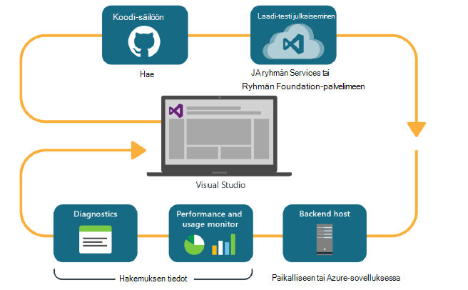

<properties
    pageTitle="Kehittäjän Analytics"
    description="Visual Studiossa, sovelluksen tiedot ja HockeyApp DevOps"
    authors="alancameronwills"
    services="application-insights"
    documentationCenter=""
    manager="douge"/>

<tags
    ms.service="application-insights"
    ms.workload="tbd"
    ms.tgt_pltfrm="ibiza"
    ms.devlang="na"
    ms.topic="article" 
    ms.date="05/18/2016"
    ms.author="awills"/>

# Hakemuksen tiedot ja HockeyApp Analytics Developer

*Hakemuksen tiedot on esikatselu.*

Useiden projektien toimivat nopean [DevOps](https://en.wikipedia.org/wiki/DevOps) jakson. Ne luominen ja niiden sovellusten saada palautetta siitä, miten se on suorittanut ja käyttäjät voivat tehdä sitä ja käyttää kyseisen luomaan kehittäminen jaksot. 

Käyttö- ja suorituskyvyn seurannassa on tärkeää on telemetriatietojen live-sovelluksesta ja palautetta itse käyttäjiltä. 

Useiden järjestelmien on suunniteltu useita komponenteilta: verkkopalvelun, Taustajärjestelmä suorittimien tai Microsoft Data ja Asiakasohjelmistoa käyttäjän selaimessa tai sovelluksena puhelimella tai muu laite. Nämä eri komponenteilta telemetriatietojen on otettava yhdessä.

Jotkin versioiden rajoittanut jaettavaksi nimettyjen testaajia; on myös järjestetty flighting (testit uusista ominaisuuksista ja rajoitettu käyttäjäryhmien) ja A | B testaaminen (vaihtoehtoinen käyttöliittymän rinnakkain testit).

Hallinta jakelu ja integrointi useita asiakkaan ja palvelimen osat kautta valvontaa ei ole trivial tehtävän. Tämä toimenpide on olennainen osa sovelluksen arkkitehtuurista: emme voi luoda tässä takuita ilman iteratiivinen kehittäminen kehä ja hyvä Valvontatyökalut.

Tässä artikkelissa tarkastellaan miten devOps jakson seurantaa ominaisuuksia sopivat sisään prosessin muita osia. 

Jos haluat tarkastella tietyn esimerkki, on [mielenkiintoista Esimerkkitapaus](http://aka.ms/mydrivingdocs) , jossa on useita asiakkaan ja palvelimen osat.

## DevOps kehä

Visual Studio ja Developer analysoinnin työkalut tarjoavat hyvin integroitu devOps-toiminto. Esimerkiksi näin tyypillinen jakson web-sovelluksen (joka voi olla Java, Node.js tai ASP.NET):

* Kehittäjä säilöön koodi tarkistaa tai yhdistää tärkeimmät haaran. Tietovarasto on Git Tässä kuvassa, mutta [Ryhmän Foundation Versionhallinta](https://www.visualstudio.com/docs/tfvc/overview)tasaisesti ehkä.
* Muutokset käynnistävän muodosta ja yksikkö-testi. Muodosta-palvelua voi olla [Visual Studio Team Services tai paikallisen vastaavaan-ryhmän Foundation-palvelimeen](https://www.visualstudio.com/docs/vsts-tfs-overview). 
* Onnistuneiden muodosta ja Yksikkötesti voivat [käynnistimen automaattinen käyttöönotto](https://www.visualstudio.com/docs/release/author-release-definition/more-release-definition). Web app-isäntä voi olla oman verkkopalvelin tai Microsoft Azure. 
* Telemetriatietojen live-sovelluksen lähetetään [Hakemuksen tiedot](app-insights-overview.md), sekä palvelimen ja [asiakkaan selaimilla](app-insights-javascript.md). Siellä voit analysoida sovelluksen ja käyttö kuviot suorituskykyä. Tehokas [hakutyökalut](app-insights-analytics.md) Ohje mahdollisten ongelmien vianmäärityksen. [Ilmoitusten](app-insights-alerts.md) Varmista, että tiedät ongelmasta heti, kun se on syntynyt. 
* Seuraava kehittäminen-jakson saa ilmoituksen oman live telemetriatietojen analyysi.

### Laitteen ja työpöytäsovelluksiin

Laitteen ja työpöytäsovellukset jakson distribution-osa on hieman erilainen, koska olemme ei vain lataaminen yhtenä tai kahtena palvelimiin. Sen sijaan onnistuneen muodosta ja Yksikkötesti voivat [käynnistimen lataaminen HockeyApp](https://support.hockeyapp.net/kb/third-party-bug-trackers-services-and-webhooks/how-to-use-hockeyapp-with-visual-studio-team-services-vsts-or-team-foundation-server-tfs). HockeyApp valvoo jakauman työryhmän testikäyttäjän (tai yleiseen, jos käytät mieluummin). 

HockeyApp kerää myös suorituskyky ja -käyttötietoja, lomakkeissa:

* Tarkka käyttäjän äänimerkki toiminnon yhteydessä on näyttökuvat
* Kaatumisraportit
* Mukautetun telemetriatietojen koodattu itse.

DevOps kehä on valmis uudelleen, kun teet tuleva kehityssuunnitelmien perusteella saadun palautteen.

## Kehittäjän Analytics määrittäminen

Kullekin osalle sovelluksesi - mobiilisovelluksen tai web tai desktop - vaiheet ovat lähinnä saman. Monenlaisia app for Visual Studio automaattisesti suorittaa joitakin seuraavasti.

1. Lisää tarvittavat SDK sovelluksen. Sovelluksille se on HockeyApp ja se on verkkopalvelut sovelluksen tiedot. Jokaisella on eri ympäristöissä eri vaihtoehtoja. (Se on myös mahdollista joko SDK käytettävät Työpöytäsovellukset, mutta suosittelemme HockeyApp.)
2. Voit rekisteröidä sovelluksen hakemuksen tiedot tai HockeyApp-portaaliin, sen mukaan, voit käyttää SDK-paketissa. Tämä on, jossa näet analytics live-sovellukset. Saat instrumentation-näppäintä tai ID, jolla voit määrittää sovelluksen kyselyjä niin, että SDK tietää, missä voit lähettää sen telemetriatietojen.
3. Lisää mukautettua koodia (halutessasi) kirjautua tapahtumia tai arvot-diagnostiikka tai analysoida suorituskyvyn tai käyttö. Paljon seuranta hallinta, jotta et enää tarvitse, ensimmäinen jakso on.
3. Sovelluksille:
 * Lataa HockeyApp virheenkorjaus muodosta. Sieltä voit jakaa sen ryhmäsivuston testikäyttäjän. Aina, kun lataat myöhemmin muodostaa, ryhmän ilmoitetaan.
 * Kun määrität oman jatkuva luoda palvelun, Luo release määrityksen, joka käyttää laajennuksen vaihe HockeyApp lataaminen.

### Analyysin ja HockeyApp telemetriatietojen vienti

Voit tutkia HockeyApp mukautettu ja kirjaudu sisään käyttämällä analyysin ja jatkuva Vie ominaisuuksia sovelluksen tietoja määrittämällä [sillan](app-insights-hockeyapp-bridge-app.md)telemetriatietojen.

## Seuraavat vaiheet
 
Seuraavassa on erilaisia app yksityiskohtaiset ohjeet:

* [ASP.NET web Appissa](app-insights-asp-net.md) 
* [Java web Appissa](app-insights-java-get-started.md)
* [Node.js web Appissa](https://github.com/Microsoft/ApplicationInsights-node.js)
* [iOS-sovellukseen](https://support.hockeyapp.net/kb/client-integration-ios-mac-os-x-tvos/hockeyapp-for-ios)
* [Mac OS X-ohjelma](https://support.hockeyapp.net/kb/client-integration-ios-mac-os-x-tvos/hockeyapp-for-mac-os-x)
* [Android-sovelluksen](https://support.hockeyapp.net/kb/client-integration-android/hockeyapp-for-android-sdk)
* [Yleinen Windows-sovellus](https://support.hockeyapp.net/kb/client-integration-windows-and-windows-phone/how-to-create-an-app-for-uwp)
* [Windows Phone 8 ja 8.1-sovellus](https://support.hockeyapp.net/kb/client-integration-windows-and-windows-phone/hockeyapp-for-windows-phone-silverlight-apps-80-and-81)
* [Esityksen Windows Foundation-sovellus](https://support.hockeyapp.net/kb/client-integration-windows-and-windows-phone/hockeyapp-for-windows-wpf-apps)

