<properties 
    pageTitle="Diagnostiikan hakutoiminnolla | Microsoft Azure" 
    description="Etsi ja suodattaa yksittäisiä tapahtumia, pyynnöt ja kirjaudu jäljittää." 
    services="application-insights" 
    documentationCenter=""
    authors="alancameronwills" 
    manager="douge"/>

<tags 
    ms.service="application-insights" 
    ms.workload="tbd" 
    ms.tgt_pltfrm="ibiza" 
    ms.devlang="na" 
    ms.topic="article" 
    ms.date="06/09/2016" 
    ms.author="awills"/>
 
# Diagnostiikan haun avulla hakemuksen tiedot

Diagnostiikan haun toimintoa [Hakemuksen tiedot] [ start] , että käytät etsitään, tutustu telemetriatietojen yksittäisiä kohteita, kuten page views poikkeukset-tai web-pyynnöt. Ja voit tarkastella log jäljittää ja tapahtumia, jotka on koodattu.

## Jos näet diagnostiikan haun?

### Azure-portaalissa

Voit avata diagnostiikan haun erikseen:

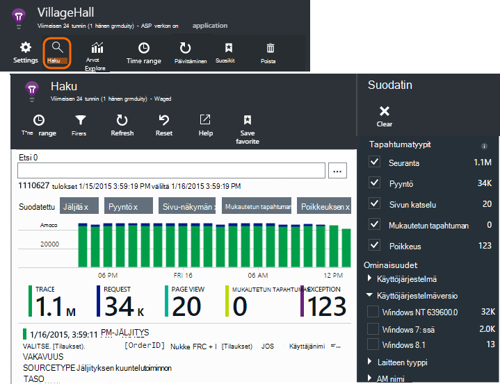

Se avautuu myös, kun napsautat läpi kaikki kaaviot ja ruudukon kohteet. Tässä tapauksessa sen suodattimissa on valmiiksi määritetty keskittyä valitun kohteen tyyppi. 

Jos sovellus on verkkopalvelun, yhteenveto-sivu näyttää kaavion pyyntöjen määrän. Napsauta sitä ja saat tarkempia kaavioon luettelo, jossa näkyy, kuinka monta pyynnöt on tehty kunkin URL-osoitteen kanssa. Valitse minkä tahansa rivin ja saat yksittäisten pyyntöjen luettelo kyseisen URL-osoitteen:

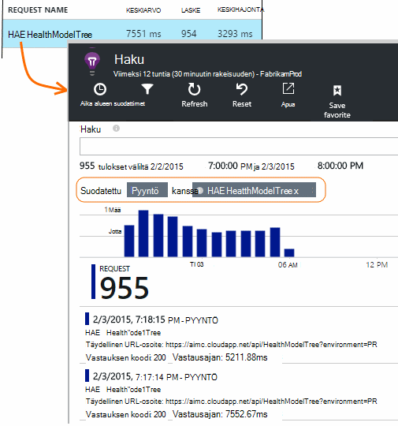

Päärungon muodostavat diagnostiikan haku on lueteltu telemetriatietojen kohteet - palvelimen pyynnöt sivun näkymät, mukautetut tapahtumat, joka on koodattu ja niin edelleen. Luettelon yläosassa on yhteenveto-kaavio, jossa määrät tapahtumien ajan kuluessa.

Tapahtumien yleensä näkyvät diagnostiikan haun ennen kuin ne näkyvät metrisillä hallinnassa. Vaikka sivu päivitetään väliajoin, valitse Päivitä, jos odotat sisäänpääsyä tietyn tapahtuman.

### Visual Studiossa

Avaa Etsi-toiminnon Visual Studiossa:

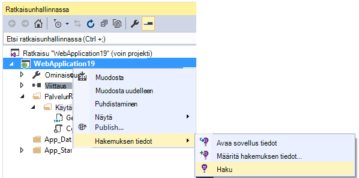

Etsi-ikkunassa on samat toiminnot kuin web-portaaliin:

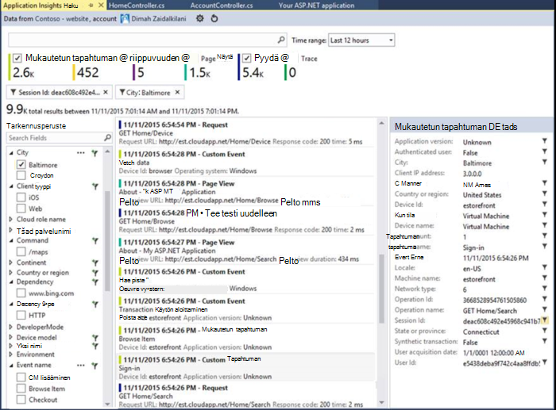

## Esimerkkejä

Jos sovelluksen Luo telemetriatietojen paljon (ja käytät ASP.NET SDK-version 2.0.0-beta3 tai uudempi), mukautuvat esimerkkejä moduulin automaattisesti vähentää asema, joka lähetetään portaalin lähettämällä vain edustava luku tapahtumat. Tapahtumat, jotka liittyvät pyynnössä kuitenkin valittuna tai valitsematta ryhmänä ja siten, että voit siirtyä niihin liittyvät tapahtumat. 

[Lue lisää esimerkkejä](app-insights-sampling.md).

## Yksittäisten kohteiden tarkistaminen

Valitse telemetriatietojen keskustelusta Nähdäksesi avainkenttien ja toisiinsa liittyvät kohteet. Jos haluat nähdä täydellisen luettelon kentät, valitse "...". 

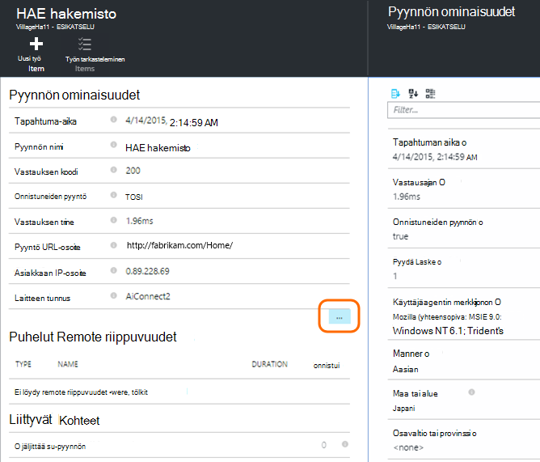

Etsi täydellisen luettelon kentät, Käytä tavallista merkkijonoja (ilman yleismerkkejä). Käytettävissä olevat kentät määräytyvät sen mukaan, telemetriatietojen.

## Luo työnimike

Voit luoda ohjelmavirhe Visual Studio Team Servicesissä telemetriatietojen minkä tahansa kohteen tiedot. 

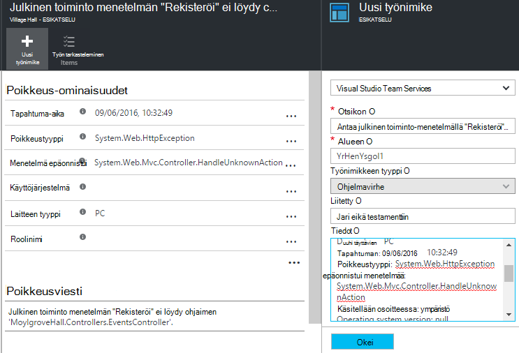

Ensimmäisen kerran teet tämän, sinua pyydetään ryhmän Services-tilin ja projektin linkki.

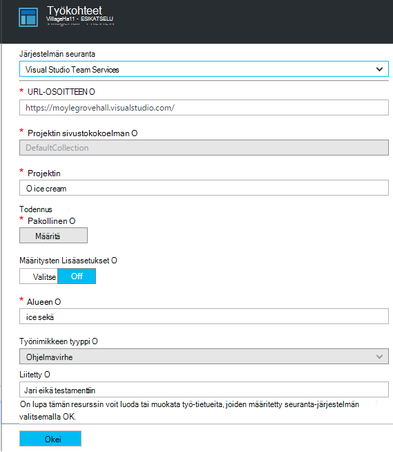

(Voit myös siirtyä asetusten määritys-sivu > töitä.)

## Suodattimen tapahtumatyypit

Avaa suodatin-sivu ja valitse haluamasi tapahtumatyypit. (Jos myöhemmin, jonka haluat palauttaa suodattimia, joiden kanssa olet avannut sivu, valitse Palauta.)

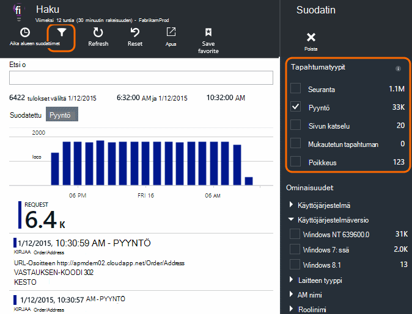

Tapahtuman ovat:

* **Jäljitys** - vianmäärityslokit, kuten TrackTrace, log4Net, NLog ja System.Diagnostic.Trace puheluja.
* **Pyydä** - HTTP-pyyntöjen server-sovelluksessa, kuten sivujen, komentosarjoja, kuvia, tyylitiedostot ja tiedot. Näitä tapahtumia käytetään pyynnön ja vastauksen yleiskatsaus kaavioiden luominen.
* **Sivun katselu** - web-asiakasohjelman lähettämä Telemetriatietojen käyttää sivulla view-raporttien luominen. 
* **Mukautettu tapahtuma** - Jos olet lisännyt TrackEvent() puhelut tilauksen [seurata käyttöä][track], voit etsiä tästä.
* **Poikkeus** - palvelin ja mitkä kirjaudut käyttäen TrackException() aiheutetaan poikkeuksia.

## Suodata arvot

Voit suodattaa tapahtumat niiden ominaisuuksien arvot. Käytettävissä olevat ominaisuudet määräytyvät tapahtuman valittu. 

Valitse esimerkiksi pyynnöt tietyn vastauksen koodilla ulos.

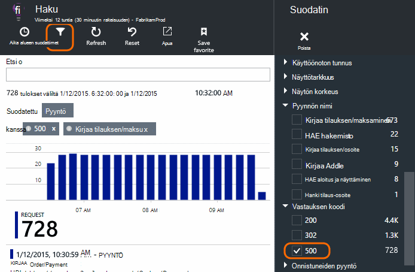

Valitsemalla ei ole tietyn ominaisuuden arvoja on samoin kuin valitsemalla kaikki arvot; se siirtyy käytöstä suodattaminen kyseisestä ominaisuudesta.

### Haun rajaaminen

Huomaa, että laskee oikealla puolella suodatinarvot näyttää kuinka monta esiintymien on nykyisen suodatettuun sarjaan. 

Tässä esimerkissä se on Poista, joka `Reports/Employees` pyytäminen useimpia 500 virheet tulokset:

Lisäksi voit halutessasi myös Katso, mitä muita tapahtumia on näistä tänä aikana, voit tarkistaa **Sisällytä tapahtumat Määrittämätön ominaisuudet**.

## Poista robotti ja web-testi liikenne

Suodatus **reaali tai synteettiset liikenteen** ja tarkista **reaaliluku**.

Voit myös suodattaa **synteettistä liikenteen lähteen**mukaan.

## Tarkasta yksittäisiin

Lisää suodatin pyynnön nimi ja sitten tutkia kyseisen tapahtuman yksittäiset esiintymät.

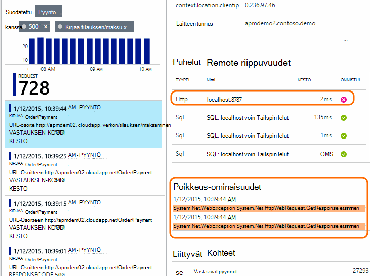

Pyyntö tapahtumien tiedot Näytä poikkeukset pyynnön käsittelyssä on tapahtunut.

Vahvista automaattisen poikkeuksen nähdäksesi sen tiedot, mukaan lukien pinon jäljitys.

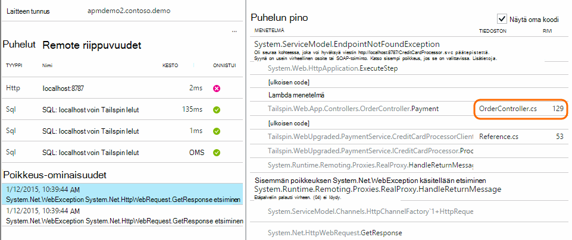

## Tapahtumien samalla ominaisuudella etsiminen

Etsi kaikki kohteet, joilla on sama ominaisuuden arvo:

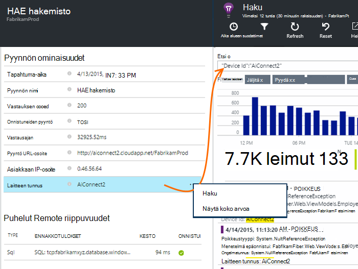

## Hakuperusteena kustannusarvo

Pyydä pyynnöt vastauksen aina > 5s.  Kertaa esitetään jakoviivat: 10 000 jakoviivat = 1ms.

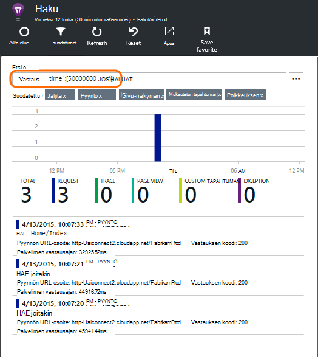

## Hae tiedot

Voit etsiä termejä kaikista ominaisuuden arvot. Tämä on erityisen hyödyllinen, jos olet kirjoittanut [Mukautetut tapahtumat] [ track] arvojen kanssa. 

Voit määrittää alueen hakujen lyhentää alueen yli nopeammin on aika. 

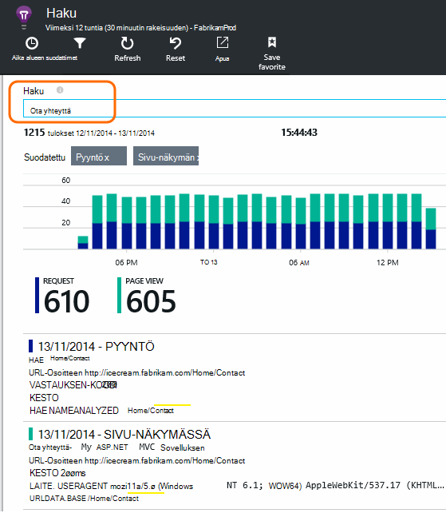

Etsi ehdot, ei alimerkkijonoja. Ehdot ovat aakkosnumeerinen merkkijonoja, kuten joitakin välimerkkejä kuten '. "ja"_". Esimerkki:

termi|*ei* vastaa mukaan|mutta nämä vastaavat
---|---|---
HomeController.About|tietoja Aloitus|h\*tietoja Aloitus\*
IsLocal|Paikallinen on \*Paikallinen|ISL\* islocal i\*l\*
Uusi viive|w d|Uusi viive n\* ja d\*

Seuraavassa on haku-lausekkeiden avulla voit:

Esimerkkikyselyn | Vaikutus 
---|---
hidas|Etsi kaikki tapahtumat päivämääräalue, jonka kentät sisältävät termi "hidastaa"
tietokannan?|Vastaa database01, databaseAB... ? ei voi suorittaa hakusana alkuun.
tietokannan * |Vastaa tietokannan, database01, databaseNNNN  * ei sallita hakusana alkuun
Apple ja Banaani|Etsi tapahtumia, jotka sisältävät molemmat ehdot. Käytä pääoman "ja" ei "ja".
Apple tai Banaani Apple Banaani|Etsi tapahtumia, jotka sisältävät joko termi. Käytä "Tai", ei "tai". < /br/ > lyhyt lomake.
Apple ei Banaani Apple-Banaani|Etsi tapahtumia, joissa yksi termi, mutta et toiseen. Lyhyessä muodossa.
sovelluksen * ja Banaani-(grape pear)|Loogiset operaattorit ja ole sijoitettu oikein sulkeisiin.
"Metrijärjestelmä": 0-500 "Metrijärjestelmä": 500 vastaanottaja * | Etsi tapahtumia, jotka sisältävät arvo alueelta nimettyä mitta.

## Haun tallentaminen

Kun olet määrittänyt kaikki haluamasi suodattimet, voit tallentaa haun suosikkeihin. Jos työskentelet organisaation tilille, voit valita, haluatko jakaa sen ryhmän muiden jäsenten kanssa.

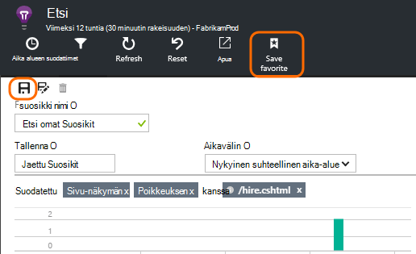

Jos haluat nähdä haun uudelleen, **Siirry yhteenveto-sivu** ja Avaa Suosikit:

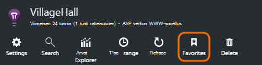

Jos olet tallentanut suhteellinen aikaväli, avata uudelleen sivu on uusimmat tiedot. Jos olet tallentanut suora aikaväli, näet samat tiedot aina.

## Lisää telemetriatietojen lähettäminen hakemuksen tiedot

Lisäksi ulos-valmiin telemetriatietojen, sovelluksen havainnollistamisen SDK lähettämä voit tehdä seuraavaa:

* Sieppaaminen log jäljittää-suosikki-kirjaaminen-framework [.NET] -[ netlogs] tai [Java][javalogs]. Tämä tarkoittaa, voit etsiä log jäljittää ja yhdistää ne sivun näkymät, poikkeukset ja muita tapahtumia. 
* [Koodin kirjoittaminen] [ track] lähetetään mukautetut tapahtumat, sivun näkymien ja poikkeukset. 

[Lue, miten voit lähettää lokit ja mukautetun telemetriatietojen sovelluksen havainnollistamisen][trace].

## Q & A

### Kuinka paljon tietoja säilytetään?

Enintään 500 tapahtumat sekunnissa kunkin sovelluksesta. Tapahtumien säilyvät seitsemän päivän ajan.

### Miten näen kirjaa tietoja palvelin-pyyntöjä?

Olemme kirjautumatta kirjaa tiedot automaattisesti, mutta voit käyttää [TrackTrace tai log puheluita][trace]. Sijoittaa tiedot viestin viesti-parametrin. Et voi suodattaa viestin ominaisuudet, kuten, mutta kokorajoitus on pidempi.

## Seuraavat vaiheet

* [Lähetä lokit ja mukautetun telemetriatietojen sovelluksen havainnollistamisen][trace]
* [Käytettävyys ja vastausajan testien määrittäminen][availability]
* [Vianmääritys][qna]

<!--Link references-->

[availability]: app-insights-monitor-web-app-availability.md
[javalogs]: app-insights-java-trace-logs.md
[netlogs]: app-insights-asp-net-trace-logs.md
[qna]: app-insights-troubleshoot-faq.md
[start]: app-insights-overview.md
[trace]: app-insights-search-diagnostic-logs.md
[track]: app-insights-api-custom-events-metrics.md

 