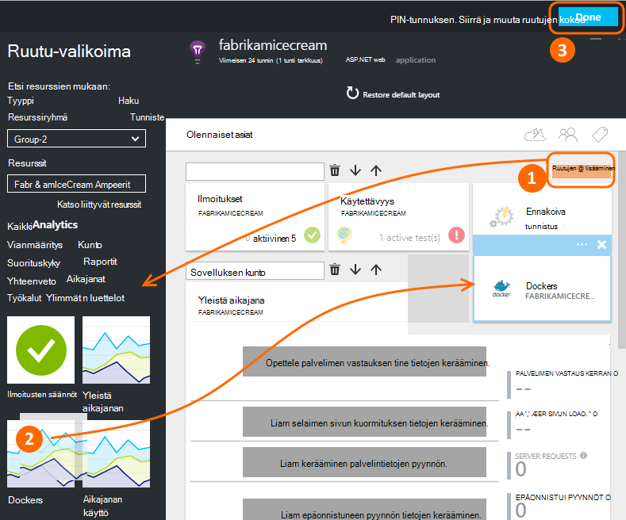
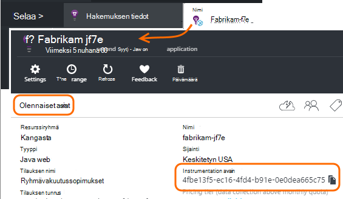
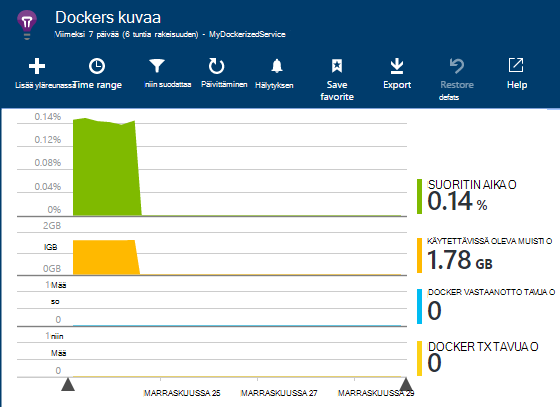
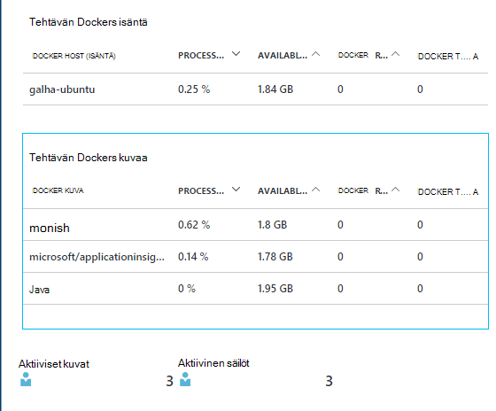
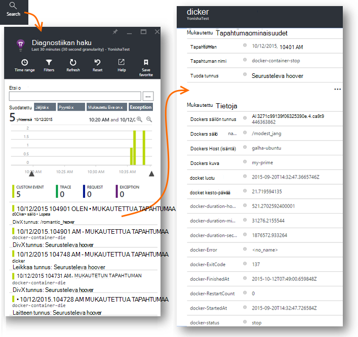
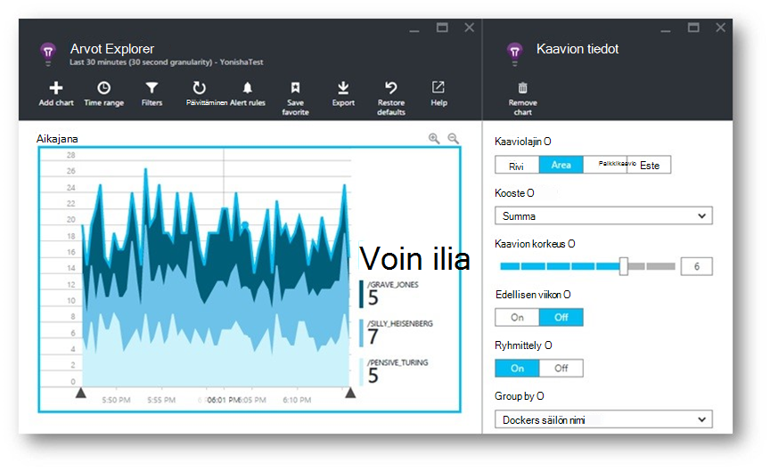
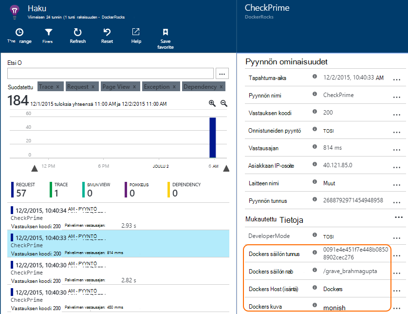
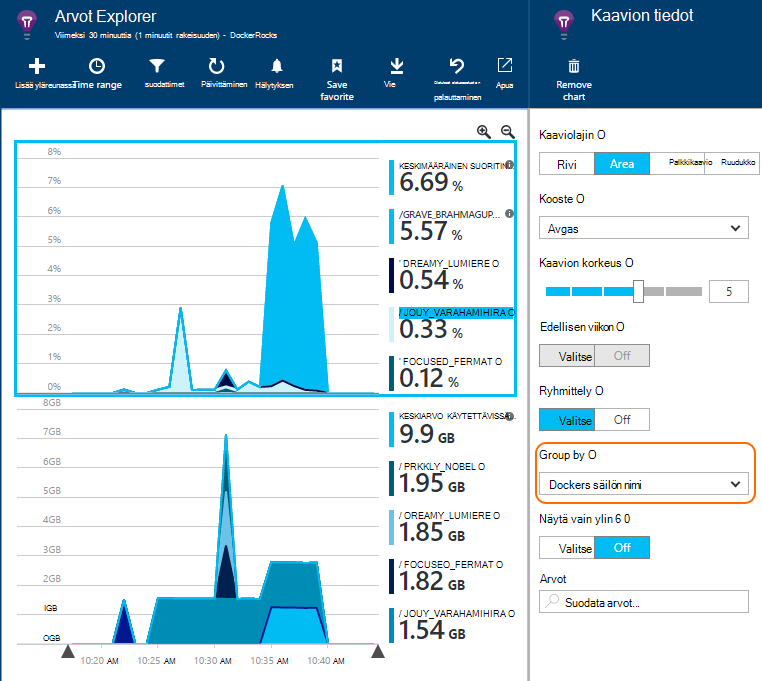

<properties 
    pageTitle="Hakemuksen tiedot Docker sovellusten valvonta" 
    description="Hakemuksen tiedot docker teholaskureita, tapahtumia ja poikkeukset voit näkyviin sekä telemetriatietojen tai kontteihin pakattuja sovelluksista." 
    services="application-insights" 
    documentationCenter=""
    authors="alancameronwills" 
    manager="douge"/>

<tags 
    ms.service="application-insights" 
    ms.workload="tbd" 
    ms.tgt_pltfrm="ibiza" 
    ms.devlang="na" 
    ms.topic="article" 
    ms.date="12/01/2015" 
    ms.author="awills"/>
 
# <a name="monitor-docker-applications-in-application-insights"></a>Hakemuksen tiedot Docker sovellusten valvonta

Elinkaari-tapahtumien ja suorituskyvyn laskureita [Docker](https://www.docker.com/) säilöjen voit piirrettävät hakemuksen tiedot. Asentaa [Sovelluksen tiedot](app-insights-overview.md) -kuva isäntä säilöä ja se näyttää suorituskyvyn laskureita isäntä sekä muita kuvia.

Docker voit jakaa ja lisää siihen kaikki riippuvuudet kevyt säilöt-sovelluksia. Ne tällöin suoritetaan, joka suoritetaan Docker Engine host-konetta.

Kun suoritat [sovelluksen havainnollistamisen kuva](https://hub.docker.com/r/microsoft/applicationinsights/) Docker isännän, saat seuraavat edut:

* Elinkaari telemetriatietojen tietoja kaikki käynnissä säilöt isännän - aloittaa, lopettaa ja niin edelleen.
* Kaikki säilöt suorituskyvyn laskureita. Suorittimen, muistin, verkon käyttö ja lisää.
* Jos käynnissä säilöjen kaikkien näiden sovellusten telemetriatietojen sovellukset [asentaa sovelluksen havainnollistamisen SDK](app-insights-java-live.md) on tunnistaminen säilö ja isännöidä koneen lisäominaisuuksia. Esimerkiksi jos sinulla on käytössä useampi kuin yksi host sovelluksen esiintymät, voit helposti voi suodattaa app-telemetriatietojen isäntä.


## <a name="set-up-your-application-insights-resource"></a>Sovelluksen tiedot-resurssien määrittäminen

1. Kirjaudu sisään [Microsoft Azure Portal](https://azure.com) ja avaa sovelluksen havainnollistamisen resurssi, kun sovellus; tai [Luo uusi tunnus](app-insights-create-new-resource.md). 

    *Mitä resurssin kannattaa käyttää?* Jos joku muu on kehitetty sovellukset, jotka ovat käytössä isäntä-täytyy [luoda uuden sovelluksen tiedot resurssin](app-insights-create-new-resource.md). Tämä on, jossa tarkastella ja analysoida telemetriatietojen. (Valitse "Muut", jos sovellus tyypille.)

    Mutta jos olet kehittäjä-sovelluksia, valitse Toivottavasti olet [lisännyt sovelluksen havainnollistamisen SDK](app-insights-java-live.md) kullekin niistä. Jos ne ovat todella osien yhden business-sovelluksen, voit määrittää kaikki ne telemetriatietojen lähettäminen yksi resurssi ja käytät samaa resurssia Docker lifecycle ja suorituskyvyn tietojen näyttämiseen. 

    Kolmas tilanne on kehittänyt useimmat sovellukset, mutta käytössäsi on erillinen resurssien niiden telemetriatietojen näyttämiseen. Tässä tapauksessa sinun on todennäköisesti myös haluat luoda erilliset resurssin Docker tiedoille. 

2.  Lisää Docker-ruutua: Valitse **Lisää-ruutu**, vedä valikoimasta Docker-ruutu ja valitse sitten **Valmis**. 

    


3. **Essentials** valintaluettelo ja kopioi Instrumentation-näppäintä. Käytät tätä onko SDK where lähettää sen telemetriatietojen.


    

Ottaa selaimen ikkunan käteviä, kun palaat siihen pian, jotta voit tarkastella omaa telemetriatietojen.


## <a name="run-the-application-insights-monitor-on-your-host"></a>Suorita isäntä sovelluksen tiedot-näyttö
 
Nyt kun jotakin näyttämiseen telemetriatietojen on käytössä, voit määrittää tai kontteihin pakattuja sovellus, joka kerää ja lähetä se.

1.  Yhdistä Docker isäntään. 
2.  Muokkaa instrumentation key-tuotetunnuksen kyselyjä Tämä komento ja suorita sitten sitä:
 
    ```

    docker run -v /var/run/docker.sock:/docker.sock -d microsoft/applicationinsights ikey=000000-1111-2222-3333-444444444
    ```

Vain yhden sovelluksen havainnollistamisen kuvan tarvitaan Docker host kohden. Jos sovellus on otettu käyttöön useita Docker isännät-Toista jokaisen isännän komento.

## <a name="update-your-app"></a>Sovelluksen päivittäminen

Jos sovellus on instrumented [Sovelluksen havainnollistamisen SDK Java](app-insights-java-get-started.md)kanssa, Lisää seuraava rivi ApplicationInsights.xml-tiedostoon, projektin alle `<TelemetryInitializers>` elementti:

```xml

    <Add type="com.microsoft.applicationinsights.extensibility.initializer.docker.DockerContextInitializer"/> 
```

Tämä lisää Docker tietoja, kuten säilö ja isännän tunnuksen sovelluksen lähettämät telemetriatietojen jokaisen kohteen.

## <a name="view-your-telemetry"></a>Näytä oman telemetriatietojen

Siirry Azure-portaalissa hakemuksen tiedot resurssin.

Vahvista automaattisen Docker-ruutu.

Näet pian saapuvat Docker-sovelluksen tiedot, erityisesti, jos sinulla on muita säilöjä Docker-ohjelma-käyttöjärjestelmässä.


Seuraavassa on kuvattu joitakin saat näkymiä.

### <a name="perf-counters-by-host-activity-by-image"></a>Teholaskureita isäntä-toimintojen kuvaa








Napsauta mitä tahansa tarkemmin isäntä- tai kuvan nimi.


Voit mukauttaa näkymää, napsauttamalla mitä tahansa kaavion otsikon, ruudukon tai lisätä kaavion. 

[Lisätietoja arvot explorer](app-insights-metrics-explorer.md).

### <a name="docker-container-events"></a>Docker säilö tapahtumat




Jos haluat tutkia yksittäiset tapahtumat, valitse [Etsi](app-insights-diagnostic-search.md). Hakemisesta ja suodattamisesta etsiminen valvottavat tapahtumat. Napsauttamalla mitä tahansa saat tarkempia tietoja.
 
### <a name="exceptions-by-container-name"></a>Poikkeukset säilön nimen mukaan
 



### <a name="docker-context-added-to-app-telemetry"></a>Sovelluksen telemetriatietojen lisätään docker konteksti

Pyydä telemetriatietojen lähettää sovelluksesta instrumented AI SDK-paketissa, jolla Docker kontekstin kanssa:



Ajan ja käytettävissä olevan muistin suorituskyvyn laskureita täydentänyt perusteella ja ryhmitelty Docker säilön nimi:





## <a name="q--a"></a>Q & A

*Mitä hakemuksen tiedot Anna minulle, voin noutaminen Docker?*

* Säilön ja kuva suorituskyvyn laskureita erittelyn.
* Integroi yhden Raporttinäkymät-ikkunan tietojen säilö ja sovelluksen.
* [Vie telemetriatietojen](app-insights-export-telemetry.md) tietokantaan, Power BI tai muita Raporttinäkymät-ikkunan lisäanalysointia varten.

*Miten voin hankkia telemetriatietojen sovelluksen itse?*

* Asenna sovellus havainnollistamisen SDK-sovelluksessa. Lue, miten: [Java web Apps-sovelluksista](app-insights-java-get-started.md), [Windowsin web apps](app-insights-asp-net.md).
