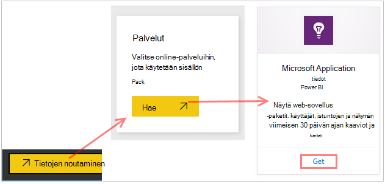
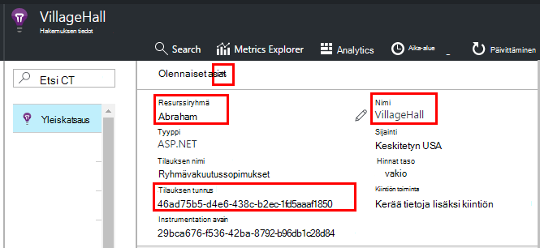
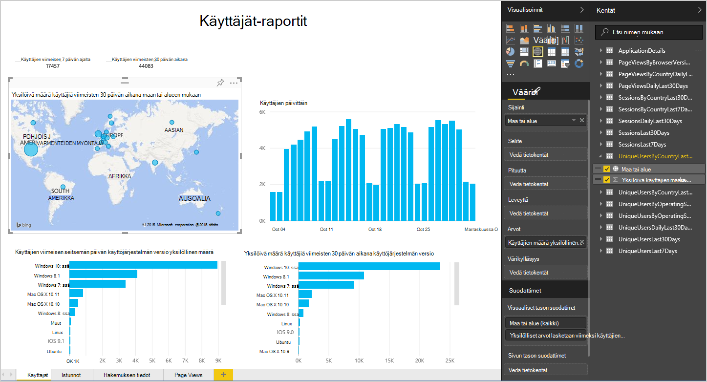
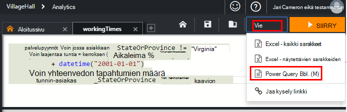
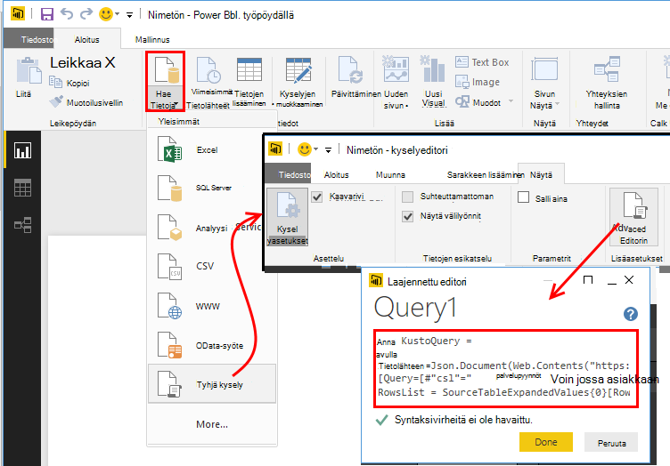
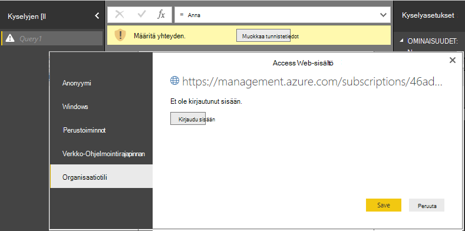
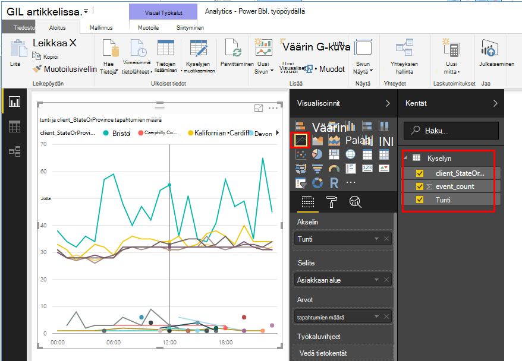
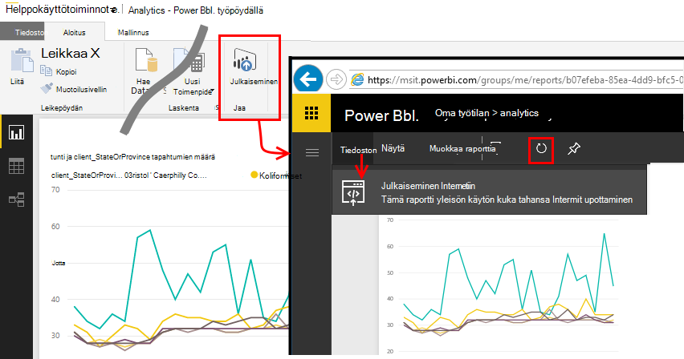

<properties 
    pageTitle="Vie Power BI-sovelluksen tiedot | Microsoft Azure" 
    description="Kyselyjen käyttöanalyysitietojen voidaan näyttää Power BI." 
    services="application-insights" 
    documentationCenter=""
    authors="noamben" 
    manager="douge"/>

<tags 
    ms.service="application-insights" 
    ms.workload="tbd" 
    ms.tgt_pltfrm="ibiza" 
    ms.devlang="na" 
    ms.topic="article" 
    ms.date="10/18/2016" 
    ms.author="awills"/>

# Power BI-syötettä hakemuksen tiedot

[Power BI](http://www.powerbi.com/) on kuuluu business analytics-työkaluista, joiden avulla voit analysoida tietoja ja jakaa tuloksia. RTF-raporttinäkymien ovat saatavilla kaikkiin laitteisiin. Voit yhdistää tietoja useista lähteistä, kuten Analytics kyselyjen [Visual Studio hakemuksen tiedot](app-insights-overview.md).

Kolmella suositellut sovelluksen tiedot-tietojen vieminen Power BI. Voit käyttää niitä yhdessä tai erikseen.

* [**Power BI-sovittimen**](#power-pi-adapter) - määrittäminen koontinäyttöön ja telemetriatietojen sovellukset. Kaavioissa olevat ennalta, mutta voit lisätä omat kyselyt muista lähteistä.
* [**Vie Analytics kyselyt**](#export-analytics-queries) - Kirjoita kyselyn avulla Analytics ja vieminen Power BI. Voit sijoittaa tämän kyselyn Raporttinäkymät-ikkunan ja muut tiedot.
* [**Jatkuva vienti ja Stream Analytics**](app-insights-export-stream-analytics.md) - Tämä edellyttää enemmän työtä määrittäminen. Se on hyödyllinen, jos haluat säilyttää tietosi pitkäksi. Muussa tapauksessa muita tapoja on suositeltavaa.

## Power BI-näyttösovittimen

Tämä menetelmä luo koontinäyttöön ja telemetriatietojen. Alkuperäinen tietojoukon valmiiksi määritetty, mutta voit lisätä sen enemmän tietoja.

### Hae sovittimen

1. [Power BI](https://app.powerbi.com/)kirjautuminen.
2. Avaa **tietojen noutaminen**, **palveluihin**tai **hakemuksen tiedot**

    

3. Anna sovelluksen tiedot resurssin tiedot.

    

4. Odota hetki tai kaksi, tuotavat tiedot.

    

Voit muokata dashboard-sovelluksen tiedot-kaavioiden yhdistämisen niitä muista lähteistä ja kyselyjen Käyttöanalyysitietojen kanssa. Tällä visualisointi-valikoimassa, jossa saat lisää kaavioita ja kukin kaavio on parametreja, voit määrittää.

Ensimmäisen tuonnin jälkeen koontinäyttö ja raporttien edelleen päivittää päivittäin. Voit hallita päivityksen ajoitus-tietojoukko.

## Vie Analytics-kyselyt

Voit kirjoittaa haluamasi Analytics kyselyn ja vieminen, Power BI-koontinäytön tätä vaihtoehtoa, toimi. (Voit lisätä sovittimen luoma koontinäyttö.)

### Yhden kerran: Asenna Power BI Desktopin

Tuo sovelluksen tiedot-kyselyn, voit käyttää Power BI tietokoneversio. Mutta voit julkaista sen Internet- tai Power BI-pilvi työtilaan. 

Asenna [Power BI Desktopin](https://powerbi.microsoft.com/en-us/desktop/).

### Vie Analytics-kysely

1. [Avoinna Analytics- ja kirjoitusoikeudet kyselyn](app-insights-analytics-tour.md).
2. Testaa ja muokata kyselyä, kunnes olet tyytyväinen tulokset.
3. Valitse **Vie** -valikosta **Power BI (M)**. Tallenna tekstitiedosto.

    
4. Valitse Power BI Desktopin **Nouda tiedot, tyhjä kysely** ja kyselyeditori- **näkymä** -kohdassa Valitse **Kyselyn muokkaus**.

    Liitä viedyn M kielen tarkennettu kysely editoriin.

    

5. Voit joutua tunnistetietoja, jotta voit käyttää Azure Power BI. Käytä 'organisaatiotili kirjautumaan sisään Microsoft-tili.

    

6. Kyselyn visualisointi ja valitse akselin, y-akselin ja segmentoinnille dimension kentät.

    

7. Raportin julkaiseminen Power BI-pilvi työtila. Sieltä voit upottaa muiden sivujen synkronoidut versio.

    
 
8. Päivittää raportin manuaalisesti väliajoin tai ajoitetusta päivityksestä asetukset-sivulla Määritä.

## Esimerkkejä tietoja

Jos sovelluksesi lähettää paljon tietoja, säädön esimerkkejä-ominaisuus saattaa toimia ja Lähetä vain oman telemetriatietojen prosentteina. Sama on TOSI, jos käytössä on manuaalisesti esimerkkejä SDK: ssa tai nieltynä. [Lue lisää esimerkkejä.](app-insights-sampling.md)
 

## Seuraavat vaiheet

* [Power BI - tietoja](http://www.powerbi.com/learning/)
* [Analytics-opetusohjelma](app-insights-analytics-tour.md)
