<properties 
    pageTitle="Virta-analyysin avulla voit käsitellä tietoja viety sovelluksen tiedot | Microsoft Azure" 
    description="Virta Analytics voit jatkuvasti transform, suodattaa ja reitittää tiedot sovelluksen tiedot viedään." 
    services="application-insights" 
    documentationCenter=""
    authors="noamben" 
    manager="douge"/>

<tags 
    ms.service="application-insights" 
    ms.workload="tbd" 
    ms.tgt_pltfrm="ibiza" 
    ms.devlang="na" 
    ms.topic="article" 
    ms.date="10/18/2016" 
    ms.author="awills"/>

# <a name="use-stream-analytics-to-process-exported-data-from-application-insights"></a>Virta-analyysin avulla voit käsitellä viedyt tiedot sovelluksen tiedot

[Azure Stream Analytics](https://azure.microsoft.com/services/stream-analytics/) on paras mahdollinen työkalu käsittelyyn [viety hakemuksen tiedot](app-insights-export-telemetry.md). Virta Analytics voit noutaa tietoja useista eri lähteistä. Voit muuntaa ja tietojen suodattaminen ja reitittämiseen eri määrä.

Tässä esimerkissä Luo sovittimen, joka hakee tietoja-sovelluksen tiedot, nimeää ja käsittelee kaikkia kenttiä ja piiput Power BI.

> [AZURE.WARNING] On paljon helpompaa ja parantaminen [Suositeltavia tapoja Power BI-sovelluksen tiedot-tietojen näyttämiseen](app-insights-export-power-bi.md). Oheisen polku on vain esimerkki esitä käsitteleminen viedyille tiedoille.

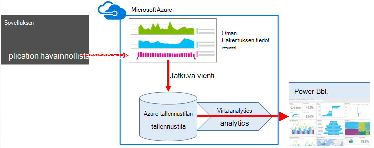


## <a name="create-storage-in-azure"></a>Tallennustilan luominen Azure

Jatkuva Vie tulostaa aina Azure-tallennustilan tilin tietoja, joten sinun täytyy luoda muistitilaa ensin.

1.  "Perinteinen-tallennustilan tilin luominen [Azure portal](https://portal.azure.com)-tilaukseesi.

    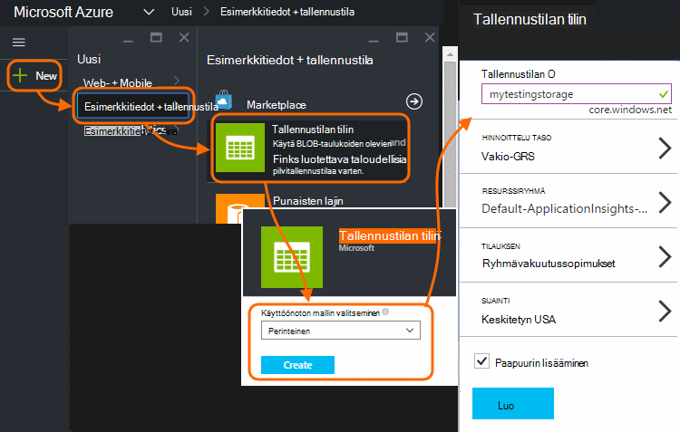

2. Luoda säilön

    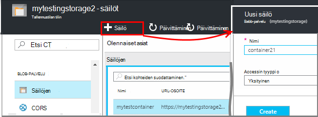

3. Kopioi tallennustilan pikanäppäin

    Tarvitset sitä pian voit määrittää syötteen stream analytics-palveluun.

    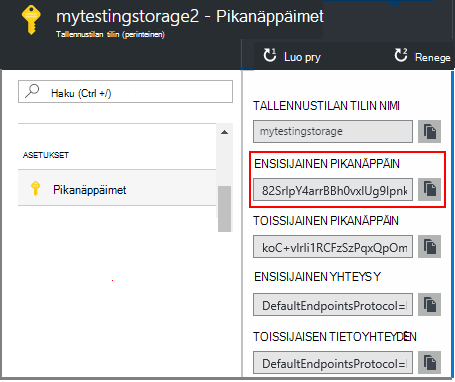

## <a name="start-continuous-export-to-azure-storage"></a>Käynnistä jatkuva Vie Azure-tallennustilan

Hakemuksen tiedot Azure varastoon [Jatkuva Vie](app-insights-export-telemetry.md) siirtää tietoja.

1. Siirry Azure-portaalissa loit sovelluksen hakemuksen tiedot resurssin.

    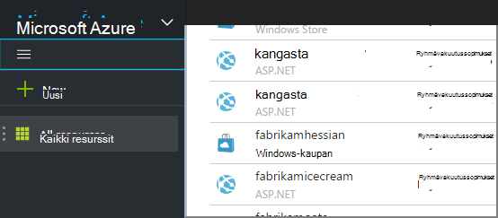

2. Luo jatkuva Vie.

    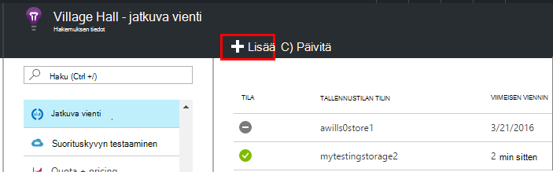


    Valitse aiemmin luomasi tallennustilan-tili:

    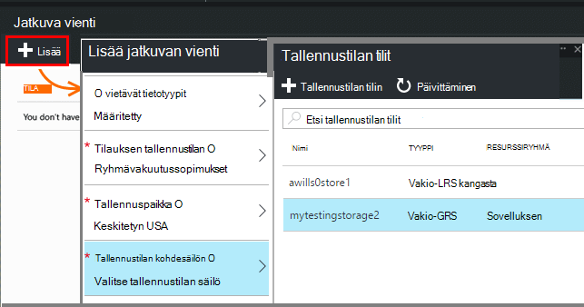
    
    Määritä haluamasi tapahtumatyypit:

    

3. Anna joidenkin tietojen keräämistä. Istut takaisin ja salliminen käyttää sovelluksen jonkin aikaa. Telemetriatietojen toimitetaan ja näet tilastokaavion [metrisillä](app-insights-metrics-explorer.md) Resurssienhallinnassa ja yksittäiset tapahtumat [Diagnostiikan haku](app-insights-diagnostic-search.md). 

    Ja -tallennustilan Vie tiedot. 

4. Tarkasta viedyille tiedoille. Valitse Visual Studion **tarkastella / Cloud Explorer**, ja avaa Azure / tallennustilan. (Jos tämä vaihtoehto ei ole, sinun täytyy asentaa Azure SDK: Avaa uusi projekti-valintaikkuna ja Avaa Visual C# / Cloud / hakeminen Microsoft Azure SDK .NET.)

    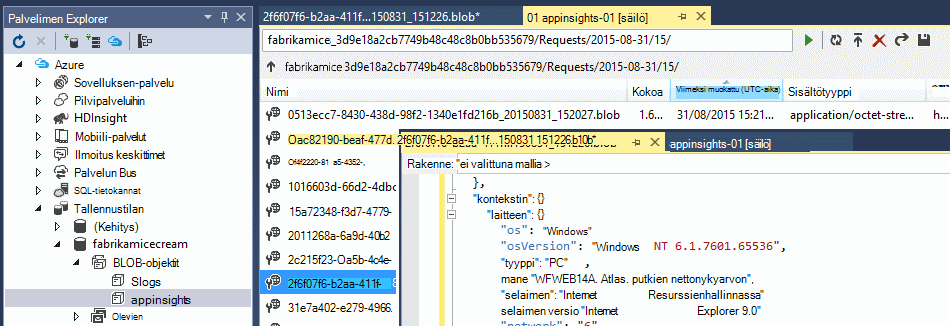

    Merkitse muistiin polun nimi, joka johdetaan nimi- ja sovellusnäppäintä Yleiset-osan. 

Tapahtumat kirjoitetaan blob-tiedostoja JSON-muodossa. Kunkin tiedostossa voi olla yksi tai useampi tapahtumat. Niin haluamme lukea tapahtumatietoja ja suodattaa pois haluamme kentät. On kaikenlaisten emme voi käyttää tietoja, mutta Microsoftin suunnitelman tänään on käytettävä Stream Analytics voit tulostaa tiedot Power BI.

## <a name="create-an-azure-stream-analytics-instance"></a>Azure Stream Analytics luominen

[Perinteinen Azure-portaalin](https://manage.windowsazure.com/)ja Azure Stream Analytics-palvelu ja luo uusi Stream Analytics työ:


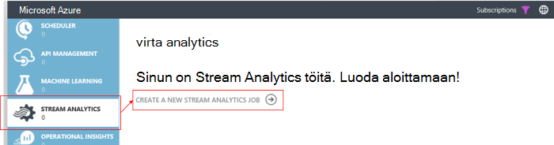


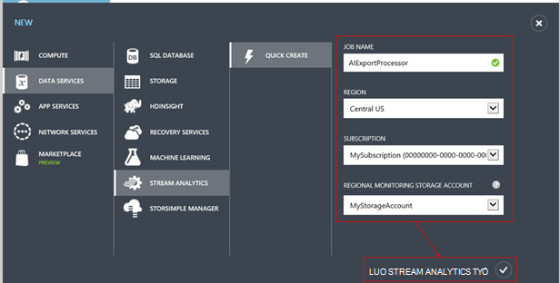

Kun uusi projekti on luotu, Laajenna sen tiedot:

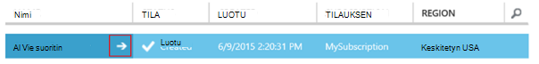


### <a name="set-blob-location"></a>Määritä Blob-objektien sijainti

Määritä toteuttamaan syötteen jatkuva Vie-blob:

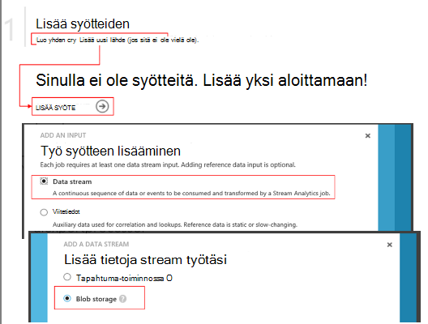

Nyt tarvitset tallennustilan-tililtä, jonka kirjoittamasi Access perusavain. Määritä tallennustilan tilin avaimeksi.

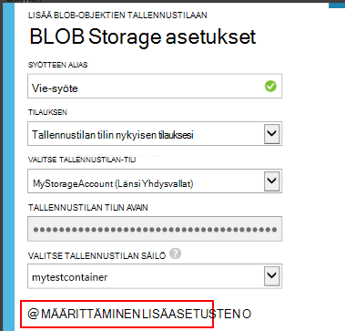

### <a name="set-path-prefix-pattern"></a>Määritä polku etuliitemalli 

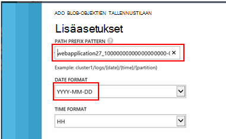


**Muista päivämäärämuodon asettaminen YYYY-MM-DD (ja katkoviivat).**

Polku etuliite malli määrittää, missä muodossa Analytics löytää syötteen tiedostoja muistiin. Sinun täytyy määrittää sen vastaamaan miten jatkuva Vie tallentaa tiedot. Määritä tältä:

    webapplication27_12345678123412341234123456789abcdef0/PageViews/{date}/{time}

Tässä esimerkissä:

* `webapplication27`on hakemuksen tiedot resurssin **kaikki pieniksi kirjaimiksi**.
* `1234...`on hakemuksen tiedot resurssin **pois katkoviivat**instrumentation-näppäintä. 
* `PageViews`on tietotyypin haluat analysoida. Saatavilla olevat tyypit määräytyvät sen mukaan, mitä voit määrittää jatkuva Vie suodatin. Voit tarkastella muita käytettävissä olevia tyyppejä viedyille tiedoille tarkastelee ja tuo näkyviin [tietomallin Vie](app-insights-export-data-model.md).
* `/{date}/{time}`kirjoitetaan kuvion literaaleina.

> [AZURE.NOTE] Tarkasta tallennustilan varmistaaksesi, että saat polku oikealle.

### <a name="finish-initial-setup"></a>Ensimmäinen asennus valmis

Vahvista Sarjatoiminto muoto:

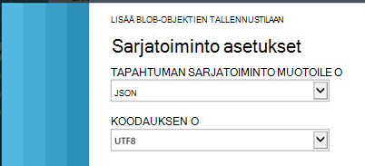

Sulje ohjattu toiminto ja odota, Viimeistele määritys.

> [AZURE.TIP] Esimerkki-komennon avulla voit ladata tietoja. Säilyttää sen näyte korjaamisessa kyselyn.

## <a name="set-the-output"></a>Määritä tulos

Nyt työtäsi ja määritä tulos.

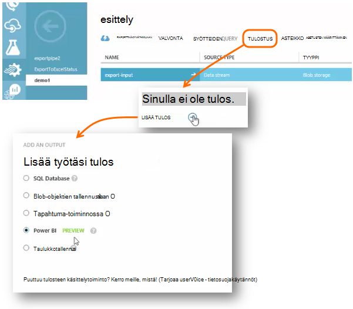

Anna **työpaikan tai oppilaitoksen tilin** sallivat Stream Analytics käyttämään Power BI-resurssia. Valitse varasto tulostukseen ja kohde Power BI-tietojoukko ja taulukon nimi.

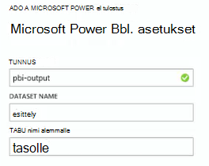

## <a name="set-the-query"></a>Kyselyn määrittäminen

Kyselyn ohjaa syötetyistä siirrettävät käännös.

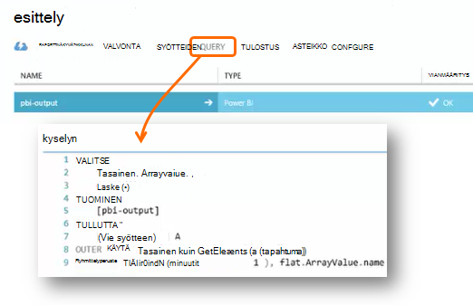


Testi-funktion avulla voit tarkistaa, että saat oikealle output. Anna esimerkkitiedot, ottamiasi syötteiden-sivulta. 

### <a name="query-to-display-counts-of-events"></a>Kyselyn, joka näyttää tapahtumien määrä

Liitä tämä kysely:

```SQL

    SELECT
      flat.ArrayValue.name,
      count(*)
    INTO
      [pbi-output]
    FROM
      [export-input] A
    OUTER APPLY GetElements(A.[event]) as flat
    GROUP BY TumblingWindow(minute, 1), flat.ArrayValue.name
```

* Vie-syöte on on antanut syötteen stream alias
* pbi – tulos on määritimme tulostus-alias
* Käytämme [ULOMPI käyttää GetElements](https://msdn.microsoft.com/library/azure/dn706229.aspx) sillä sisäkkäisiä JSON-arrray tapahtuman nimi. Valitse Valitse valitsee tapahtuman nimi-ja aika-asteikon samanniminen esiintymien määrä. [Group By](https://msdn.microsoft.com/library/azure/dn835023.aspx) -lauseeseen ryhmien elementit ajanjaksoon 1 minuutin.


### <a name="query-to-display-metric-values"></a>Kyselyn metrisillä arvojen näyttämiseen


```SQL

    SELECT
      A.context.data.eventtime,
      avg(CASE WHEN flat.arrayvalue.myMetric.value IS NULL THEN 0 ELSE  flat.arrayvalue.myMetric.value END) as myValue
    INTO
      [pbi-output]
    FROM
      [export-input] A
    OUTER APPLY GetElements(A.context.custom.metrics) as flat
    GROUP BY TumblingWindow(minute, 1), A.context.data.eventtime

``` 

* Tämä kysely liittyvä kyselyjä arvot telemetriatietojen tapahtuma-aika ja kustannusarvo. Metrijärjestelmän arvot eivät sisällä matriisin, joten Käytämme ULOMPI käyttää GetElements kuvion Pura rivit. "myMetric" on tässä tapauksessa nimi arvo. 

### <a name="query-to-include-values-of-dimension-properties"></a>Kyselyn dimension ominaisuuksien arvot

```SQL

    WITH flat AS (
    SELECT
      MySource.context.data.eventTime as eventTime,
      InstanceId = MyDimension.ArrayValue.InstanceId.value,
      BusinessUnitId = MyDimension.ArrayValue.BusinessUnitId.value
    FROM MySource
    OUTER APPLY GetArrayElements(MySource.context.custom.dimensions) MyDimension
    )
    SELECT
     eventTime,
     InstanceId,
     BusinessUnitId
    INTO AIOutput
    FROM flat

```

* Tämä kysely on kiinteä indeksissä dimensio-matriisissa on tietyn dimension mukaan ilman ominaisuuksien dimension arvot.

## <a name="run-the-job"></a>Suorita työ

Voit valita päivämäärän menneisyydessä työn käynnistämiseen. 

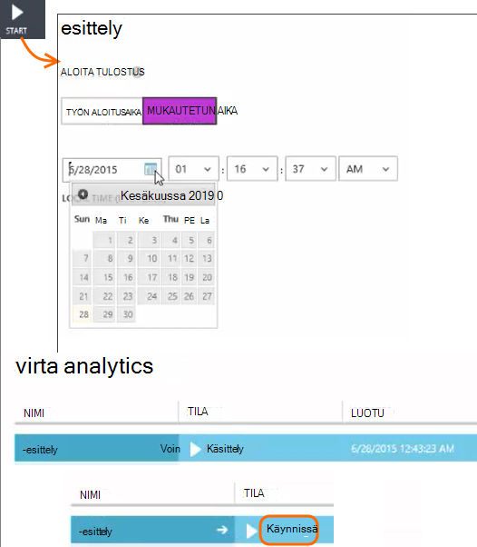

Odota, kunnes työ on käynnissä.

## <a name="see-results-in-power-bi"></a>Hakutuloksia Power BI

> [AZURE.WARNING] On paljon helpompaa ja parantaminen [Suositeltavia tapoja Power BI-sovelluksen tiedot-tietojen näyttämiseen](app-insights-export-power-bi.md). Oheisen polku on vain esimerkki esitä käsitteleminen viedyille tiedoille.

Avaa Power BI työpaikan tai oppilaitoksen tilillä ja valitse tietojoukko ja taulukon, jonka Stream Analytics-työ tulosteen määritelty.

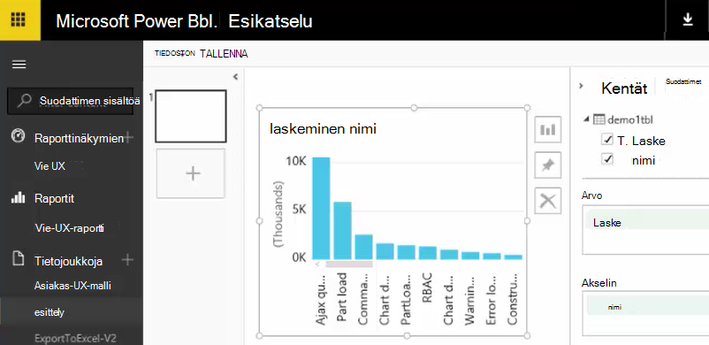

Voit nyt käyttää tätä tietojoukko raporttien ja raporttinäkymien [Power](https://powerbi.microsoft.com)BI.


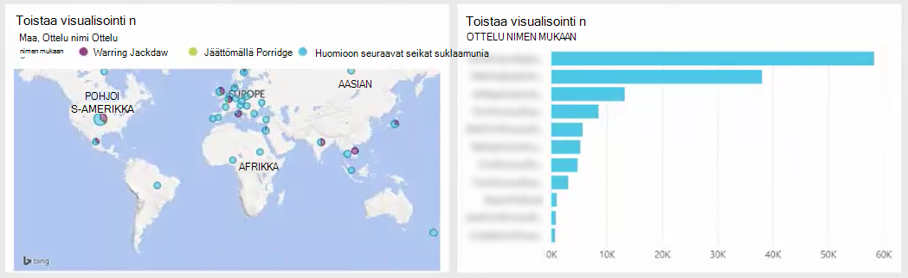


## <a name="no-data"></a>Tietoja?

* Tarkista, että voit [määrittää päivämäärämuodon](#set-path-prefix-pattern) oikein YYYY-MM-DD (ja katkoviivat).


## <a name="video"></a>Video

Noam Ben Zeev esitetään, kuinka voit käsitellä käyttämällä Stream Analytics viedyille tiedoille.

> [AZURE.VIDEO export-to-power-bi-from-application-insights]

## <a name="next-steps"></a>Seuraavat vaiheet

* [Jatkuva vienti](app-insights-export-telemetry.md)
* [Yksityiskohtaisia tietoja mallin viittaus ominaisuuden tiedostotyypit ja -arvoja.](app-insights-export-data-model.md)
* [Hakemuksen tiedot](app-insights-overview.md)
* [Lisää näytteiden ja vaihe vaiheelta](app-insights-code-samples.md)
 
