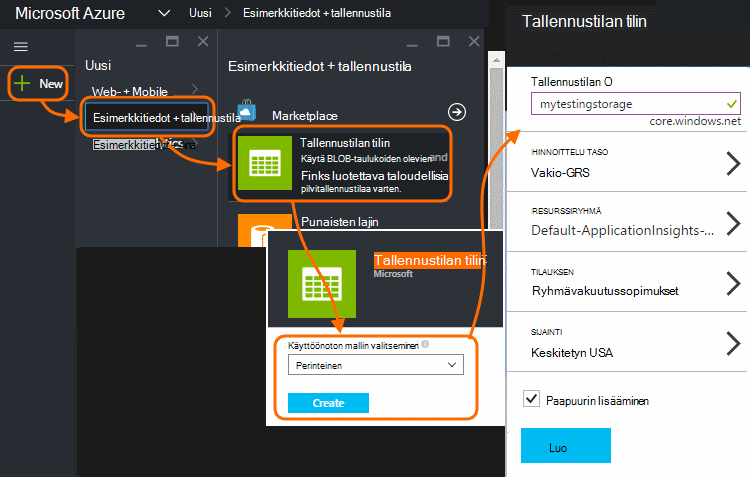
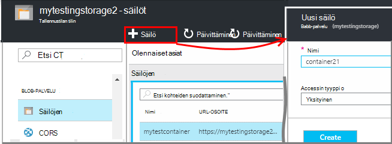
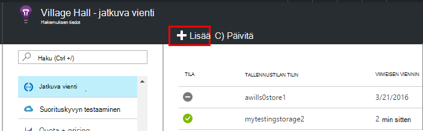
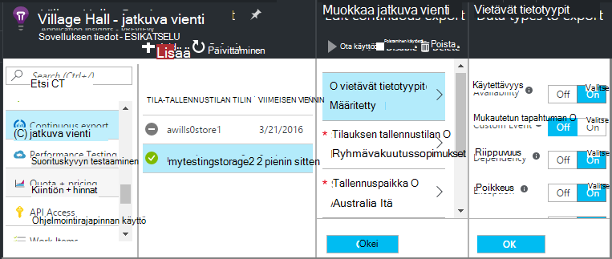
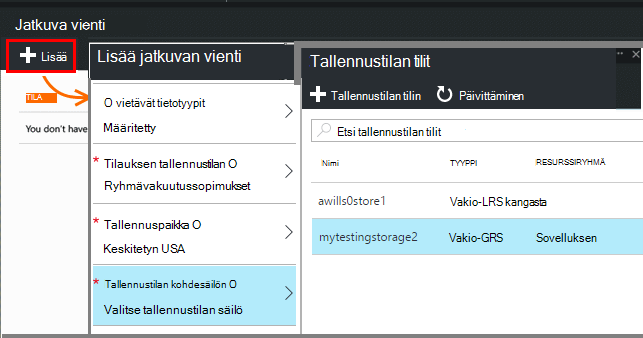
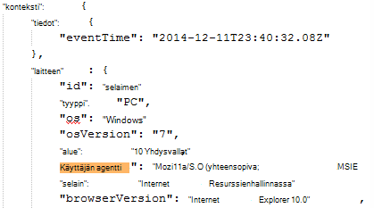
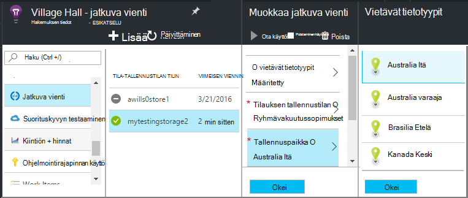

<properties 
    pageTitle="Jatkuva vienti telemetriatietojen-sovelluksen tiedot | Microsoft Azure" 
    description="Microsoft Azure-tallennustilan diagnostiikka- ja käyttö tietojen vieminen ja lataa se esitykseen sieltä." 
    services="application-insights" 
    documentationCenter=""
    authors="alancameronwills" 
    manager="douge"/>

<tags 
    ms.service="application-insights" 
    ms.workload="tbd" 
    ms.tgt_pltfrm="ibiza" 
    ms.devlang="na" 
    ms.topic="article" 
    ms.date="10/18/2016" 
    ms.author="awills"/>
 
# Telemetriatietojen vieminen hakemuksen tiedot

Jos haluat pitää yhteyttä telemetriatietojen kauemmin kuin Vakio säilytysaika Tai käsitellä erityinen tavalla? Jatkuva Vie sopii tämä. Näet sovelluksen tiedot-portaalissa tapahtumat voi viedä Microsoft Azure tallennustilan JSON-muodossa. Sieltä voit ladata tiedot ja kirjoittaa riippumatta siitä, mitä olet koodi on käyttänyt sitä.  

Jatkuva vienti on käytettävissä maksuttoman kokeilujakson ja [Standard- ja hinnoittelua suunnitelmien Premium](https://azure.microsoft.com/pricing/details/application-insights/).

Ennen kuin määrität jatkuva vienti on joitain vaihtoehtoja, haluat ehkä ottaa huomioon:

* [Vie-painiketta](app-insights-metrics-explorer.md#export-to-excel) arvot tai Etsi sivu yläreunassa avulla voit siirtää taulukoita ja kaaviot Excel-laskentataulukoksi. 
* [Analyysin](app-insights-analytics.md) on tehokas kyselykielen telemetriatietojen ja voit myös viedä tulokset.
* Jos haluat [tietojen tarkastelu Power BI](http://blogs.msdn.com/b/powerbi/archive/2015/11/04/explore-your-application-insights-data-with-power-bi.aspx)-, jotka voit tehdä käyttämättä jatkuva Vie.

## Tallennustilan tilin luominen

Jos sinulla ei vielä ole "perinteinen-tallennustilan tilin, luo sellainen nyt.

1. Tallennustilan tilin luominen [Azure portal](https://portal.azure.com)-tilaukseesi.

    

2. Voit luoda säilön.

    

## Jatkuva Vie määrittäminen

Avaa sovelluksen sivu yleiskatsaus sovelluksen tiedot-portaalissa, jatkuva Vie: 

Lisää jatkuvan vienti ja tapahtuman muutostyypit, jotka haluat viedä:

Valitse tai luo [Azure-tallennustilan tilin](../storage/storage-introduction.md) , johon haluat tallentaa tiedot:

Kun olet luonut vienti, se käynnistyy siirtymällä. (Vain saat tietoja, jotka saapuu, kun olet luonut viennin.) 

Voi olla noin tunnin ennen tiedot näkyvät blob viiveen.

Jos haluat muuttaa tapahtuman tyyppiä myöhemmin, Muokkaa viennin:

Kun haluat lopettaa virta, valitse Poista käytöstä. Kun valitset Ota käyttöön uudelleen, virta käynnistetään uudelleen uusilla tiedoilla. Et saa tiedot, jotka Saapuneet-portaalissa, kun vienti on poistettu käytöstä.

Kun haluat lopettaa virta pysyvästi, poistaa Vie. Tällöin tietojen ei poista säilöstä.

#### Ei voi lisätä tai muuttaa vienti?

* Voit lisätä tai muuttaa viennin, sinun on omistaja, osallistuja tai hakemuksen tiedot osallistuja-oikeudet. [Tietoja rooleista][roles].

## Mitä tapahtumien näyttöön?

Viedyille tiedoille on raaka telemetriatietojen saamme sovelluksestasi, paitsi että lisäämme sijainnin tiedot, jotka on Laske-asiakkaan IP-osoite. 

Tiedot, jotka on hylätty [Esimerkkejä](app-insights-sampling.md) ei sisälly viedyille tiedoille.

Muut lasketut arvot eivät sisälly. Esimerkiksi Microsoft ei viedä keskimääräinen suorittimen käytön, mutta olemme viedä raaka telemetriatietojen, josta keskiarvo lasketaan.

Tiedot myös kaikki [käytettävyys web testien](app-insights-monitor-web-app-availability.md) olet määrittänyt tuloksia. 

> [AZURE.NOTE] **Esimerkkejä.** Jos sovelluksesi lähettää tietojen tarkastelun ja käytät sovelluksen tiedot-SDK ASP.NET-version 2.0.0-beta3 tai uudempi versio, mukautuvat esimerkkejä-ominaisuus saattaa toimia ja Lähetä vain oman telemetriatietojen prosentteina. [Lue lisää esimerkkejä.](app-insights-sampling.md)

## Tarkista tiedot

Voit tarkastaa tallennustilan suoraan portaalin. **Selaa**, valitse tallennustilan-tilisi ja avaa sitten **säilöt**.

On rajattu hiusristikon sisään Azure tallennustilan Visual Studiossa, Avaa **Näytä**, **Cloud Explorer**. (Jos sinulla ei ole kyseisen valikkokomento, sinun täytyy asentaa Azure SDK: Avaa **Uusi projekti** -valintaikkuna, laajenna Visual C# / Cloud ja valitse **Hae .NET Microsoft Azure SDK**.)

Kun avaat blob-säilö, näet säilön tiedostojoukon Blob-objektien kanssa. Kunkin tiedoston URI johdettu sovelluksen tiedot-resurssin nimen, instrumentation-näppäintä, telemetriatietojen-tyypin tai päivämäärä ja kellonaika. (Resurssinimi on pieniksi kirjaimiksi ja instrumentation avain jättää katkoviivat.)

Päivämäärä ja kellonaika on UTC-ajan ja ovat, kun telemetriatietojen on tallennettu store - ei on luotu aikaa. Niin Jos kirjoitat koodia lataa tiedot, se voi siirtää lineaarisesti läpi tiedot.

Näin polku muodossa:

    $"{applicationName}_{instrumentationKey}/{type}/{blobDeliveryTimeUtc:yyyy-MM-dd}/{ blobDeliveryTimeUtc:HH}/{blobId}_{blobCreationTimeUtc:yyyyMMdd_HHmmss}.blob"
  
Jos 

-   `blobCreationTimeUtc`on aika-sisäinen luotiin blob väliaikaisen tallennustilan
-   `blobDeliveryTimeUtc`Kun blob kopioidaan viennin kohde tallennustilan kertaa

## Tietojen muoto

* Kunkin blob on tekstitiedosto, joka sisältää useita ' \n'-separated rivit. Siinä on noin puolet minuutin ajan kuluessa käsitteleminen telemetriatietojen.
* Kullakin rivillä on telemetriatietojen arvopiste, kuten pyynnön tai sivun näkymän.
* Kullakin rivillä on Muotoilematon JSON-asiakirja. Jos istut ja stare muutoksia, Avaa Visual Studiossa ja valitse Muokkaa, Lisäasetukset-muotoisen tiedoston:

Aika-kestot ovat jakoviivat, jossa 10 000 jakoviivat = 1ms. Esimerkiksi nämä arvot näkyvät asioiden 1ms lähettää pyynnön selaimesta 3ms vastaanottamaan ne ja 1.8s käsittelemään sivua selaimessa:

    "sendRequest": {"value": 10000.0},
    "receiveRequest": {"value": 30000.0},
    "clientProcess": {"value": 17970000.0}

[Yksityiskohtaisia tietoja mallin viittaus ominaisuuden tiedostotyypit ja -arvoja.](app-insights-export-data-model.md)

## Tietojen käsitteleminen

Pieni asteikolla voit kirjoittaa lisäkoodin erotettu toisistaan tietojen, lue laskentataulukkoon ja niin edelleen. Esimerkki:

    private IEnumerable<T> DeserializeMany<T>(string folderName)
    {
      var files = Directory.EnumerateFiles(folderName, "*.blob", SearchOption.AllDirectories);
      foreach (var file in files)
      {
         using (var fileReader = File.OpenText(file))
         {
            string fileContent = fileReader.ReadToEnd();
            IEnumerable<string> entities = fileContent.Split('\n').Where(s => !string.IsNullOrWhiteSpace(s));
            foreach (var entity in entities)
            {
                yield return JsonConvert.DeserializeObject<T>(entity);
            }
         }
      }
    }

Katso suurempi koodin otoksen [Työntekijä roolin avulla][exportasa].

## Poistaa vanhoja tietoja
Huomaa, että olet vastuussa hallinta oman tallennustilaa ja poistamalla vanhat tiedot tarvittaessa. 

## Jos tallennustilan avain uudelleen...

Jos muutat avain tallennustilaa, jatkuva Vie lakkaa toimimasta. Näet ilmoituksen Azure-tili. 

Avaa jatkuva Vie-sivu ja Muokkaa vienti. Muokkaa vietävä kohde, mutta jättää vain saman tallennustilan valittuna. Vahvista valitsemalla OK.

Jatkuva Vie käynnistetään uudelleen.

## Vie objektit

* [Vie SQL Työntekijä roolin avulla][exportcode]
* [Vie SQL virta-analyysin avulla][exportasa]
* [Virta Analytics otoksen 2](app-insights-export-stream-analytics.md)

Valitse suurempi Skaalaa harkitse [HDInsight](https://azure.microsoft.com/services/hdinsight/) - Hadoop klustereiden pilveen. Hdinsightista on erilaisia Technologiesin hallintaa ja analysointia big datasta.

## Q & A

* *Mutta kaikki toiminnot on kerran ladattava kaavion.*  
 
    Kyllä, voi tehdä sitä. Valitse [Vie tiedot](app-insights-metrics-explorer.md#export-to-excel)sivu alkuun.

* *Vie määritetään, mutta ei ole tietoja my-säilössä.*

    Hakemuksen tiedot mennyt minkä tahansa telemetriatietojen sovelluksestasi jälkeen voit määrittää viennin? Saat vain uudet tiedot.

* *Yritit vienti määrittäminen mutta on estetty*

    Jos tilin omistaa organisaatiossa, sinun on kuuluttava omistajat ja osallistujien ryhmät.

* *Voit viedä suoraan omaa paikallisen säilön?* 

    Ei ikävä Kyllä. Tutustu Vie ohjelma tällä hetkellä toimii vain Azure tallennustilan tällä hetkellä.  

* *Onko kaikki my-säilössä valitseminen tietojen määrää rajoitettu?* 

    Ei. Olemme säilyttää valitseminen tiedot, kunnes poistat Vie. Olemme Pysäytä, jos on osumien Blob-objektien tallennustilaan ulompi rajoitukset, mutta tämä on melko erittäin suuri. Kannattaa, voit määrittää, kuinka paljon tallennustilaa, voit käyttää.  

* *Kuinka monta BLOB muistiin pitäisi näkyä?*

 * Jokaisen Vie valitun tietotyypin uusi Blob-objektien luodaan minuutin välein, (Jos tiedot ovat käytettävissä). 
 * Lisäksi sovellusten suuri tietoliikenne varataan lisää osion yksiköt. Tällöin kunkin yksikön Luo blob minuutin välein.

* *Voin uudelleen avain tallennustilan tai säilö nimensä ja vie ei toimi.*

    Muokkaa vienti ja avaa viennin kohde-sivu. Jätä valittuna kuin aiemmin saman tallennustilan ja Vahvista valitsemalla OK. Vie käynnistetään uudelleen. Jos muutos oli viimeisten muutaman päivän aikana, et menetä tietoja.

* *Vie keskeyttäminen*

    Kyllä. Valitse Poista käytöstä.

## MALLIKOODEJA

* [Jäsennä viedä JSON Työntekijä roolin avulla][exportcode]
* [Virta Analytics-Esimerkki](app-insights-export-stream-analytics.md)
* [Vie SQL virta-analyysin avulla][exportasa]

* [Yksityiskohtaisia tietoja mallin viittaus ominaisuuden tiedostotyypit ja -arvoja.](app-insights-export-data-model.md)

<!--Link references-->

[exportcode]: app-insights-code-sample-export-telemetry-sql-database.md
[exportasa]: app-insights-code-sample-export-sql-stream-analytics.md
[roles]: app-insights-resources-roles-access-control.md

 
