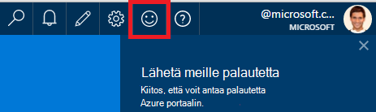
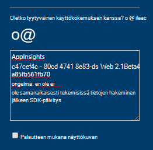
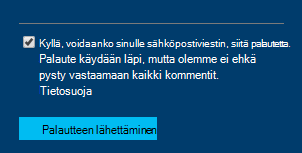

<properties 
    pageTitle="Tekninen tuki hakemisesta hakemuksen tiedot ryhmälle | Microsoft Azure" 
    description="Tapauksen, edellyttää erityistä tukea sovelluksen havainnollistamisen kehittäminen kuulumisia ollessasi tällä siitä, miten voit lähettää tiedot tuesta." 
    services="application-insights" 
    documentationCenter=""
    authors="alexbulankou" 
    manager="douge"/>
 
<tags 
    ms.service="application-insights" 
    ms.workload="tbd" 
    ms.tgt_pltfrm="ibiza" 
    ms.devlang="na" 
    ms.topic="article" 
    ms.date="06/01/2016" 
    ms.author="albulank"/>
    
# <a name="how-to-get-technical-support-from-application-insights-development-team"></a>Tekninen tuki hakemisesta hakemuksen tiedot ryhmälle
    
Tekniset ongelma [Visual Studio hakemuksen tiedot](app-insights-overview.md)ollessasi seuraavien asetusten saaminen:

## <a name="1-check-the-documents"></a>1. Valitse asiakirjat

* Puuttuvat tiedot? Tarkistus: [Esimerkkejä](app-insights-sampling.md) [kiintiöiden ja rajoitusta](app-insights-pricing.md).
* Vianmääritys: [ASP.NET](app-insights-troubleshoot-faq.md) | [Java](app-insights-java-troubleshoot.md)

## <a name="2-search-the-forums"></a>2. Hae keskustelupalstoilta

* [MSDN-keskustelupalsta](https://social.msdn.microsoft.com/Forums/vstudio/home?forum=ApplicationInsights)
* [StackOverflow](http://stackoverflow.com/questions/tagged/ms-application-insights)

## <a name="3-azure-support-plan"></a>3. azure tuki suunnitelman?

Tilanteita, jos haluat tutkia tietyn tapaus kehittäjät. 

Jos sinulla on [tukevat suunnitelma Microsoft Azure ja](https://azure.microsoft.com/support/plans/) voit [avata tuki lippu](https://portal.azure.com/?#blade/Microsoft_Azure_Support/HelpAndSupportBlade).

## <a name="4-contact-the-application-insights-team"></a>4. Ota sovelluksen tiedot-ryhmä

Jos sinulla ei ole tuki suunnitelma, kehittäminen tiimimme on hyvää tarjota parhaat tukea sovelluksen tiedot-asiakkaille kuin olemme valmisteleminen välitavoitetta yleiseen käyttöön. Olemme ovat esittely **Uusi tuki-vaihtoehto**: Voit kuvaavat US tapaus lähettämällä palautelomake Azure-portaalissa ja kehittäjä on sovelluksen tiedot-ryhmän yhteystiedon takaisin ohjeet ongelman ratkaisemiseen.


1. Valitse oikeassa yläkulmassa olevaa hymiön [sovelluksen tiedot-portaalissa](https://portal.azure.com):  

       

2. Kommentti-ruutuun Varmista, että haluat määrittää **AppInsights** ensimmäistä riviä ja lisää sitten seuraavat tiedot:   

    ```

    AppInsights   
    ikey: <instrumentation key>   
    sdk: <SDK that you are using, including name and version>  
    issue: <please describe the problem you are having>

    ```   

       

3. Valitse "Kyllä, se on sinulle sähköpostiviestin ok". 

      

Suunnittelijan sovelluksen tiedot-ryhmän jäsenet saavat sinuun pian. Kun Microsoft tarjoaa tämän palvelun parhaat työmäärään välein, ei ole muodollinen SLA voidaan kirjoittaa tässä vaiheessa.


