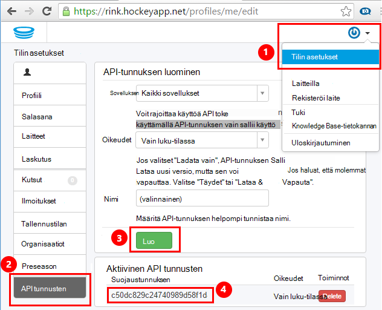
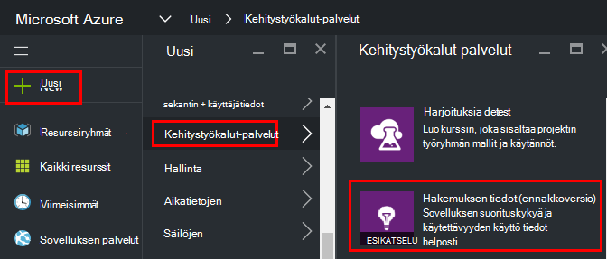
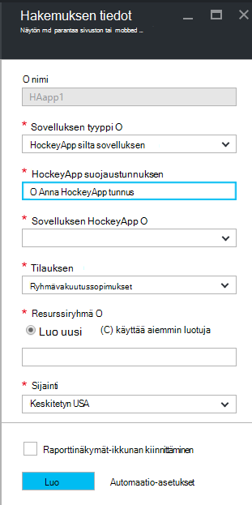
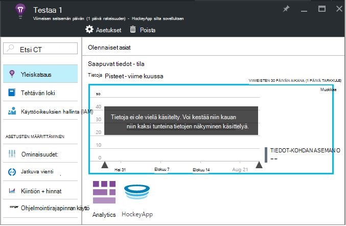
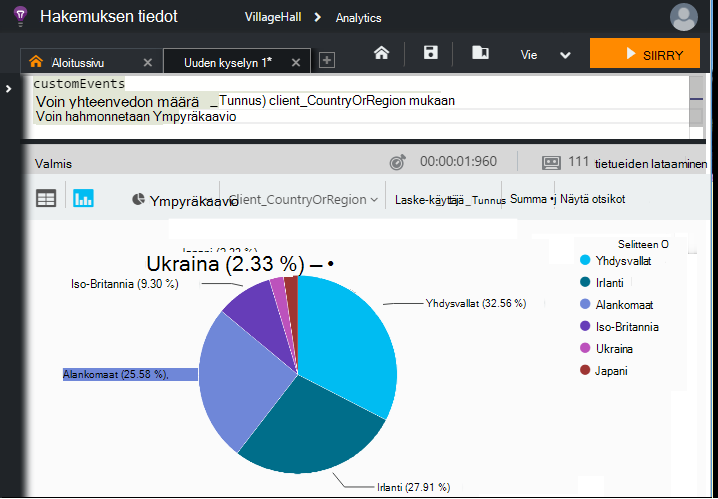

<properties 
    pageTitle="Hakemuksen tiedot HockeyApp tietoja | Microsoft Azure" 
    description="Analysoi käyttö ja Azure sovelluksen ja sovelluksen havainnollistamisen suorituskykyä." 
    services="application-insights" 
    documentationCenter="windows"
    authors="alancameronwills" 
    manager="douge"/>

<tags 
    ms.service="application-insights" 
    ms.workload="tbd" 
    ms.tgt_pltfrm="ibiza" 
    ms.devlang="na" 
    ms.topic="article" 
    ms.date="08/25/2016" 
    ms.author="awills"/>

#  Hakemuksen tiedot HockeyApp tietojen tutkiminen

[HockeyApp](https://azure.microsoft.com/services/hockeyapp/) on suositellut ympäristö live työpöytä- ja mobile-sovellusten seurantaa varten. HockeyApp voit lähettää mukautetun ja jäljittää telemetriatietojen käyttö ja auttaminen vianmäärityksen (lisäksi kaatumisen tietojen hakeminen). Vuosta telemetriatietojen voidaan suorittaa kysely [Visual Studio hakemuksen tiedot](app-insights-overview.md)tehokkaita [Analytics](app-insights-analytics.md) -ominaisuuden avulla. Lisäksi voit [viedä mukautettu ja jäljittää telemetriatietojen](app-insights-export-telemetry.md). Jotta näitä toimintoja, voit määrittää sillan, joka välittää HockeyApp tiedot sovelluksen havainnollistamisen.

## HockeyApp silta-sovellus

HockeyApp silta sovellus on core-ominaisuus, jonka avulla voit käyttää sovelluksen tiedot HockeyApp tietojen analysointitietoja ja jatkuva Vie toiminnot. HockeyApp HockeyApp silta sovelluksen luonnin jälkeen keräämät tiedot ovat käytettävissä olevat nämä ominaisuudet. Katsotaan, voit määrittää yhden silta nämä sovellukset.

Avaa HockeyApp, Tiliasetukset- [Ohjelmointirajapinnan tunnukset](https://rink.hockeyapp.net/manage/auth_tokens). Luo uusi tunnus tai Käytä aiemmin luotua. Pienin oikeudet tarvitaan ovat "vain luku-". Ota kopion Ohjelmointirajapinnan tunnuksen.

Avaa Microsoft Azure-portaalin ja [Luo sovelluksen tiedot-resurssi](app-insights-create-new-resource.md). Määritä "HockeyApp silta sovelluksen" sovelluksen tyyppi:

Sinun ei tarvitse määrittää nimen – tämä määritetään automaattisesti HockeyApp nimestä.

HockeyApp silta kentät näkyvät. 

Kirjoittamasi HockeyApp-tunnuksen antaminen Tämä toiminto täyttää "HockeyApp sovelluksen" avattavasta valikosta kaikkien HockeyApp-sovellusten kanssa. Valitse haluamasi vaihtoehto, jota haluat käyttää, ja loput kentät. 

Avaa uusi resurssi. 

Huomaa, että tiedot kestää jonkin aikaa, voit käynnistää etenee.

Joka on tämä! Kerättyjen HockeyApp instrumented sovelluksen tästä eteenpäin tiedot on nyt myös käytettävissä sovelluksen havainnollistamisen analyysin ja jatkuva Vie ominaisuuksia.

Seuraavaksi lyhyesti tarkastellaan näistä toiminnoista, jotka ovat nyt käytettävissä.

## Analytics

Analyysin on tehokas työkalu ad-hoc kyselyt tietojen, jonka avulla voi selvittää oman telemetriatietojen analysointiin ja tutustu nopeasti syiden ja kuviot.

* [Lisätietoja Analytics](app-insights-analytics-tour.md)
* [Johdanto video](https://channel9.msdn.com/events/Build/2016/T666)
* [Videon Lisäasetukset käsitteitä](https://channel9.msdn.com/Events/Build/2016/P591)

## Jatkuva vienti

Jatkuva Vie voit Vie tiedot Azure-Blob-säiliö säilö. Tämä on erittäin hyödyllinen, jos haluat säilyttää tietosi kauemmin kuin tällä hetkellä tarjoamat tiedot sovelluksen säilytysaika. Voit säilyttää tiedot Blob-objektien tallennustilaan, käsitellä SQL-tietokanta tai warehousing ratkaisu haluamasi tiedot.

[Lisätietoja jatkuva vieminen](app-insights-export-telemetry.md)

## Seuraavat vaiheet

* [Käyttää Analytics tiedoissa](app-insights-analytics-tour.md)

