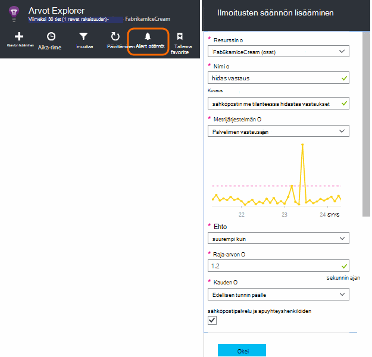
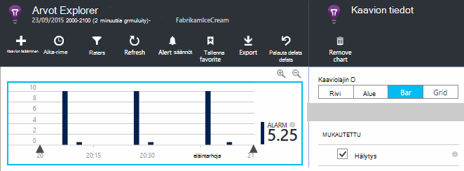
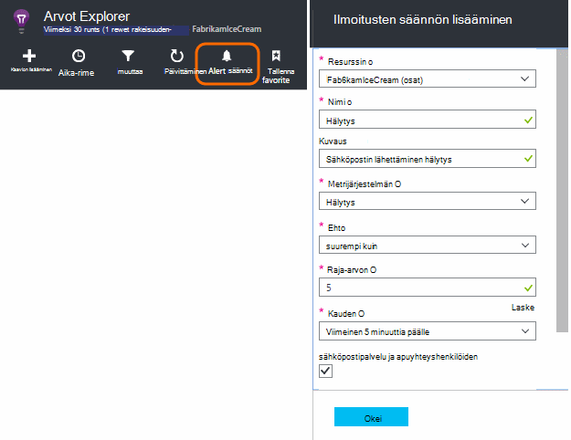
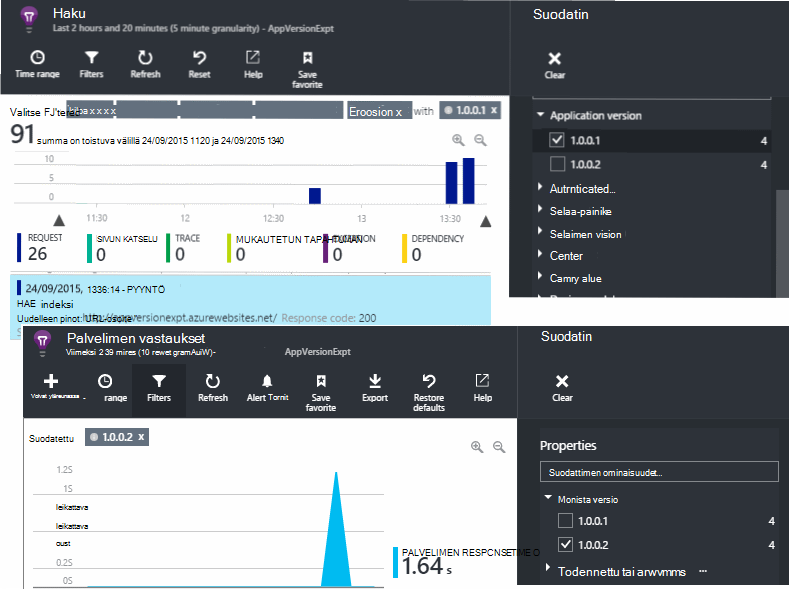
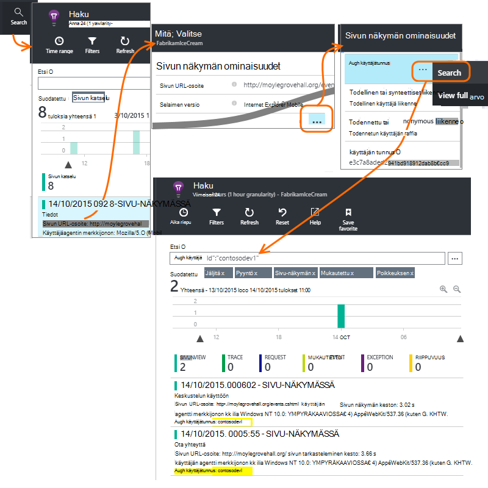
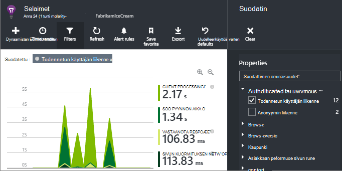
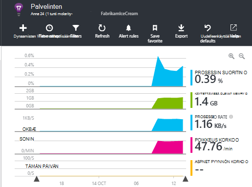

<properties 
    pageTitle="Miten voin...-sovelluksen tiedot | Microsoft Azure" 
    description="Usein kysytyt kysymykset-sovelluksen tiedot." 
    services="application-insights" 
    documentationCenter=""
    authors="alancameronwills" 
    manager="douge"/>

<tags 
    ms.service="application-insights" 
    ms.workload="tbd" 
    ms.tgt_pltfrm="ibiza" 
    ms.devlang="na" 
    ms.topic="article" 
    ms.date="02/05/2016" 
    ms.author="awills"/>

# <a name="how-do-i--in-application-insights"></a>Miten voin...-sovelluksen tiedot?

## <a name="get-an-email-when-"></a>Lähetettävän sähköpostitse kun...

### <a name="email-if-my-site-goes-down"></a>Sähköpostin, jos oman sivuston siirtyy

Määritä [käytettävyys web testata](app-insights-monitor-web-app-availability.md).

### <a name="email-if-my-site-is-overloaded"></a>Jos Oma sivusto ylikuormitetaan lähettäminen sähköpostitse

Määritä **palvelimen vastausajan** [ilmoitus](app-insights-alerts.md) . Raja-arvo väliltä 1 ja 2 sekuntia pitäisi toimia.



Sovelluksen saattaa näyttää rasitusta merkkejä palauttamalla virheen koodit. Määrittää ilmoituksen **epäonnistui pyynnöt**.

Jos haluat määrittää **palvelimen poikkeukset**ilmoituksen, voit joutua tekemään [joitakin lisäasetuksia](app-insights-asp-net-exceptions.md) , jotta voit nähdä tiedot.

### <a name="email-on-exceptions"></a>Sähköpostin määrittämisestä poikkeukset

1. [Poikkeuksien seurantaa määrittäminen](app-insights-asp-net-exceptions.md)
2. Poikkeus Laske metrijärjestelmä [ilmoituksen määrittäminen](app-insights-alerts.md)


### <a name="email-on-an-event-in-my-app"></a>Sähköpostin määrittämisestä tapahtuman sovelluksen

Oletetaan, että haluat lähetettävän sähköpostitse tietyn tapahtuman yhteydessä. Sovelluksen tietoja ei voi tämän tilan suoraan, mutta sen voi [lähettää ilmoituksen, kun mittarin ylittää raja-arvon](app-insights-alerts.md). 

Ilmoituksia voi määrittää [mukautettua arvot](app-insights-api-custom-events-metrics.md#track-metric), vaikka ei mukautetut tapahtumat. Kirjoita lisäkoodin niin, että mittarin tapahtuman yhteydessä:

    telemetry.TrackMetric("Alarm", 10);

tai:

    var measurements = new Dictionary<string,double>();
    measurements ["Alarm"] = 10;
    telemetry.TrackEvent("status", null, measurements);

Ilmoitukset on kahden, koska on pieni Lähetä, kun pidät päättyneen ilmoitusta.

    telemetry.TrackMetric("Alarm", 0.5);

Kaavion luominen [metrisillä explorer](app-insights-metrics-explorer.md) näkevän tekemäsi hälytys:



Nyt ilmoituksen, kun lisätiedot menee mid arvon yläpuolella lyhyen Kyselysäännön määrittäminen:




Määritä pienin keskiarvon laskenta-aikaan. 

Saat sähköpostit, kun lisätiedot menee yläpuolella sekä raja-arvon alapuolelle.

Joitakin huomioitavia seikkoja:

* Ilmoituksen on tiloja ("ilmoitus" ja "kunnossa"). Valtion arvioidaan vain, kun mittarin vastaanotetaan.
* Voit lähettää sähköpostiviestin, vain, kun tila muuttuu. Tämä on miksi on lähetettävä molemmat hyvin ja vähäisen arvot. 
* Arviointikohde ilmoituksen keskiarvon oteta huomioon vastaanotettu arvot edellisen kuluessa. Näin tapahtuu aina, kun mittarin vastaanotetaan, jotta sähköpostia voidaan lähettää useammin, voit määrittää ajan.
* Koska sähköpostit lähetetään sekä "ilmoitus" ja "kunnossa", haluat ehkä ottaa huomioon suunnittelemassa uudelleen one-shot tapahtuman kahden tilan käyttäminen ehtona. Esimerkiksi "työ valmis" tapahtuman sijaan on "työn edistymistä"-ehtoa, mistä sähköpostit alussa ja lopussa työn.

### <a name="set-up-alerts-automatically"></a>Määritä ilmoitukset automaattisesti

[Luo uusi ilmoituksia PowerShellin avulla](app-insights-alerts.md#set-alerts-by-using-powershell)

## <a name="use-powershell-to-manage-application-insights"></a>Hakemuksen tiedot hallinta PowerShellin avulla

* [Luo uudet resurssit](app-insights-powershell-script-create-resource.md)
* [Luo uusi ilmoituksia](app-insights-alerts.md#set-alerts-by-using-powershell)

## <a name="application-versions-and-stamps"></a>Sovelluksen versioita ja niihin

### <a name="separate-the-results-from-dev-test-and-prod"></a>Keskihajonta, Testaa ja tuot tulokset erottaa

* Määritä eri environmnents eri ikeys
* Eri molempia varten (keskihajonta, Testaa, tuot) kanssa eri ominaisuusarvoihin telemetriatietojen merkitseminen

[Opi lisää](app-insights-separate-resources.md)
 

### <a name="filter-on-build-number"></a>Suodattaa koontiversio

Kun julkaiset sovelluksen uuden version, kannattaa voi telemetriatietojen erottaa eri versiot.

Voit määrittää sovelluksen versionumeron niin, että voit suodattaa [haun](app-insights-diagnostic-search.md) ja [metrisillä explorer](app-insights-metrics-explorer.md) tulokset. 




Usealla eri sovelluksen versionumeron määrittäminen.

* Määritä suoraan:

    `telemetryClient.Context.Component.Version = typeof(MyProject.MyClass).Assembly.GetName().Version;`

* Rivittää kyseisen rivin [telemetriatietojen alustaja](app-insights-api-custom-events-metrics.md#telemetry-initializers) varmistaa, että kaikki TelemetryClient esiintymät määritetään johdonmukaisesti.

* [ASP.NET] Määritä versio `BuildInfo.config`. Internet-moduulin noutaa BuildLabel solmun versio. Liittää tämän tiedoston projektin ja muista aina kopio-ominaisuuden määrittäminen ratkaisunhallinnassa.

    ```XML

    <?xml version="1.0" encoding="utf-8"?>
    <DeploymentEvent xmlns:xsi="http://www.w3.org/2001/XMLSchema-instance" xmlns:xsd="http://www.w3.org/2001/XMLSchema" xmlns="http://schemas.microsoft.com/VisualStudio/DeploymentEvent/2013/06">
      <ProjectName>AppVersionExpt</ProjectName>
      <Build type="MSBuild">
        <MSBuild>
          <BuildLabel kind="label">1.0.0.2</BuildLabel>
        </MSBuild>
      </Build>
    </DeploymentEvent>

    ```
* [ASP.NET] Luo BuildInfo.config automaattisesti MSBuild. Voit tehdä tämän Lisää muutamalla .csproj-tiedostoon:

    ```XML

    <PropertyGroup>
      <GenerateBuildInfoConfigFile>true</GenerateBuildInfoConfigFile>    <IncludeServerNameInBuildInfo>true</IncludeServerNameInBuildInfo>
    </PropertyGroup> 
    ```

    Luo tiedosto nimeltä *yourProjectName*. BuildInfo.config. Julkaisuprosessin nimeää sen BuildInfo.config.

    Muodosta otsikko sisältää paikkamerkin (AutoGen_...), kun luot Visual Studiossa. Mutta kun luotu MSBuild, se lisätään oikein versionumero.

    Anna MSBuild versioita luodaan, Määritä versio, kuten `1.0.*` AssemblyReference.cs:

## <a name="monitor-backend-servers-and-desktop-apps"></a>Seurata Taustajärjestelmä palvelimia ja työpöytäsovellukset

[Käytä Windows Server SDK-moduuli](app-insights-windows-desktop.md).


## <a name="visualize-data"></a>Tietojen visualisointi

#### <a name="dashboard-with-metrics-from-multiple-apps"></a>Raporttinäkymä, jossa on arvot useiden sovelluksista

* [Metrijärjestelmän Explorer](app-insights-metrics-explorer.md)kaavion mukauttaminen ja tallentaminen suosikki. Kiinnitä Azure koontinäyttö.


#### <a name="dashboard-with-data-from-other-sources-and-application-insights"></a>Raporttinäkymä, jossa on tietoja muista lähteistä ja hakemuksen tiedot

* [Vie telemetriatietojen Power BI](app-insights-export-power-bi.md). 

Tai

* Määritä SharePoint-raporttinäkymän tietojen näyttäminen SharePointin verkko-osat. [Jatkuva vienti ja Stream Analytics SQL vieminen](app-insights-code-sample-export-sql-stream-analytics.md).  PowerView avulla voit tutkia tietokantaa ja luo SharePoint-web-osan PowerView.


<a name="search-specific-users"></a>
### <a name="filter-out-anonymous-or-authenticated-users"></a>Anonyymi tai todennetun käyttäjän suodattaminen

Jos käyttäjät kirjautumaan sisään, voit määrittää [todennettu käyttäjätunnus](app-insights-api-custom-events-metrics.md#authenticated-users). (Se ei tapahdu automaattisesti.) 

Sitten voit:

* Etsiä tietyn käyttäjätunnukset



* Suodata arvot anonyymi tai todennettu käyttäjille



## <a name="modify-property-names-or-values"></a>Muokkaa ominaisuuksien nimiä tai arvot

[Suodattimen](app-insights-api-filtering-sampling.md#filtering)luominen. Näillä oikeuksilla voit muokata tai suodattaa telemetriatietojen ennen sen lähettämistä sovelluksestasi sovelluksen havainnollistamisen.

## <a name="list-specific-users-and-their-usage"></a>Luettelon tietyille käyttäjille ja niiden käyttö

Jos haluat vain [tiettyjen käyttäjien etsiminen](#search-specific-users), voit määrittää [todennettu käyttäjätunnus](app-insights-api-custom-events-metrics.md#authenticated-users).

Jos haluat, että käyttäjäluettelo tiedoilla, kuten mitkä sivut he tarkastelevat tai kuinka usein he kirjautuvat, sinulla on kaksi vaihtoehtoa:

* [Määritä todennetun käyttäjän](app-insights-api-custom-events-metrics.md#authenticated-users), [vieminen tietokantaan](app-insights-code-sample-export-sql-stream-analytics.md) ja käytä sopivan työkaluja on käyttäjätietojen analysointiin.
* Jos sinulla on vain pienen käyttäjämäärän, Lähetä mukautetut tapahtumat tai arvot avulla halutut tiedot metrisillä arvo tai tapahtuman nimen ja miten käyttäjätunnus ominaisuutena. Voit analysoida sivun näkymät, korvaa vakio JavaScript trackPageView puhelun. Jos haluat analysoida palvelinpuolen telemetriatietojen, käyttäjätunnus lisääminen kaikki palvelimen telemetriatietojen telemetriatietojen alustaja avulla. Voit sitten Suodata ja segmentin arvot ja haut käyttäjätunnus.


## <a name="reduce-traffic-from-my-app-to-application-insights"></a>Liikenne aiheuttamaa sovelluksen sovelluksen havainnollistamisen

* Poista käytöstä [ApplicationInsights.config](app-insights-configuration-with-applicationinsights-config.md)moduulit ei enää tarvita, esimerkiksi suorituskyvyn laskuri kerääminen.
* Käytä SDK [näytteiden ja suodatus](app-insights-api-filtering-sampling.md) .
* Web-sivujen rajoittaa jokaisen sivunäkymän raportoidusta Ajax kutsuja. Valitse komentosarja-koodikatkelman jälkeen `instrumentationKey:...` , Lisää: `,maxAjaxCallsPerView:3` (tai sopivaa luku).
* Jos käytät [TrackMetric](app-insights-api-custom-events-metrics.md#track-metric), Laske metrisillä arvot erissä kooste ennen lähettämistä tulos. Ei, TrackMetric(), joka sisältää, joka liikaa.


Lisätietoja [hinnat ja kiintiön](app-insights-pricing.md).

## <a name="disable-telemetry"></a>Telemetriatietojen poistaminen käytöstä

**Dynaamisesti Lopeta ja Käynnistä** kokoelma ja telemetriatietojen palvelimesta toimittaminen:

```

    using  Microsoft.ApplicationInsights.Extensibility;

    TelemetryConfiguration.Active.DisableTelemetry = true;
```


**Valitun vakio keräilijän käytöstä** - esimerkiksi suorituskyvyn laskureita ja pyyntöjen riippuvuudet - Poista tai kommentoi pois asianomaiseen [ApplicationInsights.config](app-insights-api-custom-events-metrics.md). Voit tehdä määrityksen, esimerkiksi jos haluat lähettää TrackRequest omiin tietoihisi.


## <a name="view-system-performance-counters"></a>Tarkastele järjestelmän suorituskyvyn laskureita

Voit näyttää arvot Explorerissa arvot ovat joukko järjestelmän suorituskyvyn laskureita. Ennalta määritetyn sivu, liittyvä **palvelimissa** , joka näyttää useampia on.



### <a name="if-you-see-no-performance-counter-data"></a>Jos näet laskuri ei ole käytettävissä

* Oman tietokoneen tai AM **IIS-palvelimeen** . [Asenna tilan valvonta](app-insights-monitor-performance-live-website-now.md). 
* **Azure sivuston** - suorituskyvyn laskureita ei vielä tueta. On vakio osana Azure sivuston Ohjauspaneelin Saat useista mittareista.
* **UNIX-palvelimen** - [collectd asentaminen](app-insights-java-collectd.md)

### <a name="to-display-more-performance-counters"></a>Näytä suorituskyvyn laskureita

* Ensin [Lisää uuden kaavion tietolähteenä](app-insights-metrics-explorer.md) , näet, jos laskuri Basic määritetty Tarjoamme.
* Jos et [Lisää laskuri keräämät suorituskyvyn laskuri-moduulin joukkoon](app-insights-performance-counters.md).


