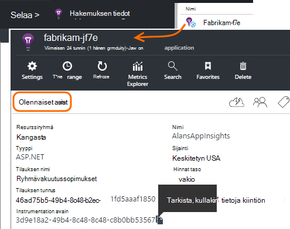

<properties 
    pageTitle="collectd: perf tilasto Java UNIX-sovelluksen tiedot" 
    description="Laajennettu seurantaa Java sivuston kanssa laajennuksen CollectD hakemuksen tiedot" 
    services="application-insights" 
    documentationCenter="java"
    authors="alancameronwills" 
    manager="douge"/>

<tags 
    ms.service="application-insights" 
    ms.workload="tbd" 
    ms.tgt_pltfrm="ibiza" 
    ms.devlang="na" 
    ms.topic="article" 
    ms.date="08/24/2016" 
    ms.author="awills"/>
 
# <a name="collectd-unix-performance-metrics-in-application-insights"></a>collectd: Unix suorituskyvyn mittarit-sovelluksen tiedot

*Hakemuksen tiedot on esikatselu.*

Tutustu Unix järjestelmän suorituskyvyn mittarit [Sovelluksen tiedot](app-insights-overview.md)-, asenna [collectd](http://collectd.org/), ja sen sovelluksen tiedot-laajennus. Avaa lähde-ratkaisun kerää järjestelmän ja verkon tilastoja.

Tavallisesti tulee käyttää collectd, jos sinulla on jo [instrumented Java WWW-palvelun kanssa hakemuksen tiedot][java]. Tällä tavalla saat enemmän tietoja auttaa sinua sovelluksen suorituskyvyn parantamiseksi tai suorittaa ongelmien vianmääritystä. 


## <a name="get-your-instrumentation-key"></a>Hae instrumentation avain

[Microsoft Azure-portaalissa](https://portal.azure.com)Avaa [Sovelluksen havainnollistamisen](app-insights-overview.md) resurssi kohtaa, johon haluat sijoittaa tiedot. (Tai [Luo uusi resurssi](app-insights-create-new-resource.md).)

Ota instrumentation-näppäintä, joka yksilöi resurssin kopio.




## <a name="install-collectd-and-the-plug-in"></a>Collectd ja laajennuksen asentaminen

Valitse Unix palvelimissa:

1. Asenna [collectd](http://collectd.org/) 5.4.0 versio tai sitä uudemmalla versiolla.
2. Lataa [sovellus havainnollistamisen collectd writer laajennuksen](https://aka.ms/aijavasdk). Huomautus versionumero.
3. Kopioi laajennus JAR yhdeksi `/usr/share/collectd/java`.
3. Muokkaa `/etc/collectd/collectd.conf`:
 * Varmista, että [Java-laajennus](https://collectd.org/wiki/index.php/Plugin:Java) on käytössä.
 * Päivitä JVMArg java.class.path varten, Sisällytä seuraavat PURKKIIN. Päivitä vastaamaan olet ladannut yhden versionumero:
  * `/usr/share/collectd/java/applicationinsights-collectd-1.0.5.jar`
 * Lisää tämä koodikatkelman, resurssi-Instrumentation-näppäintä:

```

     LoadPlugin "com.microsoft.applicationinsights.collectd.ApplicationInsightsWriter"
     <Plugin ApplicationInsightsWriter>
        InstrumentationKey "Your key"
     </Plugin>
```

Seuraavassa on osa määritysten mallitiedosto:

    ...
    # collectd plugins
    LoadPlugin cpu
    LoadPlugin disk
    LoadPlugin load
    ...

    # Enable Java Plugin
    LoadPlugin "java"

    # Configure Java Plugin
    <Plugin "java">
      JVMArg "-verbose:jni"
      JVMArg "-Djava.class.path=/usr/share/collectd/java/applicationinsights-collectd-1.0.5.jar:/usr/share/collectd/java/collectd-api.jar"

      # Enabling Application Insights plugin
      LoadPlugin "com.microsoft.applicationinsights.collectd.ApplicationInsightsWriter"
                
      # Configuring Application Insights plugin
      <Plugin ApplicationInsightsWriter>
        InstrumentationKey "12345678-1234-1234-1234-123456781234"
      </Plugin>

      # Other plugin configurations ...
      ...
    </Plugin>
.   ...

Määritä muut [collectd laajennukset](https://collectd.org/wiki/index.php/Table_of_Plugins), jotka voit koota tietoja eri lähteistä.

Käynnistä collectd mukaan sen [manuaalisesti](https://collectd.org/wiki/index.php/First_steps).

## <a name="view-the-data-in-application-insights"></a>Tarkastella tietoja hakemuksen tiedot

Sovelluksen tiedot-resurssi, Avaa [arvot Explorer ja lisätä kaavioita][metrics], valitsemalla mukautetun luokan haluamasi arvot.


Oletusarvon mukaan kaikki host tietokoneissa, josta määritetty kerääminen yhdistetään arvot. Jos haluat tarkastella kohti Host (isäntä)-arvot kaavion tiedot-sivu, ryhmittelyn ottaminen käyttöön ja valitse sitten ryhmittämään CollectD isäntä.


## <a name="to-exclude-upload-of-specific-statistics"></a>Lataa tietyn tilastojen jättäminen pois

Sovelluksen tiedot-laajennus lähettää oletusarvoisesti käytössä collectd lukea laajennukset keräämät tiedot. 

Tietojen pois tiettyjä laajennukset tai tietojen lähteitä:

* Muokkaa määritystiedostoa. 
* Valitse `<Plugin ApplicationInsightsWriter>`, Lisää direktiivi rivit seuraavasti:

Direktiivin | Vaikutus
---|---
`Exclude disk` | Poistaa kaikki keräämät tiedot `disk` laajennus
`Exclude disk:read,write` | Pois nimeltä lähteistä `read` ja `write` kohteesta `disk` laajennuksen.

Erillinen direktiivejä kanssa rivi.


## <a name="problems"></a>Ongelmia?

*Portaalin tiedot eivät näy*

* Avaa [Etsi] [ diagnostic] Nähdäksesi raaka tapahtumat saapumisesta. Joskus ne kestää kauemmin näkyvät arvot hallinnassa.
* Voit joutua määrittämään [palomuuripoikkeukset lähtevät tiedot](app-insights-ip-addresses.md)
* Sovelluksen tiedot-laajennus jäljityksen ottaminen käyttöön. Lisää seuraava rivi sisällä `<Plugin ApplicationInsightsWriter>`:
 *  `SDKLogger true`
* Avaa päätteeseen ja aloita collectd yksityiskohtaisessa tilassa, näet sen raportoi ongelmat:
 * `sudo collectd -f`


<!--Link references-->

[api]: app-insights-api-custom-events-metrics.md
[apiexceptions]: app-insights-api-custom-events-metrics.md#track-exception
[availability]: app-insights-monitor-web-app-availability.md
[diagnostic]: app-insights-diagnostic-search.md
[eclipse]: app-insights-java-eclipse.md
[java]: app-insights-java-get-started.md
[javalogs]: app-insights-java-trace-logs.md
[metrics]: app-insights-metrics-explorer.md
[usage]: app-insights-web-track-usage.md

 
