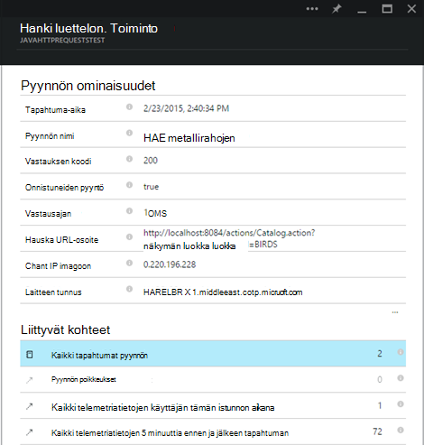

<properties 
    pageTitle="Sovelluksen havainnollistamisen tehostaminen Pimennys Java käytön aloittaminen" 
    description="Laajennuksen Pimennys avulla voit lisätä suorituskyky ja käytön valvonta Java-sivustoon ja sovelluksen tiedot" 
    services="application-insights" 
    documentationCenter="java"
    authors="alancameronwills" 
    manager="douge"/>

<tags 
    ms.service="application-insights" 
    ms.workload="tbd" 
    ms.tgt_pltfrm="ibiza" 
    ms.devlang="na" 
    ms.topic="article" 
    ms.date="03/02/2016" 
    ms.author="awills"/>
 
# Sovelluksen havainnollistamisen tehostaminen Pimennys Java käytön aloittaminen

Hakemuksen tiedot SDK lähettää telemetriatietojen Java-web-sovelluksen siten, että voit analysoida käyttöä ja suorituskykyä. Hakemuksen tiedot laajennus Pimennys asentaa SDK automaattisesti projektin niin, että voit siirtyä ruutuun telemetriatietojen sekä API, joiden avulla voit kirjoittaa mukautetun telemetriatietojen ulos.   

## Edellytykset

Tällä hetkellä laajennuksen works maven-testi ja dynaaminen Pimennys-Web-projekteissa. ([Lisää sovellus havainnollistamisen muuntyyppisten Java projektin][java].)

Sinun on:

* Oracle JRE 1,6 tai uudempi versio
* [Microsoft Azure](https://azure.microsoft.com/)-tilausta. (Voi alkaa [maksuttoman kokeiluversion](https://azure.microsoft.com/pricing/free-trial/).)
* [Pimennys IDE Java ss kehittäjille](http://www.eclipse.org/downloads/)Indigo tai uudempi versio.
* Windows 7 tai uudempi tai Windows Server 2008: n tai uudempi versio

## Asenna SDK Pimennys (kerran)

Sinun on vain tämän tietokoneen kohti kerran tehtävä. Tässä vaiheessa asentaa työkalut, jonka jälkeen voit lisätä SDK kunkin dynaamisen Web-projekti.

1. Valitse Pimennys, Ohje, Asenna uusi ohjelmisto.

    

2. SDK on http://dl.windowsazure.com/eclipse Azure-Työkalut-kohdassa. 
3. Poista **Ota päivityksen sivustoille...**

    

Noudattamalla annettuja ohjeita Java-hankkeen eri.

## Luo sovelluksen tiedot-resurssi Azure-tietokannassa

1. Kirjautuminen [Azure portal](https://portal.azure.com).
2. Luo uusi sovelluksen havainnollistamisen resurssi.  

      
3. Määritä sovelluksen Java verkkosovellukseen.  

      
4. Etsi uusi resurssi instrumentation-näppäintä. Tarvitset Liitä tämä koodiprojektin pian.  

      

## Hakemuksen tiedot lisääminen projektiin

1. Lisää sovellus havainnollistamisen Java web projektin pikavalikosta.

    

2. Liitä instrumentation avainta, jota olet saanut Azure-portaalista.

    

Avaimen lähetetään sekä jokaisen kohteen telemetriatietojen ja kertoo hakemuksen tiedot näkyvät resurssi.

## Suorita sovellus ja katso arvot

Suorita sovellus.

Palaa sovelluksen tietoja: Microsoft Azure resurssi.

HTTP-pyynnöt tiedot näkyvät Yhteenveto-sivu. (Jos se ei löydy, odota hetki ja valitse sitten Päivitä.)

 

Napsauttamalla mitä tahansa kaavion saat näkyviin lisää arvot. 

[Lue lisää arvot.][metrics]

 

Ja pyynnön ominaisuuksien tarkasteleminen, kun näet telemetriatietojen tapahtumia, kuten pyynnöt ja poikkeukset liittyy.
 

## Asiakkaan telemetriatietojen

Valitse Hae koodi seurannassa web-sivujen pikaopas-sivu: 

Lisää koodikatkelman HTML-tiedostojen otsikkoon.

#### Asiakkaan tietojen tarkasteleminen

Avaa päivitetty verkkosivujen ja käyttää niitä. Odota hetki tai kahdessa, ja valitse palautettava sovellus havainnollistamisen ja avaa käyttö-sivu. (Valitse Yhteenveto-sivu alaspäin ja valitse käyttö.)

Sivun näkymän, käyttäjän ja istunnon arvot näkyvät käyttö-sivu:

[Lisätietoja asiakkaan telemetriatietojen määrittäminen.][usage]

## Sovelluksen julkaiseminen

Sovelluksen julkaiseminen palvelimeen, ja katso telemetriatietojen näkyvät portaalissa käyttäjien käyttää nyt.

* Varmista, että palomuurin sovelluksen telemetriatietojen lähettäminen seuraavat portit:

 * DC.Services.visualstudio.com:443
 * DC.Services.visualstudio.com:80
 * F5.Services.visualstudio.com:443
 * F5.Services.visualstudio.com:80

* Asenna Windows-palvelimiin:

 * [Microsoft Visual C++ Redistributable](http://www.microsoft.com/download/details.aspx?id=40784)

    (Näin suorituskyvyn laskureita.)

## Poikkeukset ja pyynnön virheet

Käsittelemättömän poikkeukset kerätään automaattisesti:

Kerätä tietoja muiden poikkeukset, sinulla on kaksi vaihtoehtoa:

* [Lisää TrackException koodissa puhelut](app-insights-api-custom-events-metrics.md#track-exception). 
* [Asenna Java-agentti palvelimeen](app-insights-java-agent.md). Voit määrittää menetelmiä haluat seurata.

## Seurata menetelmäkutsujen ja riippuvuussuhteet

Kirjaudu [asentaa Java-agentti](app-insights-java-agent.md) määritetty sisäinen menetelmistä ja soitettua puhelua kautta JDBC-ja aikatiedot.

## Suorituskyvyn laskureita

Yhteenveto-sivu Vieritä alas ja valitse **palvelimet** -ruutu. Näet suorituskyvyn laskureita solualueen.

### Suorituskyvyn laskuri sivustokokoelman mukauttaminen

Käytöstä sivustokokoelman suorituskyvyn laskureita ja, Lisää seuraava koodi pääkansion solmun ApplicationInsights.xml tiedoston:

    <PerformanceCounters>
       <UseBuiltIn>False</UseBuiltIn>
    </PerformanceCounters>

### Kerää suorituskykylaskureita

Voit määrittää muita suorituskykylaskureita kerätään.

#### JMX laskureita (tarjoamia mukaan Java virtuaalikoneen)

    <PerformanceCounters>
      <Jmx>
        <Add objectName="java.lang:type=ClassLoading" attribute="TotalLoadedClassCount" displayName="Loaded Class Count"/>
        <Add objectName="java.lang:type=Memory" attribute="HeapMemoryUsage.used" displayName="Heap Memory Usage-used" type="composite"/>
      </Jmx>
    </PerformanceCounters>

*   `displayName`– Nimi näkyy sovelluksen tiedot-portaalissa.
*   `objectName`– JMX objektinimi.
*   `attribute`– JMX objektinimi hakeaksesi määrite
*   `type`(valinnainen) - määritteen JMX objektin tyyppi:
 *  Oletusarvo: Yksinkertainen tyyppi kuten kokonaisluku tai pitkä.
 *  `composite`: resurssilaskurin tietojen on "Attribute.Data"-muodossa
 *  `tabular`: resurssilaskurin tietojen on taulukkorivin muoto

#### Windowsin suorituskykylaskureita

Kunkin [Windowsin suorituskyky laskuri](https://msdn.microsoft.com/library/windows/desktop/aa373083.aspx) on luokan jäsen (samalla tavalla, että kenttä on luokan jäsen). Luokat voivat olla yleinen, tai voit on numeroitu tai nimeltä esiintymät.

    <PerformanceCounters>
      <Windows>
        <Add displayName="Process User Time" categoryName="Process" counterName="%User Time" instanceName="__SELF__" />
        <Add displayName="Bytes Printed per Second" categoryName="Print Queue" counterName="Bytes Printed/sec" instanceName="Fax" />
      </Windows>
    </PerformanceCounters>

*   Näyttönimi – sovelluksen tiedot-portaalissa näkyvä nimi.
*   LuokanNimi –, johon on liitetty suorituskyvyn laskuri suorituskyvyn laskuri luokan (objekti).
*   counterName – nimen suorituskyky laskuri.
*   EsiintymänNimi – nimen suorituskyky laskuri luokan esiintymän tai tyhjä merkkijono (""), jos luokka sisältää yksittäisen esiintymän. Jos ryhmän on prosessi ja haluat kerätä suorituskyvyn laskuri on nykyisen JVM prosessista sovelluksen suoritetaan, Määritä `"__SELF__"`.

Suorituskyvyn laskureita näkyvät mukautettua arvot [Arvot]Explorerissa[metrics].

### UNIX suorituskyvyn laskureita

* Hae erilaisia järjestelmän ja verkon tietojen [collectd kanssa sovelluksen tiedot-laajennuksen asentaminen](app-insights-java-collectd.md) .

## Käytettävyys web testit

Hakemuksen tiedot voit testata verkkosivuston, tarkista, että se on käytössä ja vastaanottamisen sekä säännöllisin väliajoin. [Voit määrittää][availability], valitse käytettävyys alaspäin.

Saat kaavioiden vastauksen kertaa sekä sähköposti-ilmoitukset, jos sivuston siirtyy.

[Lisätietoja käytettävyys web testit.][availability] 

## Vianmäärityslokit

Jos käytät Logback tai Log4J (v1.2 tai v2.0) jäljitys, voit määrittää jäljityksen lokit lähetetään automaattisesti sovelluksen havainnollistamisen, jossa voit tarkastella ja etsiä niitä.

[Lisätietoja vianmäärityslokit][javalogs]

## Mukautettu telemetriatietojen 

Lisää muutama koodin rivit Java verkkosovelluksen selvittää, mitä käyttäjät tekevät sitä tai selvittää ongelmia. 

Voit lisätä koodin sekä verkkosivun JavaScript palvelinpuolen Java.

[Lisätietoja mukautettujen telemetriatietojen][track]

## Seuraavat vaiheet

#### Haku- ja vianmääritys

* [Lisää WWW-asiakasohjelman telemetriatietojen] [ usage] suorituskyvyn telemetriatietojen käyttämistä web-asiakasohjelmassa.
* [Määritä web testit] [ availability] , varmista, että sovelluksesi pysyy suorien ja vastaa.
* [Etsi tapahtuma- ja lokit] [ diagnostic] voi selvittää ongelmia.
* [Sieppaa Log4J tai Logback jäljittää][javalogs]

#### Seurata käyttöä

* [Lisää WWW-asiakasohjelman telemetriatietojen] [ usage] näytön sivun näkymiä ja käyttäjän arvot.
* [Mukautetut tapahtumat ja arvot seuranta] [ track] lisätietoja siitä, miten sovelluksesi käytetään, sekä asiakkaan ja palvelimen.

<!--Link references-->

[availability]: app-insights-monitor-web-app-availability.md
[diagnostic]: app-insights-diagnostic-search.md
[java]: app-insights-java-get-started.md
[javalogs]: app-insights-java-trace-logs.md
[metrics]: app-insights-metrics-explorer.md
[track]: app-insights-api-custom-events-metrics.md
[usage]: app-insights-web-track-usage.md

 