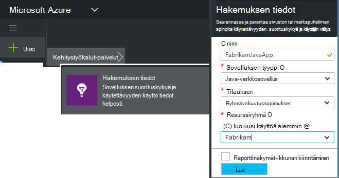
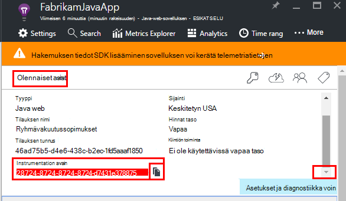
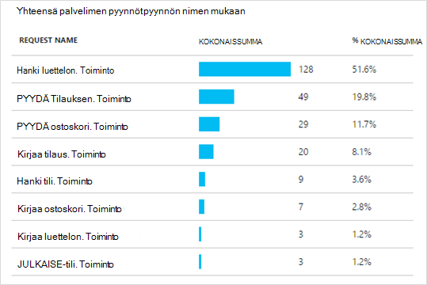
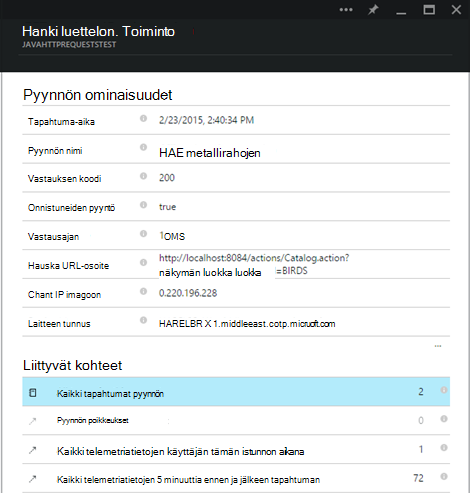
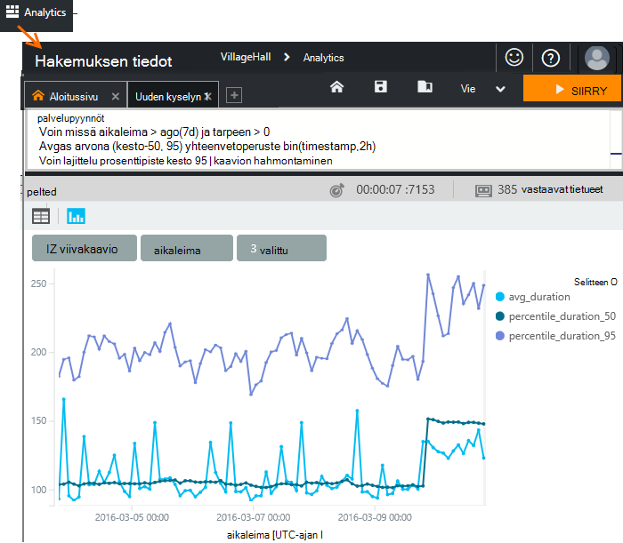
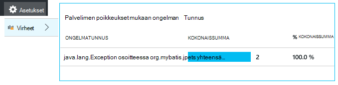
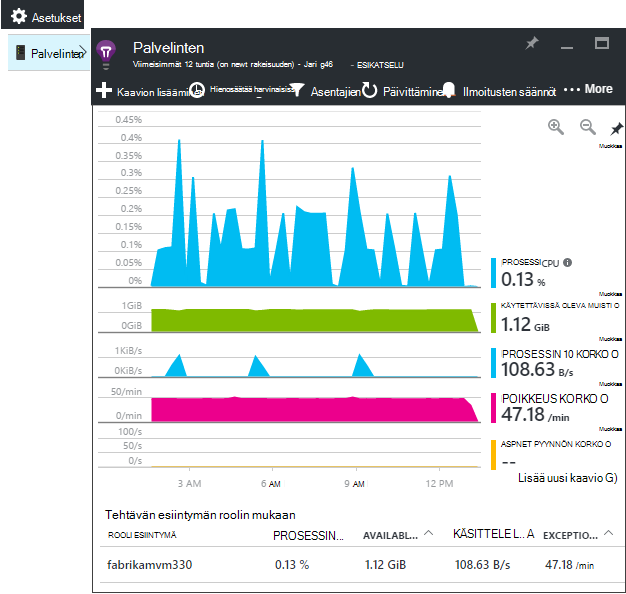
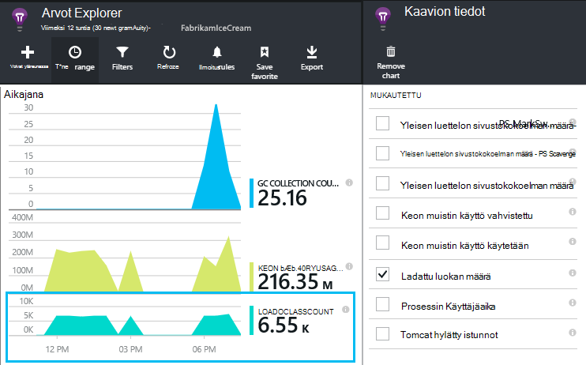
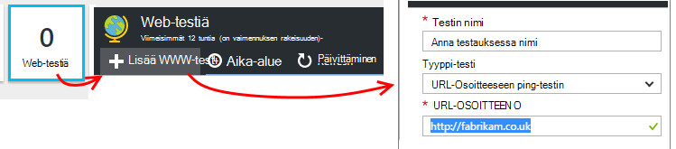
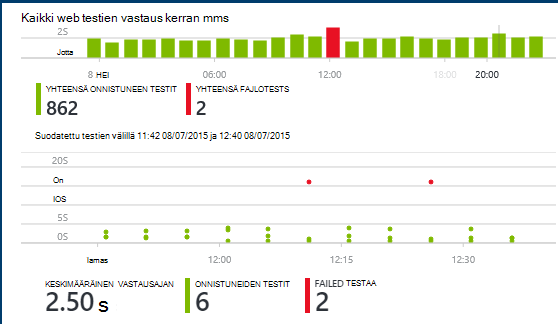

<properties
    pageTitle="Java web app analytics kanssa hakemuksen tiedot | Microsoft Azure"
    description="Seurata suorituskyvyn ja käyttömäärän Java sivuston kanssa hakemuksen tiedot. "
    services="application-insights"
    documentationCenter="java"
    authors="alancameronwills"
    manager="douge"/>

<tags
    ms.service="application-insights"
    ms.workload="tbd"
    ms.tgt_pltfrm="ibiza"
    ms.devlang="na"
    ms.topic="get-started-article"
    ms.date="08/17/2016"
    ms.author="awills"/>

# Aloita sovelluksen havainnollistamisen Java-web-Projectissa

*Hakemuksen tiedot on esikatselu.*

[AZURE.INCLUDE [app-insights-selector-get-started](../../includes/app-insights-selector-get-started.md)]

[Sovelluksen tiedot](https://azure.microsoft.com/services/application-insights/) on extensible analytics-palvelu, joka auttaa sinua ymmärtämään, suorituskykyä ja live-sovelluksen käyttö. [Haku- ja vianmäärityksen suorituskykyongelmia ja poikkeukset](app-insights-detect-triage-diagnose.md)ja [koodin kirjoittaminen] [ api] jäljittämiseksi käyttäjät voivat tehdä sovelluksen kanssa.

Hakemuksen tiedot tukee Java-sovellusten Linux, Unix tai Windows-käyttöjärjestelmässä.

Tarvitset:

* Oracle JRE 1,6 tai uudempi tai Zulu JRE 1,6 tai uudempi versio
* [Microsoft Azure](https://azure.microsoft.com/)-tilausta. (Voi alkaa [maksuttoman kokeiluversion](https://azure.microsoft.com/pricing/free-trial/).)

*Jos sinulla on web-sovellusta, joka on jo julkaistu, [Lisää suorituksen verkkopalvelin SDK](app-insights-java-live.md)voitu noudattamalla vaihtoehtoista toimintosarjaa. Kyseisen vaihtoehtoinen vältetään, joiden koodi, mutta et saa asetus, jos haluat kirjoittaa koodia käyttäjän seuraaminen.*

## 1. sovelluksen havainnollistamisen instrumentation Key-tunnuksen hankkiminen

1. Kirjaudu [Microsoft Azure-portaalissa](https://portal.azure.com).
2. Luo sovelluksen tiedot-resurssi. Määritä sovelluksen Java verkkosovellukseen.

    
4. Etsi uusi resurssi instrumentation-näppäintä. Tarvitset tätä näppäintä Liitä koodiprojektin pian.

    

## 2. Java sovelluksen tiedot-SDK lisääminen projektiin

*Valitse projektin sopivalla tavalla.*

#### Jos käytät Pimennys maven-testi tai dynaaminen Web projektin luominen...

Käytä [Sovelluksen havainnollistamisen SDK Java laajennuksen][eclipse].

#### Jos käytät maven-testi...

Jos projektisi on jo määritetty käyttämään maven-testi muodosta, voit yhdistää pom.xml tiedosto seuraava koodi.

Päivität Projektiriippuvuudet saat binaaritiedostot ladataan.

    <repositories>
       <repository>
          <id>central</id>
          <name>Central</name>
          <url>http://repo1.maven.org/maven2</url>
       </repository>
    </repositories>

    <dependencies>
      <dependency>
        <groupId>com.microsoft.azure</groupId>
        <artifactId>applicationinsights-web</artifactId>
        <!-- or applicationinsights-core for bare API -->
        <version>[1.0,)</version>
      </dependency>
    </dependencies>

* *Muodosta tai tarkistussumma tarkistusvirheitä?* Kokeile tiettyyn versioon, kuten: `<version>1.0.n</version>`. Löydät uusimman version [julkaisutiedot SDK](https://github.com/Microsoft/ApplicationInsights-Java#release-notes) tai tutustu [maven-testi palvelutiedot](http://search.maven.org/#search%7Cga%7C1%7Capplicationinsights).
* *Haluatko päivittää uusi SDK?* Päivitä projektin.

#### Jos käytät Gradle...

Jos projektisi on jo määritetty käyttämään Gradle muodosta, voit yhdistää build.gradle tiedosto seuraava koodi.

Päivitä sitten Projektiriippuvuudet saat binaaritiedostot ladataan.

    repositories {
      mavenCentral()
    }

    dependencies {
      compile group: 'com.microsoft.azure', name: 'applicationinsights-web', version: '1.+'
      // or applicationinsights-core for bare API
    }

* *Muodosta tai tarkistussumma kelpoisuustarkistuksen virheet? Kokeile tiettyyn versioon, kuten:* `version:'1.0.n'`. *Löydät uusimman version [julkaisutiedot SDK](https://github.com/Microsoft/ApplicationInsights-Java#release-notes).*
* *Voit päivittää uudet SDK*
 * Päivitä projektin.

#### Muussa tapauksessa...

Lisää manuaalisesti SDK:

1. Lataa [sovellus havainnollistamisen SDK Java](https://aka.ms/aijavasdk).
2. Pura binaaritiedostoja zip-tiedostosta ja lisää ne projektiin.

### Kysymyksiä...

* *Mikä on välisen suhteen `-core` ja `-web` zip-osat?*

 * `applicationinsights-core`tutustutaan ajoneuvon Ohjelmointirajapinnan. Tarvitset, tämä osa.
 * `applicationinsights-web`palauttaa arvot, joissa seurataan HTTP pyynnön määrät ja vastaus kertaa. Tämän osan voit jättää pois, jos et halua tätä telemetriatietojen kerääminen automaattisesti. Jos haluat kirjoittaa omia esimerkiksi.

* *Päivittää SDK, kun olemme Julkaise muutokset*
 * Lataa uusimmat [Hakemuksen tiedot SDK Java](https://aka.ms/qqkaq6) ja korvaa vanhat.
 * Muutokset on kuvattu [SDK julkaisutiedot](https://github.com/Microsoft/ApplicationInsights-Java#release-notes).

## 3. Lisää sovellus havainnollistamisen .xml-tiedostossa

Lisää ApplicationInsights.xml projektin resurssit-kansioon tai varmista, että se lisätään projektin käyttöönoton luokan polun. Kopioi seuraava XML siihen.

Korvaa instrumentation avainta, jota olet saanut Azure-portaalista.

    <?xml version="1.0" encoding="utf-8"?>
    <ApplicationInsights xmlns="http://schemas.microsoft.com/ApplicationInsights/2013/Settings" schemaVersion="2014-05-30">

      <!-- The key from the portal: -->

      <InstrumentationKey>** Your instrumentation key **</InstrumentationKey>

      <!-- HTTP request component (not required for bare API) -->

      <TelemetryModules>
        <Add type="com.microsoft.applicationinsights.web.extensibility.modules.WebRequestTrackingTelemetryModule"/>
        <Add type="com.microsoft.applicationinsights.web.extensibility.modules.WebSessionTrackingTelemetryModule"/>
        <Add type="com.microsoft.applicationinsights.web.extensibility.modules.WebUserTrackingTelemetryModule"/>
      </TelemetryModules>

      <!-- Events correlation (not required for bare API) -->
      <!-- These initializers add context data to each event -->

      <TelemetryInitializers>
        <Add   type="com.microsoft.applicationinsights.web.extensibility.initializers.WebOperationIdTelemetryInitializer"/>
        <Add type="com.microsoft.applicationinsights.web.extensibility.initializers.WebOperationNameTelemetryInitializer"/>
        <Add type="com.microsoft.applicationinsights.web.extensibility.initializers.WebSessionTelemetryInitializer"/>
        <Add type="com.microsoft.applicationinsights.web.extensibility.initializers.WebUserTelemetryInitializer"/>
        <Add type="com.microsoft.applicationinsights.web.extensibility.initializers.WebUserAgentTelemetryInitializer"/>

      </TelemetryInitializers>
    </ApplicationInsights>

* Instrumentation avain lähetetään sekä jokaisen kohteen telemetriatietojen ja kertoo hakemuksen tiedot näkyvät resurssi.
* HTTP-pyyntö osa on valinnainen. Se lähettää automaattisesti telemetriatietojen pyynnöt ja vastausajat-portaaliin.
* Tapahtumien korrelaatio on HTTP-pyyntö osan lisäys. Määrittää tunniste sivupyynnön vastaanottanut palvelimeen ja tunnus Lisää ominaisuutena jokaisen kohteen telemetriatietojen ominaisuutena "Operation.Id". Sen avulla voit yhdistää liittyvät sivupyynnön määrittämällä suodattimen [Diagnostiikan]hakutoiminnossa telemetriatietojen[diagnostic].
* Sovelluksen tiedot-avain voi välittää dynaamisesti järjestelmän ominaisuutena Azure-portaalista (-DAPPLICATION_INSIGHTS_IKEY = your_ikey). Jos ominaisuutta ei ole määritetty, se tarkistaa Azure-sovelluksen asetusten ympäristömuuttuja (APPLICATION_INSIGHTS_IKEY). Jos sekä ominaisuuksia ei ole määritetty, oletusarvo InstrumentationKey käytetään ApplicationInsights.xml. Tässä järjestyksessä auttaa hallitsemaan eri ympäristöissä eri InstrumentationKeys dynaamisesti.

### Voit määrittää instrumentation käyttäjäavainten vaihtoehtoisilla tavoilla

Hakemuksen tiedot SDK näyttää näppäimen seuraavassa järjestyksessä:

1. Järjestelmäominaisuus:-DAPPLICATION_INSIGHTS_IKEY = your_ikey
2. Ympäristömuuttuja: APPLICATION_INSIGHTS_IKEY
3. Kokoonpanotiedosto: ApplicationInsights.xml

Voit myös [määrittää sen koodissa](app-insights-api-custom-events-metrics.md#ikey):

    telemetryClient.InstrumentationKey = "...";

## 4. Lisää HTTP-suodatin

Määritysten viimeisessä vaiheessa avulla kirjautua web sivupyynnön HTTP pyynnön-osa. (Ei vaadita Jos haluat vain ajoneuvon Ohjelmointirajapinnan.)

Etsi ja Avaa projektin web.xml-tiedosto ja Yhdistä online solmun, jossa sovellussuodattimet on määritetty seuraava koodi.

Saat mahdollisimman tarkat tulokset-suodatin on yhdistettävä ennen kaikki suodattimet.

    <filter>
      <filter-name>ApplicationInsightsWebFilter</filter-name>
      <filter-class>
        com.microsoft.applicationinsights.web.internal.WebRequestTrackingFilter
      </filter-class>
    </filter>
    <filter-mapping>
       <filter-name>ApplicationInsightsWebFilter</filter-name>
       <url-pattern>/*</url-pattern>
    </filter-mapping>

#### Jos käytät Spring Web MVC 3.1 tai uudempi

Muokata näitä elementtejä sovelluksen tiedot-paketti sisältää:

    <context:component-scan base-package=" com.springapp.mvc, com.microsoft.applicationinsights.web.spring"/>

    <mvc:interceptors>
        <mvc:interceptor>
            <mvc:mapping path="/**"/>
            <bean class="com.microsoft.applicationinsights.web.spring.RequestNameHandlerInterceptorAdapter" />
        </mvc:interceptor>
    </mvc:interceptors>

#### Jos käytät joustintukien huolto 2

Lisää kohde (yleensä nimeltään struts.xml tai huomioon ottaen default.xml) huomioon ottaen määritystiedosto:

     <interceptors>
       <interceptor name="ApplicationInsightsRequestNameInterceptor" class="com.microsoft.applicationinsights.web.struts.RequestNameInterceptor" />
     </interceptors>
     <default-interceptor-ref name="ApplicationInsightsRequestNameInterceptor" />

(Jos sinulla on määritetty oletusarvoinen Pinotut interceptors, keräilyaltaan yksinkertaisesti voidaan lisätä pinota.)

## 5. Suorita sovellus

Suorita virheenkorjaus tilassa kehittäminen tietokoneeseen tai julkaista palvelimeen.

## 6. oman telemetriatietojen tarkasteleminen hakemuksen tiedot

Palaa sovelluksen tiedot-resurssin [Microsoft Azure](https://portal.azure.com)-portaalissa.

HTTP-pyyntöjen tietoa näkyy yhteenveto-sivu. (Jos se ei löydy, odota hetki ja valitse sitten Päivitä.)

[Lue lisää arvot.][metrics]

Napsauttamalla mitä tahansa kaavion saat näkyviin tarkempia koostetun arvot.

> Hakemuksen tiedot olettaa MVC sovellusten pyyntöjen muoto on: `VERB controller/action`. Esimerkiksi `GET Home/Product/f9anuh81`, `GET Home/Product/2dffwrf5` ja `GET Home/Product/sdf96vws` on ryhmitelty `GET Home/Product`. Tämä ryhmittely mahdollistaa kuvaava koosteet pyyntöjen, kuten pyynnöt ja keskimääräinen suoritusaika pyynnöt.

### Esiintymän tietoihin 

Vahvista automaattisen tietyn pyynnön tyypin Nähdäksesi yksittäiset esiintymät. 

Kahdenlaisia tiedot näkyvät sovelluksen tietoja: tietojen, tallentaa ja näytetään keskiarvoja, määrät ja summat; ja tiedot – yksittäisten raporttien HTTP-pyynnöt, poikkeukset, sivun näkymiä tai mukautetut tapahtumat esiintymä.

Kun tarkastelet pyyntö ominaisuuksia, näet telemetriatietojen tapahtumia, kuten pyynnöt ja poikkeukset liittyy.

### Analytics: Tehokas kyselykielen

Kun kannattaa koota tietoja, voit suorittaa kyselyjä sekä tietojen koostaminen ja yksittäiset esiintymät. [Analyysin]() on tehokas työkalu sekä tietoja suorituskyvyn ja käyttömäärän ja vianmääritystä varten.

## 7. asentaa sovelluksen palvelimessa

Sovelluksen julkaiseminen palvelimeen, ja katso telemetriatietojen näkyvät portaalissa käyttäjien käyttää nyt.

* Varmista, että palomuurin sovelluksen telemetriatietojen lähettäminen seuraavat portit:

 * DC.Services.visualstudio.com:443
 * F5.Services.visualstudio.com:443

* Asenna Windows-palvelimiin:

 * [Microsoft Visual C++ Redistributable](http://www.microsoft.com/download/details.aspx?id=40784)

    (Tämä osa mahdollistaa suorituskyvyn laskureita.)

## Poikkeukset ja pyynnön virheet

Käsittelemättömän poikkeukset kerätään automaattisesti:

Kerätä tietoja muiden poikkeukset, sinulla on kaksi vaihtoehtoa:

* [Lisää trackException() puhelut koodissa][apiexceptions]. 
* [Asenna Java-agentti palvelimeen](app-insights-java-agent.md). Voit määrittää menetelmiä haluat seurata.

## Seurata menetelmäkutsujen ja riippuvuussuhteet

Kirjaudu [asentaa Java-agentti](app-insights-java-agent.md) määritetty sisäinen menetelmistä ja soitettua puhelua kautta JDBC-ja aikatiedot.

## Suorituskyvyn laskureita

Avaa **asetukset**- **palvelimiin**Nähdäksesi suorituskyvyn laskureita solualueen.

### Suorituskyvyn laskuri sivustokokoelman mukauttaminen

Käytöstä sivustokokoelman suorituskyvyn laskureita ja, Lisää seuraava koodi pääkansion solmun ApplicationInsights.xml tiedoston:

    <PerformanceCounters>
       <UseBuiltIn>False</UseBuiltIn>
    </PerformanceCounters>

### Kerää suorituskykylaskureita

Voit määrittää muita suorituskykylaskureita kerätään.

#### JMX laskureita (tarjoamia mukaan Java virtuaalikoneen)

    <PerformanceCounters>
      <Jmx>
        <Add objectName="java.lang:type=ClassLoading" attribute="TotalLoadedClassCount" displayName="Loaded Class Count"/>
        <Add objectName="java.lang:type=Memory" attribute="HeapMemoryUsage.used" displayName="Heap Memory Usage-used" type="composite"/>
      </Jmx>
    </PerformanceCounters>

*   `displayName`– Nimi näkyy sovelluksen tiedot-portaalissa.
*   `objectName`– JMX objektinimi.
*   `attribute`– JMX objektinimi hakeaksesi määrite
*   `type`(valinnainen) - määritteen JMX objektin tyyppi:
 *  Oletusarvo: Yksinkertainen tyyppi kuten kokonaisluku tai pitkä.
 *  `composite`: resurssilaskurin tietojen on "Attribute.Data"-muodossa
 *  `tabular`: resurssilaskurin tietojen on taulukkorivin muoto

#### Windowsin suorituskykylaskureita

Kunkin [Windowsin suorituskyky laskuri](https://msdn.microsoft.com/library/windows/desktop/aa373083.aspx) on luokan jäsen (samalla tavalla, että kenttä on luokan jäsen). Luokat voivat olla yleinen, tai voit on numeroitu tai nimeltä esiintymät.

    <PerformanceCounters>
      <Windows>
        <Add displayName="Process User Time" categoryName="Process" counterName="%User Time" instanceName="__SELF__" />
        <Add displayName="Bytes Printed per Second" categoryName="Print Queue" counterName="Bytes Printed/sec" instanceName="Fax" />
      </Windows>
    </PerformanceCounters>

*   Näyttönimi – sovelluksen tiedot-portaalissa näkyvä nimi.
*   LuokanNimi –, johon on liitetty suorituskyvyn laskuri suorituskyvyn laskuri luokan (objekti).
*   counterName – nimen suorituskyky laskuri.
*   EsiintymänNimi – nimen suorituskyky laskuri luokan esiintymän tai tyhjä merkkijono (""), jos luokka sisältää yksittäisen esiintymän. Jos ryhmän on prosessi ja haluat kerätä suorituskyvyn laskuri on nykyisen JVM prosessista sovelluksen suoritetaan, Määritä `"__SELF__"`.

Suorituskyvyn laskureita näkyvät mukautettua arvot [Arvot]Explorerissa[metrics].

### UNIX suorituskyvyn laskureita

* Hae erilaisia järjestelmän ja verkon tietojen [collectd kanssa sovelluksen tiedot-laajennuksen asentaminen](app-insights-java-collectd.md) .

## Hae käyttäjän ja istunnon tiedot

OK haluat lähettää telemetriatietojen web-palvelimesta. Nyt saat sovelluksen koko 360 asteen näkymän, voit lisätä Lisää seuranta:

* [Telemetriatietojen lisääminen web-sivujen] [ usage] näytön sivun näkymiä ja käyttäjän arvot.
* [Määritä web testit] [ availability] , varmista, että sovelluksesi pysyy suorien ja vastaa.

## Lokitiedoston jäljittää Capture

Voit tehdä hakemuksen tiedot sektoria ja arpakuution lokit Log4J, Logback tai muita kirjaaminen kehysten. Voit yhdistää lokit pyyntöjen ja muut telemetriatietojen. [Lue, miten][javalogs].

## Lähetä oma telemetriatietojen

Nyt kun olet asentanut SDK-Ohjelmointirajapinnan avulla voit lähettää oman telemetriatietojen.

* [Mukautetut tapahtumat ja arvot seuranta] [ api] kerrotaan, mitä käyttäjät tekevät sovelluksen.
* [Etsi tapahtuma- ja lokit] [ diagnostic] voi selvittää ongelmia.

## Käytettävyys web testit

Hakemuksen tiedot voit testata verkkosivuston, tarkista, että se on käytössä ja vastaanottamisen sekä säännöllisin väliajoin. [Voit määrittää][availability], valitse Web testit.

Saat kaavioiden vastauksen kertaa sekä sähköposti-ilmoitukset, jos sivuston siirtyy.

[Lisätietoja käytettävyys web testit.][availability] 

## Kysymyksiä? Ongelmia?

[Java vianmääritys](app-insights-java-troubleshoot.md)

## Seuraavat vaiheet

Lisätietoja on artikkelissa [Java Developer Center](/develop/java/).

<!--Link references-->

[api]: app-insights-api-custom-events-metrics.md
[apiexceptions]: app-insights-api-custom-events-metrics.md#track-exception
[availability]: app-insights-monitor-web-app-availability.md
[diagnostic]: app-insights-diagnostic-search.md
[eclipse]: app-insights-java-eclipse.md
[javalogs]: app-insights-java-trace-logs.md
[metrics]: app-insights-metrics-explorer.md
[usage]: app-insights-web-track-usage.md
