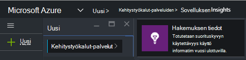
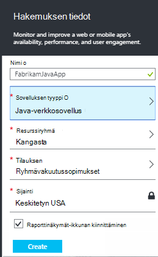
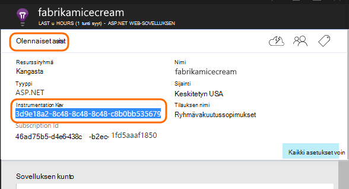
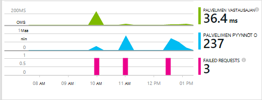
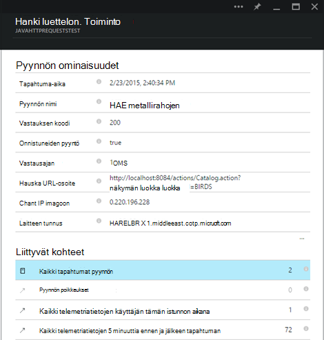

<properties 
    pageTitle="Hakemuksen tiedot Java web Apps-sovellukset, jotka ovat jo live" 
    description="Seurannan, joka on jo käynnissä palvelimeen web-sovelluksen käynnistäminen" 
    services="application-insights" 
    documentationCenter="java"
    authors="alancameronwills" 
    manager="douge"/>

<tags 
    ms.service="application-insights" 
    ms.workload="tbd" 
    ms.tgt_pltfrm="ibiza" 
    ms.devlang="na" 
    ms.topic="article" 
    ms.date="08/24/2016" 
    ms.author="awills"/>
 
# Hakemuksen tiedot Java web Apps-sovellukset, jotka ovat jo live

*Hakemuksen tiedot on esikatselu.*

Jos sinulla on jo käynnissä J2EE palvelimeen web-sovelluksen, voit aloittaa seurantaa sen [Sovelluksen tiedot](app-insights-overview.md) ilman, että voit tehdä muutoksia koodi tai projektin Käännä. Tämän asetuksen saat tietoja lähetetään palvelimeen ja käsittelemättömän poikkeukset ja suorituskyvyn laskureita pyyntöjen.

Tarvitset [Microsoft Azure](https://azure.com)-tilausta.

> [AZURE.NOTE] Tällä sivulla menettelyä Lisää SDK web App-sovellukseen suorituksen aikana. Tämä runtime instrumentation on hyödyllinen, jos et halua päivittää tai muodostaminen uudelleen lähdekoodia. Mutta mahdollisuuksien mukaan Suosittelemme [SDK lähdekoodin voit lisätä](app-insights-java-get-started.md) sen sijaan. Saat lisää asetuksia, esimerkiksi kirjoittaa koodin, käyttäjän seuraaminen.

## 1. sovelluksen havainnollistamisen instrumentation Key-tunnuksen hankkiminen

1. Kirjaudu [Microsoft Azure-portaalissa](https://portal.azure.com)
2. Luo uusi sovelluksen havainnollistamisen resurssi

    
3. Määritä sovelluksen Java verkkosovellukseen.

    
4. Etsi uusi resurssi instrumentation-näppäintä. Tarvitset tätä näppäintä Liitä koodiprojektin pian.

    

## 2. Lataa SDK

1. Lataa [sovellus havainnollistamisen SDK Java](https://aka.ms/aijavasdk). 
2. Palvelimeen Pura hakemiston, josta projektin binaaritiedostot ladataan SDK-sisältö. Jos käytät Tomcat, tähän kansioon olisi yleensä kohdassa`webapps\<your_app_name>\WEB-INF\lib`

## 3. Lisää sovellus tiedot xml-tiedosto

Luo kansio, johon olet lisännyt SDK ApplicationInsights.xml. Sijoita siihen seuraavat XML.

Korvaa instrumentation avainta, jota olet saanut Azure-portaalista.

    <?xml version="1.0" encoding="utf-8"?>
    <ApplicationInsights xmlns="http://schemas.microsoft.com/ApplicationInsights/2013/Settings" schemaVersion="2014-05-30">

      <!-- The key from the portal: -->

      <InstrumentationKey>** Your instrumentation key **</InstrumentationKey>

      <!-- HTTP request component (not required for bare API) -->

      <TelemetryModules>
        <Add type="com.microsoft.applicationinsights.web.extensibility.modules.WebRequestTrackingTelemetryModule"/>
        <Add type="com.microsoft.applicationinsights.web.extensibility.modules.WebSessionTrackingTelemetryModule"/>
        <Add type="com.microsoft.applicationinsights.web.extensibility.modules.WebUserTrackingTelemetryModule"/>
      </TelemetryModules>

      <!-- Events correlation (not required for bare API) -->
      <!-- These initializers add context data to each event -->

      <TelemetryInitializers>
        <Add   type="com.microsoft.applicationinsights.web.extensibility.initializers.WebOperationIdTelemetryInitializer"/>
        <Add type="com.microsoft.applicationinsights.web.extensibility.initializers.WebOperationNameTelemetryInitializer"/>
        <Add type="com.microsoft.applicationinsights.web.extensibility.initializers.WebSessionTelemetryInitializer"/>
        <Add type="com.microsoft.applicationinsights.web.extensibility.initializers.WebUserTelemetryInitializer"/>
        <Add type="com.microsoft.applicationinsights.web.extensibility.initializers.WebUserAgentTelemetryInitializer"/>

      </TelemetryInitializers>
    </ApplicationInsights>

* Instrumentation avain lähetetään sekä jokaisen kohteen telemetriatietojen ja kertoo hakemuksen tiedot näkyvät resurssi.
* HTTP-pyyntö osa on valinnainen. Se lähettää automaattisesti telemetriatietojen pyynnöt ja vastausajat-portaaliin.
* Tapahtumien korrelaatio on HTTP-pyyntö osan lisäys. Määrittää tunniste sivupyynnön vastaanottanut palvelimeen ja tunnus Lisää ominaisuutena jokaisen kohteen telemetriatietojen ominaisuutena "Operation.Id". Sen avulla voit yhdistää liittyvät sivupyynnön määrittämällä suodattimen [Diagnostiikan haun](app-insights-diagnostic-search.md)telemetriatietojen.

## 4. Lisää HTTP-suodatin

Etsi ja Avaa projektin web.xml-tiedosto ja Yhdistä seuraavat koodikatkelman koodin web app-solmun, jossa sovelluksen suodattimet on määritetty.

Saat mahdollisimman tarkat tulokset-suodatin on yhdistettävä ennen kaikki suodattimet.

    <filter>
      <filter-name>ApplicationInsightsWebFilter</filter-name>
      <filter-class>
        com.microsoft.applicationinsights.web.internal.WebRequestTrackingFilter
      </filter-class>
    </filter>
    <filter-mapping>
       <filter-name>ApplicationInsightsWebFilter</filter-name>
       <url-pattern>/*</url-pattern>
    </filter-mapping>

## 5. palomuuripoikkeukset

Haluat ehkä [määrittää poikkeuksia lähtevät tiedot lähetetään](app-insights-ip-addresses.md).

## 6. uudelleen web Appissa

## 7. oman telemetriatietojen tarkasteleminen hakemuksen tiedot

Palaa sovelluksen tiedot-resurssin [Microsoft Azure](https://portal.azure.com)-portaalissa.

Telemetriatietojen pyyntöjen tietoja näkyy yhteenveto-sivu. (Jos se ei löydy, odota hetki ja valitse sitten Päivitä.)

 

Napsauttamalla mitä tahansa kaavion saat näkyviin lisää arvot. 

 

Ja pyynnön ominaisuuksien tarkasteleminen, kun näet telemetriatietojen tapahtumia, kuten pyynnöt ja poikkeukset liittyy.
 

[Lue lisää arvot.](app-insights-metrics-explorer.md)

## Seuraavat vaiheet

* [Lisää telemetriatietojen verkkosivuille](app-insights-web-track-usage.md) näytön sivun näkymiä ja käyttäjän arvot.
* Varmista, että sovelluksesi pysyy suorien ja vastaa [web testien määrittäminen](app-insights-monitor-web-app-availability.md) .
* [Lokitiedoston jäljittää Capture](app-insights-java-trace-logs.md)
* [Etsi tapahtuma- ja lokeja](app-insights-diagnostic-search.md) voi selvittää ongelmia.

 
