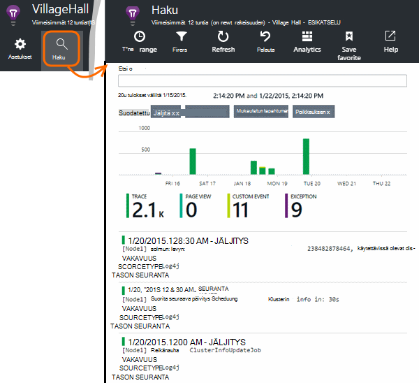

<properties 
    pageTitle="Tutustu Java jäljitys kirjaa hakemuksen tiedot" 
    description="Etsi Log4J tai Logback jäljitystä hakemuksen tiedot" 
    services="application-insights" 
    documentationCenter="java"
    authors="alancameronwills" 
    manager="douge"/>

<tags 
    ms.service="application-insights" 
    ms.workload="tbd" 
    ms.tgt_pltfrm="ibiza" 
    ms.devlang="na" 
    ms.topic="article" 
    ms.date="07/12/2016" 
    ms.author="awills"/>

# Tutustu Java jäljitys kirjaa hakemuksen tiedot

Jos käytät Logback tai Log4J (v1.2 tai v2.0) jäljitys, voit määrittää jäljityksen lokit lähetetään automaattisesti sovelluksen havainnollistamisen, jossa voit tarkastella ja etsiä niitä.

Asenna [Sovellus havainnollistamisen SDK Java][java], jos et ole vielä tehnyt.

## Kirjaaminen kirjastojen lisääminen projektiin

*Valitse projektin sopivalla tavalla.*

#### Jos käytät maven-testi...

Jos projektisi on jo määritetty käyttämään maven-testi muodosta, Yhdistä jompikumpi seuraavista katkelmat koodin pom.xml-tiedostoon.

Päivitä sitten Projektiriippuvuudet, saat binaaritiedostot ladataan.

*Logback*

    <dependencies>
       <dependency>
          <groupId>com.microsoft.azure</groupId>
          <artifactId>applicationinsights-logging-logback</artifactId>
          <version>[1.0,)</version>
       </dependency>
    </dependencies>

*Log4J v2.0*

    <dependencies>
       <dependency>
          <groupId>com.microsoft.azure</groupId>
          <artifactId>applicationinsights-logging-log4j2</artifactId>
          <version>[1.0,)</version>
       </dependency>
    </dependencies>

*Log4J v1.2*

    <dependencies>
       <dependency>
          <groupId>com.microsoft.azure</groupId>
          <artifactId>applicationinsights-logging-log4j1_2</artifactId>
          <version>[1.0,)</version>
       </dependency>
    </dependencies>

#### Jos käytät Gradle...

Jos projektisi on jo määritetty käyttämään Gradle muodosta, Lisää seuraavat rivit `dependencies` ryhmän build.gradle tiedostossa:

Päivitä sitten Projektiriippuvuudet, saat binaaritiedostot ladataan.

**Logback**

    compile group: 'com.microsoft.azure', name: 'applicationinsights-logging-logback', version: '1.0.+'

**Log4J v2.0**

    compile group: 'com.microsoft.azure', name: 'applicationinsights-logging-log4j2', version: '1.0.+'

**Log4J v1.2**

    compile group: 'com.microsoft.azure', name: 'applicationinsights-logging-log4j1_2', version: '1.0.+'

#### Muussa tapauksessa...

Lataa ja poimia haluamasi appender ja sitten oikeaan kirjastoon lisääminen projektiin:

Lokin | Lataa | Kirjasto
----|----|----
Logback|[SDK Logback appender kanssa](https://aka.ms/xt62a4)|applicationinsights kirjaaminen-logback
Log4J v2.0|[SDK Log4J v2 appender kanssa](https://aka.ms/qypznq)|applicationinsights kirjaaminen-log4j2 
Log4j v1.2|[SDK Log4J v1.2 appender kanssa](https://aka.ms/ky9cbo)|applicationinsights kirjaaminen-log4j1_2 

## Lisää appender kirjaaminen framework

Voit määrittää, että jäljittää, Yhdistä Log4J tai Logback-kokoonpanotiedosto koodin asiaa katkelma: 

*Logback*

    <appender name="aiAppender" 
      class="com.microsoft.applicationinsights.logback.ApplicationInsightsAppender">
    </appender>
    <root level="trace">
      <appender-ref ref="aiAppender" />
    </root>

*Log4J v2.0*

    <Configuration packages="com.microsoft.applicationinsights.Log4j">
      <Appenders>
        <ApplicationInsightsAppender name="aiAppender" />
      </Appenders>
      <Loggers>
        <Root level="trace">
          <AppenderRef ref="aiAppender"/>
        </Root>
      </Loggers>
    </Configuration>

*Log4J v1.2*

    <appender name="aiAppender" 
         class="com.microsoft.applicationinsights.log4j.v1_2.ApplicationInsightsAppender">
    </appender>
    <root>
      <priority value ="trace" />
      <appender-ref ref="aiAppender" />
    </root>

Sovelluksen tiedot-appenders voidaan viitata minkä tahansa määritetyn tapahtumalokin ja ei välttämättä pääkansion lokin (katso yllä MALLIKOODEJA-).

## Tutustu oman jäljittää sovelluksen tiedot-portaalissa

Nyt kun olet määrittänyt projektin jäljittää lähettäminen hakemuksen tiedot, voit tarkastella ja etsiä nämä jäljittää sovelluksen tiedot-portaalissa [haun] [ diagnostic] sivu.

## Seuraavat vaiheet

[Diagnostiikan haku][diagnostic]

<!--Link references-->

[diagnostic]: app-insights-diagnostic-search.md
[java]: app-insights-java-get-started.md

 
