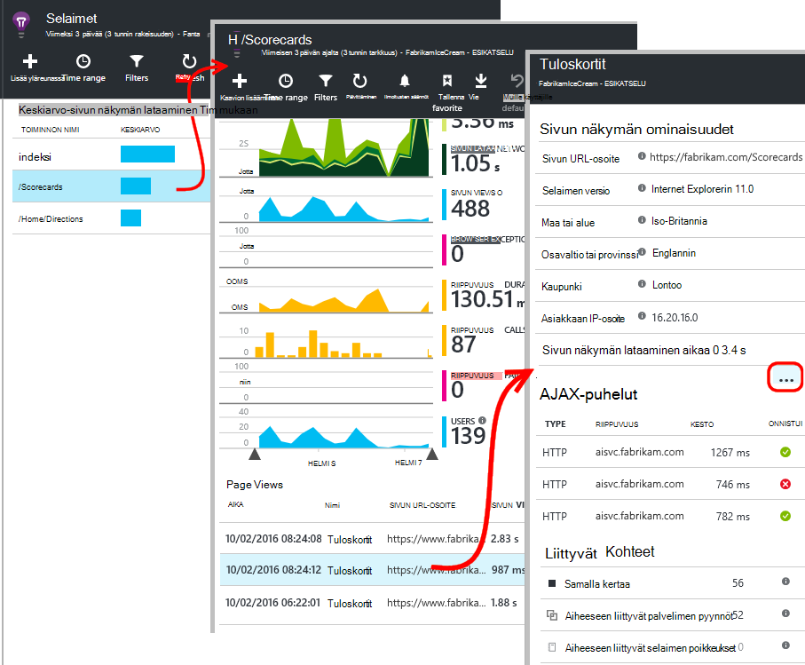

<properties
    pageTitle="Sovelluksen tietoa JavaScript-web-sovellusten | Microsoft Azure"
    description="Hae sivun näkymän ja istunnon laskee-Web-sivuston asiakkaan tiedot, ja seuraa käyttötavat. Tunnista JavaScript-web-sivujen poikkeukset ja suorituskykyongelmia."
    services="application-insights"
    documentationCenter=""
    authors="alancameronwills"
    manager="douge"/>

<tags
    ms.service="application-insights"
    ms.workload="tbd"
    ms.tgt_pltfrm="ibiza"
    ms.devlang="na"
    ms.topic="get-started-article"
    ms.date="08/15/2016"
    ms.author="awills"/>

# Verkkosivujen sovelluksen tietoa

[AZURE.INCLUDE [app-insights-selector-get-started-dotnet](../../includes/app-insights-selector-get-started-dotnet.md)]

Tutustu suorituskyvyn ja käyttömäärän verkkosivu tai sovelluksen. Jos lisäät Visual Studio hakemuksen tiedot sivun komentosarjan, saat ajoitukset sivujen latausaikaa sekunneilla AJAX puhelut, määrät ja selaimen poikkeukset ja AJAX virheet, sekä käyttäjien ja istunnon laskee tiedot. Kaikki näihin voit Segmentoitu sivun, asiakkaan käyttöjärjestelmän ja selaimen versio, geo sijainti ja muiden dimensioiden. Voit myös ilmoitusten määrittäminen epäonnistui laskee tai hidastaa sivun lataamista.

Voit käyttää sovelluksen havainnollistamisen web-sivuilla – voit lisätä lyhyt JavaScript-osan. Web-palvelu on [Java](app-insights-java-get-started.md) tai [ASP.NET](app-insights-asp-net.md), voit integroida Serveristä ja asiakkaiden telemetriatietojen.

Tarvitset [Microsoft Azure](https://azure.com)-tilausta. Jos ryhmä on organisaation tilauksen, pyydä omistajaa Microsoft Account lisääminen. Ei vapaa hinnoittelu taso, joten kehittäminen ja pieniä käyttö ei kustannusten mitään.

## Web-sivun tiedot sovelluksen määrittäminen

Ensin sinun on lisättävä verkkosivujen sovelluksen tiedot? Ehkä jo tehnyt niin. Jos valitsit Lisää sovellus havainnollistamisen web App-sovellukseen, uusi projekti-valintaikkunassa Visual Studiossa, komentosarja on lisätty sitten. Tässä tapauksessa ei tarvitse tehdä mitään muuta.

Muussa tapauksessa sinun on lisättävä koodi katkelma web-sivuille seuraavasti.

### Avaa sovelluksen tiedot-resurssi

Hakemuksen tiedot resurssi on, jolloin sivun suorituskyvyn ja käyttömäärän koskevia tietoja näkyy. 

Kirjautua [Azure-portaaliin](https://portal.azure.com).

Jos määrität jo sovelluksesi palvelinpuolen seurantaa, sinulla on jo resurssi:

Jos sinulla ei ole, luo se:

*Jo kysymyksiä?* [Lisätietoja resurssin luominen](app-insights-create-new-resource.md).

### Sovelluksen tai web-sivujen SDK-komentosarjan lisääminen

Pikaoppaassa hakeminen verkkosivujen komentosarja:

Lisää juuri ennen komentosarjan `</head>` jokaisen sivun, jota haluat seurata tunnistetta. Jos sivuston perustyylisivun, voit sijoittaa komentosarja siellä. Esimerkki:

* ASP.NET-MVC projektin lisäät sen`View\Shared\_Layout.cshtml`
* Avaa SharePoint-sivustoon, valitse Ohjauspaneelin [sivustoasetuksiin / perustyylisivu](app-insights-sharepoint.md).

Komentosarja on instrumentation avain, joka ohjaa hakemuksen tiedot resurssin tiedot. 

([Tarkempaa selvitys siitä, käytössä](http://apmtips.com/blog/2015/03/18/javascript-snippet-explained/))

*(Jos käytät tunnetun web-sivun kehys, Etsi hakemuksen tiedot sovittimia. Http://servername, on [AngularJS-moduuli](http://ngmodules.org/modules/angular-appinsights).)*

## Määrityksistä

On useita [parametreja](https://github.com/Microsoft/ApplicationInsights-JS/blob/master/API-reference.md#config) voit määrittää, mutta useimmissa tapauksissa sinun ei kannata täytyy. Voit esimerkiksi poistaa käytöstä tai rajoittaa Ajax kutsuja raportoitu sivunäkymän kohden (Voit pienentää liikenne). Tai voit määrittää Virheenkorjaustila on siirtyä nopeasti putkijohto ilman, että erämuotoinen telemetriatietojen.

Voit määrittää nämä parametrit Etsi koodikatkelman tämän rivin ja lisätä sen jälkeen CSV-kohteita:

    })({
      instrumentationKey: "..."
      // Insert here
    });

[Käytettävissä olevat parametrit](https://github.com/Microsoft/ApplicationInsights-JS/blob/master/API-reference.md#config) ovat:

    // Send telemetry immediately without batching.
    // Remember to remove this when no longer required, as it
    // can affect browser performance.
    enableDebug: boolean,

    // Don't log browser exceptions.
    disableExceptionTracking: boolean,

    // Don't log ajax calls.
    disableAjaxTracking: boolean,

    // Limit number of Ajax calls logged, to reduce traffic.
    maxAjaxCallsPerView: 10, // default is 500

    // Time page load up to execution of first trackPageView().
    overridePageViewDuration: boolean,

    // Set these dynamically for an authenticated user.
    appUserId: string,
    accountId: string,

## Suorita sovellus

Suorita web app-käyttää sitä Luo telemetriatietojen ja odota hetki jonkin aikaa. Voit suorittaa käyttämällä **F5** -näppäintä kehittäminen tietokoneeseen tai julkaista sen ja toistaa sitä käyttäjille.

Jos haluat tarkistaa, joka lähettää verkkosovellukseen sovelluksen havainnollistamisen telemetriatietojen, käytä selaimen vianmääritystyökaluista (**F12** -selaimissa). Tiedot lähetetään dc.services.visualstudio.com.

## Tietojen selaimen suorituskyky

Avaa näyttämään koostetun suorituskykytietoja käyttäjien selaimilla selaimet-sivu.

*Ei ole vielä tietoja? Valitse * *Päivitä* * sivun yläreunassa. Edelleen mitään? Katso [vianmääritys](app-insights-troubleshoot-faq.md).*

Selaimet-sivu on [mittarit Explorer sivu](app-insights-metrics-explorer.md) ja valmiit suodattimet-kaavion valinnat. Voit muokata aikaväli, suodattimien ja kaavion määrittäminen Jos ja tallentaa tuloksen suosikkeihin. Valitse **Palauta oletusarvot** pääset takaisin alkuperäiseen sivu-määritys.

## Sivun kuormituksen suorituskyky

Ylimpänä on Segmentoitu kaavion sivujen lataamista. Kaavion yhteensä korkeutta edustaa keskimääräinen aika lataamisen ja näyttää sivujen sovelluksestasi käyttäjien selaimissa. Aika mitataan kun selain lähettää alkuperäisen HTTP-pyynnön ennen kuin kaikki synkronisen kuormituksen tapahtumien käsitelty, mukaan lukien asettelun ja komentosarjojen suorittaminen. Se ei sisällä asynkroninen tehtäviä, kuten ladataan verkko-osien AJAX puhelut.

Kaavion lohkoja kokonaissivumäärä latausajasta [Vakio ajoitukset W3C määrittämiä](http://www.w3.org/TR/navigation-timing/#processing-model)kyselyjä. 

Huomaa, että *verkkoyhteyden* aika on usein pienempi kuin voisi olettaa, koska se on keskiarvoon kaikki palvelupyynnöt selaimesta palvelimen kautta. Useita yksittäisiä pyynnöt on muodostettaessa 0, koska on jo aktiivisen yhteyden palvelimeen.

### Hidas lataaminen?

Hidas sivujen latausaikaa sekunneilla ovat tyytymättömyyden käyttäjien pää lähteen. Jos kaavio osoittaa hidas sivujen latausaikaa sekunneilla, on helppo tehdä joitakin diagnostiikan Oheistiedot.

Kaavio näyttää kaikkien sivujen latausaikaa sekunneilla keskiarvo-sovelluksen. Jos ongelma vain tietyt sivut näkyviin kohde alemmas sivu, ei ruudukon Segmentoitu sivun URL-osoitteen avulla:

Huomaa, että Näytä sivumäärä ja keskihajonta. Jos sivujen määrä on hyvin pieni, valitse ongelma ei ole vaikuttavia käyttäjien paljon. Suuri (vastaa itse keskiarvo) keskihajonta ilmaisee useita yksittäisiä mitat välillä.

**Suurentaa yksi URL-osoite ja yksi sivu-näkymässä.** Valitse minkä tahansa sivun nimi, jos haluat nähdä suodatettuna vain kyseisen URL-osoite selaimen kaaviot sivu ja sen jälkeen, valitse sivu-näkymä esiintymän.

Valitse `...` kyseisen tapahtuman ominaisuudet täydellinen luettelo tai tarkastaa Ajax puhelut ja niihin liittyvät tapahtumat. Hidas Ajax puhelut vaikuttavat koko sivun latausajasta, jos ne on synkronoitu. Aiheeseen liittyvät tapahtumat sisältävät pyynnöt palvelimen URL-Osoitetta (Jos olet asentanut sovelluksen havainnollistamisen verkkosivustoon).

**Sivun suorituskyky ajan kuluessa.** Selaimet, sivu uudelleen milloin Muuta sivun näkymän Latausajasta ruudukon viivakaavio, ovatko oli päät tietyn aikoina:

**Määritetään muiden dimensioiden mukaan.** Sivut ovat ehkä hitaammin lataaminen selaimeen, asiakkaan OS tai käyttäjän paikka? Lisää uusi kaavio ja kokeilla **Group by** -dimensio.

## AJAX-suorituskyky

Varmista, että AJAX puhelujen web-sivujen toimivat hyvin. Niitä käytetään usein täyttää sivun osat asynkronisesti. Vaikka yleinen sivua voi ladata välittömästi, käyttäjien saattaa voidaan kehysnopeuteen staring on tyhjä verkko-osat, odotetaan, ne näkyvät tiedot.

Selaimet sivu näytetään web-sivulta AJAX puhelujen riippuvuudet nimellä.

Yhteenvetokaaviot yläosassa sivu on:

ja yksityiskohtainen ruudukoiden alemman alaspäin:

Valitse minkä tahansa rivin tiedot.

> [AZURE.NOTE] Jos poistat selaimet suodatusvaihtoehdot sivu, sekä palvelimessa oleva että AJAX riippuvuudet sisältyvät kaavioista. Valitsemalla Palauta oletusarvot määrittämään suodatin.

**Voit siirtyä epäonnistunut Ajax puhelut** riippuvuuden virheet ruudukon kohtaan ja valitse sitten haluat nähdä tietyn esiintymät.

Valitse `...` koko telemetriatietojen Ajax puhelun varten.

### Ajax-soittoja raportoitu?

AJAX-puhelut sisältävät kaikki HTTP-web-sivun komentosarjan puhelujen. Jos et näe niitä ilmoitettu, tarkista, että koodikatkelman ei `disableAjaxTracking` tai `maxAjaxCallsPerView` [Parametrit](https://github.com/Microsoft/ApplicationInsights-JS/blob/master/API-reference.md#config).

## Selaimen poikkeukset

Selaimet, sivu ei yhteenveto poikkeukset-kaavio ja ruudukko tyyppisiä poikkeuksen edelleen alaspäin sivu.

Jos et näe selaimen poikkeukset ilmoitetaan, tarkista, että koodikatkelman ei `disableExceptionTracking` [parametria](https://github.com/Microsoft/ApplicationInsights-JS/blob/master/API-reference.md#config).

## Tarkasta yksittäisen sivun tapahtumien tarkasteleminen

Yleensä sivun näkymän telemetriatietojen analysoidaan mukaan hakemuksen tiedot ja tuo näkyviin vain kumulatiivinen raportit kaikkien käyttäjien keskiarvona. Mutta vianmääritystä varten, voit myös tarkastella yksittäisen sivun tapahtumien tarkasteleminen.

Määritä suodattimia sivunäkymän diagnostiikan haku-sivu.

Valitse mikä tahansa tapahtuma yksityiskohdat. Valitse tiedot-sivulla "..." jopa yksityiskohdat.

> [AZURE.NOTE] Jos käytät [haun](app-insights-diagnostic-search.md), Huomaa, että sinulla on vastattava koko sanat: "Abou" ja "tietoja" eivät vastaa "Tietoja".

Voit käyttää tehokkaita [Analytics kyselyn kielen](app-insights-analytics-tour.md) etsimään sivun näkymät.

### Sivun ominaisuuksien tarkasteleminen

* **Sivun näkymän kesto** 

 * Oletusarvon mukaan-sivulla Lataa asiakkaan kuluvaa aikaa pyytää täyden kuormituksen (mukaan lukien Aux tiedostot mutta lukuun ottamatta asynkroninen tehtäviä, kuten Ajax soittaa). 
 * Jos määrität `overridePageViewDuration` [sivun määritysten](#detailed-configuration)asiakkaan väli pyytää suorittamisen ensimmäisen `trackPageView`. Jos olet siirtänyt trackPageView sen tavallista kohdasta komentosarja alustamisen jälkeen, se vaikuttavat eri arvon.
 * Jos `overridePageViewDuration` määrittäminen ja argumentti on säädetty kesto `trackPageView()` Soita-argumentin arvo on käyttää sen sijaan. 

## Mukautetun sivun laskee

Sivujen määrä tapahtuu oletusarvon mukaan aina, kun uusi sivu ladataan selaimeen.  Mutta voit laskea muita sivun näkymät. Esimerkiksi sivun voivat näkyä sisällön välilehdet ja haluat laskea sivuun, kun käyttäjä vaihtaa välilehdet. Tai JavaScript-koodia sivulla voi ladata uutta sisältöä muuttamatta selaimen URL-osoite.

Lisää JavaScript puhelun tältä asiakas-koodin haluamasi kohtaan:

    appInsights.trackPageView(myPageName);

Sivun nimi voi olla samaa merkkiä URL-osoitteena, mutta mikä tahansa "#" tai "?" ohitetaan.

## Seurannan käyttö

Haluatko selvittää, mitä käyttäjien tehdä sovelluksen?

* [Lisätietoja käyttö seuranta](app-insights-web-track-usage.md)
* [Lue lisää mukautetut tapahtumat ja arvot API](app-insights-api-custom-events-metrics.md).

#### Video: Käytön seuranta

> [AZURE.VIDEO tracking-usage-with-application-insights]

## Seuraavat vaiheet

* [Seurata käyttöä](app-insights-web-track-usage.md)
* [Mukautetut tapahtumat ja arvot](app-insights-api-custom-events-metrics.md)
* [Mittayksikön muodosta lisätietoja](app-insights-overview-usage.md)

