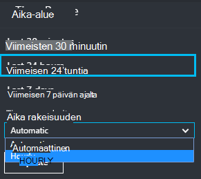

<properties 
    pageTitle="Tutustuminen hakemuksen tiedot arvot | Microsoft Azure" 
    description="Tulkitseminen metrisillä explorer kaavioita ja mukauttamisesta metrisillä explorer lavat." 
    services="application-insights" 
    documentationCenter=""
    authors="alancameronwills" 
    manager="douge"/>

<tags 
    ms.service="application-insights" 
    ms.workload="tbd" 
    ms.tgt_pltfrm="ibiza" 
    ms.devlang="na" 
    ms.topic="article" 
    ms.date="10/15/2016" 
    ms.author="awills"/>
 
# Hakemuksen tiedot arvot tutustuminen

[Hakemuksen tiedot] arvot[ start] on, arvojen ja tapahtumia, jotka lähetetään telemetriatietojen sovelluksestasi määrät. Niiden avulla voit havaita suorituskykyongelmia ja katso, miten sovelluksesi käytetään trendien. On vakio arvot monien ja voit myös luoda oman mukautetun arvot ja tapahtumia.

Arvot ja tapahtuman laskee näkyvät koostetun arvoja, kuten summien, keskiarvojen ja laskee kaavioita.

Tässä on esimerkki kaavion:

Jotkin kaaviot ovat Segmentoitu: yhteensä milloin tahansa kaavion korkeutta saadaan laskemalla yhteen arvot näytetään. Oletusarvon mukaan selite näkyvät suurin määrät.

Pisteviivoja Näytä lisätiedot arvosta yhden viikon.

## Aika-alue

Voit muuttaa kaaviossa tai ruudukossa, valitse mikä tahansa sivu piiriin aikaväli.

Jos olet puuttuu tietoja, joita ei ole vielä näkyviin, valitse Päivitä. Kaavioiden päivittäminen itse väliajoin, mutta välit on pidempi suurempi aikavälin. Release-tilassa se voi viedä aikaa tiedot säilyvät analyysi putkijohto kaavion päälle.

Jos haluat lähentää osa kaaviosta, vedä päälle:

Palauttaa sen valitsemalla Kumoa Zoomaa.

## Rakeisuuden ja pisteen arvot

Hiiren osoitinta kaavion näytettävät arvot arvot senhetkinen.

Edellisen esimerkkejä ajalta koostetaan tiettynä metrijärjestelmä arvo. 

Esimerkkejä välin tai "rakeisuuden" näkyy yläreunaan sivu. 

Voit muuttaa aika-alueen sivu rakeisuuden:

Käytettävissä olevat tarkkuudet määräytyvät sen mukaan, mitä valitset aikaväli. Eksplisiittinen tarkkuudet ovat "Automaattinen" rakeisuuden aika-alueella. 

## Arvot Explorer

Napsauttamalla mitä tahansa kaavion saat näkyviin tarkempia joukko liittyvät kaavioita ja ruudukoita yhteenveto-sivu. Voit muokata näitä kaavioita ja ruudukoita keskittyminen käyttämällä tiedot.

Tai voit napsauttaa yhteenveto-sivu muistissaan arvot Explorer-painike.

Valitse esimerkiksi web-sovelluksen epäonnistui pyynnöt kaavion kautta:

## Mitä luvut tarkoittavat?

Oletusarvoisesti reunassa selitteessä näkyvät yleensä koostetun arvon kaavion kuluessa. Jos pidät osoitinta kaavion päällä, se näyttää arvon senhetkinen.

Kunkin arvopisteen kaaviossa on vastaanotettu edellisen esimerkkejä välin tai "rakeisuuden" arvojen kooste. Rakeisuuden yläreunaan sivu näkyy ja vaihtelee kaavion yleinen aikajanaa.

Arvot voidaan koota useilla eri tavoilla: 

 * **Summa** laskee yhteen kaikki vastaanotettu esimerkkejä välin tai kauden kaavion arvopisteiden arvot.
 * **Keskimääräinen** jakaa summan vastaanotettu ajalta arvopisteiden määrä.
 * Käyttäjien ja -tilien määrät käytetään **yksilöllinen** arvo. Esimerkkejä ajalta tai kaavion ajanjakson kuvassa tänä nähdä eri käyttäjien määrää.

Voit muuttaa kooste-menetelmää:

Kunkin metrijärjestelmä oletustapa näkyy, kun luot uuden kaavion tai kun kaikki arvot ovat valitsematta:

## Kaavioiden ja ruudukoiden muokkaaminen

Voit lisätä uuden kaavion sivu seuraavasti:

Valitse **Muokkaa** olemassa oleva vai uusi kaaviossa voit muokata, se näkyy:

Voit näyttää useita metrijärjestelmä kaaviossa, mutta ole tietoja, jotka voidaan näyttää yhdessä yhdistelmät rajoituksia. Heti, kun valitset yhden metrijärjestelmä, jotkin muiden eivät ole käytettävissä. 

Jos [mukautettua arvot] koodattu[ track] kyselyjä sovelluksen (kutsujen TrackMetric ja TrackEvent) ne näkyvät tässä.

## Tiedot

Voit jakaa mittarin ominaisuus - esimerkiksi verrata sivun näkymiä asiakassovelluksissa eri käyttöjärjestelmien kanssa. 

Valitse kaaviossa tai ruudukossa, siirry ryhmittelyyn ja Ryhmittele ominaisuus:

> [AZURE.NOTE] Kun käytät ryhmittely, alue- ja palkkikaavion tyypit mahdollistavat pinottu näyttö. Tämä on sopiva, missä kooste-menetelmä summa. Mutta missä yhdistämistapa keskiarvon, valitse viivan tai Ruudukon näyttäminen tiedostotyypit. 

Jos [mukautettua arvot] koodattu[ track] sovelluksen kyselyjä ja ne sisältävät ominaisuusarvoihin, voit tarvittaessa Valitse ominaisuus luettelosta.

Kaavio on pieni segmentoidun tietojen? Muuta korkeutta:

## Tietojen suodattaminen

Jos haluat nähdä vain valitun arvojoukon ominaisuuden arvot:

Jos et valitse tietyn ominaisuuden arvoja, on sama kuin valitsemalla ne kaikki: ei ole suodatin kyseisestä ominaisuudesta.

Huomaa tapahtumien rinnalla kunkin ominaisuusarvon määrät. Kun valitset yhden ominaisuuden arvoja, laskee rinnalla muiden ominaisuusarvojen muutetaan.

Suodattimien sivu kaikissa kaavioissa. Jos haluat eri kaavioita eri suodattimet, luoda ja tallentaa eri arvot lavat. Jos haluat, voit kiinnittää kaavioiden eri lavat-koontinäyttö, niin, että näet ne toisistaan: n rinnalla.

### Poista robotti ja web-testi liikenne

Suodatus **reaali tai synteettiset liikenteen** ja tarkista **reaaliluku**.

Voit myös suodattaa **synteettistä liikenteen lähteen**mukaan.

### Voit lisätä ominaisuuksia suodattimen luettelo

Haluat suodattaa luokan oman valitsemisen telemetriatietojen? Esimerkiksi ehkä Jaa eri luokkiin käyttäjien määrittäminen ja haluat tietojen määritetään näiden luokkien mukaan.

[Luo omia ominaisuus](app-insights-api-custom-events-metrics.md#properties). Määrittää sen [Telemetriatietojen alustaja](app-insights-api-custom-events-metrics.md#telemetry-initializers) sen näkyvät kaikki telemetriatietojen - eri SDK moduulit lähettämä vakio telemetriatietojen mukaan lukien.

## Kaavion muokkaaminen

Huomaa, että voit siirtyä ruudukoiden ja kaaviot:

## Tallenna arvot-sivu

Kun olet luonut joidenkin kaavioiden, tallenna ne suosikiksi. Voit jakaa sen ryhmän muiden jäsenten kanssa, jos käytössäsi on organisaatiotili.

Jos haluat nähdä sivu uudelleen, **Siirry yhteenveto-sivu** ja Avaa Suosikit:

Jos olet valinnut suhteellinen aikavälin, kun olet tallentanut, sivu päivitetään uusimman arvot. Jos valitsit suora aikavälin, se näyttää samat tiedot aina.

## Palauta sivu

Jos muokkaat sivu, mutta valitse haluat palata alkuperäiseen tallennettu määrittäminen, valitse Palauta.

## Live arvot muodossa: pikaviestien arvot Sulje seurantaa varten

Live arvot muodossa Näyttää sovelluksen arvot oikealle tällä hetkellä hyvin, sekunnin viive lähelle reaaliaikainen kanssa. Tämä on erittäin hyödyllinen silloin, kun olet vapauttaminen uusi versio ja haluat varmistaa, että kaikki kohdat ovat toimimasta oikein tai tutkiminen tapahtuma reaaliajassa.

Toisin kuin arvot Resurssienhallinnassa Live arvot muodossa näyttää kiinteän joukon arvot. Tietoja jatkuu vain, kunhan se on kaavion ja sitten poistetaan. 

Live arvot muodossa on käytettävissä sovelluksen havainnollistamisen SDK ASP.NET-version 2.1.0 tai uudempi versio.

## Ilmoitusten määrittäminen

Saat ilmoituksen sähköpostitse epätavallisia arvoista, mikä tahansa arvo, lisää ilmoituksen. Voit käyttää joko tilin järjestelmänvalvojille tai tietyn sähköpostiosoitteen sähköpostiviestin lähettäminen.

[Lisätietoja ilmoitusten][alerts].

## Tietojen vieminen Exceliin

Voit viedä metrisillä Excel-tiedostoon metrijärjestelmä Explorerissa näkyvien tietojen. Viedyille tiedoille sisältää tietoja kaikista kaavioiden ja taulukoiden tarkastelu-portaalissa. 

Kunkin kaavion tai taulukon tiedot viedään erilliseen laskentataulukkoon Excel-tiedoston.

Mitä näkyy mitä viedään. Muuta aikaväli tai suodattimet, jos haluat muuttaa tiedot viedään. Taulukoiden, jos **ladata lisää** -komento on näkyvissä, napsauttamalla sitä ennen kuin valitset viennin, voit viedä enemmän tietoja.

*Vie toimii Internet Explorer ja Chrome tällä hetkellä. Pyrimme parhaillaan korjaamaan lisääminen tuki muissa selaimissa.*

## Jatkuva vienti

Jos haluat viedä jatkuvasti niin, että voit käsitellä ulkoisesti tietoja, kannattaa käyttää [Jatkuva Vie](app-insights-export-telemetry.md).

### Power BI

Jos haluat, että tietosi entistä monipuolisempi näkymiä, voit [viedä Power BI](http://blogs.msdn.com/b/powerbi/archive/2015/11/04/explore-your-application-insights-data-with-power-bi.aspx).

## Analytics

[Analyysin](app-insights-analytics.md) on monipuolisemman voi analysoida oman telemetriatietojen tehokkaita kysely-kielellä. Käytä tätä, jos haluat yhdistää tai laskea tulokset-arvot tai suorittaa deph-siihen tarkemmin sinua sovelluksen viimeisimmät suorituskyvyn. Toisaalta Käytä arvot Explorer, jos haluat automaattisen päivityksen kaavioita Raporttinäkymät-ikkunan ja ilmoitukset.

## Vianmääritys

*Kaikki tiedot eivät näy kaaviota.*

* Suodattimet sivu kaikissa kaavioissa. Varmista, että samalla, kun olet keskitytään yhden kaavion, voit ei ole määritetty suodatin, joka jättää huomiotta kaikki tiedot toiseen. 

    Jos haluat määrittää erilaisia kaavioita eri suodattimia, luoda niitä eri terät, tallenna ne kuin erillisessä Suosikit. Jos haluat, voit kiinnittää ne koontinäyttö niin, että näet ne toisistaan: n rinnalla.

* Jos kaavion Ryhmittelyperuste ominaisuus, joka ei ole määritetty lisätiedot, valitse ilmenee mitään kaaviossa. Kokeile 'Ryhmittelyperuste', tai valitse eri ryhmittely-ominaisuus.
* Suorituskykytietoja (suorittimen, IO korko ja niin edelleen) on käytettävissä Java verkkopalvelut, Windowsin Työpöytäsovellukset [IIS-WWW-sovelluksia ja palveluja, jos asennat tilan valvonta](app-insights-monitor-performance-live-website-now.md)tai [Azure pilvipalveluihin](app-insights-azure.md). Ei ole käytettävissä Azure sivustot.

## Seuraavat vaiheet

* [Käyttötapa hakemuksen tiedot ja seuranta](app-insights-overview-usage.md)
* [Diagnostiikan haun avulla](app-insights-diagnostic-search.md)

<!--Link references-->

[alerts]: app-insights-alerts.md
[start]: app-insights-overview.md
[track]: app-insights-api-custom-events-metrics.md

 