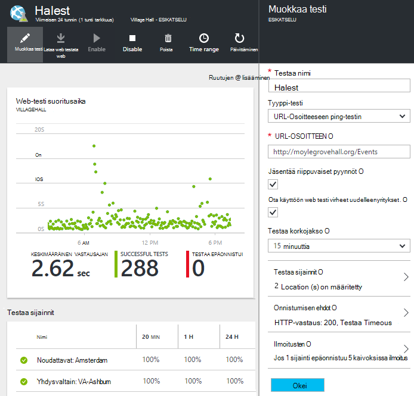

<properties 
    pageTitle="Hakemuksen tiedot käytettävyys testien Azure päätepisteen siirtäminen" 
    description="Siirtyminen perinteinen Azure päätepisteen seuranta testien kyselyjä hakemuksen tiedot käytettävyys Testaa 2016 31 lokakuun mukaan."
    services="application-insights" 
    documentationCenter=""
    authors="soubhagyadash" 
    manager="douge"/>

<tags 
    ms.service="application-insights" 
    ms.workload="tbd" 
    ms.tgt_pltfrm="ibiza" 
    ms.devlang="na" 
    ms.topic="article" 
    ms.date="07/25/2016" 
    ms.author="awills"/>
 
# Hakemuksen tiedot käytettävyys testejä seurannasta Azure päätepisteen siirtäminen

Käytät [päätepisteen seuranta](https://blogs.msdn.microsoft.com/mast/2013/03/03/windows-azure-portal-update-configure-web-endpoint-status-monitoring-preview/) Azure-sovellusten? *31 lokakuussa 2016*, mukaan olemme niiden tilalle uusi ja tehokkaampaa [käytettävyys testit](app-insights-monitor-web-app-availability.md). On jo luonut joitakin uuden testejä, vaikka ne on poistettu käytöstä ennen 2016 31 lokakuun. 

Voit muokata uusia testejä ja tee Vaihda itse halutessasi. Voi etsiä niitä [Azure portal](https://portal.azure.com) oletusarvo-ApplicationInsights-CentralUS resurssiryhmä.

## Mitkä ovat käytettävyys testien?

Azure, joka tarkistaa jatkuvasti, että sivuston tai palvelu on käytössä ja käynnissä ominaisuus käytettävyys testaus on lähettämällä pyyntöjen siihen (yksi ping tai Visual Studio web testit) enintään 16 sijainneista eri puolilla maailmaa. 

[Perinteinen Azure portal](https://manage.windowsazure.com)testit kutsuttiin päätepisteen seuranta. Hän lisää vain alueen. Uusi käytettävyys testejä on merkittävästi:

* Enintään 10 Visual Studio web tai ping testit hakemuksen tiedot resurssia kohden. 
* Enintään 16 sijainnit maailmanlaajuisesti testi pyynnöt lähettäminen web Appissa. Ohjata testi onnistumisen ehdot. 
* Testaa sivuston tai palvelu - vain Azure verkkosovelluksissa.
* Testaa uudelleenyritykset: Pienennä positiivisiin ilmoitusten lyhytkestoisia verkko-ongelmien vuoksi. 
* Webhooks saavat ilmoituksia HTTP POST ilmoitukset.

Lisätietoja [käytettävyys testien tähän](app-insights-monitor-web-app-availability.md).

Käytettävyys testit ovat osa [Visual Studio hakemuksen tiedot](app-insights-overview.md), joka on extensible analytics-palvelu, minkä tahansa web-sovelluksen.

## Niin Omat päätepisteen tapahtumat Testaa?

* Uuden sovelluksen havainnollistamisen käytettävyys testejä testien seuranta päätepiste kopioinut.
* Uusi käytettävyys testejä on poistettu käytöstä ja vanha päätepisteen testejä on edelleen käytössä.
* Ilmoitat sääntöjen *ei* siirretä. Uusi testejä alun perin on määritetty oletusarvoinen säännön:
 * Käynnistimien, kun enintään 1 sijainti ilmoittaa virheet 5 minuuttia.
 * Lähettää sähköpostia tilaus-järjestelmänvalvojille.

[Azure portal](https://portal.azure.com)löytyvät siirretyt testejä "Oletus-ApplicationInsights-CentralUS" resurssiryhmän. Testaa nimet ovat etuliite "Migrated-". 

## Mikä on suoritettava?

* Jos olemme vastattu aiheuttaa siirtyminen testejä, uusi käytettävyys testejä on [helppo määrittäminen](app-insights-monitor-web-app-availability.md).

### Vaihtoehto A: tee mitään. Jätä meille.

**31 lokakuussa 2016, valitse** Microsoft on:

* Poista vanha päätepisteen testejä.
* Ota käyttöön siirretyt käytettävyys testejä.

### Vaihtoehto B: Voit hallita ja/tai uusi testejä.

* Tarkastelu ja muokkaus uusi käytettävyys Testaa uuden [Azure portal](https://portal.azure.com). 
 * Tarkista käynnistimen ehdot
 * Tarkista sähköpostin vastaanottajien
* Uusi testejä ottaminen käyttöön
* Microsoft poistaa vanhoja päätepisteen seuranta 2016 31 lokakuun testit käytöstä 

### C: vaihtoehto Suostumuksen antamista ulos

Jos et halua käyttää käytettävyys testit, voit poistaa ne [Azure](https://portal.azure.com)-portaalissa. On myös tilauksen peruutuslinkki ilmoituksen sähköpostitse alareunassa.

Emme silti poistaa vanhoja päätepisteen testit 2016 31 lokakuun. 

## Miten uusi testejä muokata?

Kirjautuminen [Azure portal](https://portal.azure.com) ja etsi 'Migrated-' web-testit: 

Muokkaa ja/tai testi:

## Mistä tämä johtuu?

Parempi palvelu. Vanha päätepisteen-palvelu on paljon enemmän. Voit määrittää kahdella URL-osoitteet yksinkertainen ping-testeissä 3 Azure AM tai web-sovelluksen geo sijainneista. Uusi testejä suorittamisen monivaiheinen web-testien ylöspäin 16 sijainnit ja voit määrittää enintään 10 testien sovelluksen. Voit testata URL-Osoitteen – sen ei tarvitse olla Azure sivusto.

Uusi testejä määritetään erikseen web App-sovelluksen tai AM, jotka olet testaamiseen. 

Olemme siirrettävissä testejä varmistamiseksi päättää niitä käyttäessäsi uuden portaalin jatkat. 

## Mikä on hakemuksen tiedot?

Uusi käytettävyys testejä kuuluvat [Visual Studio hakemuksen tiedot](app-insights-overview.md). Seuraavassa on [2 minuutin videossa](http://go.microsoft.com/fwlink/?LinkID=733921).

## Olen voin maksaa uusi testeissä?

Siirretyt testejä määritetään-sovelluksen tiedot-resurssin oletusarvon vapaa palvelupakettiin. Näin sivustokokoelman enintään 5 miljoonaa arvopisteiden. Käsittelevään helposti testejä käyttää tällä hetkellä data-asema. 

Jos hakemuksen tiedot, kuten ja luo Lisää käytettävyys tarkistaa tai vahvistaa suorituskyvyn seurantaa ja diagnostiikan ominaisuuksia, sinun Luo enemmän arvopisteitä.  Kuitenkin tulos olisi vain vapaa suunnitelman kiintiön ehkä valitset. Et vastaanota laskun ellei osallistua Standard tai Premium-palvelupaketin. 

[Lue lisää siitä, sovelluksen havainnollistamisen hinnat ja kiintiön seuranta](app-insights-pricing.md). 

## Mikä on ja ei siirretä?

Säilyttää vanha päätepisteen-tuloksia:

* Testataan päätepisteen URL-osoite.
* GEO sijainnit, joista pyynnöt lähetetään.
* Testaa korkojakso pysyy 5 minuuttia.
* Testaa aikakatkaisu pysyy 30 sekuntia. 

Ei siirretä:

* Ilmoitusten käynnistimen sääntö. Sääntö, joka on määrittänyt käynnistimien kun 1 sijainti raportoi virheet 5 minuuttia.
* Ilmoitusten vastaanottajat. Ilmoitus sähköpostit lähetetään tilauksen omistaja ja muiden omistajien. 

## Mistä löydän uusi testejä?

Voit muokata jossakin uusi nyt voit halutessasi. Kirjautuminen [Azure portal](https://portal.azure.com), Avaa **Resurssiryhmät** ja valitse **Oletus-ApplicationInsights-CentralUS**. Kyseisen ryhmän löydät uusi web-testejä. [Lue lisää uusi käytettävyys testejä](app-insights-monitor-web-app-availability.md).

Huomaa, että tästä osoitteesta lähetetään ilmoitus uusista sähköpostiviesteistä: sovelluksen tiedot-ilmoitukset(ai-noreply@microsoft.com)

## Mitä tapahtuu, jos minulla mitään?

Vaihtoehto A koskevat. Syy siirretyt testejä ottaminen käyttöön ja määrittää oletusarvon ilmoitusten sääntöjä, kuten edellä mainittiin. Sinun on voit lisätä minkä tahansa mukautetun ilmoitusten sääntöjä, kuten edellä mainittiin vastaanottajat. Päivitystoiminto poistuu käytöstä aiempien versioiden seuranta testien päätepisteen. 

## Mihin voin antaa palautetta tästä? 

Arvostamme antamaasi palautetta. Ota [meihin yhteyttä sähköpostitse](mailto:vsai@microsoft.com). 

