<properties
    pageTitle="Käynnissä IIS-sivuston suorituskyvyn vianmääritys | Microsoft Azure"
    description="Sivuston suorituskyvyn seuranta ilman käyttöönotto se uudelleen. Käytä erillinen tai sovelluksen havainnollistamisen SDK saat riippuvuuden telemetriatietojen."
    services="application-insights"
    documentationCenter=".net"
    authors="alancameronwills"
    manager="douge"/>

<tags
    ms.service="application-insights"
    ms.workload="tbd"
    ms.tgt_pltfrm="ibiza"
    ms.devlang="na"
    ms.topic="get-started-article"
    ms.date="10/24/2016"
    ms.author="awills"/>

# Välineen web Apps-sovellusten suorituksen tiedot sovelluksen kanssa

*Hakemuksen tiedot on esikatselu.*

Voit soittimen live web-sovelluksessa, jossa Visual Studio hakemuksen tiedot, eikä sinun tarvitse muokkaaminen ja ota uudelleen koodisi. Sovelluksia isännöidään paikallisen IIS-palvelimeen, voit asentaa tilan valvonta; tai jos ne sitten Azure verkkosovelluksissa tai suorittaa Azure-AM, voit asentaa sovelluksen tiedot-tunniste. (On myös erillinen artikkeleita instrumenting [live J2EE web Apps-sovellusten](app-insights-java-live.md) ja [Azure pilvipalveluihin](app-insights-cloudservices.md).)

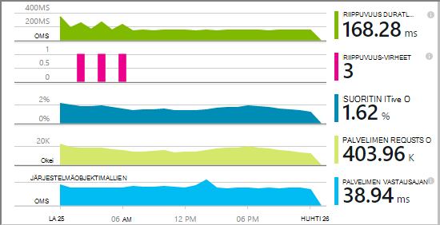

Voit valita seuraavista vaihtoehdoista kolme ohjautuu sen vuoksi, voit käyttää sovelluksen havainnollistamisen .NET-web-sovellusten:

* **Luominen aika:** [Lisää sovellus havainnollistamisen SDK-paketissa] [greenbrown] web app-koodiin. 
* **Suoritusaika:** Soittimen koodiin palvelimessa, seuraavalla tavalla, joiden ja mallirakenteeseen koodi.
* **Sekä:** Muodosta SDK web app-koodiksi ja koskevat myös suorituksenaikainen tunnisteet. Saat parhaan kumpaankin vaihtoehtoon. 

Tässä on yhteenveto kunkin reittiä Hae:

||Luo aika|Suoritusaika|
|---|---|---|
|Pyynnöt ja poikkeukset|Kyllä|Kyllä|
|[Lisää poikkeukset](app-insights-asp-net-exceptions.md)||Kyllä|
|[Riippuvuus diagnostiikka](app-insights-asp-net-dependencies.md)|Valitse .NET 4.6 +|Kyllä|
|[Järjestelmän suorituskyvyn laskureita](app-insights-performance-counters.md)||IIS- tai Azure pilvipalvelussa, ei Azure web Appissa|
|[Mukautetun telemetriatietojen Ohjelmointirajapinta][api]|Kyllä||
|[Jäljitä log-integrointi](app-insights-asp-net-trace-logs.md)|Kyllä||
|[Sivun näkymän ja käyttäjän tiedot](app-insights-javascript.md)|Kyllä||
|Ei tarvitse muodostaa koodi|Ei||

## Soittimen koodiin suorituksen aikana

Tarvitset [Microsoft Azure](http://azure.com) -tilaus.

### Jos sovellus on Azure verkkosovellukseen tai pilvipalvelussa

* Valitse sovelluksen tiedot sovelluksen Ohjauspaneelin Azure-tietokannassa. 

    [Lue lisää](app-insights-azure.md).

### Jos sovelluksesi sijaitsee IIS-palvelimessa

1. IIS-verkkosivustoon Kirjaudu sisään järjestelmänvalvojan tunnistetiedoilla.
2. Lataa ja suorita [tilan valvonta asennusohjelma](http://go.microsoft.com/fwlink/?LinkId=506648).
4. Microsoft Azure kirjautuminen ohjatun asennuksen.

    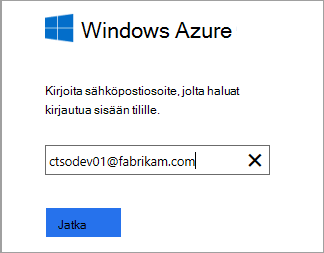

    *Yhteyden virheitä? Katso [vianmääritys](#troubleshooting).*

5. Valitse asennettujen web-sovelluksen tai sivustoon, jota haluat seurata ja valitse resurssien, johon haluat tarkastella tuloksia sovelluksen tiedot-portaalissa.

    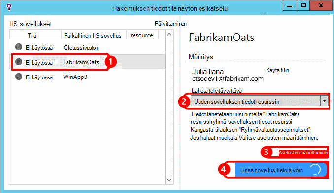

    Tavallisesti, valitse Määritä uusi resurssi ja [resurssiryhmä][roles].

    Muussa tapauksessa käytä aiemman resurssin, jos olet jo määrittänyt [web Testaa] [ availability] sivuston tai [web-Asiakasohjelman seuranta][client].

6. Käynnistä IIS uudelleen.

    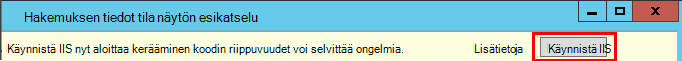

    Web-palvelu keskeytetään, hetki.

6. Huomaa, että ApplicationInsights.config on lisätty, jota haluat seurata verkkosovelluksissa.

    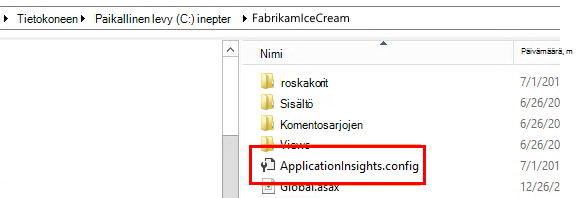

   Saatavilla on myös web.config tehdään muutoksia.

#### Haluatko (poistetaan) Määritä myöhemmin?

Kun olet suorittanut ohjatun toiminnon, voit määrittää uudelleen agentti, milloin tahansa. Voit käyttää myös tämän Jos agentti asennettu, mutta ollut ensimmäisen määrityskerran joitakin ongelmia.

## Näytä suorituskyvyn telemetriatietojen

Kirjautua [Azure-portaaliin](https://portal.azure.com), Etsi tiedot sovelluksen ja avaa resurssi, jonka loit.

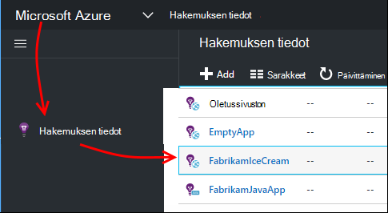

Avaa pyyntö, vastausajan, riippuvuuden ja muiden tietojen suorituskyky-sivu.

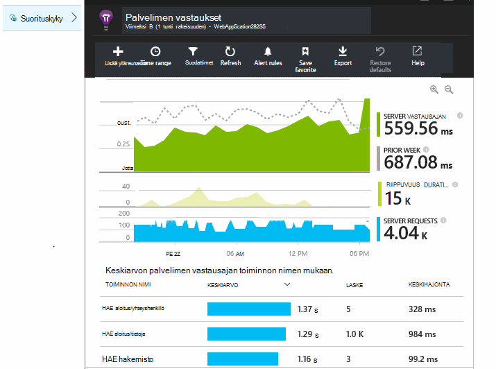

Valitse mikä tahansa kaaviota ja avaa yksityiskohtaisempia tietoja.

Voit tehdä [muokata, järjestää uudelleen, Tallenna](app-insights-metrics-explorer.md), ja kiinnitä kaavioiden tai [raporttinäkymät-ikkunan](app-insights-dashboards.md)koko sivu.

## Riippuvuudet

Riippuvuussuhteen kesto kaaviossa näkyy aika, jonka puhelut ulkoisen osia, kuten tietokantoja, REST API tai Azure-blob-säiliö-sovellukset.

Voit määritetään kaavion puhelut eri riippuvuudet: muokata kaaviota, ryhmittelyn ottaminen käyttöön ja Ryhmittelyperuste riippuvuuden, riippuvuustyyppi tai riippuvuuden suorituskykyä.

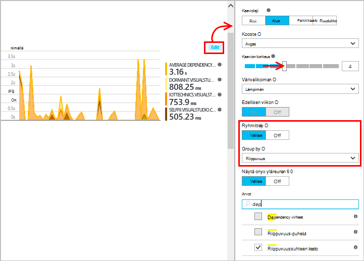

## Suorituskyvyn laskureita 

(Ei käytössä Azure verkkosovelluksissa.) Napsauttamalla palvelimiin Nähdäksesi kaavioiden palvelimen suorituskykyyn laskureita kuten suorittimen käyttöönottoon asti ja muistin käyttö yhteenveto-sivu.

Jos sinulla on useita server esiintymät, haluat ehkä muokata kaavioita ryhmittelyyn roolin esiintymä.

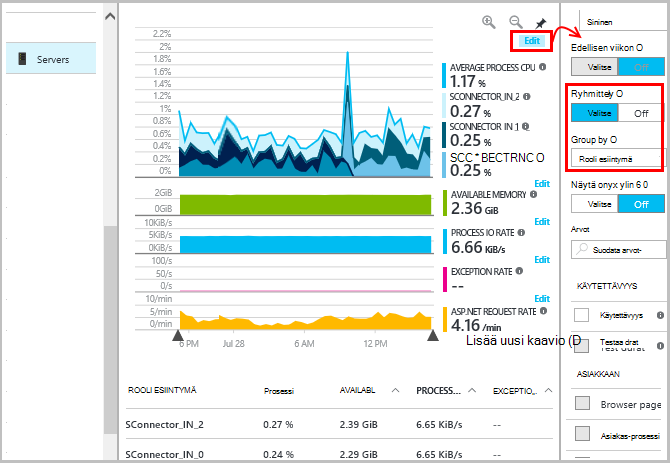

Voit myös [muuttaa suorituskyvyn laskureita, jotka ovat ilmoittaa SDK](app-insights-configuration-with-applicationinsights-config.md#nuget-package-3). 

## Poikkeukset

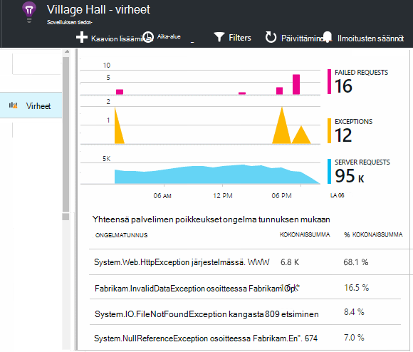

Voit tiettyjä poikkeuksia (viimeisten seitsemän päivän aikana) alirakenteeseen ja pinon jäljittää ja kontekstitiedot.

## Esimerkkejä

Jos sovelluksesi lähettää tietojen tarkastelun ja käytät sovelluksen tiedot-SDK ASP.NET-version 2.0.0-beta3 tai uudempi versio, mukautuvat esimerkkejä-ominaisuus saattaa toimia ja Lähetä vain oman telemetriatietojen prosentteina. [Lue lisää esimerkkejä.](app-insights-sampling.md)

## Vianmääritys

### Yhteysvirheet

Tarvitset avaamaan [joitakin lähtevät portit](app-insights-ip-addresses.md#outgoing-ports) palvelimen palomuurin siten, että tila-näytössä toimimaan.

### Ei ole telemetriatietojen?

  * Sivuston avulla voit luoda tietoja.
  * Odota muutama minuutti, jolloin tiedot saapuvat ja valitse sitten **Päivitä**.
  * Avaa diagnostiikan Search (haku-ruutu) Nähdäksesi yksittäiset tapahtumat. Tapahtumat ovat näkyvissä diagnostiikan Etsi usein, ennen kuin koostetietoja näkyy kaaviot.
  * Avaa tila-näytössä ja valitse sovelluksen vasemmassa ruudussa. Tarkista, onko diagnostiikka viestejä tämän sovelluksen "määritysten ilmoitukset-kohdassa:

  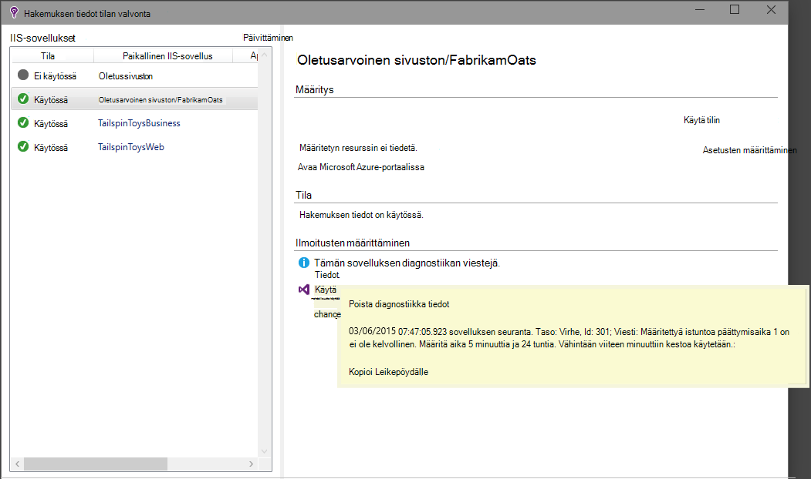

  * Varmista, että palvelimen palomuurin porttien yllä lähtevän tietoliikenteen.
  * Palvelimessa, jos näkyviin tulee sanoma "ei riitä käyttöoikeuksista", toimi seuraavasti:
    * IIS Manager Valitse sovelluksen sovellussarjan, Avaa **Lisäasetukset**ja Huomaa **Prosessimalli** -kohdassa tunnistetiedot.
    * Valitse tietokoneen hallinta Ohjauspaneelissa Lisää tämä jäsenyys suorituskyvyn valvonnan käyttäjät-ryhmään.
  * Jos sinulla on MMA/SCOM palvelimeen asennetut, jotkin voivat olla ristiriidassa. SCOM ja tila-näytössä ja asenna uusimmat versiot uudelleen.
  * Katso [vianmääritys][qna].

## Järjestelmävaatimukset

OS tuki sovelluksen havainnollistamisen tilan valvonta-palvelimeen:

- Windows Server 2008
- Windows Server 2008 R2
- Windows Server 2012
- Windows server 2012 R2

uusimman SP ja .NET Framework 4.0 ja 4.5

Asiakaspuolen Windows 7, 8 ja 8.1, uudelleen käyttämällä .NET Framework 4.0 ja 4.5

IIS-tuki: IIS 7 7.5, 8, 8,5 (IIS tarvitaan)

## PowerShell-automatisointi

Voit aloittaa ja lopettaa seuranta PowerShell-toiminnolla IIS-palvelimeen.

Tuo ensin sovelluksen tiedot-moduulin:

`Import-Module 'C:\Program Files\Microsoft Application Insights\Status Monitor\PowerShell\Microsoft.Diagnostics.Agent.StatusMonitor.PowerShell.dll'`

Tarkistaa, mitkä sovellukset seurataan:

`Get-ApplicationInsightsMonitoringStatus [-Name appName]`

* `-Name`(Valinnainen) Web-sovelluksen nimi.
* Näyttää kunkin web-sovelluksen (tai nimettyä sovelluksen) tilan seuranta hakemuksen tiedot IIS-palvelimeen.

* Palauttaa `ApplicationInsightsApplication` kunkin sovelluksen:
 * `SdkState==EnabledAfterDeployment`: Sovellus seurataan ja on instrumented suorituksen aikana tilan valvonta-työkalun avulla tai mukaan `Start-ApplicationInsightsMonitoring`.
 * `SdkState==Disabled`: Sovellus ei instrumented sovelluksen tietoja varten. Se ei koskaan instrumented tai Suorituksenaikainen valvonta poistettiin käytöstä tilan valvonta-työkalua tai kanssa `Stop-ApplicationInsightsMonitoring`.
 * `SdkState==EnabledByCodeInstrumentation`:-Sovellus on instrumented lisäämällä SDK lähdekoodin. Sen SDK ei voi päivittää tai pysäyttää.
 * `SdkVersion`Näyttää versio käytössä tämän sovelluksen seurantaa varten.
 * `LatestAvailableSdkVersion`Näyttää tällä hetkellä käytettävissä versio NuGet-valikoima. Voit päivittää sovelluksen tämän version, `Update-ApplicationInsightsMonitoring`.

`Start-ApplicationInsightsMonitoring -Name appName -InstrumentationKey 00000000-000-000-000-0000000`

* `-Name`IIS-sovelluksen nimeä
* `-InstrumentationKey`Hakemuksen tiedot resurssin haluamaasi tulokset näytetään ikey.

* Tämä cmdlet-komento koskee vain sovellukset, joita ei ole jo instrumented - eli SdkState == NotInstrumented.

    Cmdlet ei vaikuta sovellusta, joka on jo instrumented, muodosta aikaan lisäämällä SDK koodin tai cmdlet edellisen käyttämällä suorituksen aikana.

    SDK-versio, jolla soittimen sovellus on versio, joka on viimeksi ladattu tähän palvelimeen.

    Voit ladata uusimman version, käyttämällä päivityksen ApplicationInsightsVersion.

* Palauttaa `ApplicationInsightsApplication` onnistuneen. Jos se epäonnistuu, se kirjaa jäljityksen stderr.

    
          Name                      : Default Web Site/WebApp1
          InstrumentationKey        : 00000000-0000-0000-0000-000000000000
          ProfilerState             : ApplicationInsights
          SdkState                  : EnabledAfterDeployment
          SdkVersion                : 1.2.1
          LatestAvailableSdkVersion : 1.2.3

`Stop-ApplicationInsightsMonitoring [-Name appName | -All]`

* `-Name`IIS-sovelluksen nimi
* `-All`Lopettaa IIS-palvelimen kaikkien sovellusten valvonta, jonka`SdkState==EnabledAfterDeployment`

* Lopettaa määritetyn sovellusten valvonta ja poistaa instrumentation. Se toimii vain sovellukset, jotka on instrumented suorituksen aikana tilan seuranta-työkalulla tai Käynnistä ApplicationInsightsApplication. (`SdkState==EnabledAfterDeployment`)

* Palauttaa ApplicationInsightsApplication.

`Update-ApplicationInsightsMonitoring -Name appName [-InstrumentationKey "0000000-0000-000-000-0000"`]

* `-Name`: Verkkosovellukseen IIS nimi.
* `-InstrumentationKey`(Valinnainen). Tämän toiminnon avulla voit muuttaa resurssia, johon sovelluksen telemetriatietojen lähetetään.
* Tämä cmdlet-komento:
 * Päivitykset nimetty sovelluksen SDK-versioon ladata viimeksi tähän tietokoneeseen. (Toimii vain, jos `SdkState==EnabledAfterDeployment`)
 * Jos annat instrumentation-näppäintä, nimetyn sovellus uudelleen telemetriatietojen lähettäminen resurssi, jonka avain. (Toimii, jos `SdkState != Disabled`)

`Update-ApplicationInsightsVersion`

* Lataa uusimmat sovelluksen tiedot-SDK-palvelimeen.

## Seuraavat vaiheet

* [Luo web testit] [ availability] varmistaaksesi, että sivuston pysymisen rajoitusten live.
* [Etsi tapahtuma- ja lokit] [ diagnostic] voi selvittää ongelmia.
* [Lisää WWW-asiakasohjelman telemetriatietojen] [ usage] poikkeuksia verkkosivun koodi ja avulla voit lisätä jäljittää kutsuja.
* [Hakemuksen tiedot SDK lisääminen web-palvelukoodi] [ greenbrown] niin, että voit lisätä Jäljitä ja log tallenteita server-koodi.

<!--Link references-->

[api]: app-insights-api-custom-events-metrics.md
[availability]: app-insights-monitor-web-app-availability.md
[client]: app-insights-javascript.md
[diagnostic]: app-insights-diagnostic-search.md
[greenbrown]: app-insights-asp-net.md
[qna]: app-insights-troubleshoot-faq.md
[roles]: app-insights-resources-roles-access-control.md
[usage]: app-insights-web-track-usage.md
