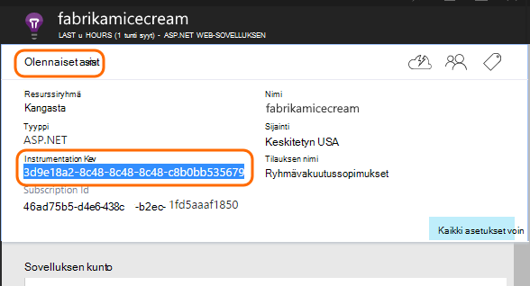

<properties
    pageTitle="Lisää sovellus havainnollistamisen SDK seurannassa Node.js sovelluksen | Microsoft Azure"
    description="Analysoi käyttö, käytettävyys ja paikallisen tai Microsoft Azure web-sovelluksen kanssa sovelluksen havainnollistamisen suorituskykyä."
    services="application-insights"
    documentationCenter=""
    authors="alancameronwills"
    manager="douge"/>

<tags
    ms.service="application-insights"
    ms.workload="tbd"
    ms.tgt_pltfrm="ibiza"
    ms.devlang="na"
    ms.topic="get-started-article"
    ms.date="08/30/2016"
    ms.author="awills"/>


# <a name="add-application-insights-sdk-to-monitor-your-nodejs-app"></a>Hakemuksen tiedot SDK seurannassa Node.js sovelluksen lisääminen

*Hakemuksen tiedot on esikatselu.*

[Visual Studio hakemuksen tiedot](app-insights-overview.md) valvoo live sovelluksen auttaa [tunnistamaan ja vianmäärityksen suorituskykyongelmia ja poikkeukset](app-insights-detect-triage-diagnose.md)ja [Tutustu, miten sovelluksen käytetään](app-insights-overview-usage.md). Se toimii sovellukset, joita isännöidään oman paikallisen IIS-palvelimiin tai Azure VMs sekä Azure verkkosovelluksissa.


SDK on automaattinen sivustokokoelman saapuvan HTTP-pyyntö korvaukset ja vastaukset, suorituskyvyn laskureita (suorittimen ja muistin RPS) ja käsittelemättömän poikkeukset. Lisäksi voit lisätä mukautetun puhelut riippuvuudet, arvot tai muita tapahtumia.


#### <a name="before-you-start"></a>Ennen aloittamista

Tarvitset:

* Visual Studio 2013 tai uudempi versio. On myöhemmin parempi.
* [Microsoft Azure](http://azure.com)-tilausta. Jos ryhmäsi tai organisaation on Azure-tilaus, omistaja voi lisätä voit, käyttämällä [Microsoft-tili](http://live.com).

## <a name="add"></a>Luo sovelluksen tiedot-resurssi

Kirjautuminen [Azure portal][portal], ja luo uusi sovelluksen havainnollistamisen resurssi. [Resurssin] [ roles] Azure-tietokannassa on erillisen palvelun. Resurssi on kohtaa, johon telemetriatietojen sovelluksestasi analysoida ja esittää sinulle.


Valitse muu sovelluksen tyyppi. Sovelluksen tyyppi valinta määrittää oletussisältö ja resurssin näiden ominaisuuksien [Arvot]Resurssienhallinnassa näkyvä[metrics].

#### <a name="copy-the-instrumentation-key"></a>Kopioi Instrumentation avain

Resurssin yksilöivä avain ja asentaa sen pian SDK: ssa voidaan ohjata resurssin tiedot.




## <a name="sdk"></a>Asenna SDK-sovelluksessa

```
npm install applicationinsights --save
```

## <a name="usage"></a>Käyttö

Tämä ottaa käyttöön pyynnön valvonta, käsittelemättömän poikkeuksen vuoksi seuranta ja järjestelmän suorituskyvyn (suorittimen ja muistin/RPS).

```javascript

var appInsights = require("applicationinsights");
appInsights.setup("<instrumentation_key>").start();
```

Instrumentation-näppäintä voit myös määrittää ympäristömuuttuja APPINSIGHTS_INSTRUMENTATIONKEY. Jos tämä on valmis, argumentteja ei tarvita, kun kutsutaan `appInsights.setup()` tai `appInsights.getClient()`.

Voit kokeilla SDK lähettämättä telemetriatietojen: määrittää instrumentation käyttäjäavainten on muu kuin tyhjä merkkijono.


## <a name="run"></a>Projektin suorittaminen

Suorita sovellus ja kokeile,: Avaa Luo joitakin telemetriatietojen eri sivuille.


## <a name="monitor"></a>Näytä oman telemetriatietojen

Palaa [Azure portal](https://portal.azure.com) ja Etsi sovellus tiedot resurssin.


Etsi yleiskuvaus-sivun tiedot. Ensimmäinen näet vain yksi tai kaksi pistettä. Esimerkki:


Napsauttamalla mitä tahansa kaavion saat näkyviin lisää arvot. [Lue lisää arvot.][perf]

#### <a name="no-data"></a>Tietoja?

* Sovelluksen avaaminen eri sivuille, niin, että se luo joitakin telemetriatietojen avulla.
* Avaa [Etsi](app-insights-diagnostic-search.md) -ruudun Nähdäksesi yksittäiset tapahtumat. Joskus kestää tapahtumien hieman samalla, kun se on pidempi tulee arvot putkijohto.
* Odota hetki ja valitsemalla **Päivitä**. Kaavioiden päivittää itse säännöllisesti, mutta voit päivittää manuaalisesti jos odotat sisäänpääsyä joitakin-tiedot näkyvät.
* Katso [vianmääritys][qna].

## <a name="publish-your-app"></a>Sovelluksen julkaiseminen

Nyt sovelluksen käyttöönotto IIS tai Azure ja katso saavutustasopisteet tiedot.


#### <a name="no-data-after-you-publish-to-your-server"></a>Kun julkaiset palvelimellesi tietoja?

Avaa palvelimen palomuurin porttien lähtevän tietoliikenteen:

+ `dc.services.visualstudio.com:443`
+ `f5.services.visualstudio.com:443`


#### <a name="trouble-on-your-build-server"></a>Muodosta palvelimeen ongelmia?

Katso [Tämä vianmääritys kohde](app-insights-asp-net-troubleshoot-no-data.md#NuGetBuild).


## <a name="customized-usage"></a>Mukautetun käyttö 

### <a name="disabling-auto-collection"></a>Automaattinen sivustokokoelman poistaminen käytöstä

```javascript
import appInsights = require("applicationinsights");
appInsights.setup("<instrumentation_key>")
    .setAutoCollectRequests(false)
    .setAutoCollectPerformance(false)
    .setAutoCollectExceptions(false)
    // no telemetry will be sent until .start() is called
    .start();
```

### <a name="custom-monitoring"></a>Mukautetun seuranta

```javascript
import appInsights = require("applicationinsights");
var client = appInsights.getClient();

client.trackEvent("custom event", {customProperty: "custom property value"});
client.trackException(new Error("handled exceptions can be logged with this method"));
client.trackMetric("custom metric", 3);
client.trackTrace("trace message");
```

[Lisätietoja telemetriatietojen API](app-insights-api-custom-events-metrics.md).

### <a name="using-multiple-instrumentation-keys"></a>Useita instrumentation näppäimiä käyttämällä

```javascript
import appInsights = require("applicationinsights");

// configure auto-collection with one instrumentation key
appInsights.setup("<instrumentation_key>").start();

// get a client for another instrumentation key
var otherClient = appInsights.getClient("<other_instrumentation_key>");
otherClient.trackEvent("custom event");
```

## <a name="examples"></a>Esimerkkejä

### <a name="tracking-dependency"></a>Seuranta-riippuvuus

```javascript
import appInsights = require("applicationinsights");
var client = appInsights.getClient();

var startTime = Date.now();
// execute dependency call
var endTime = Date.now();

var elapsedTime = endTime - startTime;
var success = true;
client.trackDependency("dependency name", "command name", elapsedTime, success);
```


### <a name="manual-request-tracking-of-all-get-requests"></a>Kaikkien "Hanki-pyyntöjen Manuaalinen seuranta

```javascript
var http = require("http");
var appInsights = require("applicationinsights");
appInsights.setup("<instrumentation_key>")
    .setAutoCollectRequests(false) // disable auto-collection of requests for this example
    .start();

// assign common properties to all telemetry sent from the default client
appInsights.client.commonProperties = {
    environment: process.env.SOME_ENV_VARIABLE
};

// track a system startup event
appInsights.client.trackEvent("server start");

// create server
var port = process.env.port || 1337
var server = http.createServer(function (req, res) {
    // track all "GET" requests
    if(req.method === "GET") {
        appInsights.client.trackRequest(req, res);
    }

    res.writeHead(200, { "Content-Type": "text/plain" });
    res.end("Hello World\n");
}).listen(port);

// track startup time of the server as a custom metric
var start = +new Date;
server.on("listening", () => {
    var end = +new Date;
    var duration = end - start;
    appInsights.client.trackMetric("StartupTime", duration);
});
```

## <a name="next-steps"></a>Seuraavat vaiheet

* [Valvoa oman telemetriatietojen-portaalissa](app-insights-dashboards.md)
* [Kyselyjen Käyttöanalyysitietojen kirjoittaa oman telemetriatietojen päälle](app-insights-analytics-tour.md)


<!--Link references-->

[knowUsers]: app-insights-overview-usage.md
[metrics]: app-insights-metrics-explorer.md
[perf]: app-insights-web-monitor-performance.md
[portal]: http://portal.azure.com/
[qna]: app-insights-troubleshoot-faq.md
[roles]: app-insights-resources-roles-access-control.md
