<properties
    pageTitle="Käyttöanalyysin tiedot sovelluksen kanssa"
    description="Yleistä käyttöanalyysin tiedot sovelluksen kanssa"
    services="application-insights"
    documentationCenter=""
    authors="alancameronwills"
    manager="douge"/>

<tags
    ms.service="application-insights"
    ms.workload="tbd"
    ms.tgt_pltfrm="ibiza"
    ms.devlang="multiple"
    ms.topic="article" 
    ms.date="04/08/2016"
    ms.author="awills"/>

# Käyttöanalyysin tiedot sovelluksen kanssa

Tietää, miten käyttää sovelluksen avulla voit kehittäminen työsi keskittyä tilanteita, jotka ovat tärkeimpiä niihin ja Hanki tietoja kyselyjä, kuin ohjeista Helpota tai vaikeaa saavuttamiseksi tavoitteet.

Hakemuksen tiedot voit tarjota Tyhjennä sovelluksen käyttö-näkymän auttavat käyttäjien parempana ja täytä liiketoiminnan tavoitteet.

Hakemuksen tiedot toimii sekä erillinen-sovellukset (iOS-, Android- ja Windows) ja web Apps-sovellukset (isännöimät .NET tai J2EE). 

## Hakemuksen tiedot lisääminen projektiin

Aloita [Microsoft Azure](https://azure.com)ja vapaa-tilin hankkiminen. (Kokeilujakson jälkeen voit jatkaa vapaa taso-palvelun kanssa.)

[Azure portal](https://portal.azure.com)Luo sovelluksen tiedot-resurssi. Tämä on, jossa näet käyttö- ja suorituskyvyn tiedot sovelluksen tietoja.

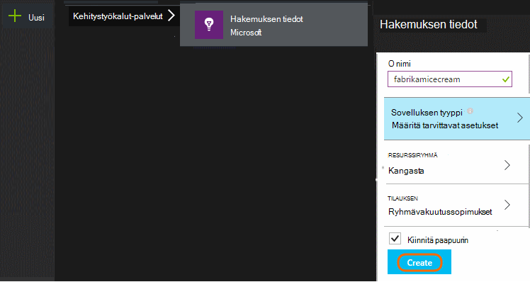

**Jos sovellus on laite, sovellus** lisääminen projektiin hakemuksen tiedot SDK-paketissa. Tarkka menettelyä vaihtelee eri [IDE ja ympäristö](app-insights-platforms.md). Windows-sovellusten vain projektia Visual Studiossa hiiren kakkospainikkeella ja valitsemalla "Lisää sovellus-tietoja."

**Onko verkkosovellukseen,** Avaa Pika-aloitus-sivu ja Hae koodikatkelman lisääminen web-sivuille. Julkaise ne tämän koodikatkelman.

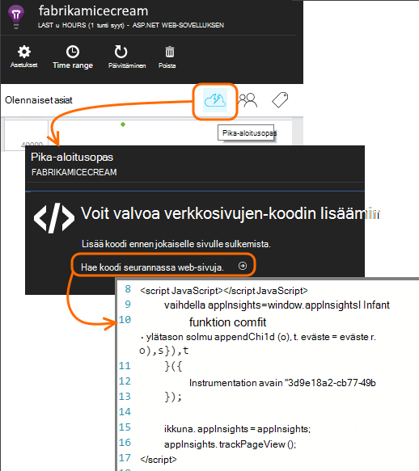

Voit lisätä hakemuksen tiedot myös niin, että yhdistää telemetriatietojen asiakkaan ja palvelimen [ASP.NET](app-insights-asp-net.md) tai [J2EE](app-insights-java-get-started.md) server-koodin.

### Suorita projektin ja ensimmäisen hakutuloksia

Suorita projektin virheenkorjaus tilassa muutaman minuutin, ja siirry [Azure portal](https://portal.azure.com) ja Etsi project-resurssin-sovelluksen tiedot.

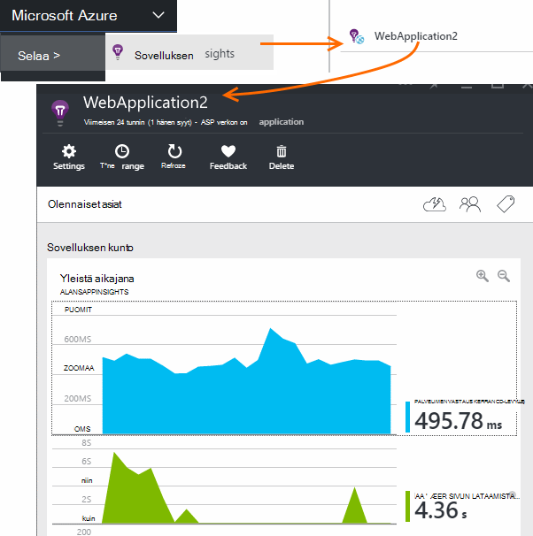

Julkaise sovelluksen hakee Lisää telemetriatietojen ja selvitä, mitä käyttäjät tekevät sovelluksen kanssa.

## Analytics ruutuun ulos

Napsauta Nähdäksesi käyttötiedot Page Views-ruutua.

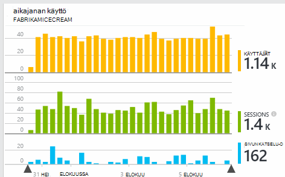

Osoita kaaviota, jos haluat nähdä tiettynä laskee edellä tyhjää aluetta. Muussa tapauksessa numerot Näytä koostetun ajan, kuten keskiarvoon, summan tai eri käyttäjien määrä ajanjaksolle arvo.

Web-sovellusten käyttäjien lasketaan käyttämällä evästeitä. Henkilö, joka käyttää eri selaimissa, tyhjentää evästeet ja tietosuoja-ominaisuus käyttää lasketaan useita kertoja.

Web-istunnon lasketaan 30 minuutin ajan kuluttua. Istunnon puhelimella tai muussa laitteessa lasketaan, kun sovellus on hyllytetty yli muutaman sekunnin ajan.

Napsauttamalla mitä tahansa kaavion saat näkyviin tarkempia tietoja. Esimerkki:

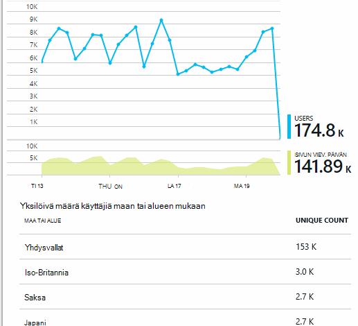

(Tässä esimerkissä käytetään sivustosta, mutta kaavioiden muistuttaa sovellukset, jotka suoritetaan laitteissa.)

Vertaa edellisellä viikolla, jos asiat muutoksia:

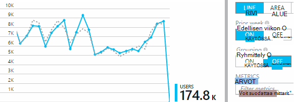

Vertaa kahden arvot, kuten käyttäjien ja uudet käyttäjät:

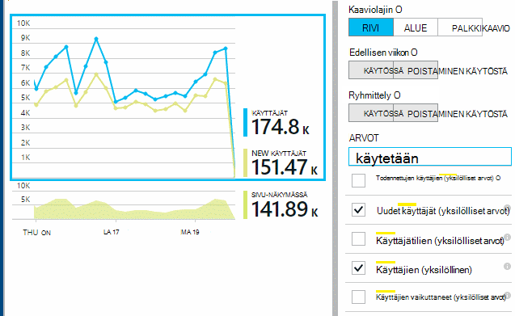

Tietojen ryhmitteleminen (segmentin) ominaisuuden, kuten selaimen, käyttöjärjestelmä tai kaupunki:

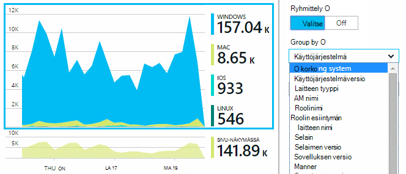

## Sivun käyttö

Napsauttamalla saat sivun näkymät-ruutu hajautuksen Suosituimmat sivut:

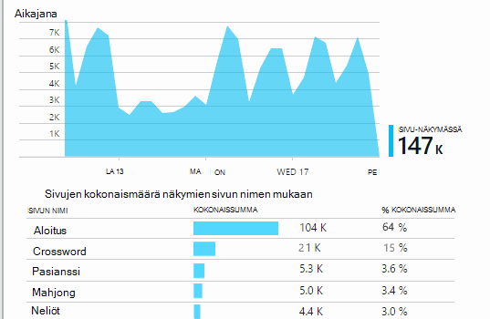

Yllä olevassa esimerkissä on visualisointi n sivustosta. Siitä välittömästi näkyvissä:

* Edellisen viikon käyttö ei ole entistä parempi. Ehkäpä olemme kannattaa ottaa huomioon hakukoneoptimointi?
* Monta vähemmän henkilöt näkevät visualisointi n sivut kuin aloitussivulle. Miksi Microsoftin kotisivun ei herättää muiden visualisointi n toistaa?
* 'Crossword' on eniten käytetyt Ottelu. Olemme tulisi ilmoittaa prioriteetti uusia ideoita ja parannukset siellä.

## Mukautetun seuranta

Oletetaan, että oletetaan, että sen sijaan, että kunkin Ottelu käyttöönoton eri web-sivua, päätät refactor ne kaikki sovellukseen saman yhden-koodattu web-sivun Javascript toiminnot eniten. Tämän avulla käyttäjä voi siirtyä nopeasti yhden Ottelu väliltä tai on myös useita visualisointi n yhdelle sivulle.

Mutta haluat silti sovelluksen havainnollistamisen kirjautua kuinka monta kertaa, kunkin Ottelu aukeaa, samalla tavalla kuin kun siirretyt eri web-sivuille. Tämä on helppoa: puhelun telemetriatietojen-moduulin lisääminen vain oman JavaScript haluamaasi tietueeseen, joka on avattu uuden 'sivun':

    telemetryClient.trackPageView(game.Name);

## Mukautetut tapahtumat

Voit käyttää telemetriatietojen selvittääksesi, miten sovelluksesi käytetään monella tavalla. Mutta et halua sekoita viestit sivun näkymiä. Käytä mukautetut tapahtumat. Voit lähettää heille sovelluksille, web-sivujen tai web-palvelimeen:

(JavaScript)

    telemetryClient.trackEvent("GameEnd");

(C#)

    var tc = new Microsoft.ApplicationInsights.TelemetryClient();
    tc.TrackEvent("GameEnd");

(VB)

    Dim tc = New Microsoft.ApplicationInsights.TelemetryClient()
    tc.TrackEvent("GameEnd")

Eniten mukautetut tapahtumat näkyvät Yhteenveto-sivu.

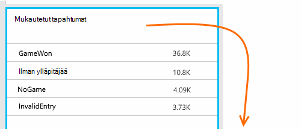

Valitse taulukosta, joukon tapahtumien otsikkoon. Voit määritetään kaavion eri ominaisuuksien, kuten tapahtuman nimi:

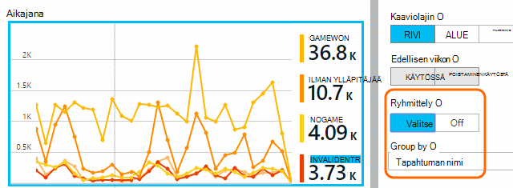

Aikajanojen erityisen hyödyllinen ominaisuus on, että voit yhdistää muutokset muiden arvot ja tapahtumien kanssa. Toisinaan, kun useita visualisointi n toistetaan, voit esimerkiksi todennäköisesti odottanut Nähdäksesi nousu-sekä hylätyt visualisointi n. Mutta hylätyt visualisointi n nousu on kohtuutonta, haluat ehkä selvittää, onko suuren kuormituksen aikana aiheuttaa ongelmia, jotka käyttäjät löydä voi hyväksyä.

## Siirtyminen tiettyyn tapahtumat

Saat paremman käsityksen siitä, miten tyypillinen istunnon menee, haluat ehkä keskittyä tietyn käyttäjäistunnon, joka sisältää tietyn tyyppisiä tapahtuman.

Tässä esimerkissä on koodattu mukautetun tapahtuman "NoGame", jota kutsutaan, jos käyttäjä kirjautuu käynnistämättä todella Ottelu. Miksi käyttäjän tehdään? Ehkäpä Jos olemme siirtyminen joitakin tiettyjä esiintymät, emme palautetaan virhe clue.

Mukautetut tapahtumat vastaanotetut sovelluksen luetellaan nimi yhteenveto-sivu:

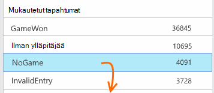

Tapahtuman halutut selaamalla ja valitse viimeisimmät tietyn esiintymä:

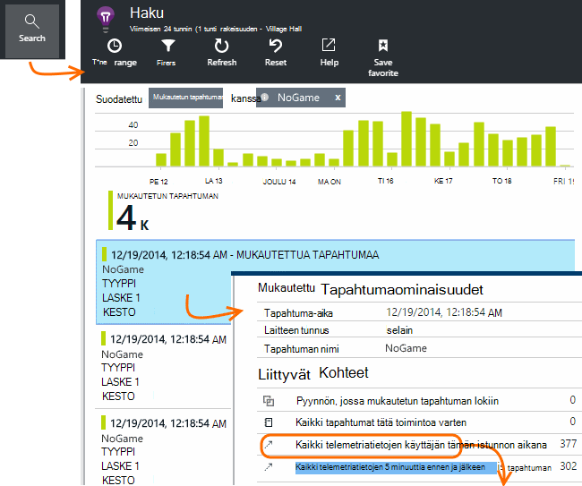

Katsotaan telemetriatietojen istunnon, jossa tietyn NoGame tapahtuma ilmeni.

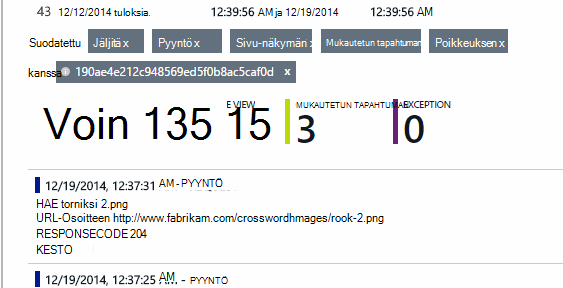

Oli poikkeuksia, jolloin käyttäjä ei voi toistaa joissakin virhe.

Emme voi suodattaa kaikenlaisia telemetriatietojen lukuun ottamatta sivun näkymät, tämän istunnon aikana:

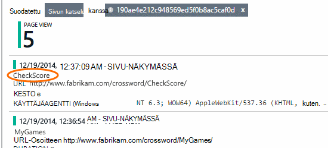

Ja nyt näemme, että vain, jos haluat tarkistaa uusimman tulosten kirjautunut käyttäjä. Ehkäpä olemme kannattaa harkita, joka on helppo tehdä käyttäjän Tarinan kehittäminen. (Ja on olisi mukautetun tapahtuman raporttiin tietyn juttu toteutuessa.)

## Suodattaminen, Etsi ja määritetään tietojen ominaisuudet
Voit liittää haluamaansa tunnisteet ja numeerisia arvoja tapahtumat.

Asiakastietokoneen JavaScript

    appInsights.trackEvent("WinGame",
        // String properties:
        {Game: currentGame.name, Difficulty: currentGame.difficulty},
        // Numeric measurements:
        {Score: currentGame.score, Opponents: currentGame.opponentCount}
    );

C#-palvelimessa

    // Set up some properties:
    var properties = new Dictionary <string, string>
        {{"game", currentGame.Name}, {"difficulty", currentGame.Difficulty}};
    var measurements = new Dictionary <string, double>
        {{"Score", currentGame.Score}, {"Opponents", currentGame.OpponentCount}};

    // Send the event:
    telemetry.TrackEvent("WinGame", properties, measurements);

VB-palvelimessa

    ' Set up some properties:
    Dim properties = New Dictionary (Of String, String)
    properties.Add("game", currentGame.Name)
    properties.Add("difficulty", currentGame.Difficulty)

    Dim measurements = New Dictionary (Of String, Double)
    measurements.Add("Score", currentGame.Score)
    measurements.Add("Opponents", currentGame.OpponentCount)

    ' Send the event:
    telemetry.TrackEvent("WinGame", properties, measurements)

Liitä ominaisuudet sivun näkymät samalla tavalla:

Asiakastietokoneen JavaScript

    appInsights.trackPageView("Win",
        {Game: currentGame.Name},
        {Score: currentGame.Score});

Diagnostiikan hakutoiminnossa tarkastella ominaisuuksia valitsemalla tapahtuman yksittäisen esiintymän kautta.

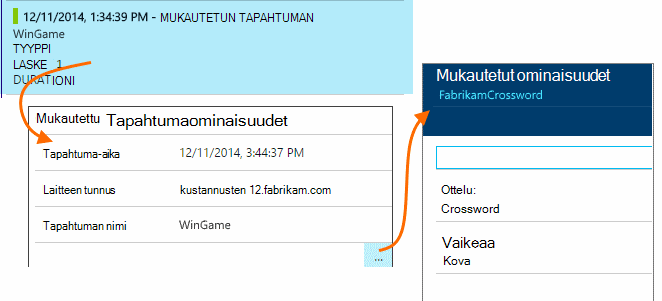

Tapahtuman esiintymien tietyn kiinteistöistä, joiden arvo hakukentän avulla.

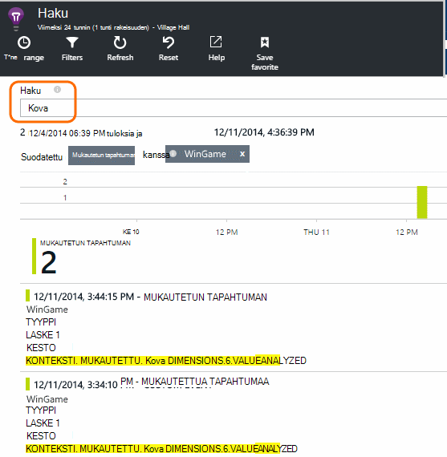

## A | B testaaminen

Jos et tiedä ominaisuus muuttujan onnistuisi enemmän, Vapauta molempien on, että kunkin käytettävissä eri käyttäjille. Arvioivat onnistumista kunkin ja siirrä sitten yhdistetty versio.

Tätä tapaa, voit liittää eri tunnisteet kaikki telemetriatietojen, joka lähetetään kunkin sovelluksen-versiossa. Tämän voi tehdä määrittämällä aktiivisen TelemetryContext ominaisuudet. Nämä oletusominaisuudet lisätään viestiin telemetriatietojen, joka lähettää sovelluksen – et pelkästään mukautettuja viestejä, mutta myös vakio telemetriatietojen.

Valitse sovelluksen tiedot-portaalissa voit sitten voi Suodata ja Ryhmittele (segmentin) tietojen tunnisteiden siten, että vertailla eri versioita.

C#-palvelimessa

    using Microsoft.ApplicationInsights.DataContracts;

    var context = new TelemetryContext();
    context.Properties["Game"] = currentGame.Name;
    var telemetry = new TelemetryClient(context);
    // Now all telemetry will automatically be sent with the context property:
    telemetry.TrackEvent("WinGame");

VB-palvelimessa

    Dim context = New TelemetryContext
    context.Properties("Game") = currentGame.Name
    Dim telemetry = New TelemetryClient(context)
    ' Now all telemetry will automatically be sent with the context property:
    telemetry.TrackEvent("WinGame")

Yksittäisten telemetriatietojen voit ohittaa oletusarvot.

Voit määrittää yleinen alustaja niin, että kaikki uudet TelemetryClients automaattisesi että kontekstissa.

    // Telemetry initializer class
    public class MyTelemetryInitializer : ITelemetryInitializer
    {
        public void Initialize (ITelemetry telemetry)
        {
            telemetry.Properties["AppVersion"] = "v2.1";
        }
    }

Valitse sovellus-alustaja, kuten Global.asax.cs:

    protected void Application_Start()
    {
        // ...
        TelemetryConfiguration.Active.TelemetryInitializers
        .Add(new MyTelemetryInitializer());
    }

## Muodosta - mitta - tietoja

Kun analytics, siitä tulee kehittäminen jakson – ei vain jotakin tietoja-ikkuna, jonka avulla ratkaiseminen mielestäsi integroitu osa. Seuraavassa on vihjeitä:

* Määrittää sovelluksen tärkeimmistä arvo. Haluatko, että niin monta käyttäjää mahdollisimman tai mieluummin on pieni joukko erittäin käyttäjille? Haluatko vierailut tai myynti suurentaminen?
* Mittaa kunkin Tarinan suunnitteleminen. Kun uusi käyttäjä Tarinan luonnos tai toimintoa, tai päivittää aiemmin luodun suunnitelma aina mietittävä, miten haluat mitata muutos onnistuu. Kysy ennen coding käynnistyy, "mikä vaikutus tämä on Microsoftin arvojen mukaisesti, jos se toimii? Olemme Jäljitä minkä tahansa uusille tapahtumille?"
Ja, kun ominaisuus on käytettävissä, varmista, että analysointitietoja tarkastelemalla ja toimia tulokset.
* Suhteiden avaimen metrijärjestelmä muita tietoja. Esimerkiksi jos lisäät "Suosikit"-toimintoa, jonka haluat tietää, kuinka usein käyttäjät lisäävät Suosikit. Mutta se on ehkä Lisää kiinnostavat tietää, kuinka usein ne tulevat takaisin niiden suosikkeihin. Ja tärkeintä, asiakkaat, jotka käyttävät Suosikit kädessä ostaa lisää tuote?
* Kanarian testaamiseen. Määritä ominaisuus-valitsin, jonka avulla voit luoda uuden toiminnon vain joidenkin käyttäjien nähtävissä. Hakemuksen tiedot avulla voit nähdä, onko uutta toimintoa käytetään olet suunnitelluista tavalla. Muutosten tekeminen, ja vapauta se kaikille vastaanottajille.
* Keskustele käyttäjille! Analytics ei riitä sellaisenaan, mutta komplementtivirhefunktion ylläpito hyvä asiakassuhteen.

## Opi lisää

* [Tunnistaa, kiireellisyysjärjestys ja kaatuu ja sovelluksen suorituskykyongelmien vianmääritys](app-insights-detect-triage-diagnose.md)
* [Aloita sovelluksen havainnollistamisen monta ympäristöissä](app-insights-detect-triage-diagnose.md)

## Video

> [AZURE.VIDEO usage-monitoring-application-insights]

 
