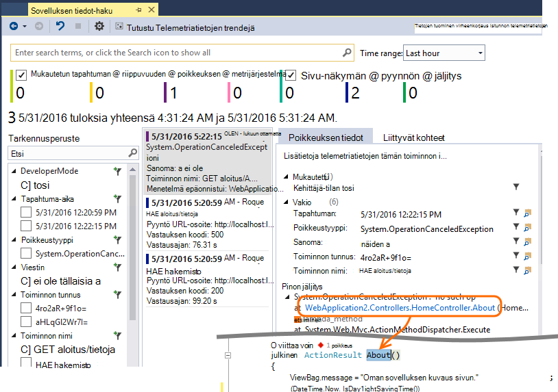
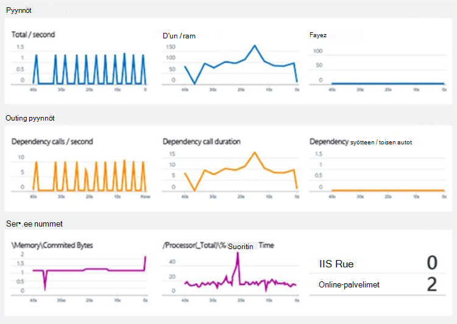

<properties 
    pageTitle="Hakemuksen tiedot opetusohjelma | Microsoft Azure" 
    description="Seurata käyttöä ja live web-sovelluksen suorituskykyä.  Tunnistaa, kiireellisyysjärjestys ja suorittaa ongelmien vianmääritystä. Jatkuvasti seurannassa ja parantaa success käyttäjien kanssa." 
    services="application-insights" 
    documentationCenter=""
    authors="alancameronwills" 
    manager="douge"/>

<tags 
    ms.service="application-insights" 
    ms.workload="tbd" 
    ms.tgt_pltfrm="ibiza" 
    ms.devlang="na" 
    ms.topic="article" 
    ms.date="10/15/2016" 
    ms.author="awills"/>
 
# Sovelluksen tiedot - esittely

Visual Studio hakemuksen tiedot on extensible analytics-palvelu, valvoo live web-sovelluksen. Voit tunnistaa ja suorituskyvyn vianmääritys ja ymmärtää, mitä käyttäjät todella tehdä sovelluksen sitä. Se on suunniteltu kehittäjille, jotka auttavat parantamaan jatkuvasti suorituskyvyn ja käytettävyyttä. Se toimii sovellusten ympäristöjen, kuten .NET, Node.js ja J2EE erilaisia, valitse isännöidään paikallisen tai pilveen. 

[Katso esittely animaation](https://www.youtube.com/watch?v=fX2NtGrh-Y0).

## Miten se toimii?

Asentaa sovelluksen pieni instrumentation paketin ja Määritä sovelluksen tiedot-resurssin Microsoft Azure-portaalissa. Laitteet valvoo sovelluksen ja lähettää telemetriatietoja-portaaliin. Portaalin näytetään tilastokaavion, mutta se on tehokas haku-työkaluja, joiden avulla voit selvittää ongelmia.

Hakemuksen tiedot on useiden [Vakio instrumentation moduulit](app-insights-configuration-with-applicationinsights-config.md) ja kerääminen erityyppisiä telemetriatietojen, kuten pyynnön vastausajat, poikkeukset ja riippuvuuden puhelut. Voit myös [lähettää mukautetun telemetriatietojen koodin kirjoittaminen](app-insights-api-custom-events-metrics.md) portaaliin.

### Mikä on?

Sinua sovelluksen suorituskykyyn vaikuttavia on hyvin pieni. Seuranta on ei-esto, ja ovat erämuotoinen ja erillinen viestiketjun lähetetyt. 

## Mitä se tarkoittaa?

Hakemuksen tiedot tarkoituksena on ryhmälle, voi auttaa sinua ymmärtämään, kuinka sovelluksen suorittamiseen ja miten sitä käytetään. Se on:

Telemetriatietojen tyypit:

* HTTP-pyyntö korvaukset, vastaus-aikoja, success korvaukset.
* Riippuvuudet (HTTP ja SQL) Soita kursseja, vastausajat, success korvaukset.
* Poikkeus jäljittää Serveristä ja asiakas.
* Vianmäärityslokeihin jälkitiedot.
* Käyttäjä- ja laskee, selaimen latausajat, poikkeukset sivunäkymän laskee.
* AJAX puhelun palkat, vastausajat ja success korvaukset.
* Palvelimen suorituskykylaskureita.
* Mukautetun asiakas- ja telemetriatietojen.
* Asiakkaan sijainti, selaimen versio, käyttöjärjestelmäversio, esiintymä, mukautettuja dimensioita ja lisää Segmentointi.
* Käytettävyys testit

Diagnostiikka- ja analyyttisten työkalut:

* Automaattinen ja manuaalinen ilmoitukset virheen korvaukset ja muita tietoja ja käytettävyyttä.
* Kaavioiden koostetun arvot ajan mittaan.
* Diagnostiikan etsimällä esiintymät pyynnöt, poikkeukset, mukautetut tapahtumat-loki jäljittää, sivun näkymät, riippuvuuden ja AJAX kutsuja. 
* Analytics - tehokkaita kyselykielen oman telemetriatietojen päälle
* Raporttinäkymät - Laadi kaavioita haluat seurata kaikkia sovelluksen osia.

## Miten sitä käytetään?

### Valvonta

Asentaa sovelluksen tiedot-sovellukseen, Määritä käytettävyys web testit ja:

* Määritä ryhmä-ryhmän, seuraa kuormituksen, vastausajan ja suorituskyvyn riippuvuudet, sivujen latausaikaa sekunneilla ja AJAX puhelut Raporttinäkymät-ikkunan. 
* Tutustu, jotka ovat kahdesta ja eniten epäonnistumista pyyntöjä.
* Katso Live muodossa, kun otat käyttöön uudessa versiossa, lisätietoja välittömästi kaikki heikkeneminen.

### Vianmääritys

Kun saat ilmoituksen tai tutustu ongelman:

* Yhdistää virheet poikkeukset, riippuvuuden kutsut ja jäljittää.
* Tutustu pinon Vedostaa ja Jäljitä lokitiedot.

### Arvioi

Mittaa tehokkuutta kunkin uusi ominaisuus, joka otetaan käyttöön.

* Mittaa, kuinka asiakkaat käyttää uuden UX tai ominaisuuksien suunnitteleminen.
* Kirjoita mukautetun telemetriatietojen koodisi kirjautua käyttö.
* Pohjalta kehittäminen kunkin jakson Kova näyttöä-telemetriatietojen.

## Käytön aloittaminen

Hakemuksen tiedot on monia palveluita Microsoft Azure isännöi ja telemetriatietojen lähetetään siellä analysointia ja esitys. Jotta ennen kuin teet jotain muuta, tarvitset [Microsoft Azure](http://azure.com)-tilausta. On ilmainen rekisteröintiä, ja voit valita vapaa [hinnoittelua taso](https://azure.microsoft.com/pricing/details/application-insights/) , sovelluksen tiedot. Jos organisaatiossa on tilaus, hän voi lisätä Microsoft-tili. 

Aloita useilla tavoilla. Alkavat kumpi toimii parhaiten puolestasi. Voit lisätä muiden myöhemmin.

* **AT suoritusaika: soittimen palvelimessa koodiin.** Ei mitään päivitystä koodia. Sinun on palvelimen järjestelmänvalvojan käyttöoikeudet.
 * [**IIS paikallisen tai AM**](app-insights-monitor-performance-live-website-now.md)
 * [**Azure verkkosovellukseen tai AM**](app-insights-monitor-performance-live-website-now.md#if-your-app-runs-as-an-azure-web-app)
 * [**J2EE**](app-insights-java-live.md)
* **Kehittäminen milloin: Lisää sovelluksen tiedot-koodin.** Voit kirjoittaa mukautetun telemetriatietojen välineen taustatietokantaan ja työpöytäsovellukset.
 * [Visual Studio](app-insights-asp-net.md) 2013: n päivitys 2 tai uudempi.
 * Java [Pimennys](app-insights-java-eclipse.md) tai [muista työkaluista](app-insights-java-get-started.md)
 * [Node.js](app-insights-nodejs.md)
 * [Muiden ympäristöjen](app-insights-platforms.md)
* Sivu-näkymän, AJAX ja muut asiakkaan telemetriatietojen **[soittimen verkkosivuille](app-insights-javascript.md)** .
* **[Käytettävyys testien](app-insights-monitor-web-app-availability.md)** - ping-sivuston säännöllisesti poistaminen Microsoftin palvelimiin.

> [AZURE.NOTE]  Tässä vaiheessa vain ehkäpä käyttämistä ja kokeilla. Mutta jos haluat nähdä sovelluksen havainnollistamisen käyttömahdollisuuksista, lue...

## Tutustu arvot

Suorita - joko virheenkorjaus tilassa kehittäminen käyttämääsi laitteeseen tai ottamalla yhteyttä palvelimeen - sovellus ja käytä sitä jonkin aikaa. Kirjaudu [Azure portal](https://portal.azure.com).

Siirry sinua sovelluksen hakemuksen tiedot Yhteenveto-sivu:

Yleiskatsauksen avulla voit tarkastella välittömästi, miten sovellus toimii. Voit vertailla kuormituksen (kannalta pyynnöt korko) ajan sovelluksen liian vastata pyynnöt. Jos näkyvissä on kohtuutonta nousu vastauksen samanaikaisesti, kun kuormituksen siirtyy ylöspäin, haluat ehkä sovellus lisää resursseja. Jos se näkyy enemmän epäonnistui vastaukset oikealle käyttöönoton uusi versio, ehkä haluat peruuttaa.

#### Saat tarkempia tietoja

Napsauttamalla mitä tahansa kaavion saat tarkempia kaaviot. Esimerkiksi palvelimen vastausajan kaavion liidejä kaavioihin, joissa näkyvät pyynnön palkat, vastausajat ja vastaus kellonaikoja riippuvuudet (eli services, joka sovelluksen kutsuu).  

Riippuvuudet kaavio on hyötyä, koska sen avulla voit nähdä, onko tietokantojen ja REST API, joka käyttää sovelluksen hyvin vastaa tai aiheuttaa viivästyksiä.

#### Kaavion mukauttaminen

Yritä muokata jokin kaavioista. Web-sovelluksen käytetään sivustokokoelman palvelimen esiintymät, voit verrata eri server-esiintymät vastauksen kertaa:

1. Pitämällä hiiren osoitinta kaavion ja sitten Muokkaa.
2. Valitse mittarin. Useita arvot voidaan näyttää yhdessä kaaviossa, mutta vain tiettyjen: sinun on ehkä Poista yksi arvo, ennen kuin voit valita haluamasi vaihtoehto.
3. Määritetään mittarin ominaisuuden mukaan Group By avulla. Tässä esimerkissä on näkyvät omille riveilleen eri vastauksen kertaa. 

    Huomaa, että sinulla on kelvollinen ominaisuus metrijärjestelmän tai kaavion ei näytetä mitään tietoja.
4. Valitse kaaviolaji. Alue- ja palkkikaavioissa Näytä pinottu näytön sopivan, kun koostamistyyppi on "Sum".

[Lisätietoja tutustuminen arvot](app-insights-metrics-explorer.md).

## Esiintymän tietojen hakeminen

Jos haluat tutkia ongelma, kannattaa käyttää on rajattu hiusristikon sisään tietyn tapahtuman esiintymät.

Vahvista automaattisen metrisillä kaavion etsiä esiintymän tietoihin tarvittavat suodattimet ja aikaväli. Valitse esimerkiksi – palvelin pyynnön laskee näet yksittäisen pyynnön raportit. 

Tai voit siirtyä suoraan esiintymän tietojen haun yleiskatsaus-sivulla:

Suodattimien avulla kohdistus tietyntyyppisten tapahtuma- ja valitsemasi ominaisuusarvoihin:

Valitse "..." Saat näkyviin täydellisen luettelon ominaisuudet tai avaa muita tapahtumia, jotka liittyvät pyynnössä. Tässä esimerkissä epäonnistuneen pyynnön on liitetty poikkeus-raportti:

Avaa tapahtuma - tässä esimerkissä liittyvät poikkeus - ja voit luoda työnimikkeen (Jos Visual Studio Team Services-palveluiden avulla voit seurata tehtävät). 
 

## Analytics

[Analyysin](app-insights-analytics.md) on entistä tehokkaampaa haku- ja analyysi ominaisuus, johon voit kirjoittaa kaltaisessa SQL-kyselyjä telemetriatietojen tietojen päälle joko Tarkista koskevat ongelmat tai kääntää tilastotiedot.

Avaa ohjelman ikkunan ja suorittaa kyselyjä esimerkkejä tietojen tai lukea pidempi [opetusohjelman vaiheittaisissa ohjeissa](app-insights-analytics-tour.md). IntelliSense pyytää, jota voit käyttää kyselyiden ja kyseessä on [koko kieliohje](app-insights-analytics-reference.md). 

Kyselyjen alkavat yleensä telemetriatietojen muodossa, kuten pyynnöt, poikkeukset tai riippuvuudet nimi. POP Avaa rakenne-palkki, saat luettelon käytettävissä telemetriatietojen virtaa vasemmalla. Kysely on [kysely](app-insights-analytics-reference.md#queries-and-operators) -toimintoa putkijohto `where` - totuusarvo suodatin - tai `project` -joka laskee uudet ominaisuudet. `summarize`[koosteet esiintymät](app-insights-analytics-tour.md#aggregate-groups-of-rows)ryhmittely määrität Funktiot ja lisäämällä sitten lomakemalliin koostefunktiot ryhmiteltyjen tietojen päälle.

Tulokset voivat olla [palautui taulukoita tai kaavion eri](app-insights-analytics-tour.md#charting-the-results).

## Mukautettu telemetriatietojen

Valmiin telemetriatietojen, jonka saat asentamalla sovelluksen tiedot voit analysoida laskee success korvaukset ja vastaus aina molemmat web-pyyntöihin sovellus ja riippuvuuksien - eli soittaminen SQL-REST API-sovellukset. Saat myös poikkeuksen jäljittää ja (ja tila näytön palvelimeen) järjestelmän suorituskyvyn laskureita. Jos lisäät asiakkaan katkelmaa verkkosivuille, näkyviin tulee sivun näkymän määrät ja latausajat ja asiakkaan poikkeukset AJAX Puheluhinnat onnistumisen ja vastaus. 

Tämä telemetriatietojen analysoiminen toimitusongelmaraportin usein sinua sovelluksen suorituskyvyn ja käyttömäärän tietoja. Mutta joskus, joka ei ole tarpeeksi. Voit valvoa jonon pituuden, niin, että voit paranna suorituskykyä; tai laskea myynti ja määritetään niiden sijainnin; tai asiakaspuolen, katso, kuinka usein käyttäjät napsauttavat tietyn-painiketta, niin, että voit hienosäätää käyttäjäkokemuksen.

[Sovelluksen tiedot-Ohjelmointirajapinnan](app-insights-api-custom-events-metrics.md) on puhelut `TrackEvent(name)` ja `TrackMetric(name, value)` niin, että voit lähettää omat mukautetut tapahtumat ja arvot. On vastaava puhelujen salliminen asiakaspuolen.

Jos web-sivu on yhden Ottelu sovellus, voit ehkä lisätä rivin oikeisiin kohtiin Kirjaudu käyttäjän voittaa tai menettää Ottelu:

    
    appInsights.trackEvent("WinGame");
    ...
    appInsights.trackEvent("LoseGame");

Valitse emme voi kaavion mukautetun tapahtuman laskee segmentoinnille ne tapahtuman nimen mukaan:

### Lokitiedoston jäljittää

Diagnostiikan tarkoituksiin on mukautetun tapahtuman `TrackTrace(message)` , voit käyttää suorittamisen jälkitiedot. Haku- ja Analytics-ominaisuuksiin voit etsiä sisältöä sanoman, joka voi olla enempää kuin tapahtuman nimi. 

Jos käytössäsi on jo kirjaaminen framework, kuten Log4Net, NLog, Log4J tai System.Diagnostic.Trace, ja valitse Jäljitä kutsut voi tallentaa tiedot sovelluksen mukaan, ja se näkyy muiden telemetriatietojen rinnalla. Visual Studio-työkalut lisää automaattisesti sopivan SDK-moduulin.

## Raporttinäkymien

Useita sovelluksia koostuvat useita osia, kuten verkkopalvelun ja yhden tai useamman takaisin lopettaa suorittimista. Kukin osa seurattava erillisen hakemuksen tiedot resurssin. Jos järjestelmä toimii Azure, voit ehkä käyttämällä - ja seuranta - palveluja, kuten tapahtuman keskittimet ja konepohjaisten oppimistekniikoiden sekä. 

Voit valvoa koko järjestelmään, voit valita kiinnostavat kaavioiden eri sovelluksista ja kiinnittämällä ne Azure [raporttinäkymät-ikkunan](app-insights-dashboards.md)voit pitää silmällä koko järjestelmää jatkuvasti. 

Itse asiassa voit luoda useita koontinäytöt – esimerkiksi työryhmän huoneen Raporttinäkymät-ikkunan Yleiset järjestelmän kunnon; seurantaa varten rakenne-koontinäyttö, ohjeessa on erilaisia ominaisuuksia; käyttö erillinen Raporttinäkymät-ikkunan osien testattavan; ja niin edelleen.  

Raporttinäkymien resurssit, kuten voidaan jakaa ryhmän jäsenille.

## Visual Studio laatiminen

Jos käytät Visual Studio kehittää sovelluksen, löydät hallinta hakemuksen tiedot työkaluilla. 

### Diagnostiikan haku

Etsi-ikkunassa näkyvät tapahtumat, jotka on kirjattu. (Jos olet kirjautunut Azure asentaessasi sovelluksen tietoja, voit voi etsiä saman tapahtumat-portaalissa.)

Tekstimuotoisen haku toimii kaikki tapahtumat kentät. Etsi esimerkiksi sivun; URL-Osoitteen osa tai ominaisuuden, kuten client paikkakunta; tai jäljitysloki esiintyy tietyt sanat.

Napsauttamalla mitä tahansa näet yksityiskohtaisia ominaisuuksia.

Voit myös avata voi selvittää epäonnistuneiden pyyntöjen tai poikkeuksia liittyvät kohteet-välilehti.

### Diagnostiikka-toiminnossa

Diagnostiikka-toiminnossa (Visual Studio 2015 tai uudempi) näyttää sovelluksen tiedot-palvelimen telemetriatietojen, kun se luodaan. Tämä toimii myös silloin, kun olet valinnut vain, jos haluat asentaa SDK-paketissa, niin muodostamisesta resurssin Azure-portaalissa.

### Poikkeukset

Jos sinulla on [määrittäminen poikkeuksien seurantaa](app-insights-asp-net-exceptions.md), poikkeuksen raporttien näkyy Etsi-ikkunassa. 

Valitse poikkeuksen pinon saamiseen. Jos sovelluksen koodi on avoinna Visual Studiossa, voit valita kautta pinon jäljitys-koodin haluamasi rivi.

Lisäksi koodin linssin rivin yläpuolella kummassakin menetelmässä, näet poikkeukset kirjaamat sovelluksen tiedot-Viimeiset 24 tunnin laskeminen.

### Paikallinen seuranta

(Valitse Visual Studio-2015 päivitys 2) Jos eivät ole määritetty lähettämään telemetriatietojen sovelluksen tiedot-portaaliin (niin, että ApplicationInsights.config ei ole instrumentation avainta) SDK diagnostiikka-ikkunassa näkyvät telemetriatietojen uusimmat muistin istunnosta. 

Tämä on toivottuja, jos olet jo julkaissut sovelluksen aiemman version. Et halua telemetriatietojen muistin istunnon haluat voida sekoittaa telemetriatietojen julkaistun sovelluksen sovelluksen tiedot-portaalissa.

Se on hyötyä myös silloin, jos sinulla on joitakin [mukautetun telemetriatietojen](app-insights-api-custom-events-metrics.md) , jonka haluat korjata ennen lähettämistä telemetriatietojen portaaliin.

* *Ensimmäinen voin määritetty täysin sovelluksen tiedot lähetetään telemetriatietojen-portaaliin. Mutta nyt haluan nähdä telemetriatietojen Visual Studiossa.*

 * Etsi-ikkunassa asetukset on haun paikallisen Diagnostiikka, vaikka sovelluksen lähettää telemetriatietojen-portaaliin.
 * Lopeta telemetriatietojen on lähetetty-portaaliin, kommentoi rivin pois `<instrumentationkey>...` -ApplicationInsights.config. Kun olet valmis lähettämään telemetriatietojen portaaliin uudelleen, kommentointi sitä.

## Trendien

Trendien on Visual Studio työkalun kesäolympialaisten visualisointi, miten sovellus toimii ajan kuluessa. 

Valitse **Selaa Telemetriatietojen trendejä** sovelluksen tiedot-painike tai hakemuksen tiedot Etsi-ikkunassa. Valitse jokin viisi Yleiset kyselyt avulla pääset alkuun. Voit analysoida eri tietojoukkoja telemetriatietojen sekä aikavälien ja muiden ominaisuuksien perusteella. 

Etsiminen poikkeamia tiedoista, valitsemalla jokin seuraavista poikkeavuuksista asetuksiin "näkymälaji-valikko. Suodatusasetusten ikkunan alareunassa helpottavat tiivistäminen-että telemetriatietojen tietyn alijoukot.

## Uusi versio vapauttaminen

### Live arvot muodossa

Live arvot muodossa Näyttää sovelluksen arvot oikealle tällä hetkellä hyvin, sekunnin viive lähelle reaaliaikainen kanssa. Tämä on erittäin hyödyllinen silloin, kun olet vapauttaminen uusi versio ja haluat varmistaa, että kaikki kohdat ovat toimimasta oikein tai tutkiminen tapahtuma reaaliajassa.

Toisin kuin arvot Resurssienhallinnassa Live arvot muodossa näyttää kiinteän joukon arvot. Tietoja jatkuu vain, kunhan se on kaavion ja sitten poistetaan. 

### Huomautukset

[Release huomautukset](app-insights-annotations.md) arvot kaavioissa näyttää, missä uusi versio käyttöön. Niiden avulla on helppo nähdä, onko tekemäsi muutokset ovat vaikutusta sovelluksen suorituskykyä. Ne voivat automaattisesti luoda [Visual Studio Team Services luo järjestelmän](https://www.visualstudio.com/en-us/get-started/build/build-your-app-vs)ja voit myös [luoda niitä PowerShell](#create-annotations-from-powershell).

Release huomautukset on pilvipohjainen luo ominaisuus ja Visual Studio Team Services-palvelun vapauttamista. 

## Ilmoitukset

Jos sovelluksen kanssa, haluat tietää se heti. 

Hakemuksen tiedot on kolmenlaisia merkillä, joka toimitetaan sähköpostitse.

### Ennakoiva diagnostiikka 

[Ennakoiva diagnostiikka](app-insights-proactive-failure-diagnostics.md) on automaattisesti määritetty – sinun ei tarvitse määrittää sen. Sivustoon, joka sisältää riittävästi liikenne saat sähköpostiviestin, onko nousu epäonnistui pyyntöjä, joka on epätavallinen päivä- tai korko-aika. Ilmoituksen sisältää vianmääritystiedot. 

Tässä on esimerkki-ilmoitus. 

Ennakoiva tunnistus toisen tyypin löytää korrelaatioita virheet ja tekijöistä, kuten sijainnin, asiakkaan OS tai selaimen tyyppi.

### Metrijärjestelmän ilmoitukset

Voit määrittää [metrisillä ilmoitusten](app-insights-alerts.md) kertoa, milloin tahansa metrijärjestelmä ylittää raja-arvo ajan – kuten virheen laskelmia, muistin tai sivun näkymät.

### Käytettävyys

[Käytettävyys web testien](app-insights-monitor-web-app-availability.md) lähettäminen sivuston pyynnöt Microsoftin palvelimilta eri paikoissa eri puolilla maailmaa. Ne kertoa, kun sivusto on käytettävissä Internetissä tai vastaa hitaasti. 

## Vie

Saat telemetriatietojen tietojen ulos sovelluksen tiedot-portaalin seuraavilla tavoilla:

* [Jatkuva Vie](app-insights-export-telemetry.md) on paras mahdollinen, jos haluat säilyttää oman telemetriatietojen kauemmin kuin Vakio säilytysaika suuri osat.
* [Arvot](app-insights-metrics-explorer.md#export-to-excel) -taulukoiden, hakutulokset ja [analyysin](app-insights-analytics.md) tulokset kaikki voidaan viedä Excel-laskentataulukkoon. 
* Tietoja Access REST-Ohjelmointirajapinnalla avulla voidaan etsiä ja Poimi tiedot, mukaan lukien käynnissä kyselyjen Käyttöanalyysitietojen. Ohjelmointirajapinnan on tällä hetkellä yksityinen esikatselu. [Lue lisää liittyminen esikatselu](https://visualstudio.uservoice.com/forums/357324-application-insights/suggestions/4999529-make-data-accessible-via-apis-for-custom-processin).
* Voit viedä [Analytics kyselyjä Power BI](app-insights-export-power-bi.md) -koontinäytöt ja tarkastella tuloksia Power BI-visualisointien, jotka voidaan päivittää automaattisesti.

 
## Tietojen hallinta

Valitse sovelluksen tiedot, jotka ovat riippuvaisia hinnoittelu-malli, jota voit valita joissakin tapauksissa käyttö on rajoitukset. Tärkeimmät raja-arvot ovat:

* Telemetriatietojen korko minuutissa
* Arvopisteen Laske kk
* Tietojen säilytysaika

[Näyte](app-insights-sampling.md) on vähentämällä kustannuksia ja välttäminen rajoitusta. Se hylkää tekemäsi telemetriatietojen pitäminen edustava näyte osuus. Liittyvien kohteiden (kuten poikkeukset ja pyynnöt, jotka aiheuttivat ne) on joko säilytetään tai poistetaan yhdessä. ASP.NET-sovelluksia on automaattinen näytteiden ja otetaan käyttöön-sovelluksessa, Muussa tapauksessa voit määrittää sen käytettäväksi nieltynä portaaliin.

## Seuraavat vaiheet

Aloita suorituksen kanssa:

* [IIS-palvelin](app-insights-monitor-performance-live-website-now.md)
* [J2EE server](app-insights-java-live.md)

Aloita kehittäminen aikaa:

* [ASP.NET](app-insights-asp-net.md)
* [Java](app-insights-java-get-started.md)
* [Node.js](app-insights-nodejs.md)

## Tuki ja palaute

* Kysymykset ja ongelmat:
 * [Vianmääritys][qna]
 * [MSDN-keskustelupalsta](https://social.msdn.microsoft.com/Forums/vstudio/home?forum=ApplicationInsights)
 * [StackOverflow](http://stackoverflow.com/questions/tagged/ms-application-insights)
 * [Kehitystyökalut-tuen saaminen](app-insights-get-dev-support.md)
* Ehdotuksia:
 * [Palautesivuston](https://visualstudio.uservoice.com/forums/357324)
* Blogi:
 * [Sovelluksen tiedot-blogi](https://azure.microsoft.com/blog/tag/application-insights)

## Videot

> [AZURE.VIDEO 218]

> [AZURE.VIDEO usage-monitoring-application-insights]

> [AZURE.VIDEO performance-monitoring-application-insights]

> [Johdanto animaatio](https://www.youtube.com/watch?v=fX2NtGrh-Y0)

<!--Link references-->

[android]: https://github.com/Microsoft/ApplicationInsights-Android
[azure]: ../insights-perf-analytics.md
[client]: app-insights-javascript.md
[desktop]: app-insights-windows-desktop.md
[detect]: app-insights-detect-triage-diagnose.md
[greenbrown]: app-insights-asp-net.md
[ios]: https://github.com/Microsoft/ApplicationInsights-iOS
[java]: app-insights-java-get-started.md
[knowUsers]: app-insights-overview-usage.md
[platforms]: app-insights-platforms.md
[portal]: http://portal.azure.com/
[qna]: app-insights-troubleshoot-faq.md
[redfield]: app-insights-monitor-performance-live-website-now.md

 