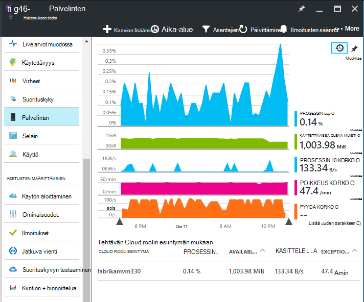

<properties 
    pageTitle="Suorituskyvyn laskureita-sovelluksen tiedot | Microsoft Azure" 
    description="Valvonta järjestelmän ja mukautetun .NET suorituskyvyn laskureita hakemuksen tiedot." 
    services="application-insights" 
    documentationCenter=""
    authors="alancameronwills" 
    manager="douge"/>

<tags 
    ms.service="application-insights" 
    ms.workload="tbd" 
    ms.tgt_pltfrm="ibiza" 
    ms.devlang="na" 
    ms.topic="article" 
    ms.date="10/11/2016" 
    ms.author="awills"/>
 
# <a name="system-performance-counters-in-application-insights"></a>Järjestelmän suorituskyvyn laskureita-sovelluksen tiedot


Windowsissa on erilaisia [suorituskyvyn laskureita](http://www.codeproject.com/Articles/8590/An-Introduction-To-Performance-Counters) , kuten suorittimen käyttöönottoon asti, muistin, levyn ja verkon käyttö. Voit myös määrittää omia. [Sovelluksen tiedot](app-insights-overview.md) voidaan näyttää näitä suorituskyvyn laskureita, jos sovellus on käynnissä IIS-kohdassa paikallisen isännän tai virtuaalikoneen, joihin sinulla on järjestelmänvalvojan oikeudet. Kaaviot tarkoittavat resursseista live-sovellukseen ja auttavat tunnistavan tasaamattomat kuormituksen server esiintymien välillä.

Suorituskyvyn laskureita näkyvät palvelimet-sivu, joka sisältää taulukon kyseisen osia mukaan esiintymä.



(Suorituskyvyn laskureita eivät ole käytettävissä Azure-verkkosovelluksissa. Mutta voi [lähettää Azure vianmääritys sovelluksen havainnollistamisen](app-insights-azure-diagnostics.md).)

## <a name="configure"></a>Asetusten määrittäminen

Jos sovelluksen havainnollistamisen tilan valvonta ei ole vielä asentanut server-tietokoneissa, sinun täytyy asentaa, niin näet suorituskyvyn laskureita.

Lataa ja suorita [tilan valvonta installer](http://go.microsoft.com/fwlink/?LinkId=506648) kunkin server-esiintymän. Jos se on jo asennettu, ei tarvitse asentaa uudelleen.

* *Voin [asentaa sovelluksen sovelluksen tiedot-SDK](app-insights-asp-net.md) kehityksen aikana. Tarvitsenko edelleen tilaa näytössä?*

    Kyllä, tila-näytössä tarvitaan kerääminen suorituskyvyn laskureita ASP.NET web Apps-sovellukset. Tiedät ehkä jo, tila-näytössä voidaan myös [näytön web Apps-sovelluksista, jotka ovat jo live](app-insights-monitor-performance-live-website-now.md)asentamatta SDK kehityksen aikana.


## <a name="view-counters"></a>Tarkastele laskureita

Palvelimet-sivu näyttää suorituskyvyn laskureita oletusarvoiset. 

Jos haluat nähdä muita laskureita, joko muokata kaavioita-palvelimet-sivu tai avaa uusi [Arvot Explorer](app-insights-metrics-explorer.md) -sivu ja lisää uudet kaaviot. 

Käytettävissä laskureita näkyvät arvot kuin kaavion muokattaessa.


Jos haluat nähdä kaikki yhdessä paikassa eniten hyötyä kaaviot, [raporttinäkymät-ikkunan](app-insights-dashboards.md) ja kiinnittämällä ne siihen.

## <a name="add-counters"></a>Lisätä laskureita

Jos suorituskyvyn laskuri ei ole näkyvissä luettelossa arvot, tämä johtuu hakemuksen tiedot SDK ei ole kerääminen-WWW-palvelimessa. Voit määrittää sen tekemään niin.

1. Tarkistaa, mitä laskureita ovat käytettävissä palvelimellesi palvelimessa tämän PowerShell-komennon avulla:

    `Get-Counter -ListSet *`

    (See [`Get-Counter`](https://technet.microsoft.com/library/hh849685.aspx).)

1. Avaa ApplicationInsights.config.

 * Jos olet lisännyt sovelluksen tiedot sovelluksen kehityksen aikana, Muokkaa ApplicationInsights.config projektin ja asentaa sen uudelleen palvelimiin.
 * Jos olet soittimen verkkosovellukseen suorituksen tilan valvonta, Etsi ApplicationInsights.config IIS-sovelluksen pääkansioon. Päivitä sinne kunkin esiintymä.

2. Muokkaa suorituskyvyn kerääminen direktiivin:

 ```XML

    <Add Type="Microsoft.ApplicationInsights.Extensibility.PerfCounterCollector.PerformanceCollectorModule, Microsoft.AI.PerfCounterCollector">
      <Counters>
        <Add PerformanceCounter="\Objects\Processes"/>
        <Add PerformanceCounter="\Sales(photo)\# Items Sold" ReportAs="Photo sales"/>
      </Counters>
    </Add>

```

Voit siepata sekä vakio laskureita ja jotka on toteutettu itse. `\Objects\Processes`Esimerkki vakio laskuri käytettävissä kaikissa Windows-järjestelmiin. `\Sales(photo)\# Items Sold`on esimerkki mukautetun laskuri, joka voi ottaa käyttöön verkkopalvelun. 

Muoto on `\Category(instance)\Counter"`, vai haluatko ainoastaan luokkien, joka ei ole esiintymät, `\Category\Counter`.

`ReportAs`Laskuri-nimet, jotka eivät vastaa tarvitaan `[a-zA-Z()/-_ \.]+` -eli niissä merkit, jotka eivät ole seuraavissa: kirjaimet pyöreä hakasulkeita, vinoviiva, yhdysmerkki, alaviiva, välilyöntiin piste.

Jos määrität erillisen, se kerätään dimensiona "CounterInstanceName" raportoidun arvo.

### <a name="collecting-performance-counters-in-code"></a>Kerääminen suorituskyvyn laskureita koodissa

Kerää järjestelmän suorituskyvyn laskureita ja lähetä ne sovelluksen havainnollistamisen, voit mukauttaa alla koodikatkelman:

    var perfCollectorModule = new PerformanceCollectorModule();
    perfCollectorModule.Counters.Add(new PerformanceCounterCollectionRequest(
      @"\.NET CLR Memory([replace-with-application-process-name])\# GC Handles", "GC Handles")));
    perfCollectorModule.Initialize(TelemetryConfiguration.Active);

Tai voit tehdä saman myös mukautettua arvot, jotka olet luonut kanssa:

    var perfCollectorModule = new PerformanceCollectorModule();
    perfCollectorModule.Counters.Add(new PerformanceCounterCollectionRequest(
      @"\Sales(photo)\# Items Sold", "Photo sales"));
    perfCollectorModule.Initialize(TelemetryConfiguration.Active);

## <a name="performance-counters-in-analytics"></a>Suorituskyvyn laskureita Analytics

Voit etsiä ja näyttää laskuri raportteja [Analytics](app-insights-analytics.md).


**PerformanceCounters** rakenteen paljastaa `category`, `counter` nimi- ja `instance` suorituskyvyn kunkin laskuri nimi.  Kunkin sovelluksen telemetriatietojen näet vain kyseisen ohjelman laskureita. Kuten näet mitä laskureita ovat käytettävissä: 


(Esiintymän' tähän viittaa suorituskyvyn laskuri-esiintymä ei rooli tai server-tietokoneen esiintymä. Suorituskyvyn laskuri esiintymän nimi yleensä lohkoja laskureita, kuten ajan prosessin tai sovelluksen nimi.)

Pääset kaavion käytettävissä olevan muistin viimeisimmät aikana: 


Muut telemetriatietojen, kuten **performanceCounters** on myös sarake `cloud_RoleInstance` , joka ilmaisee käyttäjätietoja host server-esiintymän, jossa sovellus on käynnissä. Jos esimerkiksi haluat vertailla eri tietokoneissa sovelluksen: 


## <a name="aspnet-and-application-insights-counts"></a>ASP.NET- ja sovelluksen tiedot-määrät

*Mikä on poikkeus korko ja poikkeukset arvot välinen ero?*

* *Poikkeus korko* on järjestelmän suorituskyvyn laskuri. CLR laskee kaikki käsitellyt ja käsittelemättömän poikkeukset, joka on antanut ja jakaa summan esimerkkejä aikavälin aikavälin pituuden mukaan. Hakemuksen tiedot SDK tuloksen kerää ja lähettää sen portaaliin.
* *Sääntöön* on esimerkkejä välin kaavion portaalin vastaanottanut TrackException raporttien määrä. Se sisältää vain käsitellyt kohtaa, johon olet kirjoittanut TrackException soittaa koodin ja kaikki [käsittelemättömän poikkeukset](app-insights-asp-net-exceptions.md)ei sisällä poikkeusta. 

## <a name="alerts"></a>Ilmoitukset

Muita tietoja voit varoittaa, jos suorituskyvyn laskuri siirtyy määrittämäsi rajoituksen ulkopuolella [ilmoituksen](app-insights-alerts.md) . Avaa ilmoitukset-sivu ja valitse Lisää ilmoitus.


## <a name="next"></a>Seuraavat vaiheet

* [Riippuvuus seuranta](app-insights-asp-net-dependencies.md)
* [Poikkeus seuranta](app-insights-asp-net-exceptions.md)