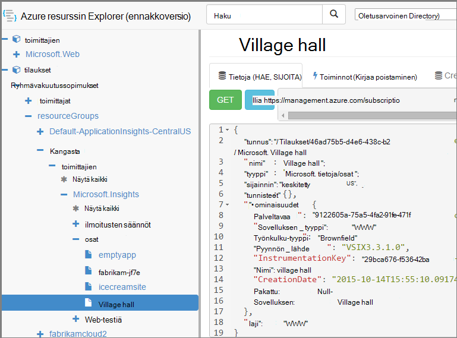

<properties 
    pageTitle="Luo sovelluksen havainnollistamisen resurssien PowerShellin avulla" 
    description="Luo sovelluksen havainnollistamisen resurssien ohjelmallisesti oman muodosta osana." 
    services="application-insights" 
    documentationCenter=""
    authors="alancameronwills" 
    manager="douge"/>

<tags 
    ms.service="application-insights" 
    ms.workload="tbd" 
    ms.tgt_pltfrm="ibiza" 
    ms.devlang="na" 
    ms.topic="article" 
    ms.date="03/02/2016" 
    ms.author="awills"/>
 
# <a name="create-application-insights-resources-using-powershell"></a>Luo sovelluksen havainnollistamisen resurssien PowerShellin avulla

Tässä artikkelissa kerrotaan, miten [Sovelluksen tiedot](app-insights-overview.md) -resurssin luominen Azure automaattisesti. Voi esimerkiksi tehdä niin muodosta yhteydessä. Sekä basic sovelluksen tiedot-resurssi voit luoda [käytettävyys web kokeet](app-insights-monitor-web-app-availability.md), [Määritä ilmoitukset](app-insights-alerts.md), ja luoda Azure resursseihin.

Nämä resurssit luominen on JSON malleja [Azure Resurssienhallinta](../powershell-azure-resource-manager.md). Sanottuna toimenpide: lataa aiemmin resurssien; JSON määritelmät parameterize tiettyjä arvoja, kuten nimet. ja suorita sitten mallin aina, kun haluat luoda uusi resurssi. Voit pakata useita resursseja yhdessä, luoda niitä kaikkia yhdessä Siirry - esimerkiksi sovelluksen-näyttö, jossa käytettävyys testejä, ilmoituksia ja tallennustilaa jatkuva Vie. On joitakin parameterizations, jossa kerrotaan tässä joitakin mustavalkoisessa.

## <a name="one-time-setup"></a>Erikseen asetukset

Jos et ole käyttänyt PowerShellin Azure-tilauksen ennen:

PowerShellin Azure-moduulin asentaminen tietokoneeseen, jonka haluat suorittaa komentosarjat:

1. Asenna [Microsoftin WWW-ympäristö asennusohjelma (v5 tai uudempi)](http://www.microsoft.com/web/downloads/platform.aspx).
2. Sen avulla voit asentaa Microsoft Azure Powershell.

## <a name="copy-the-json-for-existing-resources"></a>Kopioi aiemmin resurssien JSON

1. Määritä [Sovelluksen havainnollistamisen](app-insights-overview.md) projektin summakyselyn haluat luoda automaattisesti. Lisää web testien ja ilmoitukset, jos haluat.
2. Luo uusi .json tiedosto - puhelu oletetaan, että se `template1.json` tässä esimerkissä. Kopioi sen sisällön.


    ```JSON

        {
          "$schema": "https://schema.management.azure.com/schemas/2015-01-01/deploymentTemplate.json#",
          "contentVersion": "1.0.0.0",
          "parameters": {
            "appName": { "type": "string" },
            "webTestName": { "type": "string" },
            "url": { "type": "string" },
            "text": { "type" : "string" }
          },
          "variables": {
            "testName": "[concat(parameters('webTestName'), 
               '-', toLower(parameters('appName')))]"
            "alertRuleName": "[concat(parameters('webTestName'), 
               '-', toLower(parameters('appName')), 
               '-', subscription().subscriptionId)]"
          },
          "resources": [
            {
              // component JSON file contents
            },
            {
              //web test JSON file contents
            },
            {
              //alert rule JSON file contents
            }
 
            // Any other resources go here
          ]
        }
    
    ```

    Tämän mallin määrittää yhden käytettävyys testi lisäksi ensisijainen resurssi.


2. Avaa [Azure Resurssienhallinta](https://resources.azure.com/). Siirtyminen alaspäin `subscriptions/resourceGroups/<your resource group>/providers/Microsoft.Insights/components`-sovelluksen resurssiin. 

    

    *Osat* ovat sovellusten perustietoja hakemuksen tiedot resurssit. Liittyvien ilmoitusten sääntöjen ja käytettävyyden web testien erillisessä resursseilla.

3. Kopioi osa JSON paikkoihin `template1.json`.
6. Poista nämä ominaisuudet:
  * `id`
  * `InstrumentationKey`
  * `CreationDate`
4. Avaa webtests ja alertrules-osat ja kopioi mallin JSON yksittäisille kohteille. (Älä kopioi webtests tai alertrules solmut: Valitse kohteet, valitse ne yhdeksi.)

    Kunkin web-testin on liitetty ilmoitusten sääntö, joten sinun tarvitse kopioida molemmat arvosarjat.

    Web-testi lähetetään, ennen kuin hälytyksen.

5. Tyydyttämiseksi rakennetta Lisää rivin kullekin resurssille:

    `"apiVersion": "2014-04-01",`

    (Rakenteen complains myös isojen resurssin laji-nimistä `Microsoft.Insights/*` – mutta *Älä* Muuta nämä.)


## <a name="parameterize-the-template"></a>Parameterize malli

Nyt on tiettyjä nimiä korvaaminen parametrit. [Parameterize mallina](../resource-group-authoring-templates.md)Kirjoita lausekkeiden avulla [määrittää funktioita avustaja](../resource-group-template-functions.md). 

Ei ole parameterize merkkijonon vain osan, käytä niin `concat()` luonnissa merkkijonoja.

Seuraavassa on esimerkkejä kannattaa tehdä korvaus. On useita kunkin korvaaminen esiintymät. Voit joutua muiden malliin. Näissä esimerkeissä käytetään parametrien ja muuttujien määritimme mallin yläreunassa.

Etsi | korvaaminen
---|---
`"hidden-link:/subscriptions/.../components/MyAppName"`| `"[concat('hidden-link:',`<br/>` resourceId('microsoft.insights/components',` <br/> ` parameters('appName')))]"`
`"/subscriptions/.../alertrules/myAlertName-myAppName-subsId",` | `"[resourceId('Microsoft.Insights/alertrules', variables('alertRuleName'))]",`
`"/subscriptions/.../webtests/myTestName-myAppName",` | `"[resourceId('Microsoft.Insights/webtests', parameters('webTestName'))]",`
`"myWebTest-myAppName"` | `"[variables(testName)]"'`
`"myTestName-myAppName-subsId"` | `"[variables('alertRuleName')]"`
`"myAppName"` | `"[parameters('appName')]"`
`"myappname"`(pienet kirjaimet) | `"[toLower(parameters('appName'))]"`
`"<WebTest Name=\"myWebTest\" ...`<br/>` Url=\"http://fabrikam.com/home\" ...>"`|`[concat('<WebTest Name=\"',` <br/> `parameters('webTestName'),` <br/> `'\" ... Url=\"', parameters('Url'),` <br/> `'\"...>')]" `


## <a name="set-dependencies-between-the-resources"></a>Resurssien välillä riippuvuuksien määrittäminen

Azure kannattaa määrittää resurssien tarkka järjestyksessä. Varmista, että yhden asennus on valmis, ennen kuin seuraavan alkaa, Lisää riippuvuus rivejä:

* Sivuston Testaa resurssi:

    `"dependsOn": ["[resourceId('Microsoft.Insights/components', parameters('appName'))]"],`

* Ilmoitusten resurssi:

    `"dependsOn": ["[resourceId('Microsoft.Insights/webtests', variables('testName'))]"],`

## <a name="create-application-insights-resources"></a>Luo sovelluksen tiedot-resurssit

1. Azure kirjautuminen powershellissä,

    `Login-AzureRmAccount`

2. Suorita komento tältä:

    ```PS

        New-AzureRmResourceGroupDeployment -ResourceGroupName Fabrikam `
               -templateFile .\template1.json `
               -appName myNewApp `
               -webTestName aWebTest `
               -Url http://myapp.com `
               -text "Welcome!"
               -siteName "MyAzureSite"

    ``` 

    * -ResourceGroupName on ryhmä kohtaa, johon haluat luoda uusia resursseja.
    * -templateFile on oltava ennen mukautetun parametreja.
    * -appName luominen resurssin nimi.
    * -webTestName luominen web-testin nimi.
    * -URL-osoite web Appin URL-osoite.
    * -web-sivulla näkyvän teksti-merkkijono.
    * -Nimi - käyttää, jos se on Azure-sivusto


## <a name="define-metric-alerts"></a>Metrijärjestelmän ilmoitusten määrittäminen

Tällä [ilmoitusten PowerShell-menetelmää](app-insights-alerts.md#set-alerts-by-using-powershell).


## <a name="an-example"></a>Esimerkki

Seuraavassa on valmis osan, web-testi ja testaa ilmoitusten verkkomallin, joka on luotu:

``` JSON

{
  "$schema": "https://schema.management.azure.com/schemas/2015-01-01/deploymentTemplate.json#",
  "contentVersion": "1.0.0.0",
  "parameters": {
    "webTestName": { "type": "string" },
    "appName": { "type": "string" },
    "URL": { "type": "string" },
    "text": { "type" : "string" }
  },
  "variables": {
    "alertRuleName": "[concat(parameters('webTestName'), '-', toLower(parameters('appName')), '-', subscription().subscriptionId)]",
    "testName": "[concat(parameters('webTestName'), '-', toLower(parameters('appName')))]"
  },
  "resources": [
    {
      //"id": "[resourceId('Microsoft.Insights/components', parameters('appName'))]",
      "apiVersion": "2014-04-01",
      "kind": "web",
      "location": "Central US",
      "name": "[parameters('appName')]",
      "properties": {
        "TenantId": "9122605a-471fc50f8438",
        "Application_Type": "web",
        "Flow_Type": "Brownfield",
        "Request_Source": "VSIX3.3.1.0",
        "Name": "[parameters('appName')]",
        //"CreationDate": "2015-10-14T15:55:10.0917441+00:00",
        "PackageId": null,
        "ApplicationId": "[parameters('appName')]"
      },
      "tags": { },
      "type": "microsoft.insights/components"
    },
    {
      //"id": "[resourceId('Microsoft.Insights/webtests', variables('testName'))]",
      "name": "[variables('testName')]",
      "apiVersion": "2014-04-01",
      "type": "microsoft.insights/webtests",
      "location": "Central US",
      "tags": {
        "[concat('hidden-link:', resourceId('microsoft.insights/components', parameters('appName')))]": "Resource"
      },
      "properties": {
        "provisioningState": "Succeeded",
        "Name": "[parameters('webTestName')]",
        "Description": "",
        "Enabled": true,
        "Frequency": 900,
        "Timeout": 120,
        "Kind": "ping",
        "RetryEnabled": true,
        "Locations": [
          {
            "Id": "us-va-ash-azr"
          },
          {
            "Id": "emea-nl-ams-azr"
          },
          {
            "Id": "emea-gb-db3-azr"
          }
        ],
        "Configuration": {
          "WebTest": "[concat(
             '<WebTest   Name=\"', 
                parameters('webTestName'), 
              '\"  Id=\"32cfc791-aaad-4b50-9c8d-993c21beb218\"   Enabled=\"True\"         CssProjectStructure=\"\"    CssIteration=\"\"  Timeout=\"120\"  WorkItemIds=\"\"         xmlns=\"http://microsoft.com/schemas/VisualStudio/TeamTest/2010\"         Description=\"\"  CredentialUserName=\"\"  CredentialPassword=\"\"         PreAuthenticate=\"True\"  Proxy=\"default\"  StopOnError=\"False\"         RecordedResultFile=\"\"  ResultsLocale=\"\">  <Items>  <Request Method=\"GET\"         Guid=\"a6f2c90b-61bf-b28hh06gg969\"  Version=\"1.1\"  Url=\"', 
              parameters('Url'), 
              '\" ThinkTime=\"0\"  Timeout=\"300\" ParseDependentRequests=\"True\"         FollowRedirects=\"True\" RecordResult=\"True\" Cache=\"False\"         ResponseTimeGoal=\"0\"  Encoding=\"utf-8\"  ExpectedHttpStatusCode=\"200\"         ExpectedResponseUrl=\"\" ReportingName=\"\" IgnoreHttpStatusCode=\"False\" />        </Items>  <ValidationRules> <ValidationRule  Classname=\"Microsoft.VisualStudio.TestTools.WebTesting.Rules.ValidationRuleFindText, Microsoft.VisualStudio.QualityTools.WebTestFramework, Version=10.0.0.0, Culture=neutral, PublicKeyToken=b03f5f7f11d50a3a\" DisplayName=\"Find Text\"         Description=\"Verifies the existence of the specified text in the response.\"         Level=\"High\"  ExectuionOrder=\"BeforeDependents\">  <RuleParameters>        <RuleParameter Name=\"FindText\" Value=\"', 
              parameters('text'), 
              '\" />  <RuleParameter Name=\"IgnoreCase\" Value=\"False\" />  <RuleParameter Name=\"UseRegularExpression\" Value=\"False\" />  <RuleParameter Name=\"PassIfTextFound\" Value=\"True\" />  </RuleParameters> </ValidationRule>  </ValidationRules>  </WebTest>')]"
        },
        "SyntheticMonitorId": "[variables('testName')]"
      }
    },
    {
      //"id": "[resourceId('Microsoft.Insights/alertrules', variables('alertRuleName'))]",
      "name": "[variables('alertRuleName')]",
      "apiVersion": "2014-04-01",
      "type": "microsoft.insights/alertrules",
      "location": "East US",
      "dependsOn": [
        "[resourceId('Microsoft.Insights/components', parameters('appName'))]",
        "[resourceId('Microsoft.Insights/webtests', variables('testName'))]"
      ],
      "tags": {
        "[concat('hidden-link:', resourceId('Microsoft.Insights/components', parameters('appName')))]": "Resource",
        "[concat('hidden-link:', resourceId('Microsoft.Insights/webtests', variables('testName')))]": "Resource"
      },
      "properties": {
        "name": "[variables('alertRuleName')]",
        "description": "",
        "isEnabled": true,
        "condition": {
          "$type": "Microsoft.WindowsAzure.Management.Monitoring.Alerts.Models.LocationThresholdRuleCondition, Microsoft.WindowsAzure.Management.Mon.Client",
          "odata.type": "Microsoft.Azure.Management.Insights.Models.LocationThresholdRuleCondition",
          "dataSource": {
            "$type": "Microsoft.WindowsAzure.Management.Monitoring.Alerts.Models.RuleMetricDataSource, Microsoft.WindowsAzure.Management.Mon.Client",
            "odata.type": "Microsoft.Azure.Management.Insights.Models.RuleMetricDataSource",
            "resourceUri": "[resourceId('microsoft.insights/webtests', variables('testName'))]",
            "metricName": "GSMT_AvRaW"
          },
          "windowSize": "PT15M",
          "failedLocationCount": 2
        },
        "action": {
          "$type": "Microsoft.WindowsAzure.Management.Monitoring.Alerts.Models.RuleEmailAction, Microsoft.WindowsAzure.Management.Mon.Client",
          "odata.type": "Microsoft.Azure.Management.Insights.Models.RuleEmailAction",
          "sendToServiceOwners": true,
          "customEmails": [ ]
        },
        "provisioningState": "Succeeded",
        "actions": [ ]
      }

    }
  ]
}

```

## <a name="see-also"></a>Katso myös

Muut automaatio artikkelit:

* [Luo sovelluksen tiedot-resurssi](app-insights-powershell-script-create-resource.md) - nopea tapa ilman mallia.
* [Ilmoitusten määrittäminen](app-insights-powershell-alerts.md)
* [Luo web-testiä](https://azure.microsoft.com/blog/creating-a-web-test-alert-programmatically-with-application-insights/)
* [Lähetä Azure vianmääritys sovelluksen havainnollistamisen](app-insights-powershell-azure-diagnostics.md)
* [Luo release huomautukset](https://github.com/Microsoft/ApplicationInsights-Home/blob/master/API/CreateReleaseAnnotation.ps1)
