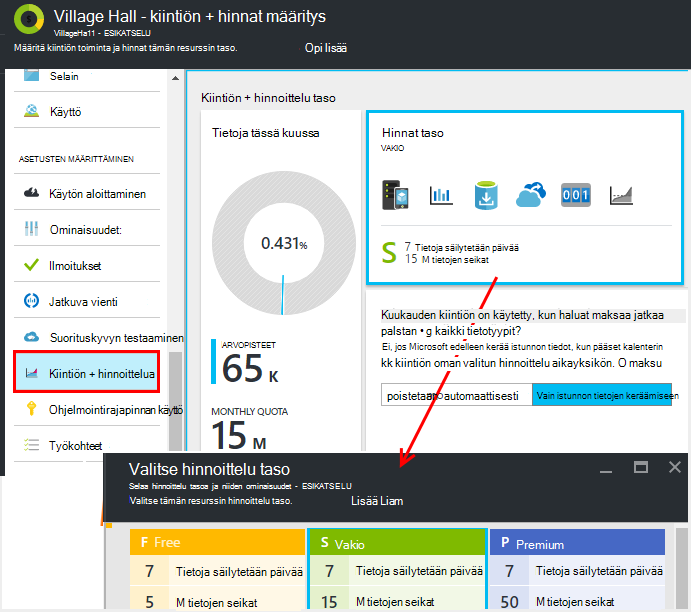
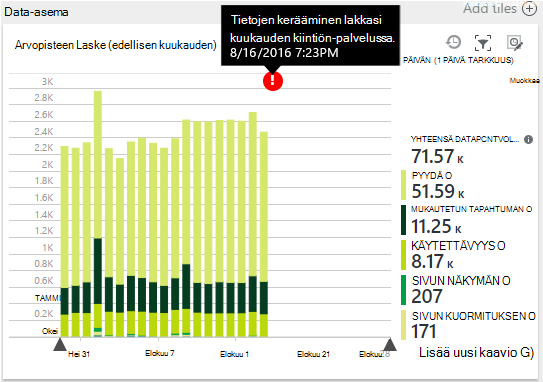
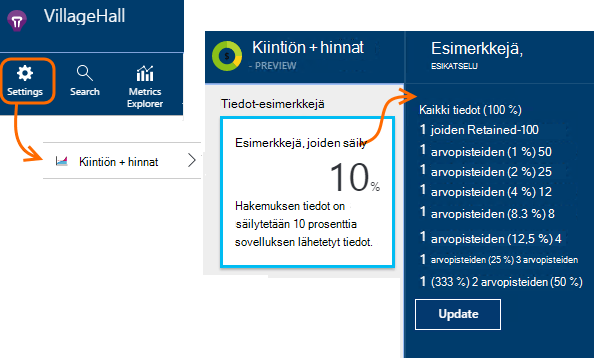
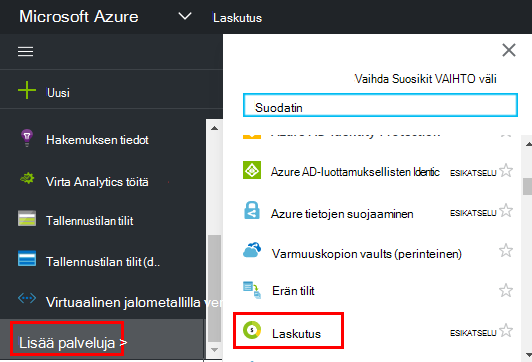

<properties 
    pageTitle="Hinnat ja kiintiön hallintaa hakemuksen tiedot | Microsoft Azure" 
    description="Valitse hinta-palvelupaketti, sinun on, hallita telemetriatietojen tietomääristä" 
    services="application-insights" 
    documentationCenter=""
    authors="alancameronwills" 
    manager="douge"/>

<tags 
    ms.service="application-insights" 
    ms.workload="tbd" 
    ms.tgt_pltfrm="ibiza" 
    ms.devlang="na" 
    ms.topic="article" 
    ms.date="10/13/2016" 
    ms.author="awills"/>

# Hinnat ja kiintiön hallintaa hakemuksen tiedot

*Hakemuksen tiedot on esikatselu.*

[Hinnat] [ pricing] for [Visual Studio hakemuksen tiedot] [ start] perustuu tietojen aseman sovellusta kohden. Tällä merkittäviin vapaa taso, jossa saat useimmat ominaisuudet liittyy joitakin rajoituksia.

Hakemuksen tiedot kullekin resurssille veloitetaan erillinen palveluna ja prosentuaalista osuutta tilauksen Azure laskussa.

[Katso hinnoittelu värimallin][pricing].

## Hakemuksen tiedot resurssin Tarkista kiintiön ja hinta suunnitteleminen

Voit avata kiintiön + hinnoittelua sovelluksen resurssin asetukset-sivu.

Hinnoittelua mallin valinta vaikuttaa:

* [Kuukausittainen kiintiön](#monthly-quota) - telemetriatietojen voit analysoida kuukausittain määrää.
* [Tietojen määrä](#data-rate) -, jolla tiedot sovelluksestasi voidaan käsitellä enimmäisnopeus.
* [Jatkuva Vie](#continuous-export) -, voit viedä tietoja muista työkalut ja -palveluista.

Nämä raja-arvot on määritetty erikseen hakemuksen tiedot kullekin resurssille.

### Maksuton Premium

Kun luot uuden sovelluksen tiedot resurssin ensimmäisen kerran, se käynnistyy vapaa taso.

Milloin tahansa joihin voi siirtyä 30 päivän maksuton Premium-kokeiluversio. Kyseinen rivimäärä on Premium-tason etuja. 30 päivän jälkeen se automaattisesti palautuvat riippumatta siitä, mitä olet taso olivat, ennen kuin -, ellet nimenomaisesti toisen tason. Valitse taso, kuten milloin tahansa kokeilujakson aikana, mutta saat edelleen maksuton 30 päivän loppuun saakka.

## Kuukausittainen kiintiön

* Kunkin kalenterikuukauden sovelluksesi voi lähettää telemetriatietojen sovelluksen havainnollistamisen määritetty määrä. Tällä hetkellä maksuton hinnoittelu taso kiintiön on 5 miljoonaa arvopistettä kuukauden ja merkittävästi lisää järjestelmiä; Voit ostaa lisää, jos pääset kiintiön.  Katso [hinnat värimallin] [ pricing] todelliset luvut. 
* Kiintiön määräytyy hinnoittelu taso, jotka olet valinnut.
* Kiintiön lasketaan kuukauden ensimmäisen päivän keskiyöhön UTC.
* Tietoja pisteiden kaavio näyttää kuinka suuri osa kiintiö on käytetty tässä kuussa ylöspäin.
* Kiintiön mitataan *arvopisteitä.* Yhteen arvopisteeseen on puhelun Jäljitä tavoilla, onko kutsutaan erikseen koodin tai jokin vakio telemetriatietojen moduulit. Se voi olla useita liitetty ominaisuudet ja arvot.
* Arvopisteiden luomat:
 * [SDK-moduuleja](app-insights-configuration-with-applicationinsights-config.md) , kerää automaattisesti tietoja, kuten ilmoittamaan pyynnön tai kaatuu tai suorituskykyä.
 * [Ohjelmointirajapinta](app-insights-api-custom-events-metrics.md) `Track...` , jotka olet kirjoittanut, kuten puheluita `TrackEvent` tai `trackPageView`.
 * [Käytettävyys web testit](app-insights-monitor-web-app-availability.md) , jotka olet määrittänyt.
* Kun olet virheenkorjaus, näet arvopisteitä on lähetetty sovelluksestasi Visual Studio kohde-ikkunassa. Asiakkaan tapahtumat näkevät avaamalla selain verkko-välilehti on virheenkorjaus ruudun (yleensä F12).
* *Istunnon tiedot* ei lasketa kiintiön. Tämä sisältää käyttäjät, istuntojen, ympäristön ja laitteen tietojen määrä.
* Jos haluat laskeminen arvopisteitä ylös tarkastus, voit hakea muistiinpanoja eri paikoista:
 * Kunkin kohteen näet [Diagnostiikan haku](app-insights-diagnostic-search.md), joka sisältää HTTP pyynnöt, poikkeukset, loki jäljittää, sivun näkymät, riippuvuuden tapahtumien ja mukautetut tapahtumat.
 * Kunkin raaka mitta [arvo](app-insights-metrics-explorer.md) , kuten suorituskyvyn laskuri. (Kaaviot näy pisteet ovat yleensä useita raaka arvopisteiden koosteet.)
 * Kunkin kohdan web käytettävyys kaaviossa on myös useita arvopisteiden koosteen.
* Voit myös tarkastaa yksittäisten arvopisteiden lähteen etsiminen aikana virheenkorjaus:
 * Jos suoritat sovelluksen virheenkorjaus tilassa Visual Studiossa, arvopisteiden kirjautunut kohde-ikkunassa. 
 * Asiakkaan arvopisteitä, Avaa selaimen muistin ruutu (yleensä F12) ja Avaa Verkko-välilehti.
* Tietojen määrä voi (oletusarvo) pienentyä [mukautuvat näytteiden](app-insights-sampling.md)perusteella. Tämä tarkoittaa, että kuin käyttö app kasvaa telemetriatietojen korko ei kasvata mahdollisimman paljon voisi olettaa.

### Kattavuus

Jos sovelluksen lähettää yli kuukauden kiintiön, voit tehdä seuraavaa:

* Maksaa lisätiedot. Katso [hinnat värimallin] [ pricing] lisätietoja. Voit valita tämän asetuksen etukäteen. Tämä vaihtoehto ei ole käytettävissä vapaa hinnat taso.
* Päivitä hinnoittelu taso.
* Ei toimi. Istunnon tiedot säilyvät voi tallentaa, mutta muiden tietojen ei tule diagnostiikan haun tai arvot Explorerissa.

## Tietojen käsittelyä lähettäminen?

Kaavion alareunassa hinnoittelua sivu näkyy sovelluksen data piste-asema, ryhmitelty pisteen tietotyyppi. (Voit myös luoda metrijärjestelmä Explorerissa kaaviolaji.)

Tarkemmin, kaavion tai vetämällä se ja valitse aika-alueen yksityiskohtaisen (+).

Kaavio näyttää tiedot, jotka saapuu sovelluksen tiedot-palvelun jälkeen [Esimerkkejä](app-insights-sampling.md)äänenvoimakkuuden.

Jos tietojen äänenvoimakkuuden saavuttaa kuukauden kiintiön, huomautuksen näkyy kaavion.

## Tietojen määrä

Lisäksi kuukausittain kiintiö on rajoittava rajoitukset tietojen määrä. Vapaa [hinnat taso] [ pricing] rajoitus on 200 tietojen pisteet/toisen keskiarvo 5 minuuttia ja varten maksettu tasoa se on 500/s keskiarvo 1 minuutti. 

On kolme uudelleenkäytettävät, joka lasketaan erikseen:

* [TrackTrace puhelut](app-insights-api-custom-events-metrics.md#track-trace) ja [tallennetaan lokit](app-insights-asp-net-trace-logs.md)
* [Poikkeukset](app-insights-api-custom-events-metrics.md#track-exception)-rajoitettu 50 pisteet/s-näppäinyhdistelmää.
* Kaikki muut telemetriatietojen (sivun näkymät, istuntojen, pyynnöt, riippuvuudet, mittarit, mukautetut tapahtumat, web-testitulokset).

*Mitä tapahtuu, jos sovellukseni on suurempi kuin toisen kohti korko?*

* Tiedot, jotka sovelluksen lähettää äänenvoimakkuuden arvioidaan minuutin välein. Jos se ylittää minuutit keskiarvona sekunnissa nopeus-palvelin ei jotkin pyynnöt. SDK puskuroi tiedot ja yrittää sitten uudelleen ylijännitesuojan levittäminen useita minuutteja päälle. Jos sovelluksen lähettää johdonmukaisesti rajoittava korko yllä olevien tietojen etsiminen, jotkin tiedot poistetaan. (ASP.NET, Java ja JavaScript SDK: T yrittävät lähettää tällä tavalla, muut SDK: T ehkä vain avattavan rajoittanut tietojen.)

Jos rajoittimen ilmenee, näkyviin tulee varoitus, että tämä on tapahtunut ilmoituksen.

*Mistä tiedän, että arvopisteiden sovelluksen lähettäminen?*

* Avaa asetukset/kiintiön ja hinnoittelu Data-asema-kaavio.
* Arvot Resurssienhallinnassa, uuden kaavion lisääminen ja valitsemalla sen metrijärjestelmä nimellä **arvopisteen äänenvoimakkuutta** . Vaihda ryhmittely ja ryhmän **tietojen tyypin**mukaan.

## Voit pienentää tietojen määrä

Jos käytössä ilmenee rajoittava rajoitukset, seuraavat seikat, voit tehdä:

* Käytä [Esimerkkejä](app-insights-sampling.md). Tämä tekniikka vähentää tietojen määrä, muuttaa oman arvot ja ilman toiminnan voi siirtyä hakutoiminnossa liittyvät kohteet.
* [Ajax-puhelut, voit raportoida määrän rajoittaminen](app-insights-javascript.md#detailed-configuration) jokaisen sivun näkymän tai vaihda Ajax raportoinnin käytöstä.
* Poistaa käytöstä sivustokokoelman moduuleja ei tarvitse muokkaamalla [ApplicationInsights.config](app-insights-configuration-with-applicationinsights-config.md). Voit esimerkiksi päättää suorituskyvyn laskureita tai riippuvuuden tiedot ovat inessential.
* Koota valmiiksi arvot. Jos olet lisännyt TrackMetric puhelut-sovelluksen, voit pienentää liikenne avulla, joka hyväksyy laskelman keskiarvo ja keskihajonta mitat erän liikaa. Tai voit käyttää [ennalta Keskusportaalisivustoihin paketti](https://www.myget.org/gallery/applicationinsights-sdk-labs). 

## Esimerkkejä

[Näyte](app-insights-sampling.md) on menetelmä, jolla telemetriatietojen lähetetään-sovelluksen edelleen säilyttää voi etsiä Aiheeseen liittyvät tapahtumat diagnostiikan hakujen aikana ja edelleen säilyttää oikea laskee tapahtuman korko vähentää. 

Esimerkkejä on tehokas tapa vähentää kulujen ja pysyä ajan kuluessa kuukauden kiintiön. Esimerkkejä algoritmin säilyttää telemetriatietojen, liittyvät kohteet niin, että kun haku, voit esimerkiksi etsiä liittyvät erityisesti poikkeuksen pyynnön. Algoritmin säilyttää myös oikea laskee niin, että näet oikeat arvot pyynnön palkat, poikkeuksen korvaukset ja muut laskee metrijärjestelmä Resurssienhallinnassa.

Esimerkkejä on useita.

* [Säädön esimerkkejä](app-insights-sampling.md) on ASP.NET SDK-paketissa, joka muuttuu automaattisesti telemetriatietojen, joka lähettää sovelluksen äänenvoimakkuuden oletusarvo. Se toimii automaattisesti SDK-sovellukseen, niin, että verkossa telemetriatietojen-liikenne vähenee. 
* *Nieltynä esimerkkejä* on vaihtoehto, joka toimii kohtaan, jossa telemetriatietojen sovelluksestasi tulee sovelluksen tiedot-palvelun. Se ei vaikuta sovelluksen lähettämät telemetriatietojen äänenvoimakkuuden, mutta se pienentää äänenvoimakkuutta palvelu säilyttää tiedot. Sen avulla voit pienentää kiintiön käyttämä telemetriatietojen selaimet ja muut SDK: T.

Voit määrittää nieltynä esimerkkejä määrittää ohjausobjektin kiintiöiden + hinnat sivu:

> [AZURE.WARNING] Objektit säilyvät ruutu arvo osoittaa vain määritetyt nieltynä esimerkkejä arvon. Se ei näy esimerkkejä korko, joka toimii SDK-sovelluksen. 
> 
> Jos saapuvan telemetriatietojen on jo näyte SDK-palvelussa, kun nieltynä otos, jota ei käytetä.
 
Saat tietää esimerkkejä todellinen korko riippumatta siitä, missä se on otettu käyttöön, käytä [Analytics kyselyn](app-insights-analytics.md) esimerkiksi:

    requests | where timestamp > ago(1d)
  	| summarize 100/avg(itemCount) by bin(timestamp, 1h) 
  	| render areachart 

Kussakin säily tietueen `itemCount` ilmaisee, joka edustaa, alkuperäinen tietueiden määrän arvoksi 1 + edellisen hylättyjen tietueiden määrän. 

## Tarkista laskun tilauksen Azure

Hakemuksen tiedot maksuja lisätään Azure laskun. Voit tarkastella tietoja siitä, että Azure laskuttaa Azure-portaalin tai [Azure Laskutus-portaalissa](https://account.windowsazure.com/Subscriptions)Laskutus-osan. 

## Nimi-rajoitukset

1.  Enintään 200 metrisillä yksilöllisesti ja 200 sovelluksen yksilöivä ominaisuuksien nimiä. Arvot ovat lähetetyissä kutsuissa TrackMetric sekä mitat, muiden tietotyypeistä, kuten tapahtumien tiedot.  [Arvot ja ominaisuuden] [ api] ovat yleisiä kohti instrumentation-näppäintä.
2.  [Ominaisuuksien] [ apiproperties] voi käyttää suodatus- ja Ryhmittelyperuste vain silloin, kun ne on alle 100 yksilölliset arvot kullekin ominaisuudelle. Kun ainutkertaisten arvojen määrä ylittää 100, voit edelleen etsiä ominaisuutta, mutta ei enää käyttää suodattimia tai Ryhmittelyperuste.
3.  Vakio-ominaisuudet, kuten pyytää nimi ja sivun URL-osoite on oikeutettu enintään 1 000 viikossa yksilöllisiä arvoja. 1 000 yksilöllisiä arvoja, kun muita arvoja on merkitty "Muita arvoja." Alkuperäiset arvot voidaan edelleen koko tekstistä ja suodattamisesta.

Jos huomaat, että sovelluksesi on suurempi kuin nämä raja-arvot, harkitse tietojen välillä eri instrumentation näppäimet -, [Luo uusi sovellus havainnollistamisen resurssien](app-insights-create-new-resource.md) jakaminen ja Lähetä soluihin uudet instrumentation avaimet. Saatat huomata, että tulokseen rakentuu paremmin. [Raporttinäkymien](app-insights-dashboards.md#dashboards) avulla voit tuoda eri arvot sivulle samassa näytössä niin tämän menetelmän ei rajoita järjestelmänvalvoja vertailla eri arvot. 

## Rajoitukset yhteenveto

[AZURE.INCLUDE [application-insights-limits](../../includes/application-insights-limits.md)]

<!--Link references-->

[api]: app-insights-api-custom-events-metrics.md
[apiproperties]: app-insights-api-custom-events-metrics.md#properties
[start]: app-insights-overview.md
[pricing]: http://azure.microsoft.com/pricing/details/application-insights/

 