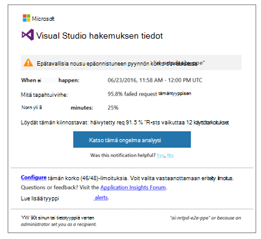

<properties 
    pageTitle="Ennakoiva diagnostiikka-sovelluksen tiedot | Microsoft Azure" 
    description="Hakemuksen tiedot suorittaa automaattisen laaja analyysi sovelluksen telemetriatietojen ja varoittaa mahdollisia ongelmia." 
    services="application-insights" 
    documentationCenter="windows"
    authors="rakefetj" 
    manager="douge"/>

<tags 
    ms.service="application-insights" 
    ms.workload="tbd" 
    ms.tgt_pltfrm="ibiza" 
    ms.devlang="na" 
    ms.topic="article" 
    ms.date="08/15/2016" 
    ms.author="awills"/>

#  Ennakoiva diagnostiikka-sovelluksen tiedot

 Ennakoiva diagnostiikka varoittaa käyttäjää suorituskyvyn ongelmia web-sovelluksen automaattisesti. Se on suorittanut smart analyysin telemetriatietojen, joka lähettää sovelluksen [Visual Studio hakemuksen tiedot](app-insights-overview.md). Jos näkyvissä on äkillinen nousu-virhe korvaukset ja epätavallisia kuvioiden asiakas- tai suorituskyvyn, saat ilmoituksen. Tämä ominaisuus on määrityksiä. Se toimii, jos sovellus lähettää tarpeeksi telemetriatietojen.

Voit käyttää ennakoiva tunnistus ilmoitusten sekä saat sähköpostit ja ennakoiva tunnistaminen-sivu.

## Tarkista ennakoiva tunnistuksia

Voit tutustua tunnistuksia kahdella tavalla:

* **Saat sähköpostin** hakemuksen tiedot. Tyypillinen esimerkki näin:

    

    Valitse suuri-painikkeen napsauttaminen avaa yksityiskohtaisempia portaalissa.

* Sinua sovelluksen yhteenveto-sivu **on ennakoiva tunnistus ruutu** näyttää uusien ilmoitusten määrä. Napsauta ruutua ja uusien ilmoitusten luettelo.

Valitse ilmoituksen tiedot näkyviin.

## Mitä ongelmia havaita?

On kolmenlaisia tunnistus:

* [Ennakoiva virheen korko diagnostiikka](app-insights-proactive-failure-diagnostics.md). Käytämme konepohjaisten oppimistekniikoiden voit määrittää epäonnistuneiden pyyntöjen, kun sovellus odotettu korko hajautettuna kuormituksen ja muiden tekijöiden kanssa. Jos epäonnistumisen kerroin menee odotettu kirjekuori ulkopuolella, Microsoft lähettää ilmoituksen.
* [Ennakoiva suorituskyvyn vianmääritys](app-insights-proactive-performance-diagnostics.md). Olemme Etsi erheellisiin kuviot vastauksen työajat ja epäonnistumisen korvaukset päivittäin. Olemme yhdistää näiden ominaisuuksien, kuten sijainti, selaimen, asiakkaan OS ongelmat, esiintymä ja kellonaika.
* [Azure Cloud Services](https://azure.microsoft.com/blog/proactive-notifications-on-cloud-service-issues-with-azure-diagnostics-and-application-insights/). Saat ilmoituksia, jos sovelluksen nykyisessä Azure Cloud Services-palveluissa ja roolin esiintymän käynnistys epäonnistuu, usein käytetyt kierrättäminen tai runtime kaatuu.

(Ohjeen kunkin ilmoituksen linkkien avulla voit asiaa artikkeleihin.)

## Seuraavat vaiheet

Voit tarkastaa sovelluksestasi telemetriatietojen seuraavia diagnostiikkatyökaluja avulla:

* [Metrijärjestelmän explorer](app-insights-metrics-explorer.md)
* [Erikoishaku](app-insights-diagnostic-search.md)
* [Analytics - tehokkaita kyselykielen](app-insights-analytics-tour.md)

Ennakoiva diagnostiikka ovat täysin automaattinen. Mutta ehkä haluat joitakin ilmoitusten määrittäminen?

* [Manuaalisesti määritetty metrisillä ilmoitukset](app-insights-alerts.md)
* [Käytettävyys web testit](app-insights-monitor-web-app-availability.md) 

