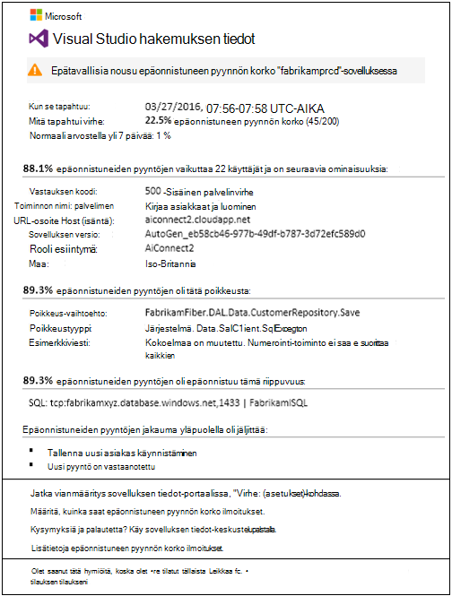
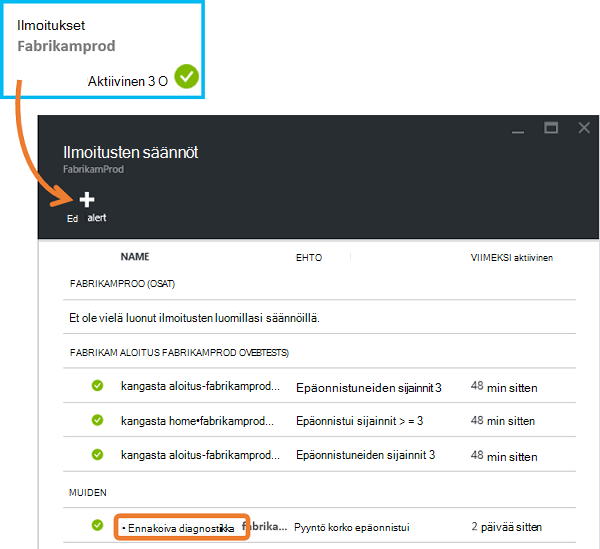
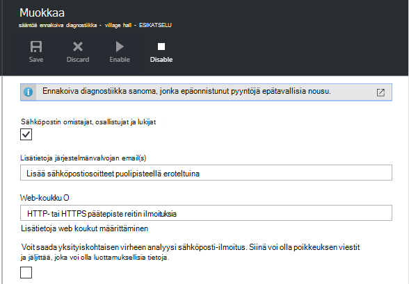
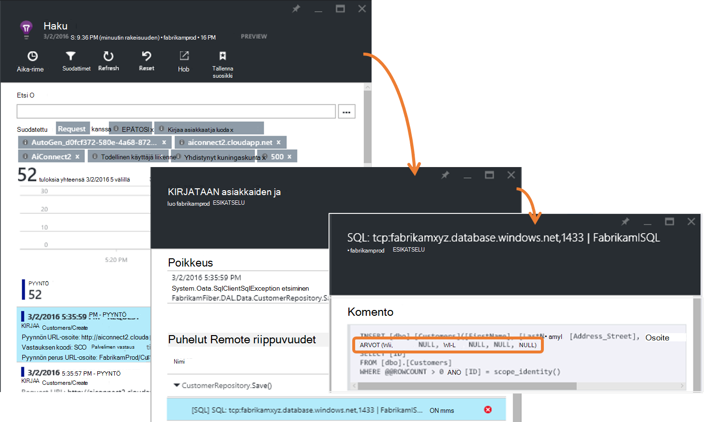
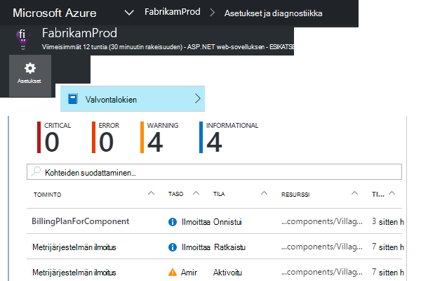
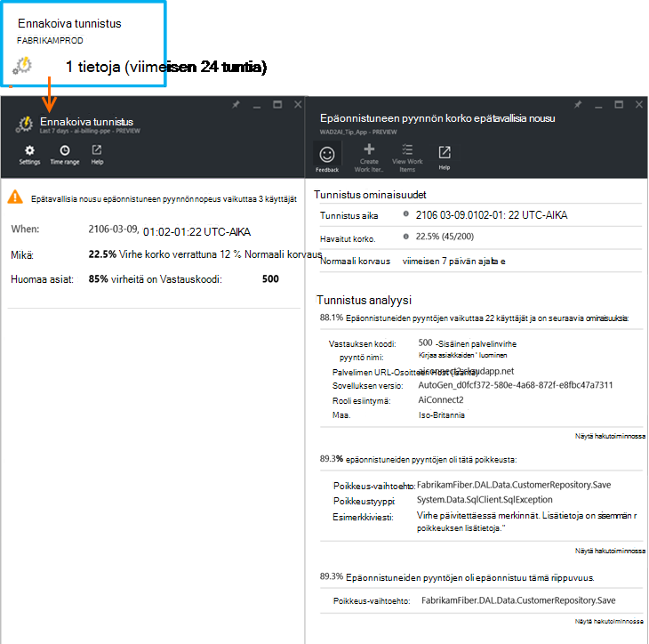

<properties 
    pageTitle="Ennakoiva virheen korko diagnostiikka-sovelluksen tiedot | Microsoft Azure" 
    description="Ilmoittaa epätavallisia muutosten suuruuden epäonnistuneiden pyyntöjen web App-sovellukseen ja tarjoaa diagnostiikan analyysi. Määrityksiä ei tarvita." 
    services="application-insights" 
    documentationCenter=""
    authors="yorac" 
    manager="douge"/>

<tags 
    ms.service="application-insights" 
    ms.workload="tbd" 
    ms.tgt_pltfrm="ibiza" 
    ms.devlang="na" 
    ms.topic="article" 
    ms.date="10/12/2016" 
    ms.author="awills"/>
 
# Ennakoiva virheen korko diagnostiikka

[Visual Studio hakemuksen tiedot](app-insights-overview.md) automaattisesti ilmoittaa, kun lähelle reaaliajassa koodiin ilmenee epätavallisia nousu virheiden suuruuden. Se havaitsee epätavallisia nosto, alentaminen pyyntöjen valmiiksi epäonnistui. Nämä ovat yleensä sisältävän vastauksen koodit-400 - ja 500-alueita. Jotta näet kiireellisyysjärjestys ja vianmäärityksessä analyysi epäonnistui pyynnöt ja Aiheeseen liittyvät telemetriatietojen ominaispiirteet annetaan ilmoituksessa. Saatavilla on myös linkit edelleen vianmääritys sovelluksen tiedot-portaaliin. Ominaisuus on määritys, eikä käyttöönottoa varten, kun se käyttää tietokoneen learning algoritmit ennustaa Normaali virheen korko.

Tämä ominaisuus toimii Java- ja ASP.NET-verkkosovelluksissa pilveen tai oman palvelimiin. Se toimii myös sovellusta, joka luo pyyntö telemetriatietojen – esimerkiksi, jos sinulla on työntekijän rooli, jotka kutsuvat [TrackRequest()](app-insights-api-custom-events-metrics.md#track-request). 

Kun [Projektin tiedot sovelluksen](app-insights-overview.md)määrittämisestä ja annettu sovelluksen Luo tiettyjä vähimmäistilan, joka telemetriatietojen, ennakoiva virheen diagnostiikka tulevat 24 tunnin lisätietoja normaalia sovelluksesi, ennen kuin se otetaan käyttöön ja lähettää ilmoitukset.

Tässä on esimerkki-ilmoitus. 

> [AZURE.NOTE] Oletusarvon mukaan saat lyhentää muoto-sähköpostin kuin tässä esimerkissä. Mutta voi [vaihtaa yksityiskohtaiset tässä muodossa](#configure-alerts).

Huomaa, että se kertoo:

* Normaali-sovelluksen toiminta verrattuna epäonnistumisen nopeus.
* Kuinka monta käyttäjää vaikuttavat – niin tiedät, kuinka paljon tehtävä.
* Ominaisen kuvion liittyvät virheet. Tässä esimerkissä on tietyn vastauksen koodi, pyyntö nimi (toiminto) ja app-versio. Heti kerrotaan, mistä aloittaisi koodissa näyttöä. Muita vaihtoehtoja voi olla tietyn selaimessa tai asiakkaan käyttöjärjestelmän.
* Poikkeus, loki jäljittää ja riippuvuuden virheen (tietokannat tai ulkoisen muut osat), jotka näkyvät yhdistetä jakauma epäonnistui pyynnöt.
* Asiaa hakuja telemetriatietojen-sovelluksen tiedot suoraan linkkejä.

## Ennakoiva ilmoitusten edut

Tavallinen [metrisillä ilmoitukset](app-insights-alerts.md) Ilmoita saattaa olla ongelma. Mutta ennakoiva virheen diagnostiikka käynnistyy diagnostiikan työmääriin voit suorittaa analyysi itse muuten on paljon. Saat tulokset siististi pakattu, voit siirtyä nopeasti ongelma ylimmällä.

## Toiminta

Reaaliaikainen ennakoiva diagnostiikka näytön lähelle telemetriatietojen vastaanotti sovelluksen ja erityisesti epäonnistuneen pyynnön korko. Tämä arvo laskee pyyntöjen määrän, jonka `Successful request` ominaisuus on EPÄTOSI. Oletusarvon mukaan `Successful request== (resultCode < 400)` (paitsi jos olet kirjoittanut mukautettua koodia [suodattimen](app-insights-api-filtering-sampling.md#filtering) tai luo [TrackRequest](app-insights-api-custom-events-metrics.md#track-request) -puhelujen). 

Sinua sovelluksen suorituskyvyn on tyypillinen rakenteessa toiminta. Jotkin pyynnöt on enemmän voi enää epäonnistumisen kuin muille henkilöille ja Yleinen virhe korko voi siirtyä kuin kuormituksen kasvaa. Ennakoiva virheen diagnostiikka käyttää konepohjaisten oppimistekniikoiden löydät nämä poikkeamia. 

Kun telemetriatietojen tulee verkkosovelluksen sovelluksen tiedot-ennakoiva virheen diagnostiikka Vertaa nykyisen toiminnan nähdä viimeisten muutaman päivän aikana kuvioilla. Jos virheen korko epätavallisia nousu havaitaan verrattuna edellisen suorituskyky-analyysin käynnistyy.

Kun analyysin käynnistäminen palvelun suorittaa klusterin analyysi epäonnistuneen pyynnön ja yrittää tunnistaa kuvion arvoja, jotka vapausasteiden virheet. Yllä olevassa esimerkissä analyysin on havainnut, että useimmat virheet käsittelevät tietyn tuloksen koodi, pyyntö nimen, palvelimen URL-osoite isännän ja roolin esiintymä. Analyysin on havainnut sen sijaan, että asiakas-käyttöjärjestelmän ominaisuuden jaetaan useiden arvojen ja siten sitä ei näy luettelossa.

Palvelussa on instrumented nämä telemetriatietojen kanssa, kun analysaattorin löytää poikkeuksen ja riippuvuuden epäonnistui, jotka liittyvät se on tunnistaa ja kaikki Jäljityslokit nämä pyynnöt liittyvät Esimerkki klusterin pyynnöt.

Tuloksena analyysin lähetetään sinulle ilmoituksen, ellei on määritetty ei.

[Ilmoitukset, voit määrittää manuaalisesti](app-insights-alerts.md), kuten ilmoituksen tilan tarkistaminen ja määrittää sen sovelluksen tiedot-resurssien ilmoitukset-sivu. Mutta toisin kuin muut ilmoitukset, sinun ei tarvitse tehdä määrittäminen tai määritä ennakoiva epäonnistumisen Diagnostiikka. Jos haluat, voit poistaa sen käytöstä tai muuttaa sen kohde-sähköpostiosoitteet.

## Ilmoitusten määrittäminen 

Voit käytöstä ennakoiva Diagnostiikka, sähköpostin vastaanottajien muuttaminen, luominen webhook tai osallistua yksityiskohtaisempia viestejä.

Avaa ilmoitukset-sivulle. Ennakoiva diagnostiikka sisältyy sekä ilmoituksia, jotka olet määrittänyt manuaalisesti ja näet, onko se on tällä hetkellä ilmoitusten tilassa.

Valitse Määritä se ilmoitusta.

Huomaa, että voit poistaa käytöstä ennakoiva Diagnostiikka, mutta et voi poistaa (tai luoda uuden käytännön).

#### Yksityiskohtaiset ilmoitukset

Jos valitset "Vastaanottaa eritelty" sähköpostiviesti sisältää useita vianmääritystiedot. Voit Joskus voi vain sähköpostien tiedoista vianmäärityksessä. 

Tällä vähäinen riski, että yksityiskohtaisempia ilmoitus voi olla luottamuksellisia tietoja, koska se sisältää poikkeuksen ja Jäljitä viestit. Kuitenkin tämä vain johtua koodisi hyödyntämällä näitä viesteihin luottamuksellisia tietoja. 

## Triaging ja vianmäärityksessä ilmoituksen

Ilmoituksen osoittaa epätavallisia nosto, epäonnistuneen pyynnön korkoa havaittiin. On todennäköistä, että on ongelmia sovelluksen tai sen ympäristössä.

-Pyyntöjä ja vaikuttaa käyttäjien määrä prosentteina voit päättää, miten kiireelliset ongelma on. Yllä olevassa esimerkissä 22.5 prosentin epäonnistumisen määrä vertautuu Normaali korvaus 1 %, ilmaisee, että jotain virheelliset on ajan tasalla. Toisaalta vain 11 käyttäjät on vaikuttanut. Jos se on sovelluksen, olisi voit arvioida, kuinka vakavia, joka on.

Monissa tapauksissa osaat nopeasti-pyyntö nimi, poikkeus, riippuvuuden järjestelmävirheiden ja Jäljitä tietojen vianmäärityksessä. 

On muutamia muita vihjeitä. Esimerkiksi riippuvuuden epäonnistumisen korko tässä esimerkissä on sama kuin poikkeuksen korko (89.3 %). Tämä ehdottaa, että poikkeuksen syntyy suoraan riippuvuus epäonnistui - antamalla Tyhjennä käsityksen siitä, mistä aloittaisi koodissa näyttöä.

Jos haluat tutkia tarkemmin, jokaisen osan linkeissä vievät sinut suoraan suodatettu asiaa pyynnöt, poikkeus, riippuvuuden tai jäljittää [haun sivulle](app-insights-diagnostic-search.md) . Tai avaa [Azure portal](https://portal.azure.com), siirry hakemuksen tiedot resurssin, kun sovellus ja avaa virheet-sivu.

Tässä esimerkissä 'View riippuvuuden virheiden tiedot'-linkin napsauttaminen avaa hakemuksen tiedot Etsi-sivu-SQL-lausekkeen, jossa ensisijaisen syy: Null-arvoja, jos annettu osoitteessa pakolliset kentät ja ei läpäissyt tallennuksen aikana toiminto.

## Tarkista uusimmat ilmoitukset

Tarkastele ilmoitukset-portaalissa, Avaa **asetukset-valvontalokien**.

Napsauttamalla mitä tahansa ilmoituksen nähdäksesi sen yksityiskohtaisesti.

Tai valitse **ennakoiva tunnistus** saat suora viimeisin ilmoituksen:

## Mitä eroa on...

Ennakoiva virheen korko diagnostiikka täydentää muiden samalla hakemuksen tiedot mutta eri ominaisuuksia. 

* [Metrijärjestelmän ilmoitusten](app-insights-alerts.md) voit määrittää, ja voit valvoa laajan valikoiman arvot, kuten suorittimen käyttöönottoon asti, pyyntö korvaukset, sivujen lataamista ja niin edelleen. Voit käyttää niitä varoittaa, jos esimerkiksi haluat lisätä lisää resursseja. Ennakoiva virheen diagnostiikka kansilehden sen sijaan kriittiset arvot (tällä hetkellä vain epäonnistuneen pyynnön kurssi), pieni solualueen suunniteltu ilmoittamaan-lähes reaaliajassa pikaviestikeskustelun web-sovelluksen epäonnistui, kun pyydät määrä kasvaa merkittävästi verrattuna web Appin normaalia.

    Ennakoiva virheen korko diagnostiikka säätää automaattisesti sen kynnysarvo vastauksena voimassa olevat ehdot.

    Ennakoiva virheen korko diagnostiikka Käynnistä diagnostiikan työtä. 
* [Ennakoiva suorituskyvyn vianmäärityksen](app-insights-proactive-performance-diagnostics.md) myös käyttää tietokoneen liiketoimintatietojen löytämään säännönmukaisuuksia epätavallisia oman arvot ja sinä ei ole määritystä ei tarvita. Mutta toisin kuin ennakoiva virheen korko diagnostiikka ennakoiva suorituskyvyn vianmäärityksen tarkoituksena on osia, että käyttö määritellään], joka voi olla väärin served – esimerkiksi mukaan tietyt sivut sijaitsevat tietynlaisia selaimessa. Analysointi suoritetaan päivittäin, ja jos minkä tahansa tuloksen löydy, se on todennäköisesti paljon vähemmän kiireelliset ilmoituksen kuin. Sen sijaan ennakoiva epäonnistumisen diagnostiikka analyysia suoritetaan aina saapuvan telemetriatietojen ja saat tiedon minuutin kuluessa jos server epäonnistumisen on suurempi kuin oikein.

## Jos saat ilmoituksen diagnostiikka ennakoiva virheen korko

*Miksi tämä ilmoitus vastaanotetuista?*

*   On olemassa epäonnistunut pyynnöt korko verrattuna edellisen jakson Normaali perusaikataulun epätavallisia nousu. Virheet ja liittyvän telemetriatietojen analyysi-jälkeen on Ajattele, ilmenee ongelmia, jotka pitäisi näyttää kyselyjä. 

*Tarkoittaa ilmoituksen ehdottomasti minulla on ongelmia?*

*   Pyrimme ilmoittamaan app häiriöt tai heikkeneminen, vaikka vain auttaa ymmärtämään täysin luokittelua ja vaikutus sovelluksen tai käyttäjille.

*Näin on voit guys tarkastella tietoni?*

*   Ei. Palvelu on täysin automaattinen. Vain saat ilmoituksia. Tiedoissa on [Yksityinen](app-insights-data-retention-privacy.md).

*Minulla on tilaa tämä ilmoitus* 

*   Ei. Jokaisen sovelluksen lähetetään pyyntö-telemetriatietojen on ilmoitusten säännöllä.

*Voit peruuttaa tai lähettää sen sijaan Työtoverini ilmoitusten saaminen?*

*   Kyllä, ilmoitus-sääntöjä, valitse ennakoiva diagnostiikka sääntö, joka määrittää sen. Voit poistaa ilmoituksen käytöstä tai muuttaa ilmoituksen vastaanottajat. 

*Olen kadottanut sähköposti. Mistä löydän ilmoitukset portaalissa?*

*   Valitse valvontalokien. Valitse asetukset, valvontalokien, ja valitse jokin Ilmoita nähdäksesi sen esiintymä, mutta rajoitettu yksityiskohtainen näkymä.

*Joitakin ilmoituksia ovat tunnetuista ongelmista ja voin et halua vastaanottaa.*

*   Emme ole ilmoitusten vaimennusta Microsoftin keskeneräisen.

## Seuraavat vaiheet

Voit tarkastaa sovelluksestasi telemetriatietojen seuraavia diagnostiikkatyökaluja avulla:

* [Metrijärjestelmän explorer](app-insights-metrics-explorer.md)
* [Erikoishaku](app-insights-diagnostic-search.md)
* [Analytics - tehokkaita kyselykielen](app-insights-analytics-tour.md)

Ennakoiva tunnistuksia ovat täysin automaattinen. Mutta ehkä haluat joitakin ilmoitusten määrittäminen?

* [Manuaalisesti määritetty metrisillä ilmoitukset](app-insights-alerts.md)
* [Käytettävyys web testit](app-insights-monitor-web-app-availability.md) 

