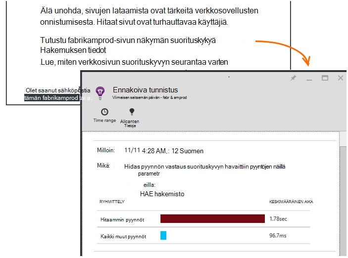

<properties 
    pageTitle="Sovelluksen tietoja: Ennakoiva suorituskyvyn vianmääritys | Microsoft Azure" 
    description="Hakemuksen tiedot suorittaa sovelluksen telemetriatietojen laaja analyysi ja varoittaa mahdollisia ongelmia." 
    services="application-insights" 
    documentationCenter="windows"
    authors="antonfrMSFT" 
    manager="douge"/>

<tags 
    ms.service="application-insights" 
    ms.workload="tbd" 
    ms.tgt_pltfrm="ibiza" 
    ms.devlang="na" 
    ms.topic="article" 
    ms.date="08/31/2016" 
    ms.author="awills"/>

#  Ennakoiva suorituskyvyn vianmääritys

*Hakemuksen tiedot on esikatselu.*

[Visual Studio hakemuksen tiedot](app-insights-overview.md) suorittaa sovelluksen telemetriatietojen laaja analyysi ja varoittaa, saat lisätietoja mahdollisista suorituskykyä. Sinun on todennäköisesti luetaan tämä koska näyttöön tulee jokin Microsoftin ennakoiva ilmoitukset sähköpostitse. 

Tämä toiminto edellytä mitään toimia ja on automaattisesti käytettävissä, kun sovellus luo riitä telemetriatietojen.

## Mitkä ovat ennakoiva suorituskyvyn vianmäärityksen?

Ennakoiva suorituskyvyn vianmäärityksen löytää epätavallisia kuviot suorituskyky-sovelluksen mukaan analysoiminen, sovelluksen lähettää sovelluksen havainnollistamisen telemetriatietojen. 

Etsii erityisesti suorituskyvyn ongelmat, jotka vaikuttavat vain joidenkin käyttäjien tai vaikuttavat vain joissakin tapauksissa käyttäjät.

Esimerkiksi se voit ilmoittaa, jos sovellus sivujen ladata paljon hitaammin selaimen muiden kuin yhden tyypin tai pyynnöt avautuvat hitaammin tietyn palvelimesta. Se myös löytävät ominaisuudet yhdistelmät liittyvien ongelmien, kuten hidas sivu latautuu yhden maantieteellisen alueen tietyn päivämäärän aikoina.

Poikkeamia tällaisia on erittäin vaikeaa olevien tietojen poistamiseksi, mutta se on yleisimpiä kuin mielestäsi ehkä. Usein ne vain pinta, kun asiakkaille valittaa. Siihen mennessä on liian myöhään: tarvittavien käyttäjien jo siirrytään kilpailijoiden!

Tällä hetkellä Microsoftin algoritmit Tarkista sivun lataamista, pyynnön vastaus aikoja palvelimessa ja riippuvuuden vastauksen kellonajat.  

Sinun ei tarvitse määrittää mitään raja-arvot tai Määritä säännöt. Koneen oppiminen ja tietojen louhinta algoritmit käytetään esiintyvien epätavallisia kuviot. 

Olemme hyvin Haluatko on palautetta. Kerro meille, miten se auttaa ehdotuksia parantamiseen ennakoiva tunnistaminen ja mitä uusia ominaisuuksia, jonka haluat lisätietoa. Voit antaa palautetta – Lähetä smile/harmistus portaalissa tai sähköpostin että AppInsightsML@microsoft.com. 

## Ennakoiva ilmoituksen

* *Miksi tämä sähköpostin vastaanotetuista?*
 * Ennakoiva tunnistus analysoida telemetriatietojen sovelluksen lähetetty hakemuksen tiedot ja havaita suorituskykyyn liittyvä ongelma sovelluksessa. 
* *Tarkoittaa ilmoituksen ehdottomasti minulla on ongelmia?*
 * Ei. Se on yksinkertaisesti ehdotuksen jotain, haluat ehkä tarkastella Lisää tiiviisti. 
* *Mitä minun pitäisi tehdä?*
 * [Tarkista tiedot esitetään](#responding-to-an-alert). Arvot Resurssienhallinnan avulla voit tarkistaa ajan kuluessa suorituskyky ja siirry muut arvot. Käyttää hakutoimintoa, jos haluat suodattaa tiettyjä tapahtumia, jotka auttavat tunnistaa pääkansion syy. 
* *Näin on voit guys tarkastella tietoni?*
 * Ei. Palvelu on täysin automaattinen. Vain saat ilmoituksia. Tiedoissa on [Yksityinen](app-insights-data-retention-privacy.md).

## Tunnistusvaiheen

* *Millaisia suorituskyvyn poikkeamia havaita?*
 * Kuviot, jotka löydät aikaa, voit tarkistaa itseäsi varten. Esimerkiksi heikko suorituskyky yhdistelmän tiettyyn sijaintiin, päivän ja ympäristössä.
* *Voit analysoida hakemuksen tiedot keräämät tiedot?*
 * Ei tällä hetkellä. Tällä hetkellä on analyysi pyynnön vastausajan, riippuvuuden vastausajan ja sivun lataaminen aika. Lisää arvot analyysi on tulossa. 
* *Voinko luoda omaa poikkeavuuksista tunnistussäännöt?*
 * Ei vielä. Mutta voit tehdä seuraavia toimia:
 * [Määritä ilmoitukset](app-insights-alerts.md) , jotka kertovat kun mittarin ylittää kynnysarvo.)
 * [Vie telemetriatietojen](app-insights-export-telemetry.md) [tietokantaan](app-insights-code-sample-export-sql-stream-analytics.md) tai [PowerBI](app-insights-export-power-bi.md) tai [muita](app-insights-code-sample-export-telemetry-sql-database.md) työkaluja, missä voit analysoida se itse.
* *Kuinka usein analyysi suoritetaan?*
 * Olemme suorittaa analyysia päivittäin edellisen päivän telemetriatietojen.
* * Niin tämä korvaa [metrisillä ilmoitukset](app-insights-alerts.md)?
 * Ei.  Microsoft ei vahvista esiintyvien jokaisen käyttäytyminen, harkitse epätavallisia.

## Voit tutkia korotettuna ongelmat

Avaa diagnostisen raportin sähköpostiviestissä tai poikkeamia-luettelosta.

* **Kun** näyttää havaittu ongelma.
* **Mitä** kuvaa
 * Ongelman, joka havaittiin;
 * Tapahtumat, jotka löydetyillä ominaisuudet näkyviin ongelma toiminnan.
* Taulukon vertaa huonosti toimiva joukon keskimääräinen toimintaa muiden tapahtumien kanssa.

Valitse Avaa metrijärjestelmä Resurssienhallinta ja etsi haluamasi raporteissa, aika-ja ominaisuudet hidas menestyneet joukon suodatettu linkkejä.

Muokkaa aikavälin ja suodattimet, joihin kannattaa tutustua telemetriatietojen.

## Kuinka voin parantaa suorituskykyä?

Hidas ja epäonnistui vastaukset ovat yksi suurimmista turhautumiselta sivuston käyttäjille, kun tiedät, oman kokemus. Joten on tärkeää kohdat.

### Kiireellisyysjärjestys

Ensimmäisen kerran sillä merkitystä? Jos sivu on aina latautuvat hitaasti, mutta vain 1 % oman sivuston käyttäjien on joskus voit tarkastella muutoksia, ehkäpä sinulla on enemmän seikat kannattaa ottaa huomioon. Jos vain 1 % käyttäjille, avaa se, mutta se ilmoittaa poikkeukset aina, joka taas, voi olla nykyarvo tutkiminen.

Vaikutus-lauseen käyttäminen sähköpostien yleistä ohjetta, mutta huomioon, että se ei ole pelkät. Kerää Vahvista muiden näyttöä.

Harkitse ongelman parametrit. Jos se on riippuvainen geography, Määritä [käytettävyys testien](app-insights-monitor-web-app-availability.md) alueen mukaan lukien: alueen voi olla vain verkko-ongelmista. 

### Hidas sivujen latausaikaa sekunneilla vianmääritys 

Ongelman sijainti Palvelin on hidas vastaavan valintasivu on todella pitkä tai selain on tehtävä on paljon tuo se näkyviin?

Avaa selaimet metrisillä sivu. [Segmentoitu näyttäminen selaimen sivun latausajasta](app-insights-javascript.md#explore-your-data) näkyy, jossa kellonajan suorittaminen. 

* Jos **Lähettää pyynnön aika** on suuri, palvelin vastaa hitaasti tai pyyntö on paljon tietoja sisältävä viesti. Tarkista [suorituskyvyn mittarit](app-insights-web-monitor-performance.md#metrics) tutkia vastauksen kertaa. 
* Määritä [riippuvuuden seuranta](app-insights-dependencies.md) voit tarkistaa, onko hehtaaritukijärjestelmä vuoksi ulkoisia palveluita tai tietokannan.
* Jos **Saa vastausta** on-sivulle ja sen riippuvaiset osat - JavaScript-CSS-kuvia ja niin edelleen (mutta ei ole ladattu asynkronisesti tiedot) ovat pitkiä. Määrittäminen [käytettävyys Testaa](app-insights-monitor-web-app-availability.md)ja muista ladata riippuvaiset osat asetuksen. Kun saat joitakin tuloksia, Avaa tuloksen tiedot ja laajenna, niin näet eri tiedostojen lataamista.
* Suuri **asiakkaan käsittelyn ajan** ehdottaa komentosarjoja on hidasta. Jos syy ei ole selvää, lisäämällä lisäkoodin ajoitus ja Lähetä ajat trackMetric kutsuissa.

### Paranna Hitaat sivut

On täynnä neuvoja vastaukset ja sivun lataamista paremmaksi, joten Yritämme ei toista kaikki tähän sivustoon. Seuraavassa on muutamia vihjeitä, jotka todennäköisesti jo tiedät, jolla pääset suunnittelemassa:

* Hidas vuoksi suuria tiedostoja ladataan: ladata komentosarjoja ja muita osia asynkronisesti. Käytä komentosarjan niputus. Jaa pääsivulta pienoisohjelmat, jotka lataavat tietonsa erikseen. Älä lähetä pitkiä taulukoita tavallinen vanha HTML: komentosarjan avulla voit pyytää tietoja JSON tai muita tiivistetyssä muodossa ja täytä taulukon paikallaan. On hyvä kehysten kaikki tämän ohjeen. (Ne myös johtaa suuri komentosarjojen tietenkin.)
* Palvelimen riippuvuudet hidas: harkitse Maantieteellisten sijaintien komponentit. Jos käytät Azure, varmista, WWW-palvelin ja tietokanta on samassa alueella. Noutaa kyselyjen enemmän tietoja kuin he tarvitsevat? Haluat välimuistin tai jonottaminen apua?
* Kapasiteetin ongelmat: Tarkista vastauksen kertaa server-arvot ja pyynnön laskee. Jos vastaus kertaa piikin säilyttämättä mittasuhteita pyynnön laskee kohdalle, on todennäköistä, että sitä venytetään palvelinten. 

## Ilmoituksen sähköpostitse

* *Onko minun tilaaminen tämä palvelu, jotta he saavat ilmoituksia?*
 * Ei. Tutustu robotti säännöllisesti tutkimuksia hakemuksen tiedot kaikille käyttäjille tiedot, ja lähettää ilmoituksia, jos se havaitsee ongelmia.
* *Voit peruuttaa tai lähettää sen sijaan Työtoverini ilmoitusten saaminen?*
 * Napsauta sähköposti-ilmoituksen Peruuta tilaus-linkkiä. 
 
    Tällä hetkellä niitä on lähetetty henkilöille, joilla on [hakemuksen tiedot resurssin kirjoitusoikeudet](app-insights-resources-roles-access-control.md).

    Voit myös muokata ennakoiva tunnistus sivu vastaanottajien luettelon asetukset.
* *En halua voidaan tällaisista vastauksista kyseisiä viestejä.*
 * He ovat rajoitettu päivässä, emme eivät ole vielä tietoja raportoitu tärkeimpiä ongelmien ratkaisemiseen. Et saa viestejä toistetaan.
* *Jos voin et tee mitään, saan muistutuksen?*
 * Ei, saat viestin kunkin ongelmasta vain kerran. 
* *Olen kadottanut sähköposti. Mistä löydän ilmoitukset portaalissa?*
 * Valitse sovelluksen hakemuksen tiedot yleiskatsaus **Ennakoiva tunnistus** -ruutu. Voit voi etsiä kaikki ilmoitukset määrittäminen seitsemän päivää taaksepäin.

## Seuraavat vaiheet

Voit tarkastaa sovelluksestasi telemetriatietojen seuraavia diagnostiikkatyökaluja avulla:

* [Metrijärjestelmän explorer](app-insights-metrics-explorer.md)
* [Erikoishaku](app-insights-diagnostic-search.md)
* [Analytics - tehokkaita kyselykielen](app-insights-analytics-tour.md)

Ennakoiva tunnistuksia ovat täysin automaattinen. Mutta ehkä haluat joitakin ilmoitusten määrittäminen?

* [Manuaalisesti määritetty metrisillä ilmoitukset](app-insights-alerts.md)
* [Käytettävyys web testit](app-insights-monitor-web-app-availability.md) 

