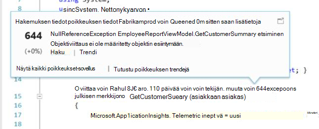

<properties
    pageTitle="Visual Studio-laajennus Developer Analytics julkaisutiedot"
    description="Visual Studio työkaluja kehittäjä Analytics uusimmat päivitykset."
    services="application-insights"
    documentationCenter=""
    authors="acearun"
    manager="douge"/>
<tags
    ms.service="application-insights"
    ms.workload="tbd"
    ms.tgt_pltfrm="ibiza"
    ms.devlang="na"
    ms.topic="article"
    ms.date="06/09/2016"
    ms.author="acearun"/>

# Analytics Kehitystyökalut julkaisutiedot
Uudet ominaisuudet: hakemuksen tiedot ja HockeyApp analytics Visual Studiossa.
## V7.0
### Visual Studio hakemuksen tiedot trendejä
Visual Studio hakemuksen tiedot on uuden työkalun Visual Studiossa, jonka avulla haluat analysoida, miten sovellus toimii ajan kuluessa. Aloita **Sovelluksen tiedot** -painiketta tai hakemuksen tiedot Hakuikkuna Valitse **Tutkiminen Telemetriatietojen trendejä**. Tai **Näytä** -valikon Valitse **Muut Windows**ja valitse sitten **Sovellus havainnollistamisen trendejä**. Valitse jokin viisi Yleiset kyselyt avulla pääset alkuun. Voit analysoida eri tietojoukkojen telemetriatietojen sekä aikavälien ja muiden ominaisuuksien perusteella. Etsiminen poikkeamia tiedoista, valitsemalla jokin seuraavista poikkeavuuksista asetukset **Näkymälaji** avattavasta luettelosta. Suodatusasetusten ikkunan alareunassa helpottavat tiivistäminen-että telemetriatietojen tietyn alijoukot.

### CodeLens poikkeukset
Poikkeus telemetriatietojen näkyy nyt CodeLens. Jos olet yhdistänyt projektin sovelluksen tiedot-palveluun, näet asennuksen aikana tapahtuneista virheistä kunkin tavan tuotannon 24 tunnin aikana poikkeusten määrä. -CodeLens voit siirtyä tutkia tarkemmin poikkeukset haun ja trendien tunnistamista.

### ASP.NET-Core-tuki
Hakemuksen tiedot tukee nyt ASP.NET Core RC2 projektien Visual Studiossa. Voit lisätä hakemuksen tiedot uusien ASP.NET Core RC2 projektien **Uusi projekti** -valintaikkunassa seuraavat näyttökuvan kuin. Vaihtoehtoisesti voit lisätä sen aiemmin luotu projekti, ratkaisunhallinnassa projektin hiiren kakkospainikkeella ja valitse sitten **Lisätä hakemuksen tiedot Telemetriatietojen**.

ASP.NET 5 RC1 ja ASP.NET Core RC2 projektien on uusia tuki myös diagnostiikkatyökalut-ikkunassa. Näet sovelluksen tiedot-tapahtumat, kuten pyyntöjä ja poikkeukset ASP.NET-sovellukset, kun korjaat paikallisesti tietokoneeseen. Valitse kuhunkin tapahtumaan **Etsi** lisätietoja alirakenteeseen.

### Yleinen Windows-sovellusten HockeyApp
Lisäksi jakelu ja käyttäjän palautetta beta HockeyApp on yleinen Windows-sovellusten raportoinnin symbolicated kaatumisen. Olemme helpommin myös lisää HockeyApp SDK: Yleinen Windows projektin hiiren kakkospainikkeella ja valitse sitten **Sportsin App – Ota käyttöön kaatua Analytics**. Tämä asentaa SDK, määrittää kaatumisen sivustokokoelman ja valmistelee HockeyApp resurssin pilvipalvelussa, ilman sovelluksen lataaminen HockeyApp-palvelun.

Muita uusia ominaisuuksia:

* Hakemuksen tiedot hakuja nopeammin ja nopeampaa on tehty. Nyt aikavälien ja tiedot suodattimet otetaan automaattisesti käyttöön, kun valitset ne.
* Myös sovelluksen havainnollistamisen hakutoiminnossa nyt asetus on siirtyä koodin suoraan pyynnön telemetriatietojen.
* On tehty parannuksia HockeyApp kirjautuminen.
* Diagnostiikkatyökalut näkyy poikkeukset tuotannon telemetriatietojen tiedot.

## Versio 5.2
Emme hyvää ilmoittaminen HockeyApp skenaariot Visual Studiossa esittely. Ensimmäinen integrointi on yleinen Windows-sovellusten ja Windows-lomakkeiden sovelluksia Visual Studion beetajakauman.

Beeta-normaalijakaumaa kanssa voit ladata vanhoissa versioissa sovellus HockeyApp jaettavaksi valittu alijoukkoa, asiakkaat tai testaajia. Yhdistää HockeyApp kaatumisen sivustokokoelman ja käyttäjän palautetta ominaisuuksien beeta-normaalijakaumaa voi antaa sinulle sovelluksen tärkeitä tietoja ennen kuin teet laaja versiossa. Voit käyttää näitä tietoja ongelmia sovelluksen kanssa, niin, että voit välttää tai Pienennä ongelmia myöhemmin, kuten pienen app luokitusten tai negatiivinen palautetta.

Katso miten helposti ladata on muodostaa beetajakauman Visual Studion varten.
### Yleinen Windows-sovellukset
Yleinen Windows app projektin solmu pikavalikko sisältää nyt yhteyttä muodosta lataaminen HockeyApp vaihtoehto.

Valitse kohde ja HockeyApp lataaminen-valintaikkuna avautuu. Sinun on HockeyApp-tiliä, voit ladata oman muodosta. Jos olet uusi käyttäjä, ei hätää. Tilin luominen on yksinkertaista.

Kun yhteys on muodostettu, näet Lataa lomake-valintaikkunassa.

Valitse sisällön lataaminen (.appxbundle tai .appx-tiedosto) ja valitse sitten julkaisuvaihtoehdot ohjatun toiminnon. Voit halutessasi lisätä julkaisutiedot seuraavalla sivulla. Valitse Aloita lataus **Valmis** .

Kun lataus on valmis, näyttöön tulee HockeyApp ilmoitus, jonka vahvistuksen sekä linkin HockeyApp portal-sovellukseen.

Joka on tämä! Lisättyjen vain muodosta beeta-jakauman vain muutamalla napsautuksella.

Voit hallita sovelluksesi HockeyApp portaalissa useilla eri tavoilla. Tämä vaihtoehto sisältää kutsutaan kaatumisen raportteja tarkastelevat käyttäjät ja palautetta, muuttamalla tiedot ja niin edelleen.

Lisätietoja sovellusten hallinta [HockeyApp Knowledge Base](http://support.hockeyapp.net/kb/app-management-2) -artikkelissa.

### Windows-lomakkeiden sovellukset
Windows-lomakkeen projektin solmu pikavalikko sisältää nyt yhteyttä muodosta lataaminen HockeyApp vaihtoehto.

Tämä avaa HockeyApp lataaminen-valintaikkuna, jossa on samanlainen kuin yksi yleinen Windows-sovelluksessa.

Huomautus Tämä ohjatun uuden kentän argumenteille sovelluksen versiosta. Yleinen Windows-sovellusten tiedot lisätään luettelo. Officen Windows-lomakkeet-ei valitettavasti ole vastaavaa ominaisuutta. Haluat määrittää ne manuaalisesti.

Loput kulun muistuttaa yleinen Windows-sovellusten: Valitse Muodosta ja vapauta asetukset, Lisää release muistiinpanot, lataa ja hallita HockeyApp-portaalissa.

On yhtä helppoa kuin. Kokeile ja Kerro mielipiteesi.
## Version 4.3
### Etsi telemetriatietojen paikallisen virheenkorjaus istunnoista
Tässä versiossa voit nyt etsiä sovelluksen havainnollistamisen telemetriatietojen luotu Visual Studio virheenkorjaus-istunnossa. Etsi, voi käyttää vain, jos sovellus rekisteröityjä hakemuksen tiedot. Nyt-sovelluksen vain täytyy olla asennettu Etsi paikallinen telemetriatietojen sovelluksen havainnollistamisen SDK.

Jos sovelluksen havainnollistamisen SDK ASP.NET-sovellukseen, toimi seuraavien ohjeiden avulla hakutoiminnolla.

1. Sovelluksen korjaaminen.
2. Avaa sovellus havainnollistamisen haun jollakin seuraavista tavoista:
    - **Näytä** -valikon **Muut Windows**ja valitse **Sovelluksen tiedot haku**.
    - Valitse **Sovelluksen tiedot** -painiketta.
    - Napsauta ratkaisunhallinnassa Laajenna **ApplicationInsights.config**ja valitse sitten **Etsi virheenkorjaus istunnon telemetriatietojen**.
3. Jos et ole rekisteröitynyt sovelluksen tiedot-haku-valintaikkuna avautuu virheenkorjaus istunnon telemetriatietojen tilassa.
4. Katso paikallisen telemetriatietojen **haku** -kuvaketta.

## 4.2 versio
Tässä versiossa on lisätty ominaisuuksia, jotka helpottavat hakeminen tietojen helpompaa kontekstissa tapahtumista, voit siirtyä koodin tietojen tapahtumien ja vaivaton sisäänrakennetun kirjaaminen tietojen lähettäminen sovelluksen tiedot. Tämän tunnisteen päivitetään kuukausittain. Jos sinulla palautetta tai ominaisuus pyynnöt, Lähetä se aidevtools@microsoft.com.
### N Valitse kirjaaminen-toiminto
Jos käytät jo NLog, log4net tai System.Diagnostics.Tracing, sinun ei tarvitse olla huolissaan siitä, että kaikki oman jäljittää siirtäminen hakemuksen tiedot. Tässä versiossa on on integroitu hakemuksen tiedot kirjaaminen sovittimet normaalin kokoonpanon käytettävyyttä.
Jos olet jo on jokin näistä kirjaaminen kehysten määritetty, seuraavassa osassa kerrotaan, miten hankkiminen.
**Jos olet jo lisännyt sovelluksen tietoja:**
1. Project-solmu, napsauta hiiren kakkospainikkeella ja valitse **Sovelluksen tiedot**ja valitse sitten **Määritä sovelluksen tiedot**. Varmista, että voit lisätä oikean sovittimen määritys-ikkunassa.
2. Vaihtoehtoisesti, kun luot ratkaisun, Huomaa ponnahdusikkunassa, joka näkyy sivun näytön oikeassa yläkulmassa ja valitse **Määritä**.

Kun lokiin kirjaaminen-sovittimen, joka on asennettu, suorita sovellus ja varmista, että tiedot ovat diagnostiikkatyökalut-välilehdessä seuraavasti:

### Siirry tai Etsi koodi, jossa telemetriatietojen tapahtumaominaisuus on lähetetty
Uusi versio julkaistaan käyttäjän osoittamalla mitä tahansa arvoa tapahtuman tiedot ja tämä etsii merkkijonon nykyisen Avaa ratkaisussa. Tulokset näkyvät Visual Studio "Etsi tulokset-luettelosta alla kuvatulla tavalla:

### Uusi Hakuikkuna, kun et ole kirjautunut sisään
Microsoft on parannettu sovelluksen tiedot-Hakuikkuna helpottavat tietojen hakua, kun sovellus on tuotannon ulkoasua.

### Tarkastella kaikkia telemetriatietojen tapahtumia tapahtumaan liittyvä
Olemme lisänneet uusi välilehti, jossa ennalta määritettyjä kyselyitä kaikkien telemetriatietojen tapahtumaan liittyvien tietojen käyttäjän tarkastellaan tapahtumatiedot-välilehden vieressä. Esimerkiksi pyyntö on nimeltään **Toiminnon tunnus**-kenttä. Jokaisen tapahtuman pyyntö kohteeseen on sama arvo **Toiminnon tunnus**. Jos poikkeuksen ilmenee, kun toiminto käsittelee pyynnön, poikkeuksen annetaan sama Toimintotunnus, kuin pyynnön tiedostojasi on helpompi löytää. Jos olet katsoo pyynnön, valitse Avaa uudessa välilehdessä, jossa näkyy uusi hakutulosten **kaikki telemetriatietojen tämän toiminnon** .

### Seuraava- ja Edellinen historia-haku
Nyt voit siirtyä edestakaisin hakutulosten välillä.

## 4.1 versio
Tässä versiossa on useita uusia ominaisuuksia ja päivityksiä. Tarvitset päivitys 1, jotta voit asentaa tässä versiossa.

### Siirry poikkeuksen lähdekoodi-menetelmällä
Nyt, jos tarkastelet poikkeukset tuotannon sovelluksestasi hakemuksen tiedot Etsi-ikkunassa, voit siirtyä menetelmä koodissa missä poikkeuksen on käynnissä. Haluat ladata oikea projektin ja sovelluksen havainnollistamisen kestää varoen muun! (Saat lisätietoja sovelluksen havainnollistamisen Hakuikkuna Katso julkaisutiedot Version 4.0 seuraavien osien.)

Miten se toimii? Voit käyttää sovelluksia havainnollistamisen haun myös silloin, kun ratkaista ei ole avoinna. Pinon jäljitys-alue näyttää sanoman ja monia pinon jäljitys kohteet eivät ole käytettävissä.

Jos tiedostotiedot ovat käytettävissä, jotkin kohteet voivat olla linkkejä, mutta ratkaisu tieto-osa on näkyvissä.

Napsauttamalla hyperlinkkiä, koodisi siirtyä valitun maksutavan sijainti. Sinun on ehkä määritettävä ero versionumero, mutta -toimintoa, voit siirtyä koodia oikean version toimitetaan myöhemmissä versioissa.

### Etsi uusi pikakuvakkeiden kohdata ratkaisunhallinnassa
Voit nyt käyttää haun kautta ratkaisunhallinnassa.

### Näyttää ilmoituksen kun julkaiseminen on valmis
Ponnahdusikkunoiden valintaikkuna tulee näkyviin, kun projekti on julkaistu verkossa, niin, että voit tarkastella sovelluksen tietoja tietojen tuotannon.

## 4. 0:

### Etsi sovellus havainnollistamisen tietoja Visual Studio
Haku-funktion sovelluksen tiedot-portaaliin, kun Visual Studio voit suodattaa ja etsimällä tapahtuman sekä ominaisuusarvoihin ja tekstiä, kuten ja tarkasta yksittäiset tapahtumat.

### Katso paikalliseen tietokoneeseen diagnostiikkatyökalut tulevat tiedot

Voit tarkastella omaa telemetriatietojen lisäksi muita muistin tietoja Visual Studio diagnostiikkatyökalut-sivulla. ASP.NET-4.5 tuetaan.

### SDK lisääminen projektiin kirjautumatta Azure

Ei enää ole sovelluksen tiedot-pakettien lisääminen projektiin, **Uusi projekti** -valintaikkunan kautta tai projektin pikavalikosta Azure kirjautuminen. Jos olet kirjautunut sisään, SDK asennettu ja määritetty lähettämään telemetriatietojen ennen kuin portaaliin. Jos et kirjaudu sisään, SDK lisätään projektin ja se luo diagnostiikan keskittimeen telemetriatietojen. Voit määrittää sen myöhemmin halutessasi.

### Laitetuki

*Yhteyden muodostaminen;* 2015, osoitteessa on [ilmoitettiin](https://azure.microsoft.com/blog/deep-diagnostics-for-web-apps-with-application-insights/) , että laitteet mobile developer Microsoftin toiminta on HockeyApp. HockeyApp avulla voit jakaa beeta-versiot, että testaajia, kerää ja analysoi kaikki kaatuu-sovellukset ja palautteen suoraan asiakkaille.
HockeyApp tukee sovelluksen kumpi ympäristössä, joka voidaan iOS, Android- tai Windows tai Office kaikissa ympäristöissä-ratkaisun, kuten Xamarin, Cordova tai yhtenäisyyden luonnissa, valitse.

Tulevissa versioissa sovelluksen tiedot-tunniste on oma Lisää integroidun käyttöliittymän HockeyApp ja Visual Studio välillä. Nyt voit aloittaa HockeyApp lisäämällä yksinkertaisesti NuGet viittaus. Katso lisätietoja [ohjeissa](http://support.hockeyapp.net/kb/client-integration-windows-and-windows-phone) .
