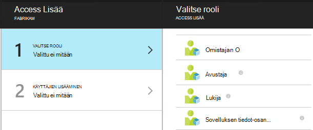

<properties
    pageTitle="Resurssit, roolien ja käyttöoikeuksien valvonta-sovelluksen tiedot"
    description="Omistajat, osallistujat ja lukijoiden organisaation tiedot."
    services="application-insights"
    documentationCenter=""
    authors="alancameronwills"
    manager="douge"/>

<tags
    ms.service="application-insights"
    ms.workload="tbd"
    ms.tgt_pltfrm="ibiza"
    ms.devlang="na"
    ms.topic="article"
    ms.date="05/07/2016"
    ms.author="awills"/>

# Resurssit, roolien ja käyttöoikeuksien valvonta-sovelluksen tiedot

Voit määrittää, kuka on luku ja päivittää access Visual Studio [Sovelluksen tietoja]tietojen[start], käyttämällä [Roolipohjainen käyttöoikeuksien valvonta Microsoft Azure-tietokannassa](../active-directory/role-based-access-control-configure.md).

> [AZURE.IMPORTANT] Määrittää käyttäjille **resurssiryhmä tai tilaus** , johon sovelluksen resurssi kuuluu - ei itse resurssien käyttö. Määritä **tiedot sovelluksen osan osallistujan** rooli. Tällä varmistetaan, että yhtenäisen web testit ja ilmoitusten sekä sovelluksen resurssien käytön valvonta. [Lue lisää](#access).

## Resurssit, ryhmiä ja tilaukset

Ensimmäinen, jotkin määritykset:

* **Resurssi** - Microsoft Azure-palvelun esiintymän. Hakemuksen tiedot resurssin kerää, analysoi ja näyttää telemetriatietojen tiedot lähetetään sovelluksestasi.  Muuntyyppisten Azure resurssit ovat verkkosovelluksissa, tietokantojen ja VMs.

    Jos haluat nähdä kaikki resurssit, siirry [Azure Portal][portal], kirjaudu sisään ja sitten Selaa.

    

* [**Resurssiryhmä** ] [ group] -ryhmä jokaisen resurssi kuuluu. Ryhmä on kätevä tapa hallintaan liittyvät resurssit, erityisesti käyttöoikeuksien hallinta. Esimerkiksi yksi resurssi ryhmään voi lisätä verkkosovellukseen, sovelluksen tiedot-resurssin seurannassa sovellus ja tallennustilaa resurssin viedyt tiedot pysyvät.

    

* [**Tilauksen**](https://manage.windowsazure.com) - käyttämään hakemuksen tiedot tai muiden Azure resurssien Azure-tilaukseen kirjautuminen. Jokaisen resurssiryhmä kuuluu yksi Azure tilaus, johon valitset hinta-paketin ja, jos kyseessä on organisaation-tilaus, valitse jäsenet ja niiden käyttöoikeudet.
* [**Microsoft-tiliä** ] [ account] -käyttäjänimi ja salasana, jonka avulla Microsoft Azure tilaukset, XBox Live, Outlook.com ja muiden Microsoftin palvelujen kirjautuminen.

## Resurssiryhmän käyttöoikeuksien hallinta

On tärkeää ymmärtää, että lisäksi loit sovelluksen resurssi-sovelluksessa on erillinen ilmoitukset ja web testien piilotetut resurssit. Liitetiedostotyypit sovelluksen samaan [resurssiryhmä](#resource-group) . Voi myös olet lisännyt Azure muiden sieltä, kuten sivustot tai tallennustilan.

Voit määrittää nämä resurssit, joten kannattaa käyttää seuraavasti:

* Hallita **resurssiryhmä tai tilauksen** tasolla.
* Määrittää käyttäjille **sovelluksen tiedot-osan osallistujan** rooli. Näin voi muokata web kokeet, ilmoituksia ja sovelluksen havainnollistamisen resurssit, mutta estää muiden palveluiden ryhmässä käyttämisen.

## Käsitellä toiselle käyttäjälle

Sinulla on tilaus tai resurssiryhmän OMISTAJAOIKEUDET.

Käyttäjän on oltava [Microsoft-tiliä][account], tai niiden [Organisaation Microsoft-tiliä](..\active-directory\sign-up-organization.md). Accessin voit antaa käyttäjille ja käyttäjäryhmät, jotka on määritelty Azure Active Directory.

#### Siirry resurssiryhmän

Lisää käyttäjä siellä.

Tai voi siirtyä toiseen ylöspäin ja käyttäjän lisääminen tilaukseen.

#### Valitse rooli

Rooli | Resurssiryhmän
---|---
Omistaja | Voit muuttaa mitään käytön mukaan lukien
Avustaja | Voit muokata joitain kohtia, mukaan lukien kaikki resurssit
Sovelluksen tiedot-osan osallistujan | Voit muokata sovelluksen havainnollistamisen resursseja, web testien ja ilmoitukset
Lukija | Voit tarkastella mutta eivät voi muokata mitään

Muokkaamisen-"sisältää luominen, poistaminen ja päivittäminen:

* Resurssit
* Web-testiä
* Ilmoitukset
* Jatkuva vienti

#### Valitse käyttäjä

Jos haluat käyttäjä ei ole hakemiston, voit kutsua kuka tahansa Microsoft-tilillä.
(Jos ne palvelut, kuten Outlook.com, Onedriveen, Windows Phone-tai XBox Live, ne on Microsoft-tili.)

## Käyttäjien ja roolien

* [Roolipohjainen käyttöoikeuksien valvonta Azure-tietokannassa](../active-directory/role-based-access-control-configure.md)

<!--Link references-->

[account]: https://account.microsoft.com
[group]: ../resource-group-overview.md
[portal]: https://portal.azure.com/
[start]: app-insights-overview.md
