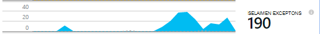
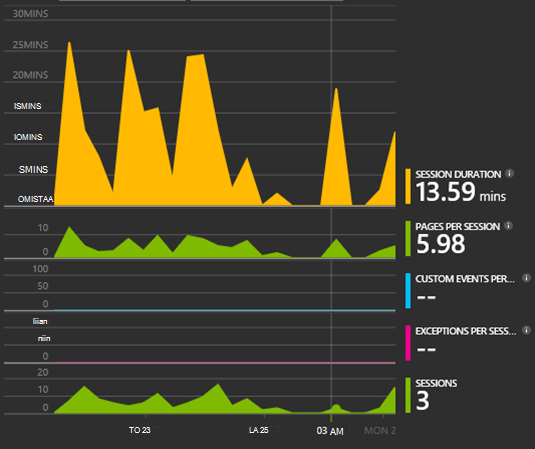
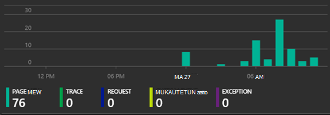

<properties 
    pageTitle="Vaiheittainen kuvaus: Valvoa Microsoft Dynamics CRM kanssa hakemuksen tiedot" 
    description="Pyydä telemetriatietojen Microsoft Dynamics CRM Online-sovelluksen tiedot käyttämällä. Ongelmatilanteita asetusten määritysten aikana käytön tiedot, visualisointi ja vie." 
    services="application-insights" 
    documentationCenter=""
    authors="mazharmicrosoft" 
    manager="douge"/>

<tags 
    ms.service="application-insights" 
    ms.workload="tbd" 
    ms.tgt_pltfrm="ibiza" 
    ms.devlang="na" 
    ms.topic="article" 
    ms.date="11/17/2015" 
    ms.author="awills"/>
 
# Vaiheittainen kuvaus: Ottaminen käyttöön Telemetriatietojen Microsoft Dynamics CRM Online-sovelluksen tiedot käyttämällä

Tässä artikkelissa kerrotaan, miten telemetriatietojen tietojen noutaminen [Microsoft Dynamics CRM Online](https://www.dynamics.com/) käyttämällä [Visual Studio sovelluksen tiedot](https://azure.microsoft.com/services/application-insights/). Käymme tässä läpi koko luettelokohteiden lisääminen sovelluksen tiedot-komentosarja-sovelluksen sieppaaminen tiedot ja tietojen visualisointi.

>[AZURE.NOTE] [Selaa näyte](https://dynamicsandappinsights.codeplex.com/).

## Lisää sovellus tiedot uuteen tai aiemmin luotuun CRM Online-esiintymässä 

Voit valvoa sovellusta, sovelluksen havainnollistamisen SDK-paketissa lisääminen sovelluksen. SDK lähettää telemetriatietojen [sovelluksen tiedot-portaalissa](https://portal.azure.com), jossa voit käyttää sekä tehokkaat Analysointityökalut ja vianmääritystyökalut tai tietojen vieminen tallennustilan.

### Luo sovelluksen tiedot-resurssi Azure-tietokannassa

1. Hanki [Microsoft Azure-tiliä](http://azure.com/pricing). 
2. Kirjaudu sisään [Azure portal](https://portal.azure.com) ja lisätä uuden sovelluksen tiedot resurssin. Tämä on missä tietojen käsittelemistä ja näkyviin.

    

    Valitse ASP.NET sovelluksen tyyppi.

3. Avaa pika-Aloitus-välilehden ja koodi-komentosarjan.

    

**Jätä koodisivu auki** , kun teet seuraavan vaiheen toisessa selainikkunassa. Tarvitset koodin pian. 

### JavaScript-WWW-resurssin luominen Microsoft Dynamics CRM:

1. Avaa CRM Online esiintymän ja kirjaudu sisään järjestelmänvalvojan oikeuksilla.
2. Avaa Microsoft Dynamics CRM-asetuksia, mukautukset, Mukauta järjestelmä

    
    
    

    

3. Luo JavaScript-resurssi.

    

    Anna sille nimi, valitse **komentosarja (JScript)** ja Avaa tekstieditori.

    
    
4. Kopioi koodi sovelluksen tiedot. Kopioitaessa muista Ohita komentosarjan tunnisteet. Lisätietoja on ohjeaiheessa näyttökuva alla:

    

    Koodi on instrumentation avainta, joka määrittää sovelluksen tiedot-resurssi.

5. Tallenna ja Julkaise.

    

### Välineen lomakkeet

1. Microsoft CRM Online Avaa Asiakas-lomakkeeseen

    

2. Avaa ominaisuudet-lomake

    

3. Lisää JavaScript WWW-resurssi, jonka loit

    

    

4. Tallenna ja julkaise lomakkeen mukautukset.

## Arvot tallennetaan

Voit nyt määrittää telemetriatietojen sieppaus lomakkeen. Aina, kun sitä käytetään tiedot lähetetään sovelluksen tiedot-resurssi.

Seuraavassa on esimerkkejä tiedot, jotka näet.

#### Sovelluksen kunto

Selaimen poikkeukset:

Napsauta kaaviota, saat tarkempia tietoja:

#### Käyttö

#### Selaimet

#### : N maantieteellinen sijainti

#### Keltaiset sivupyynnön näkymä

## Esimerkki koodi

[Selaa sample code](https://dynamicsandappinsights.codeplex.com/).

## Power BI

Voit tehdä myös myyntilukujen, jos et [Vie tietoja Microsoft Power BI](app-insights-export-power-bi.md).

## Esimerkki Microsoft Dynamics CRM-ratkaisun

[Tässä on esimerkki-ratkaisun Microsoft Dynamics CRM toteutettu] (https://dynamicsandappinsights.codeplex.com/).

## Opi lisää

* [Mikä on hakemuksen tiedot?](app-insights-overview.md)
* [Verkkosivujen sovelluksen tietoa](app-insights-javascript.md)
* [Lisää näytteiden ja vaihe vaiheelta](app-insights-code-samples.md)

 
