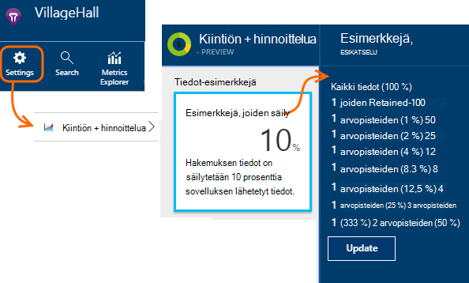

<properties 
    pageTitle="Hakemuksen tiedot näytteiden telemetriatietojen | Microsoft Azure" 
    description="Voit säilyttää äänenvoimakkuuden telemetriatietojen hallinnassa." 
    services="application-insights" 
    documentationCenter="windows"
    authors="vgorbenko" 
    manager="douge"/>

<tags 
    ms.service="application-insights" 
    ms.workload="tbd" 
    ms.tgt_pltfrm="ibiza" 
    ms.devlang="na" 
    ms.topic="article" 
    ms.date="08/30/2016" 
    ms.author="awills"/>

#  <a name="sampling-in-application-insights"></a>Sovelluksen tiedot-esimerkkejä

*Hakemuksen tiedot on esikatselu.*


Esimerkkejä on [Visual Studio sovelluksen tiedot](app-insights-overview.md) -ominaisuus on suositeltu tapaa vähentää telemetriatietojen liikenteen ja tallennustilaa säilyttämällä tilastollinen oikea analyysi hakemuksen tiedot. Suodattimen valitsee kohteet, jotka liittyvät niin, että voit siirtyä toiseen kohteet silloin, kun teet diagnostiikan tutkimuksia.
Metrijärjestelmän arvo on esitetty sinulle portaalissa, ne renormalized huomioon esimerkkejä Pienennä vaikutusta tilastotiedot.

Esimerkkejä vähentää liikenne, auttaa pitämään kuukausittain tietojen kiintiöiden ja auttaa välttämään rajoitusta.

## <a name="in-brief"></a>Lyhyesti:

* Esimerkkejä säilyttää 1: *n* tietueiden ja muiden Hylkää. Se esimerkiksi säilyttää 1-5 tapahtumien esimerkkejä korvaus 20 %. 
* Esimerkkejä tapahtuu automaattisesti, jos sovellus lähettää telemetriatietojen, paljon ASP.NET-palvelimen verkkosovelluksissa.
* Voit myös määrittää manuaalisesti, näyte jompikumpi sivulla hinnoittelu-portaalissa tai ASP.NET SDK .config-tiedostossa, voit pienentää myös ‑sovelluksen verkkoliikenteen tarpeisiin.
* Jos kirjaudut mukautetut tapahtumat ja haluat varmistaaksesi, että tapahtumien joukkoa on joko säilytetään tai poistetaan yhdessä, varmista, että heillä on sama toimintotunnukseksi-arvo.
* Esimerkkejä jakajana *n* ilmoitetaan kunkin tietueen ominaisuuden `itemCount`, jossa haku näkyy kohdassa kutsumanimi-pyyntö määrä"tai"tapahtumien määrä". Kun otos, jota ei ole toimintoa, kun `itemCount==1`.
* Jos kirjoitat kyselyjen Käyttöanalyysitietojen, kannattaa [ottaa huomioon esimerkkejä](app-insights-analytics-tour.md#counting-sampled-data). Erityisesti sijaan lasketaan vain tietueita, sinun on käytettävä `summarize sum(itemCount)`.


## <a name="types-of-sampling"></a>Esimerkkejä tyypit


On vaihtoehtoisia esimerkkejä kolmella tavalla:

* **Mukautuvat esimerkkejä** säätää automaattisesti telemetriatietojen lähettämät SDK ASP.NET-sovelluksessa. Oletusarvoisesti SDK v 2.0.0-beta3. Tällä hetkellä käytettävissä vain ASP.NET palvelinpuolen telemetriatietojen. 
* **Kiinteä korko esimerkkejä** vähentää telemetriatietojen lähetetään sekä ASP.NET palvelimen ja käyttäjien selaimista äänenvoimakkuuden. Voit määrittää nopeus. Asiakkaan ja palvelimen Synkronoi niiden esimerkkejä niin, että, tekstimuodossa haku, voit siirtyä toiseen sivuun liittyvät näkymät ja pyynnöt.
* **Esimerkkejä nieltynä** vähentää säilyttää tiedot sovelluksen tiedot-palvelusta, voit määrittää nopeus telemetriatietojen äänenvoimakkuuden. Ei pienennä telemetriatietojen liikenne, mutta sen avulla voit pitää kuukauden kiintiön. 

Jos Adaptive tai kiinteä korko esimerkkejä ovat toimintoa, kun nieltynä otos, jota ei ole käytössä.

## <a name="ingestion-sampling"></a>Nieltynä esimerkkejä

Tähän lomakkeeseen esimerkkejä toimii kohtaan, johon verkkopalvelin, selaimet ja laitteissa telemetriatietojen saavuttaa sovelluksen tiedot-palvelupäätepiste. Vaikka se ei vähentää telemetriatietojen liikenne lähettää-sovellukset, se vähentää käsitteleminen ja säilyttää (ja perittävän) mukaan sovelluksen tiedot.

Käyttää tämäntyyppistä esimerkkejä, jos sovelluksen esitellään usein kuukausittain kiintiötä ja käyttää joko esimerkkejä SDK-pohjainen tyypit ei ole. 

Määrittää nopeus esimerkkejä kiintiöiden ja hinnoittelu sivu:



Muuntyyppisten esimerkkejä, kuten algoritmin säilyttää telemetriatietojen Aiheeseen liittyvät kohteet. Esimerkiksi kun olet tarkistetaan telemetriatietojen hakutoiminnossa, pystyt Etsi liittyvät erityisesti poikkeuksen. Metrijärjestelmän laskee esimerkiksi pyyntöjä ja poikkeuksen korko säilyvät oikein.

Arvopisteitä, jotka ovat saapuvan esimerkkejä eivät ole käytettävissä minkä tahansa sovelluksen tiedot-ominaisuuden, kuten [Jatkuva Vie](app-insights-export-telemetry.md).

Nieltynä esimerkkejä ei toimi SDK-pohjainen mukautuvat tai vahvistetaan esimerkkejä ollessa toiminto. Jos SDK esimerkkejä nopeus on pienempi kuin 100 %, nieltynä esimerkkejä nopeus, jolla voit määrittää ohitetaan.

> [AZURE.WARNING] Arvo-ruutu ilmaisee arvon, joka määritetään nieltynä esimerkkejä. Se ei vastaa esimerkkejä todellinen korko, jos SDK esimerkkejä on toiminnassa.


## <a name="adaptive-sampling-at-your-web-server"></a>Mukautuvat esimerkkejä WWW-palvelimessa

Mukautuvat esimerkkejä on käytettävissä sovelluksen tiedot-SDK ASP.NET v 2.0.0-beta3 tai uudempaa versiota ja on oletusarvoisesti käytössä. 


Säädön esimerkkejä vaikuttaa äänenvoimakkuuden telemetriatietojen lähetetään palvelimen verkkosovelluksen sovelluksen tiedot-palveluun. Äänenvoimakkuuden sovitetaan automaattisesti määritetyn enimmäisnopeus liikenteen pitää.

Se ei toimivat vähäistä, telemetriatietojen, joten virheenkorjaus-sovelluksen tai sivustoon, jonka käytön ei vaikuta.

Tavoitteet kohde äänenvoimakkuuden hylätään joitakin luotu telemetriatietojen. Mutta muuntyyppiset esimerkkejä, kuten algoritmin säilyttää telemetriatietojen Aiheeseen liittyvät kohteet. Esimerkiksi kun olet tarkistetaan telemetriatietojen hakutoiminnossa, pystyt Etsi liittyvät erityisesti poikkeuksen. 

Metrijärjestelmän laskee esimerkiksi pyyntöjä ja poikkeuksen korko sovitetaan korvaamaan esimerkkejä nopeus, niin, että ne näyttävät oikea arvoja metrijärjestelmä Resurssienhallinnassa.

Hakemuksen tiedot *ennakkoversion* uusimman **Päivitä projektin NuGet** pakettien: Napsauta ratkaisunhallinnassa projektin hiiren kakkospainikkeella, valitse NuGet pakettien hallinta- **Sisällytä prerelease** ja etsi Microsoft.ApplicationInsights.Web. 

[ApplicationInsights.config](app-insights-configuration-with-applicationinsights-config.md), voit muuttaa useita parametrit `AdaptiveSamplingTelemetryProcessor` solmu. Esitetyt luvut ovat oletusarvot:

* `<MaxTelemetryItemsPerSecond>5</MaxTelemetryItemsPerSecond>`

    Kohteen nopeus, joilla mukautuvat algoritmin pyritään **kunkin palvelimen isännän**varten. Jos koodiin suoritetaan monta isännät-pienentää arvoksi siten, että ne jäävät kohde-korkokannan liikenteen sovelluksen tiedot-portaalissa.

* `<EvaluationInterval>00:00:15</EvaluationInterval>` 

    Aikaväli, jossa telemetriatietojen nykyisen korko on arvioitu uudelleen. Arviointi suoritetaan liukuva keskiarvo. Voit lyhentää aikaväliä, jos oman telemetriatietojen uhkaavat äkillinen bursts.

* `<SamplingPercentageDecreaseTimeout>00:02:00</SamplingPercentageDecreaseTimeout>`

    Näyte prosentti arvo muuttuu, kun kuinka pian jälkeen on sallittu alentaa esimerkkejä prosentti uudelleen, voit siepata vähemmän tietoja.

* `<SamplingPercentageIncreaseTimeout>00:15:00</SamplingPercentageIncreaseTimeout>`

    Näyte prosentti arvo muuttuu, kun kuinka pian jälkeen on sallittu niin, että esimerkkejä prosentti uudelleen kannattaa tallentaa enemmän tietoja.

* `<MinSamplingPercentage>0.1</MinSamplingPercentage>`

    Näyte prosentti vaihtelee, mikä on emme voi asettaa pienimmän arvon.

* `<MaxSamplingPercentage>100.0</MaxSamplingPercentage>`

    Näyte prosentti vaihtelee, mikä on emme voi asettaa suurimman arvon.

* `<MovingAverageRatio>0.25</MovingAverageRatio>` 

    Liukuvan keskiarvon laskemista leveyden määritetty viimeisimmän arvo. Käytä arvoa, joka on yhtä suuri kuin tai pienempi kuin 1. Pienemmät arvot Tee algoritmin vähemmän uudelleenaktivointi, äkillinen muutokset.

* `<InitialSamplingPercentage>100</InitialSamplingPercentage>`

    Kun sovellus on juuri aloittanut määritetty arvo. Ei pienennä tämä samalla, kun olet virheenkorjaus. 

### <a name="alternative-configure-adaptive-sampling-in-code"></a>Vaihtoehtoinen: paikallaan mukautuvat esimerkkejä koodi

Sen sijaan, että säätäminen esimerkkejä .config-tiedostossa, voit käyttää koodi. Voit määrittää takaisinsoitto-funktiota, joka suoritetaan aina, kun esimerkkejä on arvioitu uudelleen. Voi käyttää, esimerkiksi voit selvittää, mitä esimerkkejä korko on käytössä.

Poista `AdaptiveSamplingTelemetryProcessor` solmu .config-tiedostosta.


*C#*

```C#

    using Microsoft.ApplicationInsights;
    using Microsoft.ApplicationInsights.Extensibility;
    using Microsoft.ApplicationInsights.WindowsServer.Channel.Implementation;
    using Microsoft.ApplicationInsights.WindowsServer.TelemetryChannel;
    ...

    var adaptiveSamplingSettings = new SamplingPercentageEstimatorSettings();

    // Optional: here you can adjust the settings from their defaults.

    var builder = TelemetryConfiguration.Active.TelemetryProcessorChainBuilder;
    
    builder.UseAdaptiveSampling(
         adaptiveSamplingSettings,

        // Callback on rate re-evaluation:
        (double afterSamplingTelemetryItemRatePerSecond,
         double currentSamplingPercentage,
         double newSamplingPercentage,
         bool isSamplingPercentageChanged,
         SamplingPercentageEstimatorSettings s
        ) =>
        {
          if (isSamplingPercentageChanged)
          {
             // Report the sampling rate.
             telemetryClient.TrackMetric("samplingPercentage", newSamplingPercentage);
          }
      });

    // If you have other telemetry processors:
    builder.Use((next) => new AnotherProcessor(next));

    builder.Build();

```

([Lue lisää telemetriatietojen suorittimista](app-insights-api-filtering-sampling.md#filtering).)


<a name="other-web-pages"></a>
## <a name="sampling-for-web-pages-with-javascript"></a>Esimerkkejä web-sivujen JavaScript

Voit määrittää, mistä tahansa palvelimesta esimerkkejä vahvistetaan verkkosivujen. 

Kun voit [määrittää sovelluksen havainnollistamisen verkkosivut](app-insights-javascript.md), Muokkaa katkelmaa, jonka saat sovelluksen tiedot-portaalissa. (ASP.NET-sovelluksissa koodikatkelman yleensä oleviin _Layout.cshtml.)  Lisää rivi, kuten `samplingPercentage: 10,` ennen instrumentation-näppäintä:

    <script>
    var appInsights= ... 
    }({ 


    // Value must be 100/N where N is an integer.
    // Valid examples: 50, 25, 20, 10, 5, 1, 0.1, ...
    samplingPercentage: 10, 

    instrumentationKey:...
    }); 
    
    window.appInsights=appInsights; 
    appInsights.trackPageView(); 
    </script> 

Esimerkkejä prosentteina Valitse prosenttiarvon, joka on lähellä 100/N, jossa N on kokonaisluku.  Tällä hetkellä näyte ei tue muita arvoja.

Jos otat käyttöön myös vahvistetaan esimerkkejä palvelimessa, asiakkaan ja palvelimen Synkronoi niin, että, tekstimuodossa haku, voit siirtyä toiseen sivuun liittyvät näkymät ja pyynnöt.


## <a name="fixed-rate-sampling-for-aspnet-web-sites"></a>ASP.NET web-sivustojen vahvistetaan esimerkkejä

Kiinteän kurssin esimerkkejä vähentää liikenne lähettää verkkopalvelin ja selaimet. Toisin kuin mukautuvat esimerkkejä vähentää telemetriatietojen voit päättää kiinteää korkoa. Se myös Synkronoi asiakkaan ja palvelimen esimerkkejä niin, että liittyvät kohteet säilyvät – esimerkiksi niin, että jos tarkastelet sivunäkymän hakutoiminnossa, voit etsiä Aiheeseen liittyvät pyydettäessä.

Esimerkkejä algoritmin säilyttää liittyvät kohteet. HTTP-sivupyynnön tapahtuman, se ja sen liittyvät tapahtumat on hylätty tai lähettäminen. 

Arvot Resurssienhallinnassa korvaukset, kuten pyynnön ja poikkeuksen laskee kertomalla kerroin korvaamaan esimerkkejä nopeus, niin, että ne ovat noin oikein.

1. **Päivitä projektin NuGet pakettien** uusimman *julkaisua edeltävän* version hakemuksen tiedot. Napsauta ratkaisunhallinnassa projektin, valitse NuGet pakettien hallinta, **Sisällytä prerelease** ja etsi Microsoft.ApplicationInsights.Web. 

2. **Käytöstä mukautuvat esimerkkejä**: [ApplicationInsights.config](app-insights-configuration-with-applicationinsights-config.md), poista tai kommentoi pois `AdaptiveSamplingTelemetryProcessor` solmu.

    ```xml

    <TelemetryProcessors>
    <!-- Disabled adaptive sampling:
      <Add Type="Microsoft.ApplicationInsights.WindowsServer.TelemetryChannel.AdaptiveSamplingTelemetryProcessor, Microsoft.AI.ServerTelemetryChannel">
        <MaxTelemetryItemsPerSecond>5</MaxTelemetryItemsPerSecond>
      </Add>
    -->
    

    ```

2. **Ota käyttöön vahvistetaan esimerkkejä moduuli.** Lisää tämä koodikatkelman [ApplicationInsights.config](app-insights-configuration-with-applicationinsights-config.md):

    ```XML

    <TelemetryProcessors>
     <Add  Type="Microsoft.ApplicationInsights.WindowsServer.TelemetryChannel.SamplingTelemetryProcessor, Microsoft.AI.ServerTelemetryChannel">

      <!-- Set a percentage close to 100/N where N is an integer. -->
     <!-- E.g. 50 (=100/2), 33.33 (=100/3), 25 (=100/4), 20, 1 (=100/100), 0.1 (=100/1000) -->
      <SamplingPercentage>10</SamplingPercentage>
      </Add>
    </TelemetryProcessors>

    ```

> [AZURE.NOTE] Esimerkkejä prosentteina Valitse prosenttiarvon, joka on lähellä 100/N, jossa N on kokonaisluku.  Tällä hetkellä näyte ei tue muita arvoja.


### <a name="alternative-enable-fixed-rate-sampling-in-your-server-code"></a>Vaihtoehtoinen: Ota käyttöön vahvistetaan näytteiden server-koodi


Esimerkkejä-parametrin määrittäminen .config-tiedostossa, sijaan voit käyttää koodi. 

*C#*

```C#

    using Microsoft.ApplicationInsights.Extensibility;
    using Microsoft.ApplicationInsights.WindowsServer.TelemetryChannel;
    ...

    var builder = TelemetryConfiguration.Active.GetTelemetryProcessorChainBuilder();
    builder.UseSampling(10.0); // percentage

    // If you have other telemetry processors:
    builder.Use((next) => new AnotherProcessor(next));

    builder.Build();

```

([Lue lisää telemetriatietojen suorittimista](app-insights-api-filtering-sampling.md#filtering).)


## <a name="when-to-use-sampling"></a>Milloin kannattaa käyttää esimerkkejä?

Mukautuvat esimerkkejä on automaattisesti käytössä, jos käytät 2.0.0-beta3 ASP.NET SDK-version tai sitä uudemmalla versiolla. Riippumatta siitä, mitä SDK versiota käytät voit käyttää nieltynä esimerkkejä (sekä palvelimessa).

Sinun ei tarvitse esimerkkejä useimpien pienille ja koon sovellusten. Eniten hyötyä vianmääritystiedot ja eniten tarkkojen tilastojen saadaan tietojen keräämisen kaikki käyttäjän toimiin. 

 
Esimerkkejä eduista on:

* Sovelluksen tiedot palvelun tippaa ("ylikuormitustilan") arvopisteiden silloin, kun sovellus lähettää telemetriatietojen erittäin suuri määrä lyhyessä aikavälin. 
* Jos haluat säilyttää [kiintiön](app-insights-pricing.md) arvopisteiden hinnoittelu aikayksikön. 
* Voit pienentää verkkoliikenteen telemetriatietojen kokoelmasta. 

### <a name="which-type-of-sampling-should-i-use"></a>Esimerkkejä tyypin kannattaa käyttää?


**Käytä nieltynä näyte, jos:**

* Voit siirtyä usein kuukausittain kiintiö on telemetriatietojen kautta.
* Käytät SDK-paketissa, joka ei tue esimerkkejä – esimerkiksi, Java SDK tai ASP.NET-versioiden versiota aiempi kuin 2.
* Saat paljon telemetriatietojen käyttäjien selaimet.

**Käytä vahvistetaan näyte, jos:**

* Käytät hakemuksen tiedot SDK ASP.NET web services-versiota 2.0.0 tai uudempi versio, ja
* Haluat synkronoidun näyte asiakkaan ja palvelimen välillä, niin, että olet perittävän tapahtumat [haun](app-insights-diagnostic-search.md), voit siirtyä toiseen asiakkaan ja palvelimen, kuten sivun näkymiä ja pyyntöjen liittyvät tapahtumat.
* Olet varma tarvittavat esimerkkejä osuutena, kun sovellus. Pitäisi olla hyvin tarkkoja arvot pääset, mutta nopeus alle, joka ylittää hinnoittelu kiintiön ja rajoittava rajoitukset. 


**Käytä mukautuvat Esimerkkejä:**

Muussa tapauksessa kannattaa mukautuvat esimerkkejä. Tämä on käytössä oletusarvoisesti ASP.NET Serverin versio 2.0.0-beta3 SDK: ssa tai sitä uudemmalla versiolla. Se ei pienennyksen liikenne tiettyjä vähimmäismäärä, kunnes se ei vaikuta vähäisen käytön sivuston.


## <a name="how-do-i-know-whether-sampling-is-in-operation"></a>Mistä tiedän, onko esimerkkejä-toiminto?

Saat tietää esimerkkejä todellinen korko riippumatta siitä, missä se on otettu käyttöön, käytä [Analytics kyselyn](app-insights-analytics.md) esimerkiksi:

    requests | where timestamp > ago(1d)
  	| summarize 100/avg(itemCount) by bin(timestamp, 1h) 
  	| render areachart 

Kussakin säily tietueen `itemCount` ilmaisee, joka edustaa, alkuperäinen tietueiden määrän arvoksi 1 + edellisen hylättyjen tietueiden määrän. 


## <a name="how-does-sampling-work"></a>Esimerkkejä toiminta

Kiinteä korko ja säädön näytteiden ovat SDK-2.0.0 alkaen ASP.NET-versioissa: n ominaisuus. Esimerkkejä nieltynä toimintoa sovelluksen tiedot-palvelun ja voi olla toiminto, jos SDK ei suorittaman esimerkkejä. 

Esimerkkejä algoritmin päättää, mitä telemetriatietojen kohteiden poistaminen ja minkä version haluat säilyttää (olipa kyseessä SDK: ssa tai sovelluksen tiedot-palvelusta). Esimerkkejä päätös perustuu useita sääntöjä, jotka tavoitteena on säilyttää kaikki toisiinsa arvopisteiden ennalleen, ylläpito diagnostiikan kokemus-sovelluksen tiedot, joka on suoritettavia ja luotettava entistä vähäisempi tietojoukon kanssa. Esimerkiksi jos epäonnistuneita-pyynnön sovelluksen lähettää muita telemetriatietojen kohteita (kuten poikkeuksen ja kirjautunut-pyyntö jäljittää), esimerkkejä ei jakaa pyyntö ja muut telemetriatietojen. Se säilyttää tai pudottaa ollenkaan. Tuloksena tarkasteltaessa hakemuksen tiedot pyynnön tietoja voit nähdä pyynnön ja siihen liittyvä telemetriatietojen kohteet. 

Sovellusten, jotka määrittävät "käyttäjä" (eli yleisimmät verkkosovellusten), esimerkkejä päätös perustuu käyttäjätunnus, joka tarkoittaa, että kaikki telemetriatietojen kaikki tietyn käyttäjän on joko säilytetään tai poistetaan hash. Esimerkkejä päätös perustuu sovelluksia, jotka eivät määritä käyttäjät (esimerkiksi web services) muunlaisten toiminnon tunnus pyynnön. Lopuksi, joilla ei ole käyttäjän eikä toiminnon tunnuksen määrittäminen (esimerkiksi telemetriatietojen kohteiden raportoitu asynkroninen viestiketjuissa siirtyminen ei ole http-kontekstin) telemetriatietojen kohteiden esimerkkejä yksinkertaisesti Sieppaa kunkin tyypin kohteet telemetriatietojen prosentteina. 

Esityksen aikana telemetriatietojen takaisin, sovelluksen tiedot-palvelun säätää määritetty saman esimerkkejä prosentin, jota käytettiin sivustokokoelman, milloin puuttuu arvopisteiden hyvittää. Näin ollen katsoo telemetriatietojen-sovelluksen tiedot, kun käyttäjät näkevät tilastollinen oikea voidaan, jotka ovat hyvin lähellä reaalilukujen.

Kulman tarkkuudella salassa määritetyn esimerkkejä prosentti. Lisäksi tarkkuutta kasvaa sovelluksissa, jotka käsitellä päivittäin erittäin paljon yleensä samalla pyynnöt useille käyttäjille. Toisaalta sovelluksissa, jotka eivät toimi merkittäviä kuormituksen, esimerkkejä ei tarvita, kun nämä sovellukset yleensä lähettää niiden telemetriatietojen aikana yhteyden pitäminen kiintiön, menettämättä tietoja-rajoitusta. 

Huomaa, että hakemuksen tiedot ei Esimerkki arvot ja istuntoja telemetriatietojen tyypit, koska näiden, tarkkuus väheneminen voi olla erittäin ei-toivottujen. 

### <a name="adaptive-sampling"></a>Säätö-esimerkkejä

Säädön esimerkkejä Lisää osa, joka valvoo SDK lähetyksen nykyisen korko ja säätää yrittää pysyä ajan kuluessa kohde enimmäisnopeus esimerkkejä prosentti. Muutos säännöllisin väliajoin uudelleen ja lähtevien siirtonopeuden liukuvan keskiarvon perusteella.

## <a name="sampling-and-the-javascript-sdk"></a>Esimerkkejä ja JavaScript-SDK

Asiakaspuolen (JavaScript) SDK osallistuu vahvistetaan esimerkkejä palvelinpuolen SDK yhdessä. Instrumentoitujen sivujen vain lähettää asiakkaan telemetriatietojen saman käyttäjiltä, jossa palvelinpuolen tehty sen päätös-malli." Tämä logiikka on suunniteltu ylläpito käyttäjän istuntoon yhtenäisyyden yli asiakas - ja server-sivua. Tämän vuoksi mistä tahansa tietyn telemetriatietojen kohteesta-sovelluksen tiedot voit etsiä tämän käyttäjän tai istunnon kaikki muut telemetriatietojen kohteet. 

*Asiakas- ja palvelinpuolen telemetriatietojen Älä näytä koordinoidun näytteiden kuin edellä kuvaa.*

* Tarkista käytössä vahvistetaan esimerkkejä sekä asiakkaan ja palvelimen.
* Varmista, että SDK-versio on 2.0 tai uudempi.
* Tarkista, että määrität saman esimerkkejä prosentin asiakkaan ja palvelimen.


## <a name="frequently-asked-questions"></a>Usein kysytyt kysymykset 

*Miksi ei ole näyte yksinkertainen "kerääminen X prosenttia telemetriatietojen kunkin tyypin"?*

 *  Vaikka Esimerkkejä tämän menetelmän erittäin suuri tarkkuudella metrisillä voidaan, se katkaista mahdollisuus yhdistää diagnostiikkatiedot kohti käyttäjän, istunnon ja pyynnön, niiden on diagnostiikan asetuksia. Näyte vuoksi toimii paremmin "kaikki telemetriatietojen kohteiden kerääminen for X prosenttia sovelluksen käyttäjien" tai "kerätä kaikki telemetriatietojen varten sovelluspyyntöjen tehdyn X" logiikan. Pyynnöt (kuten taustan asynkroninen käsittely) ei ole liitetty telemetriatietojen kohteet Syksy takaisin on "kerääminen X prosenttia telemetriatietojen mistäkin kaikki kohteet." 

*Esimerkkejä prosentti voivat muuttua ajan kuluessa*

 * Kyllä, säädön esimerkkejä muuttuu vähitellen esimerkkejä prosenttiluku telemetriatietojen tällä hetkellä havaittujen äänenvoimakkuuden perusteella.

 

*Jos käytän vahvistetaan esimerkkejä, mistä tietää, mitkä esimerkkejä prosentti toimivat sovelluksen parhaiten?*

* Yksi tapa on aloittaa mukautuvat esimerkkejä, selvitä, mitä luokitella se suorittaa (katso yllä kysymys)- ja siirry sitten vahvistetaan ottaminen käyttämällä tätä kurssia. 

    Muussa tapauksessa sinun tarvitse arvata. Analysoida nykyisen telemetriatietojen käyttö-AI, noudata minkä tahansa rajoitusta, joka on käynnissä ja arvioida kerättyjen telemetriatietojen äänenvoimakkuuden. Nämä kolme syötteiden, että valitun hinnoittelu taso ja Ehdota, kuinka paljon voit vähentää kerättyjen telemetriatietojen äänenvoimakkuuden. Käyttäjien määrä kasvaa tai muita VAIHTO telemetriatietojen määrän voi kuitenkin poistaa oman arvio.

*Mitä tapahtuu, jos esimerkkejä prosentti on liian alhainen määritetään?*

* Kohtuuttoman pienen esimerkkejä prosentteina (over-aggressive esimerkkejä) vähentää tarkkuutta, voidaan, kun hakemuksen tiedot yrittää hyvittää tietojen aseman vähentämistä tietojen visualisoinnin. Myös diagnostiikan kokemus saattaa heikentää heiketä, kuten joitakin harvoin kaatuvat tai hidas pyynnöt voidaan näyte ulos.

*Mitä tapahtuu, jos esimerkkejä prosentti on liian suuri määritetään?*

* Kerättyjen telemetriatietojen äänenvoimakkuuden riittämätön väheneminen tulokset määrittäminen liian suuri esimerkkejä prosentteina (ei kohdetoimialueen tarpeeksi). Telemetriatietojen tietojen menettämisen liittyvät rajoittimen edelleen saattaa ilmetä ja kustannukset käyttämällä sovelluksen tietoja voi olla suurempi kuin olet suunnitellut overage kuluja.

*Mitä ympäristöissä voi käyttää esimerkkejä?*

* Nieltynä esimerkkejä saattaa aiheuttaa automaattisesti kaikki telemetriatietojen yläpuolella tiettyjä aseman Jos SDK ei suorittaa esimerkkejä. Tämä toimisi, esimerkiksi jos sovellus käyttää Java-palvelinta tai jos käytössäsi on ASP.NET-SDK vanhempi versio.

* Jos käytät ASP.NET SDK versioita 2.0.0 ja yläpuolella (Isännöity Azure-tietokannassa tai oman palvelimessa), saat mukautuvat näyte oletusarvoisesti, mutta voit vaihtaa kiinteä korko yllä olevien ohjeiden mukaisesti. Esimerkkejä vahvistetaan kanssa selaimen SDK Synkronoi automaattisesti, esimerkki liittyvät tapahtumat. 

*Tiettyjen harvinaisissa tapahtumia, haluan tarkastella aina ei. Miten voin poistaa ne aiempia esimerkkejä moduulin?*

 * Alusta erillisen esiintymän TelemetryClient uusi TelemetryConfiguration (ei oletusarvo aktiivinen) kanssa. Lähetä harvinaisten tapahtumille, avulla.


## <a name="next-steps"></a>Seuraavat vaiheet

* [Suodattaminen](app-insights-api-filtering-sampling.md) voit määrittää, että SDK lähettää tarkka tarkemmin.
