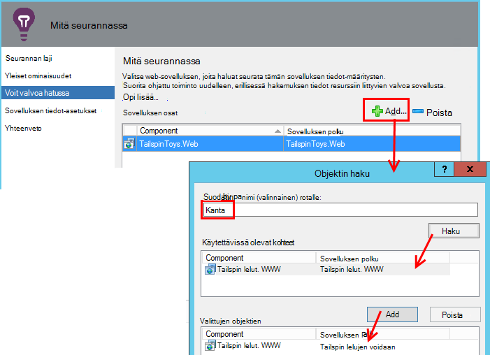

<properties 
    pageTitle="Hakemuksen tiedot SCOM integrointi | Microsoft Azure" 
    description="Jos olet SCOM-käyttäjä, valvoa suorituskykyä ja vianmääritys sovelluksen havainnollistamisen kanssa. Täydellinen raporttinäkymiä, automaattinen ilmoitusten, tehokkaita diagnostiikkatyökalut ja analyysi kyselyt." 
    services="application-insights" 
    documentationCenter=""
    authors="alancameronwills" 
    manager="douge"/>

<tags 
    ms.service="application-insights" 
    ms.workload="tbd" 
    ms.tgt_pltfrm="ibiza" 
    ms.devlang="na" 
    ms.topic="article" 
    ms.date="08/12/2016" 
    ms.author="awills"/>
 
# Sovelluksen suorituskyvyn seurantaa hakemuksen tiedot käytön SCOM

Jos käytät Hallitse palvelimia System Center Operations Manager (SCOM), voit valvoa suorituskykyä ja suorituskyvyn vianmääritys [Oivalluksia Visual Studio-sovelluksen](app-insights-asp-net.md)avulla. Hakemuksen tiedot valvoo web-sovelluksen pyynnöt lähtevän muille käyttäjille ja SQL-puheluita, poikkeukset ja log jäljittää. Sen avulla raporttinäkymien metrisillä kaavioita ja automaattinen ilmoitusten sekä tehokas diagnostiikan haku ja analytical kyselyjen tämän telemetriatietojen päälle. 

Voit siirtyä sovelluksen havainnollistamisen valvonnasta käyttämällä SCOM management Pack-paketti.

## Ennen aloittamista

Olemme oletetaan, että:

* Olet käyttänyt SCOM ja, että käytät SCOM 2012 R2: n tai 2016 hallita oman IIS verkko-palvelimiin.
* Olet jo asentanut palvelimiin web-sovelluksen, jota haluat seurata kanssa hakemuksen tiedot.
* Framework sovellusversio on .NET 4.5 tai uudempi.
* Tilauksen käyttöösi [Microsoft Azure](https://azure.com) - ja [Azure portal](https://portal.azure.com)kirjautumaan. Organisaatiossa voi olla tilauksen ja voit lisätä Microsoft-tili.

(Ryhmälle voi luoda [Sovelluksen havainnollistamisen SDK](app-insights-asp-net.md) verkkosovellukseen. Muodosta / aika-instrumentation ‑sovelluksessa joustavia, mukautettuja telemetriatietojen kirjoitettaessa. Mutta se ei ole väliä: Voit katsoa kanssa tai ilman SDK: n valmista Tässä kuvattuja ohjeita.)

## (Kerran) Asenna sovellus havainnollistamisen hallinta

Tietokoneessa, jossa Operations Manager suorittaa:

2. Poista kaikki management pack vanhaa versiota:
 1. Avaa Operations Manager hallinta-Management Pack-paketit. 
 2. Poista vanha versio.
1. Lataa ja asenna management pack luettelosta.
2. Käynnistä Operations Manager.

## Luo management Pack-paketti

1. Avaa **julkaisu**, **.NET... hakemuksen tiedot kanssa**, **Lisää seuranta ohjatun**Operations Manager ja uudelleen **.NET... hakemuksen tiedot ja**Valitse.

    

2. Määritysten jälkeen sovelluksen nimi. (Selaa tarvittaessa soittimen app yksi kerrallaan.)
    
    

3. Ohjatun toiminnon samalla sivulla Luo uusi hallintapaketin tai valitse paketti, jonka loit sovelluksen tietoja aiemmin.

     (Sovelluksen havainnollistamisen [hallintapaketin](https://technet.microsoft.com/library/cc974491.aspx) on malli, jonka luot erillisen. Voit käyttää samassa esiintymässä myöhemmin.)

    

4. Valitse yksi sovellus, jota haluat seurata. Hakutoiminnon hakee-sovelluksia asennettuna palvelinten välillä.

    

    Valinnainen seuranta-alueen kenttä voidaan Määritä alijoukkoa palvelimiin, jos et halua seurata sovelluksen jokaisessa palvelimessa.

5. Valitse ohjatun toiminnon seuraavalla sivulla sinun on määritettävä tunnistetiedot kirjautumaan Microsoft Azure.

    Valitse tällä sivulla kohtaa, johon haluat analysoida ja näyttämisen telemetriatietojen tiedot sovelluksen havainnollistamisen resurssi. 

 * Jos sovellus on määritetty hakemuksen tiedot kehityksen aikana, valitse sen aiemmin luotu resurssi.
 * Muussa tapauksessa luo uusi resurssi sovelluksen nimi. Jos määritettynä on muita sovellukset, jotka ovat samassa järjestelmässä osia, kirjoita ne samaan resurssiryhmän, voit tehdä telemetriatietojen access helpompi hallita.

    Voit muuttaa näitä asetuksia myöhemmin.

    

6. Suorita ohjattu.

    
    
Toista samat vaiheet kunkin sovelluksen, jota haluat seurata.

Jos haluat muuttaa asetuksia myöhemmin uudelleen Avaa julkaisu-ikkunasta näytön ominaisuudet.

## Tarkista seuranta

Näyttö, että olet asentanut sovelluksen etsii kaikkiin. Jossa lukee sovelluksen, se määrittää sovelluksen havainnollistamisen tilan valvonta valvoa sovellusta. Tarvittaessa ensin asentaa siihen tilan valvonta-palvelimeen.

Voit tarkistaa, mitkä sovelluksen esiintymää se löytänyt:

## Näytä telemetriatietojen-sovelluksen tiedot

Siirry [Azure portal](https://portal.azure.com)resurssi, kun sovellus. Voit [tarkastella kaavioita, jossa telemetriatietojen](app-insights-dashboards.md) -sovellukset. (Jos se ei näy pääsivulta vielä, valitse Live arvot Stream.)

## Seuraavat vaiheet

* Yhdistää tärkeimmät kaavioiden seuranta tämän ja muiden sovellusten [määrittäminen Raporttinäkymät-ikkunan](app-insights-dashboards.md) .
* [Lisätietoja arvot](app-insights-metrics-explorer.md)
* [Ilmoitusten määrittäminen](app-insights-alerts.md)
* [Ohjelmistossa suorituskykyongelmia](app-insights-detect-triage-diagnose.md)
* [Tehokas Analytics-kyselyt](app-insights-analytics.md)
* [Käytettävyys web testit](app-insights-monitor-web-app-availability.md)
