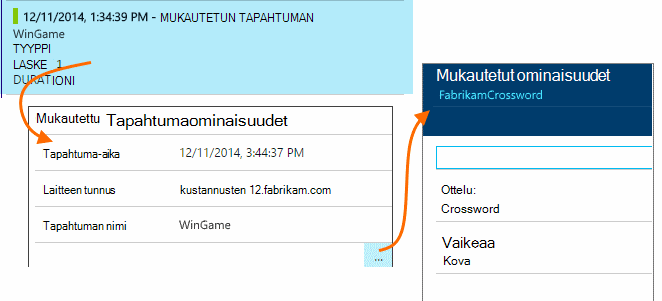

<properties 
    pageTitle="Lokit, poikkeukset ja mukautetun diagnostiikkaa ASP.NET-sovelluksen tiedot" 
    description="ASP.NET web Apps-sovelluksissa ongelmien vianmääritys hakemalla pyynnöt, poikkeukset ja luotu jäljitys, NLog tai Log4Net lokitiedot." 
    services="application-insights" 
    documentationCenter=""
    authors="alancameronwills" 
    manager="douge"/>

<tags 
    ms.service="application-insights" 
    ms.workload="tbd" 
    ms.tgt_pltfrm="ibiza" 
    ms.devlang="na" 
    ms.topic="article" 
    ms.date="04/08/2016" 
    ms.author="awills"/>
 
# Lokit, poikkeukset ja mukautetun diagnostiikkaa ASP.NET-sovelluksen tiedot

[Hakemuksen tiedot] [ start] on tehokas [Diagnostiikan haun] [ diagnostic] työkalu, jonka avulla voit tutkia ja siirry telemetriatietojen lähettämä hakemuksen tiedot SDK sovelluksestasi. Monta tapahtumia, kuten sivun käyttäjänäkymien lähetetään automaattisesti SDK.

Voit myös kirjoittaa koodin lähetetään mukautetut tapahtumat ja jäljittää poikkeuksen raportteja. Ja jos käytät jo kirjaaminen framework, kuten log4J, log4net, NLog tai System.Diagnostics.Trace, voit tallentaa ne lokit ja sisällyttää hakuun. Sen avulla on helppo yhdistää log jäljittää käyttäjän toimet, poikkeukset ja muiden tapahtumien kanssa.

## Ennen kuin voit kirjoittaa mukautetun telemetriatietojen

Jos et ole vielä [sovelluksen tietoa projektin määrittäminen][start], tee se nyt.

Kun olet suorittanut sovelluksen, se lähettää joitakin telemetriatietojen, joka näkyy diagnostiikan haku, mukaan lukien palvelin-pyyntöjen sivun kirjautunut asiakkaan, näkymien ja käsittelemättömän poikkeukset.

Avaa diagnostiikan haun nähdäksesi, joka lähettää SDK telemetriatietojen.

Tiedot vaihtelevat sovelluksen tyypistä toiseen. Voit valita yksittäisiä tapauksessa saat tarkempia tietoja kautta.

## Esimerkkejä 

Jos sovelluksesi lähettää tietojen tarkastelun ja käytät sovelluksen tiedot-SDK ASP.NET-version 2.0.0-beta3 tai uudempi versio, mukautuvat esimerkkejä-ominaisuus saattaa toimia ja Lähetä vain oman telemetriatietojen prosentteina. [Lue lisää esimerkkejä.](app-insights-sampling.md)

##Mukautetut tapahtumat

Mukautetut tapahtumat näkyvät molemmat [Diagnostiikan] hakutoiminnossa[ diagnostic] ja [Metrijärjestelmän Explorerissa][metrics]. Voit lähettää heille laitteita, verkkosivut ja sovellukset. Niiden avulla voidaan vianmääritystä varten sekä ymmärtää [käyttötavat][track].

Mukautetun tapahtuman nimi ja myös siirtää ominaisuudet, joita voit suodattaa, ja numeerinen mitat.

Asiakastietokoneen JavaScript

    appInsights.trackEvent("WinGame",
         // String properties:
         {Game: currentGame.name, Difficulty: currentGame.difficulty},
         // Numeric measurements:
         {Score: currentGame.score, Opponents: currentGame.opponentCount}
         );

C#-palvelimessa

    // Set up some properties:
    var properties = new Dictionary <string, string> 
       {{"game", currentGame.Name}, {"difficulty", currentGame.Difficulty}};
    var measurements = new Dictionary <string, double>
       {{"Score", currentGame.Score}, {"Opponents", currentGame.OpponentCount}};

    // Send the event:
    telemetry.TrackEvent("WinGame", properties, measurements);

VB-palvelimessa

    ' Set up some properties:
    Dim properties = New Dictionary (Of String, String)
    properties.Add("game", currentGame.Name)
    properties.Add("difficulty", currentGame.Difficulty)

    Dim measurements = New Dictionary (Of String, Double)
    measurements.Add("Score", currentGame.Score)
    measurements.Add("Opponents", currentGame.OpponentCount)

    ' Send the event:
    telemetry.TrackEvent("WinGame", properties, measurements)

### Suorita sovellus ja Tarkastele tuloksia.

Avaa diagnostiikan haku.

Valitse Mukautettu tapahtuma ja valitse tietyn tapahtuman nimi.

Lisää kirjoittamalla hakusana ominaisuuden arvon tietojen suodattaminen.  

Siirtyminen yksittäisen tapahtuman voit tarkastella yksityiskohtaisia ominaisuuksia.

##Sivun näkymät

[Voit lisätä verkkosivuille käyttöösi JavaScript-katkelma]trackPageView() puhelu lähetetään sivun näkymän telemetriatietojen[usage]. Tärkeimmät sen tarkoituksena on osallistuja-sivun näkymiä, jotka yleiskatsaus-sivulla näkyy määrät.

Yleensä, jonka nimi on kerran kullekin HTML-sivulle, mutta voit lisätä tulevat puhelut - esimerkiksi jos yhden sovelluksen ja haluat kirjautua uuden sivun aina, kun käyttäjä saa enemmän tietoja.

    appInsights.trackPageView(pageSegmentName, "http://fabrikam.com/page.htm"); 

Voi olla hyödyllisiä ominaisuuksia, joita voit käyttää suodattimina diagnostiikan Etsi liitettävä:

    appInsights.trackPageView(pageSegmentName, "http://fabrikam.com/page.htm",
     {Game: currentGame.name, Difficulty: currentGame.difficulty});

##Jäljitä telemetriatietojen

Jäljitä telemetriatietojen on tunnus, jolla voit lisätä erityisesti, jos haluat luoda vianmäärityslokit. 

Voit esimerkiksi lisätä puhelut tältä:

    var telemetry = new Microsoft.ApplicationInsights.TelemetryClient();
    telemetry.TrackTrace("Slow response - database01");

####  Kirjaaminen Framework sovittimen asentaminen

Voit myös hakea luotu kirjaaminen Framework - lokit log4Net NLog tai System.Diagnostics.Trace. 

1. Jos aiot käyttää log4Net tai NLog, voit asentaa sen projektin. 
2. Napsauta ratkaisunhallinnassa projektin hiiren kakkospainikkeella ja valitse **NuGet pakettien hallinta**.
3. Valitse online-palvelun >, valitse **Sisällytä Prerelease** ja Etsi "Microsoft.ApplicationInsights"

    

4. Valitse haluamasi paketti - jokin seuraavista:
  + Microsoft.ApplicationInsights.TraceListener (kannattaa tallentaa System.Diagnostics.Trace puhelut)
  + Microsoft.ApplicationInsights.NLogTarget
  + Microsoft.ApplicationInsights.Log4NetAppender

NuGet-paketti asennetaan tarvittavat kokoonpanon ja Muokkaa myös web.config tai app.config.

#### Lisää vianmäärityslokeihin puhelut

Jos käytät System.Diagnostics.Trace, tyypillinen puhelun on seuraava:

    System.Diagnostics.Trace.TraceWarning("Slow response - database01");

Jos käytät mieluummin log4net tai NLog:

    logger.Warn("Slow response - database01");

Suorita sovellus virheenkorjaus-tilassa tai ottaa sen käyttöön.

Diagnostiikan haun viestit tulevat näkyviin, kun valitset jäljitys-suodatin.

### Poikkeukset

Poikkeus-raporttien käytön-sovelluksen tiedot sisältävät hyvin tehokas, varsinkin, koska voit siirtyä epäonnistui pyyntöjä ja poikkeukset ja lukea poikkeuksen pinon.

Joissakin tapauksissa sinun on lisättävä [muutama koodin rivit] [ exceptions] varmistaaksesi, että poikkeukset ovat parhaillaan pyydettyjen automaattisesti.

Voit myös kirjoittaa koodin lähettää poikkeuksen telemetriatietojen:

JavaScript

    try 
    { ...
    }
    catch (ex)
    {
      appInsights.TrackException(ex, "handler loc",
        {Game: currentGame.Name, 
         State: currentGame.State.ToString()});
    }

C#

    var telemetry = new TelemetryClient();
    ...
    try 
    { ...
    }
    catch (Exception ex)
    {
       // Set up some properties:
       var properties = new Dictionary <string, string> 
         {{"Game", currentGame.Name}};

       var measurements = new Dictionary <string, double>
         {{"Users", currentGame.Users.Count}};

       // Send the exception telemetry:
       telemetry.TrackException(ex, properties, measurements);
    }

VB

    Dim telemetry = New TelemetryClient
    ...
    Try
      ...
    Catch ex as Exception
      ' Set up some properties:
      Dim properties = New Dictionary (Of String, String)
      properties.Add("Game", currentGame.Name)

      Dim measurements = New Dictionary (Of String, Double)
      measurements.Add("Users", currentGame.Users.Count)
  
      ' Send the exception telemetry:
      telemetry.TrackException(ex, properties, measurements)
    End Try

Ominaisuudet ja mitat-parametrit on valinnainen, mutta on hyötyä lisääminen ylimääräisten tietojen suodattaminen ja. Esimerkiksi jos on, voit suorittaa useita visualisointi n sovelluksen olet löytänyt kaikki liittyvät erityisesti Ottelu poikkeuksen raportit. Voit lisätä niin monta kohteet kuin haluat kunkin sanastoon.

#### Poikkeukset tarkasteleminen

Näet yhteenveto poikkeukset raportoi yhteenveto-sivu ja voit valita näkyviin tarkempia kautta. Esimerkki:

[]

Napsauta minkä tahansa poikkeustyyppi voit tarkastella tietyn esiintymien:

[]

Voit myös Avaa diagnostiikan haun suoraan, suodattaa poikkeukset ja valitse poikkeustyyppi, jota haluat tarkastella.

### Raportoinnin käsittelemättömän poikkeukset

Sovelluksen tiedot-raporttien käsittelemätön poikkeukset kohtaa, johon se voidaan laitteilla, [selaimet][usage], tai web-palvelimissa, onko [Tila] tarkkailu instrumented[ redfield] tai [Hakemuksen tiedot SDK][greenbrown]. 

Ei aina kuitenkin tehdä koska .NET framework saa kiinni poikkeukset joissakin tapauksissa.  Varmista, että näet kaikki poikkeukset-vuoksi edellyttää kirjoittaa pieni poikkeuksen käsittelytoiminnon. Paras menettely vaihtelee tekniikka. Katso [poikkeuksen telemetriatietojen varten ASP.NET] [ exceptions] lisätietoja. 

### Hajautettuna kanssa muodosta

Kun olet lukenut vianmäärityslokit, ei-toivottuja lähdekoodia olla muuttunut, vaikka live koodi on otettu käyttöön.

Näin ollen kannattaa sijoittaa muodosta tiedot, kuten nykyinen versio URL-osoite sekä kunkin poikkeuksen tai seuranta ominaisuus. 

Sen sijaan, että lisäät ominaisuuden erikseen jokaisen poikkeuksen kutsun, voit määrittää tietojen oletussijainnin. 

    // Telemetry initializer class
    public class MyTelemetryInitializer : ITelemetryInitializer
    {
        public void Initialize (ITelemetry telemetry)
        {
            telemetry.Properties["AppVersion"] = "v2.1";
        }
    }

Valitse sovellus-alustaja, kuten Global.asax.cs:

    protected void Application_Start()
    {
        // ...
        TelemetryConfiguration.Active.TelemetryInitializers
        .Add(new MyTelemetryInitializer());
    }

###Palvelimen Web-pyynnöt

Pyydä telemetriatietojen lähetetään automaattisesti, kun [asentaa tilan valvonta verkkosivustoon][redfield], tai voit [lisätä sovelluksen havainnollistamisen web projektiin][greenbrown]. Se myös syötteet kyselyjä pyynnön ja vastauksen ajan kaavioiden metrijärjestelmä Resurssienhallinnassa ja yleiskatsaus-sivulla.

Jos haluat lähettää muita tapahtumia, voit käyttää TrackRequest() Ohjelmointirajapinnan.

## Q & A

### Saan virhesanoman "Instrumentation avain ei voi olla tyhjä"

Näyttää kirjaaminen sovittimen Nuget paketin asentanut asentamatta hakemuksen tiedot.

Napsauta ratkaisunhallinnassa, napsauta hiiren kakkospainikkeella `ApplicationInsights.config` ja valitse **Päivitä sovelluksen tiedot**. Näyttöön tulee valintaikkuna, joka kutsuu voit kirjautua Azure ja Luo sovelluksen tiedot-resurssi, tai Käytä aiemmin luotua uudelleen. Tämä on Ratkaise.

### Kuinka paljon tietoja säilytetään?

Enintään 500 tapahtumat sekunnissa kunkin sovelluksesta. Tapahtumien säilyvät seitsemän päivän ajan.

### Oma tapahtumia tai jäljittää eivät näy

Jos sovelluksesi lähettää tietojen tarkastelun ja käytät sovelluksen tiedot-SDK ASP.NET-version 2.0.0-beta3 tai uudempi versio, mukautuvat esimerkkejä-ominaisuus saattaa toimia ja Lähetä vain oman telemetriatietojen prosentteina. [Lue lisää esimerkkejä.](app-insights-sampling.md)

## Seuraavat vaiheet

* [Käytettävyys ja vastausajan testien määrittäminen][availability]
* [Vianmääritys][qna]

<!--Link references-->

[availability]: app-insights-monitor-web-app-availability.md
[diagnostic]: app-insights-diagnostic-search.md
[exceptions]: app-insights-asp-net-exceptions.md
[greenbrown]: app-insights-asp-net.md
[metrics]: app-insights-metrics-explorer.md
[qna]: app-insights-troubleshoot-faq.md
[redfield]: app-insights-monitor-performance-live-website-now.md
[start]: app-insights-overview.md
[track]: app-insights-api-custom-events-metrics.md
[usage]: app-insights-web-track-usage.md

 
