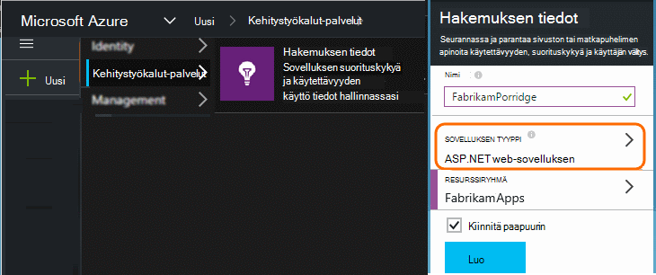
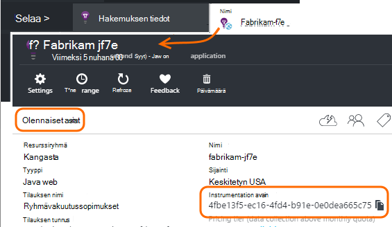

<properties 
    pageTitle="Keskihajonta, Testaa ja tuotannon erillisessä sovelluksen tiedot-resurssit" 
    description="Valvoa suorituskykyä ja sovelluksen eri vaiheissa kehittämisen käyttö" 
    services="application-insights" 
    documentationCenter=""
    authors="alancameronwills" 
    manager="douge"/>

<tags 
    ms.service="application-insights" 
    ms.workload="tbd" 
    ms.tgt_pltfrm="ibiza" 
    ms.devlang="na" 
    ms.topic="article" 
    ms.date="05/04/2016" 
    ms.author="awills"/>

# Erotat sovelluksen tiedot-resurssit

Olisi telemetriatietojen eri osat ja sovelluksen versioita voi lähetetään eri hakemuksen tiedot resursseja tai yhdistetty yhdeksi? Tässä artikkelissa näyttää parhaalla käytäntöjä ja tarvittavat tekniikoita.

Ensin ymmärtää seuraavaksi kysymyksen. Sovelluksen saadut tiedot tallennetaan ja käsitellä sovelluksen tietoja Microsoft Azure *resurssi*. Kullekin resurssille tunnistetaan on *instrumentation key* (iKey). Sovelluksen-avain annetaan sovelluksen tietoja: n SDK niin, että se lähettää se kerää oikean resurssin tiedot. Avain voidaan suorittaa koodin tai ApplicationInsights.config. Muuttamalla avain SDK: ssa, voit ohjata tietojen eri resursseja. 

Yksinkertainen kirjoitusmuotoon, kun luot uuden sovelluksen koodi voit myös luoda uusi resurssi-sovelluksen tiedot. Visual Studio *Uusi projekti* -valintaikkunassa tekee tämän puolestasi.

Jos kyseessä on paljon-sivusto, se ottaa käyttöön useita server-esiintymän.

Järjestelmä, joka koostuu useita osia – esimerkiksi web-sivuston ja taustatietokantaan suoritin sinulla monimutkaisia skenaarioille. 

## Erillisen iKeys käyttäminen

Seuraavassa on joitakin yleisiä ohjeita:

* Joissa itsenäisesti esikunnista sovelluksen-yksikkö, joka suoritetaan joukko palvelimen esiintymät, jotka voi skaalata ylös/alas ulkopuolisista muita osia, valitse yleensä yhdistät, yksittäinen resurssi -, se on yksi instrumentation näppäintä (iKey).
* Sen sijaan käyttämällä eri iKeys syyt ovat seuraavat:
 - Erillinen arvot lukea helposti eri osia.
 - Pitää alemman äänenvoimakkuuden telemetriatietojen erillään suuri-asema, jotta rajoitin-kiintiön, ja valitse yksi stream näytteiden ei vaikuta muihin.
 - Erillinen ilmoituksia, vieminen ja työn kohteen määrityksiä.
 - Venytä [rajoitukset](app-insights-pricing.md#limits-summary) , kuten telemetriatietojen kiintiön, rajoittaminen ja web testata määrä.
 - Koodin kehitteillä ja testaa lähetettävä erillisessä iKey kuin tuotannon aikaleiman.  

Sovelluksen tiedot-portaalin kokemukset paljon on suunniteltu mielessä seuraavia ohjeita. Esimerkiksi palvelimet Näytä esiintymä, että olettaen, että telemetriatietojen tietoja yksi looginen osa voi tulla useita server esiintymät osia.

## Yksittäisen iKey

Jos lähetät telemetriatietojen useita komponenteilta yksittäisen iKey:

* Lisätä ominaisuuden kaikki telemetriatietojen, jotka mahdollistavat segmentin ja suodattaa osan tunnistetiedot. Rooli tunnuksen lisätään automaattisesti telemetriatietojen server roolin esiintymät, mutta joskus [telemetriatietojen alustaja](app-insights-api-filtering-sampling.md#add-properties) avulla voit lisätä ominaisuuden.
* Päivitä eri osien sovelluksen SDK:-t tiedot yhtä aikaa. Yksi iKey telemetriatietojen on peräisin saman SDK-version kanssa.

## Erillisen iKeys

Jos sinulla on useita eri osien iKeys:

* Jos haluat nähdä avaimen telemetriatietojen [raporttinäkymät-ikkunan](app-insights-dashboards.md) luodaan looginen ohjelmasta, voit yhdistää eri sovelluksessa komponenteilta. Raporttinäkymien voidaan jakaa, jolloin yhden loogisen järjestelmänäkymä voidaan käyttää eri ryhmiä.
* Järjestää [resurssiryhmät](app-insights-resources-roles-access-control.md) ryhmän tasolla. Käyttöoikeudet on määritetty resurssiryhmä ja tällaisia käyttöoikeudet määrittää ilmoituksia. 
* Tietoja, kuten ilmoitusten sääntöjen hallinta ja WWW-testien [Azure Resurssienhallinta mallit ja PowerShellin](app-insights-powershell.md) avulla.

## Erillisen iKeys ja keskihajonta ja testi

Voit muuttaa avaimen automaattisesti, kun sovellus on julkaistu helpottaa määrittää koodissa iKey sijaan ApplicationInsights.config.

### Dynaaminen instrumentation avain

Määrittää käyttäjäavainten alustus-menetelmää, kuten global.aspx.cs ASP.NET-palvelussa:

*C#*

    protected void Application_Start()
    {
      Microsoft.ApplicationInsights.Extensibility.
        TelemetryConfiguration.Active.InstrumentationKey = 
          // - for example -
          WebConfigurationManager.AppSettings["ikey"];
      ...

Tässä esimerkissä eri resurssien ikeys sijoitetaan web-kokoonpanotiedosto eri versioita. Vaihtaminen - eli tee osana release komentosarja - web-kokoonpanotiedosto Vaihda kohde resurssi.

### Verkkosivut

IKey käytetään myös sinua sovelluksen verkkosivujen [komentosarjan, joka on saatu pika-aloitusopas-sivu](app-insights-javascript.md). Sijaan coding se literaaleina komentosarja kyselyjä, luo se palvelimen tila. Esimerkiksi uudelleen ASP.NET-sovelluksessa:

*JavaScriptin Razor*

    <script type="text/javascript">
    // Standard Application Insights web page script:
    var appInsights = window.appInsights || function(config){ ...
    // Modify this part:
    }({instrumentationKey:  
      // Generate from server property:
      "@Microsoft.ApplicationInsights.Extensibility.
         TelemetryConfiguration.Active.InstrumentationKey"
    }) // ...

## Lisää sovelluksen tiedot-resurssin luominen
  
Jos päätät erottaa telemetriatietojen eri sovelluksen osia tai eri niihin (keskihajonta-testi-tuotannon) samaan osaan, tarvitse Luo uusi sovelluksen havainnollistamisen resurssi.

Lisää [portal.azure.com](https://portal.azure.com)sovelluksen tiedot-resurssi:

* **Sovelluksen tyyppi** vaikuttaa siihen, mitä näet yhteenveto-sivu ja käytettävissä [metrisillä](app-insights-metrics-explorer.md)Explorerissa ominaisuuksista. Jos et näe sovelluksen tyypin, valitse jokin seuraavista web-sivujen verkkotyypit.
* **Resurssiryhmä** on hallintaan ominaisuuksia, kuten [käyttöoikeuksien valvonta](app-insights-resources-roles-access-control.md)käytön helpottamiseksi. Voit käyttää eri ryhmissä kehitystä, Testaa ja tuotannon.
* **Tilaus** on maksu-tilisi Azure-tietokannassa.
* **Sijainti** on, jossa on säilyttää tiedot. Tällä hetkellä se ei voi muuttaa. 
* **Raporttinäkymät-ikkunan Lisää** siirtää nopeasti ruudun oman resurssin Azure aloitussivulla. 

Resurssin luominen kestää joitakin sekunteja. Näyttöön tulee ilmoitus, kun se on valmis.

(Voit kirjoittaa [PowerShell-komentosarjaa](app-insights-powershell-script-create-resource.md) , Luo resurssille automaattisesti.)

## Käytön instrumentation avain

Resurssin, jonka loit yksilöivä instrumentation-näppäintä. 

Tarvitset instrumentation näppäimet, johon resursseista sovelluksen lähettää tietoja.

 
